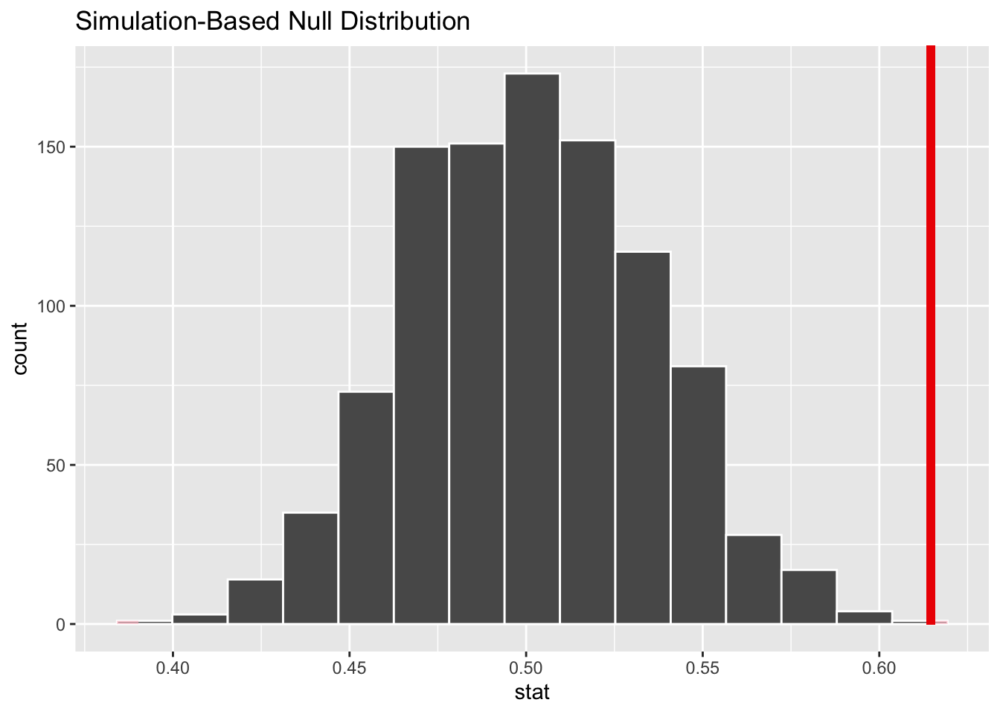

# Hypothesis testing with randomization, Part 2 {#hypothesis2}

<!-- Please don't mess with the next few lines! -->
<style>h5{font-size:2em;color:#0000FF}h6{font-size:1.5em;color:#0000FF}div.answer{margin-left:5%;border:1px solid #0000FF;border-left-width:10px;padding:25px} div.summary{background-color:rgba(30,144,255,0.1);border:3px double #0000FF;padding:25px}</style><p style="color:#ffffff">2.0</p>
<!-- Please don't mess with the previous few lines! -->

::: {.summary}

### Functions introduced in this chapter {-}

`factor`

:::


## Introduction {#hypothesis2-intro}

Now that we have learned about hypothesis testing, we'll explore a different example. Although the rubric for performing the hypothesis test will not change, the individual steps will be implemented in a different way due to the research question we're asking and the type of data used to answer it.

### Install new packages {#hypothesis2-install}

If you are using RStudio Workbench, you do not need to install any packages. (Any packages you need should already be installed by the server administrators.)

If you are using R and RStudio on your own machine instead of accessing RStudio Workbench through a browser, you'll need to type the following command at the Console:

```
install.packages("MASS")
```

### Download the R notebook file {#hypothesis2-download}

Check the upper-right corner in RStudio to make sure you're in your `intro_stats` project. Then click on the following link to download this chapter as an R notebook file (`.Rmd`).

<a href = "https://vectorposse.github.io/intro_stats/chapter_downloads/11-hypothesis_testing_with_randomization_2.Rmd" download>https://vectorposse.github.io/intro_stats/chapter_downloads/11-hypothesis_testing_with_randomization_2.Rmd</a>

Once the file is downloaded, move it to your project folder in RStudio and open it there.

### Restart R and run all chunks {#hypothesis2-restart}

In RStudio, select "Restart R and Run All Chunks" from the "Run" menu.

## Load packages {#hypothesis2-load}

In additional to `tidyverse` and `janitor`, we load the `MASS` package to access the `Melanoma` data on patients in Denmark with malignant melanoma, and the `infer` package for inference tools.


```r
library(tidyverse)
```

```
## ── Attaching packages ─────────────────────────────────────── tidyverse 1.3.2 ──
## ✔ ggplot2 3.3.6      ✔ purrr   0.3.4 
## ✔ tibble  3.1.8      ✔ dplyr   1.0.10
## ✔ tidyr   1.2.0      ✔ stringr 1.4.1 
## ✔ readr   2.1.2      ✔ forcats 0.5.2 
## ── Conflicts ────────────────────────────────────────── tidyverse_conflicts() ──
## ✖ dplyr::filter() masks stats::filter()
## ✖ dplyr::lag()    masks stats::lag()
```

```r
library(janitor)
```

```
## 
## Attaching package: 'janitor'
## 
## The following objects are masked from 'package:stats':
## 
##     chisq.test, fisher.test
```

```r
library(MASS)
```

```
## 
## Attaching package: 'MASS'
## 
## The following object is masked from 'package:dplyr':
## 
##     select
```

```r
library(infer)
```


## Our research question {#hypothesis2-question}

We know that certain types of cancer are more common among females or males. Is there a sex bias among patients with malignant melanoma?

Let's jump into the "Exploratory data analysis" part of the rubric first.


## Exploratory data analysis {#hypothesis2ex-eda}

### Use data documentation (help files, code books, Google, etc.) to determine as much as possible about the data provenance and structure. {#hypothesis2-ex-documentation}

You can look at the help file by typing `?Melanoma` at the Console. However, do not put that command here in a code chunk. The R Notebook has no way of displaying a help file when it's processed. Be careful: there's another data set called `melanoma` with a lower-case "m". Make sure you are using an uppercase "M".

There is a reference at the bottom of the help file.

##### Exercise 1 {-}

Using the reference in the help file, do an internet search to find the source of this data. How can you tell that this reference is not, in fact, a reference to a study of cancer patients in Denmark?

::: {.answer}

Please write up your answer here.

:::

*****

From the exercise above, we can see that it will be very difficult, if not impossible, to discover anything useful about the true provenance of the data (unless you happen to have a copy of that textbook, which in theory provided another more primary source). We will not know, for example, how the data was collected and if the patients consented to having their data shared publicly. The data is suitably anonymized, though, so we don't have any serious concerns about the privacy of the data. Having said that, if a condition is rare enough, a dedicated research can often "de-anonymize" data by cross-referencing information in the data to other kinds of public records. But melanoma is not particularly rare. At any rate, all we can do is assume that the textbook authors obtained the data from a source that used proper procedures for collecting and handling the data.

We print the data frame:


```r
Melanoma
```

```
##     time status sex age year thickness ulcer
## 1     10      3   1  76 1972      6.76     1
## 2     30      3   1  56 1968      0.65     0
## 3     35      2   1  41 1977      1.34     0
## 4     99      3   0  71 1968      2.90     0
## 5    185      1   1  52 1965     12.08     1
## 6    204      1   1  28 1971      4.84     1
## 7    210      1   1  77 1972      5.16     1
## 8    232      3   0  60 1974      3.22     1
## 9    232      1   1  49 1968     12.88     1
## 10   279      1   0  68 1971      7.41     1
## 11   295      1   0  53 1969      4.19     1
## 12   355      3   0  64 1972      0.16     1
## 13   386      1   0  68 1965      3.87     1
## 14   426      1   1  63 1970      4.84     1
## 15   469      1   0  14 1969      2.42     1
## 16   493      3   1  72 1971     12.56     1
## 17   529      1   1  46 1971      5.80     1
## 18   621      1   1  72 1972      7.06     1
## 19   629      1   1  95 1968      5.48     1
## 20   659      1   1  54 1972      7.73     1
## 21   667      1   0  89 1968     13.85     1
## 22   718      1   1  25 1967      2.34     1
## 23   752      1   1  37 1973      4.19     1
## 24   779      1   1  43 1967      4.04     1
## 25   793      1   1  68 1970      4.84     1
## 26   817      1   0  67 1966      0.32     0
## 27   826      3   0  86 1965      8.54     1
## 28   833      1   0  56 1971      2.58     1
## 29   858      1   0  16 1967      3.56     0
## 30   869      1   0  42 1965      3.54     0
## 31   872      1   0  65 1968      0.97     0
## 32   967      1   1  52 1970      4.83     1
## 33   977      1   1  58 1967      1.62     1
## 34   982      1   0  60 1970      6.44     1
## 35  1041      1   1  68 1967     14.66     0
## 36  1055      1   0  75 1967      2.58     1
## 37  1062      1   1  19 1966      3.87     1
## 38  1075      1   1  66 1971      3.54     1
## 39  1156      1   0  56 1970      1.34     1
## 40  1228      1   1  46 1973      2.24     1
## 41  1252      1   0  58 1971      3.87     1
## 42  1271      1   0  74 1971      3.54     1
## 43  1312      1   0  65 1970     17.42     1
## 44  1427      3   1  64 1972      1.29     0
## 45  1435      1   1  27 1969      3.22     0
## 46  1499      2   1  73 1973      1.29     0
## 47  1506      1   1  56 1970      4.51     1
## 48  1508      2   1  63 1973      8.38     1
## 49  1510      2   0  69 1973      1.94     0
## 50  1512      2   0  77 1973      0.16     0
## 51  1516      1   1  80 1968      2.58     1
## 52  1525      3   0  76 1970      1.29     1
## 53  1542      2   0  65 1973      0.16     0
## 54  1548      1   0  61 1972      1.62     0
## 55  1557      2   0  26 1973      1.29     0
## 56  1560      1   0  57 1973      2.10     0
## 57  1563      2   0  45 1973      0.32     0
## 58  1584      1   1  31 1970      0.81     0
## 59  1605      2   0  36 1973      1.13     0
## 60  1621      1   0  46 1972      5.16     1
## 61  1627      2   0  43 1973      1.62     0
## 62  1634      2   0  68 1973      1.37     0
## 63  1641      2   1  57 1973      0.24     0
## 64  1641      2   0  57 1973      0.81     0
## 65  1648      2   0  55 1973      1.29     0
## 66  1652      2   0  58 1973      1.29     0
## 67  1654      2   1  20 1973      0.97     0
## 68  1654      2   0  67 1973      1.13     0
## 69  1667      1   0  44 1971      5.80     1
## 70  1678      2   0  59 1973      1.29     0
## 71  1685      2   0  32 1973      0.48     0
## 72  1690      1   1  83 1971      1.62     0
## 73  1710      2   0  55 1973      2.26     0
## 74  1710      2   1  15 1973      0.58     0
## 75  1726      1   0  58 1970      0.97     1
## 76  1745      2   0  47 1973      2.58     1
## 77  1762      2   0  54 1973      0.81     0
## 78  1779      2   1  55 1973      3.54     1
## 79  1787      2   1  38 1973      0.97     0
## 80  1787      2   0  41 1973      1.78     1
## 81  1793      2   0  56 1973      1.94     0
## 82  1804      2   0  48 1973      1.29     0
## 83  1812      2   1  44 1973      3.22     1
## 84  1836      2   0  70 1972      1.53     0
## 85  1839      2   0  40 1972      1.29     0
## 86  1839      2   1  53 1972      1.62     1
## 87  1854      2   0  65 1972      1.62     1
## 88  1856      2   1  54 1972      0.32     0
## 89  1860      3   1  71 1969      4.84     1
## 90  1864      2   0  49 1972      1.29     0
## 91  1899      2   0  55 1972      0.97     0
## 92  1914      2   0  69 1972      3.06     0
## 93  1919      2   1  83 1972      3.54     0
## 94  1920      2   1  60 1972      1.62     1
## 95  1927      2   1  40 1972      2.58     1
## 96  1933      1   0  77 1972      1.94     0
## 97  1942      2   0  35 1972      0.81     0
## 98  1955      2   0  46 1972      7.73     1
## 99  1956      2   0  34 1972      0.97     0
## 100 1958      2   0  69 1972     12.88     0
## 101 1963      2   0  60 1972      2.58     0
## 102 1970      2   1  84 1972      4.09     1
## 103 2005      2   0  66 1972      0.64     0
## 104 2007      2   1  56 1972      0.97     0
## 105 2011      2   0  75 1972      3.22     1
## 106 2024      2   0  36 1972      1.62     0
## 107 2028      2   1  52 1972      3.87     1
## 108 2038      2   0  58 1972      0.32     1
## 109 2056      2   0  39 1972      0.32     0
## 110 2059      2   1  68 1972      3.22     1
## 111 2061      1   1  71 1968      2.26     0
## 112 2062      1   0  52 1965      3.06     0
## 113 2075      2   1  55 1972      2.58     1
## 114 2085      3   0  66 1970      0.65     0
## 115 2102      2   1  35 1972      1.13     0
## 116 2103      1   1  44 1966      0.81     0
## 117 2104      2   0  72 1972      0.97     0
## 118 2108      1   0  58 1969      1.76     1
## 119 2112      2   0  54 1972      1.94     1
## 120 2150      2   0  33 1972      0.65     0
## 121 2156      2   0  45 1972      0.97     0
## 122 2165      2   1  62 1972      5.64     0
## 123 2209      2   0  72 1971      9.66     0
## 124 2227      2   0  51 1971      0.10     0
## 125 2227      2   1  77 1971      5.48     1
## 126 2256      1   0  43 1971      2.26     1
## 127 2264      2   0  65 1971      4.83     1
## 128 2339      2   0  63 1971      0.97     0
## 129 2361      2   1  60 1971      0.97     0
## 130 2387      2   0  50 1971      5.16     1
## 131 2388      1   1  40 1966      0.81     0
## 132 2403      2   0  67 1971      2.90     1
## 133 2426      2   0  69 1971      3.87     0
## 134 2426      2   0  74 1971      1.94     1
## 135 2431      2   0  49 1971      0.16     0
## 136 2460      2   0  47 1971      0.64     0
## 137 2467      1   0  42 1965      2.26     1
## 138 2492      2   0  54 1971      1.45     0
## 139 2493      2   1  72 1971      4.82     1
## 140 2521      2   0  45 1971      1.29     1
## 141 2542      2   1  67 1971      7.89     1
## 142 2559      2   0  48 1970      0.81     1
## 143 2565      1   1  34 1970      3.54     1
## 144 2570      2   0  44 1970      1.29     0
## 145 2660      2   0  31 1970      0.64     0
## 146 2666      2   0  42 1970      3.22     1
## 147 2676      2   0  24 1970      1.45     1
## 148 2738      2   0  58 1970      0.48     0
## 149 2782      1   1  78 1969      1.94     0
## 150 2787      2   1  62 1970      0.16     0
## 151 2984      2   1  70 1969      0.16     0
## 152 3032      2   0  35 1969      1.29     0
## 153 3040      2   0  61 1969      1.94     0
## 154 3042      1   0  54 1967      3.54     1
## 155 3067      2   0  29 1969      0.81     0
## 156 3079      2   1  64 1969      0.65     0
## 157 3101      2   1  47 1969      7.09     0
## 158 3144      2   1  62 1969      0.16     0
## 159 3152      2   0  32 1969      1.62     0
## 160 3154      3   1  49 1969      1.62     0
## 161 3180      2   0  25 1969      1.29     0
## 162 3182      3   1  49 1966      6.12     0
## 163 3185      2   0  64 1969      0.48     0
## 164 3199      2   0  36 1969      0.64     0
## 165 3228      2   0  58 1969      3.22     1
## 166 3229      2   0  37 1969      1.94     0
## 167 3278      2   1  54 1969      2.58     0
## 168 3297      2   0  61 1968      2.58     1
## 169 3328      2   1  31 1968      0.81     0
## 170 3330      2   1  61 1968      0.81     1
## 171 3338      1   0  60 1967      3.22     1
## 172 3383      2   0  43 1968      0.32     0
## 173 3384      2   0  68 1968      3.22     1
## 174 3385      2   0   4 1968      2.74     0
## 175 3388      2   1  60 1968      4.84     1
## 176 3402      2   1  50 1968      1.62     0
## 177 3441      2   0  20 1968      0.65     0
## 178 3458      3   0  54 1967      1.45     0
## 179 3459      2   0  29 1968      0.65     0
## 180 3459      2   1  56 1968      1.29     1
## 181 3476      2   0  60 1968      1.62     0
## 182 3523      2   0  46 1968      3.54     0
## 183 3667      2   0  42 1967      3.22     0
## 184 3695      2   0  34 1967      0.65     0
## 185 3695      2   0  56 1967      1.03     0
## 186 3776      2   1  12 1967      7.09     1
## 187 3776      2   0  21 1967      1.29     1
## 188 3830      2   1  46 1967      0.65     0
## 189 3856      2   0  49 1967      1.78     0
## 190 3872      2   0  35 1967     12.24     1
## 191 3909      2   1  42 1967      8.06     1
## 192 3968      2   0  47 1967      0.81     0
## 193 4001      2   0  69 1967      2.10     0
## 194 4103      2   0  52 1966      3.87     0
## 195 4119      2   1  52 1966      0.65     0
## 196 4124      2   0  30 1966      1.94     1
## 197 4207      2   1  22 1966      0.65     0
## 198 4310      2   1  55 1966      2.10     0
## 199 4390      2   0  26 1965      1.94     1
## 200 4479      2   0  19 1965      1.13     1
## 201 4492      2   1  29 1965      7.06     1
## 202 4668      2   0  40 1965      6.12     0
## 203 4688      2   0  42 1965      0.48     0
## 204 4926      2   0  50 1964      2.26     0
## 205 5565      2   0  41 1962      2.90     0
```

Use `glimpse` to examine the structure of the data:


```r
glimpse(Melanoma)
```

```
## Rows: 205
## Columns: 7
## $ time      <int> 10, 30, 35, 99, 185, 204, 210, 232, 232, 279, 295, 355, 386,…
## $ status    <int> 3, 3, 2, 3, 1, 1, 1, 3, 1, 1, 1, 3, 1, 1, 1, 3, 1, 1, 1, 1, …
## $ sex       <int> 1, 1, 1, 0, 1, 1, 1, 0, 1, 0, 0, 0, 0, 1, 0, 1, 1, 1, 1, 1, …
## $ age       <int> 76, 56, 41, 71, 52, 28, 77, 60, 49, 68, 53, 64, 68, 63, 14, …
## $ year      <int> 1972, 1968, 1977, 1968, 1965, 1971, 1972, 1974, 1968, 1971, …
## $ thickness <dbl> 6.76, 0.65, 1.34, 2.90, 12.08, 4.84, 5.16, 3.22, 12.88, 7.41…
## $ ulcer     <int> 1, 0, 0, 0, 1, 1, 1, 1, 1, 1, 1, 1, 1, 1, 1, 1, 1, 1, 1, 1, …
```

### Prepare the data for analysis. {#hypothesis2-ex-prepare}

It appears that `sex` is coded as an integer. You will recall that we need to convert it to a factor variable since it is categorical, not numerical.

##### Exercise 2 {-}

According to the help file, which number corresponds to which sex?

::: {.answer}

Please write up your answer here.

:::

*****

We can convert a numerical variable a couple of different ways. In Chapter 3, we used the `as_factor` command. That command works fine, but it doesn't give you a way to change the levels of the variable. In other words, if we used `as_factor` here, we would get a factor variable that still contained zeroes and ones. 

Instead, we will use the `factor` command. It allows us to manually relabel the levels. The `levels` argument requires a vector (with `c`) of the current levels, and the `labels` argument requires a vector listing the new names you want to assign, as follows:


```r
Melanoma <- Melanoma %>%
    mutate(sex_fct = factor(sex, levels = c(0, 1), labels = c("female", "male")))
glimpse(Melanoma)
```

```
## Rows: 205
## Columns: 8
## $ time      <int> 10, 30, 35, 99, 185, 204, 210, 232, 232, 279, 295, 355, 386,…
## $ status    <int> 3, 3, 2, 3, 1, 1, 1, 3, 1, 1, 1, 3, 1, 1, 1, 3, 1, 1, 1, 1, …
## $ sex       <int> 1, 1, 1, 0, 1, 1, 1, 0, 1, 0, 0, 0, 0, 1, 0, 1, 1, 1, 1, 1, …
## $ age       <int> 76, 56, 41, 71, 52, 28, 77, 60, 49, 68, 53, 64, 68, 63, 14, …
## $ year      <int> 1972, 1968, 1977, 1968, 1965, 1971, 1972, 1974, 1968, 1971, …
## $ thickness <dbl> 6.76, 0.65, 1.34, 2.90, 12.08, 4.84, 5.16, 3.22, 12.88, 7.41…
## $ ulcer     <int> 1, 0, 0, 0, 1, 1, 1, 1, 1, 1, 1, 1, 1, 1, 1, 1, 1, 1, 1, 1, …
## $ sex_fct   <fct> male, male, male, female, male, male, male, female, male, fe…
```

You should check to make sure the first few entries of `sex_fct` agree with the numbers in the `sex` variable according to the labels explained in the help file. (If not, it means that you put the `levels` in one order and the `labels` in a different order.)

### Make tables or plots to explore the data visually. {#hypothesis2-ex-plots}

We only have one categorical variable, so we only need a frequency table. Since we are concerned with proportions, we'll also look at a relative frequency table which the `tabyl` command provides for free.


```r
tabyl(Melanoma, sex_fct) %>%
    adorn_totals()
```

```
##  sex_fct   n   percent
##   female 126 0.6146341
##     male  79 0.3853659
##    Total 205 1.0000000
```


## The logic of inference and randomization {#hypothesis2-logic}

This is a good place to pause and remember why statistical inference is important. There are certainly more females than males in this data set. So why don't we just show the table above, declare females are more likely to have malignant melanoma, and then go home?

Think back to coin flips. Even though there was a 50% chance of seeing heads, did that mean that exactly half of our flips came up heads? No. We have to acknowledge *sampling variability*: even if the truth were 50%, when w sample, we could accidentally get more or less than 50%, just by pure chance alone. Perhaps these 205 patients just happen to have more females than average.

The key, then, is to figure out if 61.5% is *significantly* larger than 50%, or if a number like 61.5% (or one even more extreme) could easily come about from random chance.

As we know from the last chapter, we can run a formal hypothesis test to find out. As we do so, make note of the things that are the same and the things that have changed from the last hypothesis tests you ran. For example, we are not comparing two groups anymore. We have one group of patients, and all we're doing is measuring the percentage of this group that is female. It's tempting to think that we're comparing males and females, but that's not the case. We are not using sex to divide our data into two groups for the purpose of exploring whether some other variable differs between men and women. We just have one sample. "Female" and "Male" are simply categories in a single categorical variable. Also, because we are only asking about one variable (`sex_fct`), the mathematical form of the hypotheses will look a little different.

Because this is no longer a question about two variables being independent or associated, the "permuting" idea we've been using no longer makes sense. So what does make sense?

It helps to start by figuring out what our null hypothesis is. Remember, our question of interest is whether there is a sex bias in malignant melanoma. In other words, are there more or fewer females than males with malignant melanoma? As this is our research question, it will be the alternative hypothesis. So what is the null? What is the "default" situation in which nothing interesting is going on? Well, there would be no sex bias. In other words, there would be the same number of females and males with malignant melanoma. Or another way of saying that---with respect to the "success" condition of being female that we discussed earlier---is that females comprise 50% of all patients with malignant melanoma.

Okay, given our philosophy about the null hypothesis, let's take the skeptical position and assume that, indeed, 50% of all malignant melanoma patients in our population are female. Then let's take a sample of 205 patients. We can't get exactly 50% females from a sample of 205 (that would be 102.5 females!), so what numbers can we get?

Randomization will tell us. What kind of randomization? As we come across each patient in our sample, there is a 50% chance of them being female. So instead of sampling real patients, what if we just flipped a coin? A simulated coin flip will come up heads just as often as our patients will be female under the assumption of the null.

This brings us full circle, back to the first randomization idea we explored. We can simulate coin flips, graph our results, and calculate a P-value. More specifically, we'll flip a coin 205 times to represent sampling 205 patients. Then we'll repeat this procedure a bunch of times and establish a range of plausible percentages that can come about by chance from this procedure. Instead of doing coin flips with the `rflip` command as we did then, however, we'll use our new favorite friend, the `infer` package.

Let's dive back into the remaining steps of the formal hypothesis test.


## Hypotheses {#hypothesis2-ex-hypotheses}

### Identify the sample (or samples) and a reasonable population (or populations) of interest. {#hypothesis2-ex-sample-pop}

The sample consists of 205 patients from Denmark with malignant melanoma. Our population is presumably all patients with malignant melanoma, although in checking conditions below, we'll take care to discuss whether patients in Denmark are representative of patients elsewhere.

### Express the null and alternative hypotheses as contextually meaningful full sentences. {#hypothesis2-ex-express-words}

$H_{0}:$ Half of malignant melanoma patients are female.

$H_{A}:$ There is a sex bias among patients with malignant melanoma (meaning that females are either over-represented or under-represented).

### Express the null and alternative hypotheses in symbols (when possible). {#hypothesis2-ex-express-math}

$H_{0}: p_{female} = 0.5$

$H_{A}: p_{female} \neq 0.5$


## Model {#hypothesis2-ex-model}

### Identify the sampling distribution model. {#hypothesis2-ex-sampling-dist-model}

We will randomize to simulate the sampling distribution.

### Check the relevant conditions to ensure that model assumptions are met. {#hypothesis2-ex-ht-conditions}

- Random
  - As mentioned above, these 205 patients are not a random sample of all people with malignant melanoma. We don't even have any evidence that they are a random sample of melanoma patients in Denmark. Without such evidence, we have to hope that these 205 patients are representative of all patients who have malignant melanoma. Unless there's something special about Danes in terms of their genetics or diet or something like that, one could imagine that their physiology makes them just as susceptible to melanoma as anyone else. More specifically, though, our question is about females and males getting malignant melanoma. Perhaps there are more female sunbathers in Denmark than in other countries. That might make Danes unrepresentative in terms of the gender balance among melanoma patients. We should be cautious in interpreting any conclusion we might reach in light of these doubts.

- 10%
  - Whether in Denmark or not, given that melanoma is a fairly common form of cancer, I assume 205 is less than 10% of all patients with malignant melanoma.


## Mechanics {#hypothesis2-ex-mechanics}

### Compute the test statistic. {#hypothesis2-ex-compute-test-stat}


```r
female_prop <- Melanoma %>%
    observe(response = sex_fct, success = "female",
            stat = "prop")
female_prop
```

```
## Response: sex_fct (factor)
## # A tibble: 1 × 1
##    stat
##   <dbl>
## 1 0.615
```

Note: Pay close attention to the difference in the `observe` command above. Unlike in the last chapter, we don't have any tildes. That's because there are not two variables involved. There is only one variable, which `observe` needs to see as the "response" variable. (Don't forget to use the factor version `sex_fct` and not `sex`!) We still have to specify a "success" condition. Since the hypotheses are about measuring females, we have to tell `observe` to calculate the proportion of females. Finally, the `stat` is no longer "diff in props" There are not two proportions with which to find a difference. There is just one proportion, hence, "prop".

### Report the test statistic in context (when possible). {#hypothesis2-ex-report-test-stat}

The observed percentage of females with melanoma in our sample is 61.4634146%.

Note: As explained in the last chapter, we have to use `pull` to pull out the number from the `female_prop` tibble.

### Plot the null distribution. {#hypothesis2-ex-plot-null}

Since this is the first step for which we need the simulated values, it will be convenient to run the simulation here. We'll need to set the seed as well.


```r
set.seed(42)
melanoma_test <- Melanoma %>%
    specify(response = sex_fct, success = "female") %>%
    hypothesize(null = "point", p = 0.5) %>%
    generate(reps = 1000, type = "draw") %>%
    calculate(stat = "prop")
melanoma_test
```

```
## Response: sex_fct (factor)
## Null Hypothesis: point
## # A tibble: 1,000 × 2
##    replicate  stat
##    <fct>     <dbl>
##  1 1         0.444
##  2 2         0.585
##  3 3         0.551
##  4 4         0.502
##  5 5         0.561
##  6 6         0.493
##  7 7         0.527
##  8 8         0.488
##  9 9         0.512
## 10 10        0.454
## # … with 990 more rows
```

This list of proportions is the sampling distribution. It represents possible sample proportions of females with melanoma **under the assumption that the null is true**. In other words, even if the "true" proportion of female melanoma patients were 0.5, these are all values that can result from random samples.

In the `hypothesize` command, we use "point" to tell `infer` that we want the null to be centered at the point 0.5. In the `generate` command, we need to specify the `type` as "draw" instead of "permute". We are not shuffling any values here; we are "drawing" values from a probability distribution like coin flips. Everything else in the command is pretty self-explanatory.

The value of our test statistic, `female_prop`, is 0.6146341. It appears in the right tail:


```r
melanoma_test %>%
    visualize() +
    shade_p_value(obs_stat = female_prop, direction = "two-sided")
```



Although the line only appears on the right, keep in mind that we are conducting a two-sided test, so we are interested in values more extreme than the red line on the right, but also more extreme than a similarly placed line on the left.

##### Exercise 3 {-}

The red line sits at about 0.615. If you were to draw a red line on the above histogram that represented a value equally distant from 0.5, but on the left instead of the right, where would that line be? Do a little arithmetic to figure it out and show your work.

::: {.answer}

Please write up your answer here.

:::

### Calculate the P-value. {#hypothesis2-ex-calculate-p}


```r
melanoma_test %>%
    get_p_value(obs_stat = female_prop, direction = "two-sided")
```

```
## Warning: Please be cautious in reporting a p-value of 0. This result is an
## approximation based on the number of `reps` chosen in the `generate()` step. See
## `?get_p_value()` for more information.
```

```
## # A tibble: 1 × 1
##   p_value
##     <dbl>
## 1       0
```

The P-value appears to be zero. Indeed, among the 1000 simulated values, we saw none that exceeded 0.615 and none that were less than 0.385. However, a true P-value can never be zero. If you did millions or billions of simulations (please don't try!), surely there would be one or two with even more extreme values. In cases when the P-value is really, really tiny, it is traditional to report $P < 0.001$. It is **incorrect** to say $P = 0$.

### Interpret the P-value as a probability given the null. {#hypothesis2-ex-interpret-p}

$P < 0.001$. If there were no sex bias in malignant melanoma patients, there would be less than a 0.1% chance of seeing a percentage of females at least as extreme as the one we saw in our data.

Note: Don't forget to interpret the P-value in a contextually meaningful way. The P-value is the probability under the assumption of the null hypothesis of seeing data at least as extreme as the data we saw. In this context, that means that if we assume 50% of patients are female, it would be extremely rare to see more than 61.5% or less than 38.5% females in a sample of size 205.


## Conclusion {#hypothesis2-ex-ht-conclusion}

### State the statistical conclusion. {#hypothesis2-ex-stat-conclusion}

We reject the null hypothesis.

### State (but do not overstate) a contextually meaningful conclusion. {#hypothesis2-ex-context-conclusion}

There is sufficient evidence that there is a sex bias in patients who suffer from malignant melanoma.

### Express reservations or uncertainty about the generalizability of the conclusion.  {#hypothesis2-ex-reservations}

We have no idea how these patients were sampled. Are these all the patients in Denmark with malignant melanoma over a certain period of time? Were they part of a convenience sample? As a result of our uncertainly about the sampling process, we can't be sure if the results generalize to a larger population, either in Denmark or especially outside of Denmark.

##### Exercise 4 {-}

Can you find on the internet any evidence that females do indeed suffer from malignant melanoma more often than males (not just in Denmark, but anywhere)?

::: {.answer}

Please write up your answer here.

:::

### Identify the possibility of either a Type I or Type II error and state what making such an error means in the context of the hypotheses. {#hypothesis2-ex-errors}

As we rejected the null, we run the risk of making a Type I error. If we have made such an error, that would mean that patients with malignant melanoma are equally likely to be male or female, but that we got a sample with an unusual number of female patients.


## Your turn {#hypothesis2-your-turn}

Determine if the percentage of patients in Denmark with malignant melanoma who also have an ulcerated tumor (measured with the `ulcer` variable) is significantly different from 50%.

As before, you have the outline of the rubric for inference below. Some of the steps will be the same or similar to steps in the example above. It is perfectly okay to copy and paste R code, making the necessary changes. It is **not** okay to copy and paste text. You need to put everything into your own words.

The template below is exactly the same as in the appendix ([Rubric for inference](#appendix-rubric)) up to the part about confidence intervals which we haven't learned yet.


##### Exploratory data analysis {-}

###### Use data documentation (help files, code books, Google, etc.) to determine as much as possible about the data provenance and structure. {-}

::: {.answer}


```r
# Add code here to understand the data.
```

:::

###### Prepare the data for analysis. [Not always necessary.] {-}

::: {.answer}


```r
# Add code here to prepare the data for analysis.
```

:::

###### Make tables or plots to explore the data visually. {-}

::: {.answer}


```r
# Add code here to make tables or plots.
```

:::


##### Hypotheses {-}

###### Identify the sample (or samples) and a reasonable population (or populations) of interest. {-}

::: {.answer}

Please write up your answer here.

:::

###### Express the null and alternative hypotheses as contextually meaningful full sentences. {-}

::: {.answer}

$H_{0}:$ Null hypothesis goes here.

$H_{A}:$ Alternative hypothesis goes here.

:::

###### Express the null and alternative hypotheses in symbols (when possible). {-}

::: {.answer}

$H_{0}: math$

$H_{A}: math$

:::


##### Model {-}

###### Identify the sampling distribution model. {-}

::: {.answer}

Please write up your answer here.

:::

###### Check the relevant conditions to ensure that model assumptions are met. {-}

::: {.answer}

Please write up your answer here. (Some conditions may require R code as well.)

:::


##### Mechanics {-}

###### Compute the test statistic. {-}

::: {.answer}


```r
# Add code here to compute the test statistic.
```

:::

###### Report the test statistic in context (when possible). {-}

::: {.answer}

Please write up your answer here.

:::

###### Plot the null distribution. {-}

::: {.answer}


```r
set.seed(42)
# Add code here to simulate the null distribution.
# Run 1000 simulations like in the earlier example.
```


```r
# Add code here to plot the null distribution.
```

:::

###### Calculate the P-value. {-}

::: {.answer}


```r
# Add code here to calculate the P-value.
```

:::

###### Interpret the P-value as a probability given the null. {-}

::: {.answer}

Please write up your answer here.

:::


##### Conclusion {-}

###### State the statistical conclusion. {-}

::: {.answer}

Please write up your answer here.

:::

###### State (but do not overstate) a contextually meaningful conclusion. {-}

::: {.answer}

Please write up your answer here.

:::

###### Express reservations or uncertainty about the generalizability of the conclusion. {-}

::: {.answer}

Please write up your answer here.

:::

###### Identify the possibility of either a Type I or Type II error and state what making such an error means in the context of the hypotheses. {-}

::: {.answer}

Please write up your answer here.

:::


## Conclusion {#hypothesis2-conclusion}

Now you have seen two fully-worked examples of hypothesis tests using randomization, and you have created two more examples on your own. Hopefully, the logic of inference and the process of running a formal hypothesis test are starting to make sense.

Keep in mind that the outline of steps will not change. However, the way each step is carried out will vary from problem to problem. Not only does the context change (one example involved sex discrimination, the other melanoma patients), but the statistics you compute also change (one example compared proportions from two samples and the other only had one proportion from a single sample). Pay close attention to the research question and the data that will be used to answer that question. That will be the only information you have to help you know which hypothesis test applies.

### Preparing and submitting your assignment {#hypothesis2-prep}

1. From the "Run" menu, select "Restart R and Run All Chunks".
2. Deal with any code errors that crop up. Repeat steps 1–-2 until there are no more code errors.
3. Spell check your document by clicking the icon with "ABC" and a check mark.
4. Hit the "Preview" button one last time to generate the final draft of the `.nb.html` file.
5. Proofread the HTML file carefully. If there are errors, go back and fix them, then repeat steps 1--5 again.

If you have completed this chapter as part of a statistics course, follow the directions you receive from your professor to submit your assignment.


