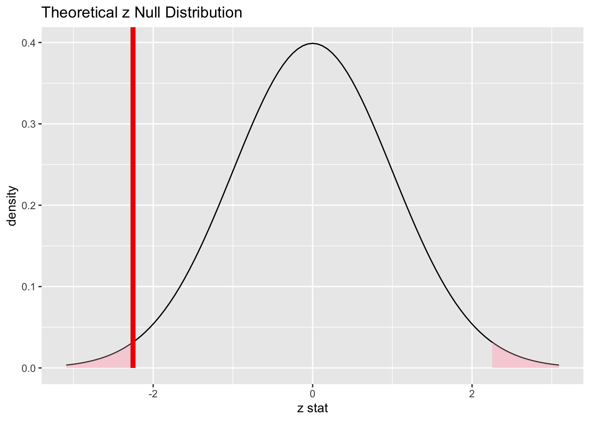
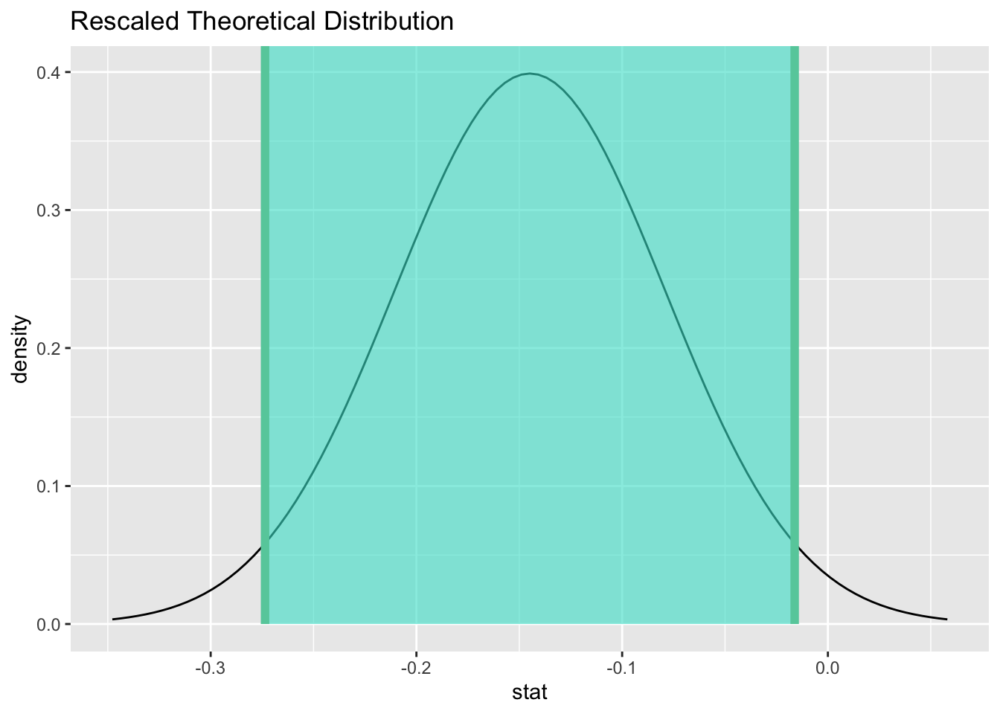

# Inference for two proportions {#two-prop}

<!-- Please don't mess with the next few lines! -->
<style>h5{font-size:2em;color:#0000FF}h6{font-size:1.5em;color:#0000FF}div.answer{margin-left:5%;border:1px solid #0000FF;border-left-width:10px;padding:25px} div.summary{background-color:rgba(30,144,255,0.1);border:3px double #0000FF;padding:25px}</style><p style="color:#ffffff">2.0</p>
<!-- Please don't mess with the previous few lines! -->


::: {.summary}

### Functions introduced in this chapter {-}

No new R functions are introduced here.

:::


## Introduction

In this chapter, we revisit the idea of inference for two proportions, but this time using a normal model as the sampling distribution model.

### Install new packages

There are no new packages used in this chapter.

### Download the R notebook file

Check the upper-right corner in RStudio to make sure you're in your `intro_stats` project. Then click on the following link to download this chapter as an R notebook file (`.Rmd`).

<a  target="_blank" href = "https://raw.githubusercontent.com/Jingsai/intro_stats/main/docs/chapter_downloads/16-inference_for_two_proportions.Rmd"
      Download = "16-inference_for_two_proportions.Rmd">
      <button type = "button"> Right Click and Save the link as a File </button>
</a>

Once the file is downloaded, move it to your project folder in RStudio and open it there.

### Restart R and run all chunks

In RStudio, select "Restart R and Run All Chunks" from the "Run" menu.


## Load packages

We load the standard `tidyverse`, `janitor` and `infer` packages as well as the `MASS` package for the `Melanoma` data.


```r
library(tidyverse)
```

```
## ── Attaching packages ─────────────────────────────────────── tidyverse 1.3.2 ──
## ✔ ggplot2 3.3.6      ✔ purrr   0.3.4 
## ✔ tibble  3.1.8      ✔ dplyr   1.0.10
## ✔ tidyr   1.2.0      ✔ stringr 1.4.1 
## ✔ readr   2.1.2      ✔ forcats 0.5.2 
## ── Conflicts ────────────────────────────────────────── tidyverse_conflicts() ──
## ✖ dplyr::filter() masks stats::filter()
## ✖ dplyr::lag()    masks stats::lag()
```

```r
library(janitor)
```

```
## 
## Attaching package: 'janitor'
## 
## The following objects are masked from 'package:stats':
## 
##     chisq.test, fisher.test
```

```r
library(infer)
library(MASS)
```

```
## 
## Attaching package: 'MASS'
## 
## The following object is masked from 'package:dplyr':
## 
##     select
```


## Research question

In an earlier chapter, we used the data set `Melanoma` from the `MASS` package to explore the possibility of a sex bias among patients with melanoma. A related question is whether male or females are more likely to die from melanoma. In this case, we are thinking of `status` as the response variable and `sex` as the predictor variable.


## The sampling distribution model for two proportions

When we simulated a sampling distribution using randomization (shuffling the values of the predictor variable), it looked like the simulated sampling distribution was roughly normal. Therefore, we should be able to use a normal model in place of randomization when we want to perform statistical inference.

The question is, "Which normal model?" In other words, what is the mean and standard deviation we should use?

Since we have two groups, let's call the true proportion of success $p_{1}$ for group 1 and $p_{2}$ for group 2. Therefore, the true difference between groups 1 and 2 in the population is $p_{1} - p_{2}$. If we sample repeatedly from groups 1 and 2 and form many sample differences $\hat{p}_{1} - \hat{p}_{2}$, we should expect most of the values $\hat{p}_{1} - \hat{p}_{2}$ to be close to the true difference $p_{1} - p_{2}$. In other words, the sampling distribution is centered at a mean of $p_{1} - p_{2}$.

What about the standard error? This is much more technical and complicated. Here is the formula, whose derivation is outside the scope of the course:

$$
\sqrt{\frac{p_{1} (1 - p_{1})}{n_{1}} + \frac{p_{2} (1 - p_{2})}{n_{2}}}.
$$

So the somewhat complicated normal model is

$$
N\left( p_{1} - p_{2}, \sqrt{\frac{p_{1} (1 - p_{1})}{n_{1}} + \frac{p_{2} (1 - p_{2})}{n_{2}}} \right).
$$

When we ran hypothesis tests for one proportion, the true proportion $p$ was assumed to be known, set equal to some null value. Therefore, we could calculate the standard error $\sqrt{\frac{p(1 - p)}{n}}$ under the assumption of the null.

We also have a null hypothesis for two proportions. When comparing two groups, the default assumption is that the two groups are the same. This translates into the mathematical statement $p_{1} - p_{2} = 0$ (i.e., there is no difference between $p_{1}$ and $p_{2}$).

But there is a problem here. Although we are assuming something about the difference $p_{1} - p_{2}$, we are not assuming anything about the actual values of $p_{1}$ and $p_{2}$. For example, both groups could be 0.3, or 0.6, or 0.92, or whatever, and the difference between the groups would still be zero.

Without values of $p_{1}$ and $p_{2}$, we cannot plug anything into the standard error formula above. One easy "cheat" is to just use the sample values $\hat{p}_{1}$ and $\hat{p}_{2}$:

$$
SE = \sqrt{\frac{\hat{p}_{1} (1 - \hat{p}_{1})}{n_{1}} + \frac{\hat{p}_{2} (1 - \hat{p}_{2})}{n_{2}}}.
$$

There is a more sophisticated way to address this called "pooling". This more advanced concept is covered in an optional appendix to this chapter.


## Inference for two proportions

Below is a fully-worked example of inference (hypothesis test and confidence interval) for two proportions. When you work your own example, you can thoughtfully copy and paste the R code, making changes as necessary.

The example below will pause frequently for commentary on the steps, especially where their execution will be different from what you've seen before when you used randomization. When it's your turn to work through another example on your own, you should follow the outline of the rubric, but you should **not** copy and paste the commentary that accompanies it.


## Exploratory data analysis

### Use data documentation (help files, code books, Google, etc.) to determine as much as possible about the data provenance and structure.

Type `?Melanoma` at the Console to read the help file. We discussed this data back in Chapter 11 and determined that it was difficult, if not impossible, to discover anything useful about the true provenance of the data. We can, at least, print the data out and examine the variables 


```r
Melanoma
```

```
##     time status sex age year thickness ulcer
## 1     10      3   1  76 1972      6.76     1
## 2     30      3   1  56 1968      0.65     0
## 3     35      2   1  41 1977      1.34     0
## 4     99      3   0  71 1968      2.90     0
## 5    185      1   1  52 1965     12.08     1
## 6    204      1   1  28 1971      4.84     1
## 7    210      1   1  77 1972      5.16     1
## 8    232      3   0  60 1974      3.22     1
## 9    232      1   1  49 1968     12.88     1
## 10   279      1   0  68 1971      7.41     1
## 11   295      1   0  53 1969      4.19     1
## 12   355      3   0  64 1972      0.16     1
## 13   386      1   0  68 1965      3.87     1
## 14   426      1   1  63 1970      4.84     1
## 15   469      1   0  14 1969      2.42     1
## 16   493      3   1  72 1971     12.56     1
## 17   529      1   1  46 1971      5.80     1
## 18   621      1   1  72 1972      7.06     1
## 19   629      1   1  95 1968      5.48     1
## 20   659      1   1  54 1972      7.73     1
## 21   667      1   0  89 1968     13.85     1
## 22   718      1   1  25 1967      2.34     1
## 23   752      1   1  37 1973      4.19     1
## 24   779      1   1  43 1967      4.04     1
## 25   793      1   1  68 1970      4.84     1
## 26   817      1   0  67 1966      0.32     0
## 27   826      3   0  86 1965      8.54     1
## 28   833      1   0  56 1971      2.58     1
## 29   858      1   0  16 1967      3.56     0
## 30   869      1   0  42 1965      3.54     0
## 31   872      1   0  65 1968      0.97     0
## 32   967      1   1  52 1970      4.83     1
## 33   977      1   1  58 1967      1.62     1
## 34   982      1   0  60 1970      6.44     1
## 35  1041      1   1  68 1967     14.66     0
## 36  1055      1   0  75 1967      2.58     1
## 37  1062      1   1  19 1966      3.87     1
## 38  1075      1   1  66 1971      3.54     1
## 39  1156      1   0  56 1970      1.34     1
## 40  1228      1   1  46 1973      2.24     1
## 41  1252      1   0  58 1971      3.87     1
## 42  1271      1   0  74 1971      3.54     1
## 43  1312      1   0  65 1970     17.42     1
## 44  1427      3   1  64 1972      1.29     0
## 45  1435      1   1  27 1969      3.22     0
## 46  1499      2   1  73 1973      1.29     0
## 47  1506      1   1  56 1970      4.51     1
## 48  1508      2   1  63 1973      8.38     1
## 49  1510      2   0  69 1973      1.94     0
## 50  1512      2   0  77 1973      0.16     0
## 51  1516      1   1  80 1968      2.58     1
## 52  1525      3   0  76 1970      1.29     1
## 53  1542      2   0  65 1973      0.16     0
## 54  1548      1   0  61 1972      1.62     0
## 55  1557      2   0  26 1973      1.29     0
## 56  1560      1   0  57 1973      2.10     0
## 57  1563      2   0  45 1973      0.32     0
## 58  1584      1   1  31 1970      0.81     0
## 59  1605      2   0  36 1973      1.13     0
## 60  1621      1   0  46 1972      5.16     1
## 61  1627      2   0  43 1973      1.62     0
## 62  1634      2   0  68 1973      1.37     0
## 63  1641      2   1  57 1973      0.24     0
## 64  1641      2   0  57 1973      0.81     0
## 65  1648      2   0  55 1973      1.29     0
## 66  1652      2   0  58 1973      1.29     0
## 67  1654      2   1  20 1973      0.97     0
## 68  1654      2   0  67 1973      1.13     0
## 69  1667      1   0  44 1971      5.80     1
## 70  1678      2   0  59 1973      1.29     0
## 71  1685      2   0  32 1973      0.48     0
## 72  1690      1   1  83 1971      1.62     0
## 73  1710      2   0  55 1973      2.26     0
## 74  1710      2   1  15 1973      0.58     0
## 75  1726      1   0  58 1970      0.97     1
## 76  1745      2   0  47 1973      2.58     1
## 77  1762      2   0  54 1973      0.81     0
## 78  1779      2   1  55 1973      3.54     1
## 79  1787      2   1  38 1973      0.97     0
## 80  1787      2   0  41 1973      1.78     1
## 81  1793      2   0  56 1973      1.94     0
## 82  1804      2   0  48 1973      1.29     0
## 83  1812      2   1  44 1973      3.22     1
## 84  1836      2   0  70 1972      1.53     0
## 85  1839      2   0  40 1972      1.29     0
## 86  1839      2   1  53 1972      1.62     1
## 87  1854      2   0  65 1972      1.62     1
## 88  1856      2   1  54 1972      0.32     0
## 89  1860      3   1  71 1969      4.84     1
## 90  1864      2   0  49 1972      1.29     0
## 91  1899      2   0  55 1972      0.97     0
## 92  1914      2   0  69 1972      3.06     0
## 93  1919      2   1  83 1972      3.54     0
## 94  1920      2   1  60 1972      1.62     1
## 95  1927      2   1  40 1972      2.58     1
## 96  1933      1   0  77 1972      1.94     0
## 97  1942      2   0  35 1972      0.81     0
## 98  1955      2   0  46 1972      7.73     1
## 99  1956      2   0  34 1972      0.97     0
## 100 1958      2   0  69 1972     12.88     0
## 101 1963      2   0  60 1972      2.58     0
## 102 1970      2   1  84 1972      4.09     1
## 103 2005      2   0  66 1972      0.64     0
## 104 2007      2   1  56 1972      0.97     0
## 105 2011      2   0  75 1972      3.22     1
## 106 2024      2   0  36 1972      1.62     0
## 107 2028      2   1  52 1972      3.87     1
## 108 2038      2   0  58 1972      0.32     1
## 109 2056      2   0  39 1972      0.32     0
## 110 2059      2   1  68 1972      3.22     1
## 111 2061      1   1  71 1968      2.26     0
## 112 2062      1   0  52 1965      3.06     0
## 113 2075      2   1  55 1972      2.58     1
## 114 2085      3   0  66 1970      0.65     0
## 115 2102      2   1  35 1972      1.13     0
## 116 2103      1   1  44 1966      0.81     0
## 117 2104      2   0  72 1972      0.97     0
## 118 2108      1   0  58 1969      1.76     1
## 119 2112      2   0  54 1972      1.94     1
## 120 2150      2   0  33 1972      0.65     0
## 121 2156      2   0  45 1972      0.97     0
## 122 2165      2   1  62 1972      5.64     0
## 123 2209      2   0  72 1971      9.66     0
## 124 2227      2   0  51 1971      0.10     0
## 125 2227      2   1  77 1971      5.48     1
## 126 2256      1   0  43 1971      2.26     1
## 127 2264      2   0  65 1971      4.83     1
## 128 2339      2   0  63 1971      0.97     0
## 129 2361      2   1  60 1971      0.97     0
## 130 2387      2   0  50 1971      5.16     1
## 131 2388      1   1  40 1966      0.81     0
## 132 2403      2   0  67 1971      2.90     1
## 133 2426      2   0  69 1971      3.87     0
## 134 2426      2   0  74 1971      1.94     1
## 135 2431      2   0  49 1971      0.16     0
## 136 2460      2   0  47 1971      0.64     0
## 137 2467      1   0  42 1965      2.26     1
## 138 2492      2   0  54 1971      1.45     0
## 139 2493      2   1  72 1971      4.82     1
## 140 2521      2   0  45 1971      1.29     1
## 141 2542      2   1  67 1971      7.89     1
## 142 2559      2   0  48 1970      0.81     1
## 143 2565      1   1  34 1970      3.54     1
## 144 2570      2   0  44 1970      1.29     0
## 145 2660      2   0  31 1970      0.64     0
## 146 2666      2   0  42 1970      3.22     1
## 147 2676      2   0  24 1970      1.45     1
## 148 2738      2   0  58 1970      0.48     0
## 149 2782      1   1  78 1969      1.94     0
## 150 2787      2   1  62 1970      0.16     0
## 151 2984      2   1  70 1969      0.16     0
## 152 3032      2   0  35 1969      1.29     0
## 153 3040      2   0  61 1969      1.94     0
## 154 3042      1   0  54 1967      3.54     1
## 155 3067      2   0  29 1969      0.81     0
## 156 3079      2   1  64 1969      0.65     0
## 157 3101      2   1  47 1969      7.09     0
## 158 3144      2   1  62 1969      0.16     0
## 159 3152      2   0  32 1969      1.62     0
## 160 3154      3   1  49 1969      1.62     0
## 161 3180      2   0  25 1969      1.29     0
## 162 3182      3   1  49 1966      6.12     0
## 163 3185      2   0  64 1969      0.48     0
## 164 3199      2   0  36 1969      0.64     0
## 165 3228      2   0  58 1969      3.22     1
## 166 3229      2   0  37 1969      1.94     0
## 167 3278      2   1  54 1969      2.58     0
## 168 3297      2   0  61 1968      2.58     1
## 169 3328      2   1  31 1968      0.81     0
## 170 3330      2   1  61 1968      0.81     1
## 171 3338      1   0  60 1967      3.22     1
## 172 3383      2   0  43 1968      0.32     0
## 173 3384      2   0  68 1968      3.22     1
## 174 3385      2   0   4 1968      2.74     0
## 175 3388      2   1  60 1968      4.84     1
## 176 3402      2   1  50 1968      1.62     0
## 177 3441      2   0  20 1968      0.65     0
## 178 3458      3   0  54 1967      1.45     0
## 179 3459      2   0  29 1968      0.65     0
## 180 3459      2   1  56 1968      1.29     1
## 181 3476      2   0  60 1968      1.62     0
## 182 3523      2   0  46 1968      3.54     0
## 183 3667      2   0  42 1967      3.22     0
## 184 3695      2   0  34 1967      0.65     0
## 185 3695      2   0  56 1967      1.03     0
## 186 3776      2   1  12 1967      7.09     1
## 187 3776      2   0  21 1967      1.29     1
## 188 3830      2   1  46 1967      0.65     0
## 189 3856      2   0  49 1967      1.78     0
## 190 3872      2   0  35 1967     12.24     1
## 191 3909      2   1  42 1967      8.06     1
## 192 3968      2   0  47 1967      0.81     0
## 193 4001      2   0  69 1967      2.10     0
## 194 4103      2   0  52 1966      3.87     0
## 195 4119      2   1  52 1966      0.65     0
## 196 4124      2   0  30 1966      1.94     1
## 197 4207      2   1  22 1966      0.65     0
## 198 4310      2   1  55 1966      2.10     0
## 199 4390      2   0  26 1965      1.94     1
## 200 4479      2   0  19 1965      1.13     1
## 201 4492      2   1  29 1965      7.06     1
## 202 4668      2   0  40 1965      6.12     0
## 203 4688      2   0  42 1965      0.48     0
## 204 4926      2   0  50 1964      2.26     0
## 205 5565      2   0  41 1962      2.90     0
```


```r
glimpse(Melanoma)
```

```
## Rows: 205
## Columns: 7
## $ time      <int> 10, 30, 35, 99, 185, 204, 210, 232, 232, 279, 295, 355, 386,…
## $ status    <int> 3, 3, 2, 3, 1, 1, 1, 3, 1, 1, 1, 3, 1, 1, 1, 3, 1, 1, 1, 1, …
## $ sex       <int> 1, 1, 1, 0, 1, 1, 1, 0, 1, 0, 0, 0, 0, 1, 0, 1, 1, 1, 1, 1, …
## $ age       <int> 76, 56, 41, 71, 52, 28, 77, 60, 49, 68, 53, 64, 68, 63, 14, …
## $ year      <int> 1972, 1968, 1977, 1968, 1965, 1971, 1972, 1974, 1968, 1971, …
## $ thickness <dbl> 6.76, 0.65, 1.34, 2.90, 12.08, 4.84, 5.16, 3.22, 12.88, 7.41…
## $ ulcer     <int> 1, 0, 0, 0, 1, 1, 1, 1, 1, 1, 1, 1, 1, 1, 1, 1, 1, 1, 1, 1, …
```

### Prepare the data for analysis.

The two variables of interest are `status` and `sex`. We are considering them as categorical variables, but they are recorded numerically in the data frame. We convert them to proper factor variables and put them in their own data frame using the help file to identify the levels and labels we need.

There is a minor hitch with `status`. The help file shows three categories: 1. died from melanoma, 2. alive, 3. dead from other causes. For two-proportion inference, it would be better to have two categories only, a success category and a failure category. Since our research question asks about deaths due to melanoma, the "success" condition is the one numbered 1 in the help file, "died from melanoma". That means we need to combine the other two categories into a single failure category. Perhaps we should call it "other". You can accomplish this by simply repeating the "other" label more than once in the `factor` command:


```r
Melanoma <- Melanoma %>%
    mutate(sex_fct = factor(sex,
                            levels = c(0, 1),
                            labels = c("female", "male")),
           status_fct = factor(status,
                               levels = c(1, 2, 3),
                               labels = c("died from melanoma", "other", "other")))
glimpse(Melanoma)
```

```
## Rows: 205
## Columns: 9
## $ time       <int> 10, 30, 35, 99, 185, 204, 210, 232, 232, 279, 295, 355, 386…
## $ status     <int> 3, 3, 2, 3, 1, 1, 1, 3, 1, 1, 1, 3, 1, 1, 1, 3, 1, 1, 1, 1,…
## $ sex        <int> 1, 1, 1, 0, 1, 1, 1, 0, 1, 0, 0, 0, 0, 1, 0, 1, 1, 1, 1, 1,…
## $ age        <int> 76, 56, 41, 71, 52, 28, 77, 60, 49, 68, 53, 64, 68, 63, 14,…
## $ year       <int> 1972, 1968, 1977, 1968, 1965, 1971, 1972, 1974, 1968, 1971,…
## $ thickness  <dbl> 6.76, 0.65, 1.34, 2.90, 12.08, 4.84, 5.16, 3.22, 12.88, 7.4…
## $ ulcer      <int> 1, 0, 0, 0, 1, 1, 1, 1, 1, 1, 1, 1, 1, 1, 1, 1, 1, 1, 1, 1,…
## $ sex_fct    <fct> male, male, male, female, male, male, male, female, male, f…
## $ status_fct <fct> other, other, other, other, died from melanoma, died from m…
```

##### Exercise 1 {-}

Observe the new variables `sex_fct` and `status_fct` in the `glimpse` output above. How can we check that the categories got assigned correctly and match the original `sex` and `status` variables?

::: {.answer}

Please write up your answer here.

:::


### Make tables or plots to explore the data visually.

As these are two categorical variables, we should look at contingency tables (both counts and percentages). The variable `status` is the response and `sex` is the predictor.


```r
tabyl(Melanoma, status_fct, sex_fct) %>%
    adorn_totals()
```

```
##          status_fct female male
##  died from melanoma     28   29
##               other     98   50
##               Total    126   79
```


```r
tabyl(Melanoma, status_fct, sex_fct) %>%
    adorn_totals() %>%
    adorn_percentages("col") %>%
    adorn_pct_formatting()
```

```
##          status_fct female   male
##  died from melanoma  22.2%  36.7%
##               other  77.8%  63.3%
##               Total 100.0% 100.0%
```

Commentary: You can see why column percentages are necessary in a contingency table. There are 28 females and 29 males who died from melanoma, almost a tie. However, there are more females (126) than there are males (79) who have melanoma in this data set. So the *proportion* of males who died from melanoma is quite a bit larger.

    
## Hypotheses

### Identify the sample (or samples) and a reasonable population (or populations) of interest.

There are two samples: 126 female patients and 79 male patients in Denmark with malignant melanoma. In order for these samples to be representative of their respective populations, we should probably restrict our conclusions to the population of all females and males in Denmark with malignant melanoma, although we might be able to make the case that these females and males could be representative of people in other countries who have malignant melanoma.

### Express the null and alternative hypotheses as contextually meaningful full sentences.

$H_{0}:$ There is no difference between the rate at which women and men in Denmark die from malignant melanoma.

$H_{A}:$ There is a difference between the rate at which women and men in Denmark die from malignant melanoma.

OR

$H_{0}:$ In Denmark, death from malignant melanoma is independent of sex.

$H_{A}:$ In Denmark, death from malignant melanoma is associated with sex.

Commentary: Either of these forms is correct. The former makes it a little easier to figure out how to express the hypotheses mathematically in the next step. The latter reminds us that the `hypothesize` step of the `infer` pipeline will require a null of `independence`.

### Express the null and alternative hypotheses in symbols (when possible).

$H_{0}: p_{died, F} - p_{died, M} = 0$

$H_{A}: p_{died, F} - p_{died, M} \neq 0$

Commentary: The order in which you subtract is irrelevant to the inferential process. However, you should be sure that any future steps respect the order you choose here. To be on the safe side, it's always best to subtract in the order in which the factor was created. So in the contingency tables above, females are listed first, and that's because "female" was the first label we used when we created the `sex_fct` variable. So we'll subtract females minus males throughout the remaining steps.


## Model

### Identify the sampling distribution model.

We will use a normal model.

### Check the relevant conditions to ensure that model assumptions are met.

* Random
    - As observed in a previous chapter when we used this data set before, We have no information about how these samples were obtained. We hope the 126 female patients and 79 male patients are representative of other Danish patients with malignant melanoma.

* 10%
    - We don't know exactly how many people in Denmark suffer from malignant melanoma, but we could imagine over time it's more than 1260 females and 790 males.

* Success/Failure
    - Checking the contingency table above (the one with counts), we see the numbers 28 and 98 (the successes and failures among females), and 29 and 50 (the successes and failures among males). These are all larger than 10.

Commentary: Ideally, for the success/failure condition we would like to check $n_{1} p_{1}$, $n_{1} (1 - p_{1})$, $n_{2} p_{2}$, and $n_{2} (1 - p_{2})$; however, the null makes no claim about the values of $p_{1}$ and $p_{2}$. We do the next best thing and estimate these by substituting the sample proportions $\hat{p}_{1}$ and $\hat{p}_{2}$. But $n_{1} \hat{p}_{1}$ and $n_{2} \hat{p}_{2}$ are just the raw counts of successes in each group. Likewise, $n_{1} (1 - \hat{p}_{1})$ and $n_{2} (1 - \hat{p}_{2})$ are just the raw counts of failures in each group. That's why we can just read them off the contingency table.

For a more sophisticated approach, one could also use "pooled proportions". See the optional appendix to this chapter for more information.


## Mechanics

### Compute the test statistic.


```r
obs_diff <- Melanoma %>%
    observe(status_fct ~ sex_fct, success = "died from melanoma",
            stat = "diff in props", order = c("female", "male"))
obs_diff
```

```
## Response: status_fct (factor)
## Explanatory: sex_fct (factor)
## # A tibble: 1 × 1
##     stat
##    <dbl>
## 1 -0.145
```

The test statistic is the difference of proportions in the sample, $\hat{p}_{died, F} - \hat{p}_{died, M}$:

$$
\hat{p}_{died, F} - \hat{p}_{died, M} = 0.222 - 0.367 = -0.145
$$

As a z-score:


```r
obs_diff_z <- Melanoma %>%
    observe(status_fct ~ sex_fct, success = "died from melanoma",
            stat = "z", order = c("female", "male"))
obs_diff_z
```

```
## Response: status_fct (factor)
## Explanatory: sex_fct (factor)
## # A tibble: 1 × 1
##    stat
##   <dbl>
## 1 -2.25
```


Commentary: We can confirm the value of the z-score manually just to make sure we understand where it comes from.

The standard error looks like the following:

$$
SE = \sqrt{\frac{\hat{p}_{died, F} (1 - \hat{p}_{died, F})}{n_{F}} + \frac{\hat{p}_{died, M} (1 - \hat{p}_{died, M})}{n_M}}
$$

Plugging in the numbers from the exploratory data analysis output:

$$
SE = \sqrt{\frac{0.222 (1 - 0.222)}{126} + \frac{0.367 (1 - 0.367)}{79}}
$$

In R,


```r
sqrt(0.222 * (1 - 0.222) / 126 + 0.367 * (1 - 0.367) / 79)
```

```
## [1] 0.06566131
```

Now our z-score formula is

$$
z = \frac{(\hat{p}_{died, F} - \hat{p}_{died, M}) - (p_{died, F} - p_{died, M})}{SE}
$$

The first term in the numerator $(\hat{p}_{died, F} - \hat{p}_{died, M})$ is our test statistic, -0.145. The second term in the numerator $(p_{died, F} - p_{died, M})$  is zero according to the null hypothesis.  Plugging all that in, along with the value of SE, gives

$$
z = \frac{-0.145 - 0}{0.066} \approx -2.2
$$

Other than a little rounding error (since we rounded everything in sight to three decimal places instead of keeping more precision), this is what the `infer` output also reported.

### Report the test statistic in context (when possible).

In our sample, there is a -14.4866385% difference between the rate at which women and men in Denmark die from malignant melanoma (meaning that males died at a higher rate).

The test statistic has a z score of -2.2530721. The difference in proportions between the rate at which women and men in Denmark die from malignant melanoma lies a bit more than 2 standard errors to the left of the null value.

Commentary: Note the phrase "meaning that males died at a higher rate". If you are looking at a difference, you must indicate the direction of the difference. Without that, we would know that there was a difference, but we would have no idea whether women or men die more from malignant melanoma. Once we know that we are subtracting female minus male, then given the values are negative, we can infer that males die from malignant melanoma more often than females in these samples.

### Plot the null distribution.


```r
status_sex_test <- Melanoma %>%
    specify(status_fct ~ sex_fct, success = "died from melanoma") %>%
    hypothesize(null = "independence") %>%
    assume(distribution = "z")
status_sex_test
```

```
## A Z distribution.
```


```r
status_sex_test %>%
    visualize() +
    shade_p_value(obs_stat = obs_diff_z, direction = "two-sided")
```



Commentary: Remember that this is a two-sided test.The red line above is the location of the test statistic, but both tails are shaded and count toward the P-value.

### Calculate the P-value.


```r
status_sex_test_p <- status_sex_test %>%
    get_p_value(obs_stat = obs_diff_z, direction = "two-sided")
status_sex_test_p
```

```
## # A tibble: 1 × 1
##   p_value
##     <dbl>
## 1  0.0243
```

### Interpret the P-value as a probability given the null.

The P-value is 0.0242546. If there were truly no difference between the rate at which women and men in Denmark die from malignant melanoma, there is only a 2.4254604% chance of seeing a difference in our data at least as extreme as what we saw.


## Conclusion

### State the statistical conclusion.

We reject the null hypothesis.

### State (but do not overstate) a contextually meaningful conclusion.

We have sufficient evidence to suggest that there is a difference between the rate at which women and men in Denmark die from malignant melanoma.

### Express reservations or uncertainty about the generalizability of the conclusion.

We echo the same concerns we had back in Chapter 11 when we first saw this data. We have no idea how these patients were sampled. Are these all the patients in Denmark with malignant melanoma over a certain period of time? Were they part of a convenience sample? As a result of our uncertainly about the sampling process, we can't be sure if the results generalize to a larger population, either in Denmark or especially outside of Denmark.

### Identify the possibility of either a Type I or Type II error and state what making such an error means in the context of the hypotheses.

If we have made a Type I error, then there would actually be no difference between the rate at which women and men in Denmark die from malignant melanoma, but our samples showed a significant difference.


## Confidence interval

### Check the relevant conditions to ensure that model assumptions are met.

None of the conditions have changed, so they don't need to be rechecked.

### Calculate and graph the confidence interval.


```r
status_sex_ci <- status_sex_test %>%
    get_confidence_interval(point_estimate = obs_diff, level = 0.95)
status_sex_ci
```

```
## # A tibble: 1 × 2
##   lower_ci upper_ci
##      <dbl>    <dbl>
## 1   -0.274  -0.0162
```


```r
status_sex_test %>%
    visualize() +
    shade_confidence_interval(endpoints = status_sex_ci)
```



### State (but do not overstate) a contextually meaningful interpretation.

We are 95% confident that the true difference between the rate at which women and men die from malignant melanoma is captured in the interval (-27.3579265%, -1.6153506%). (This difference is measured by calculating female minus male.)

Commentary: Note the addition of that last sentence. As we mentioned before, if you are looking at a difference, you must indicate the direction of the difference. We know that we are subtracting female minus male, So given that the values are negative, we can infer that males die from malignant melanoma more often than females---at least according to this confidence interval.

### If running a two-sided test, explain how the confidence interval reinforces the conclusion of the hypothesis test.

The confidence interval does not contain the null value of zero. Since zero is not a plausible value for the true difference between the rate at which women and men die from malignant melanoma, it makes sense that we rejected the null hypothesis.

### When comparing two groups, comment on the effect size and the practical significance of the result.

At the most extreme end of the confidence interval, -27.3579265% is a very large difference between females and males. If this outer value is close to the truth, males are at much more risk of melanoma than females (at least in Denmark at the time of the study). The other end of the confidence interval, -1.6153506%, is a negligible difference. If that number were close to the truth, it's not clear that the true difference would have practical significance in the real world.

Commentary: The P-value for the hypothesis test indicated that the results are *statistically significant*. But what does that really mean? It means that if the null were true, the probability of getting samples of females and males whose melanoma rates differed by -14.4866385%---or something more extreme in either direction---would be quite small. Our conclusion to reject the null follows as a logical consequence.

So we can be somewhat confident that there is a difference between females and males. But how much of a difference? A small difference can be statistically significant, and yet be completely irrelevant in the real world. A 1% difference in melanoma rates might not be enough to enact extra preventative measures for men, for example. On the other hand, a 27% difference is huge, and might result in a campaign targeted at men specifically due to the extra risk.

In other words, we cannot just rest on a conclusion of statistical significance. A difference might exist, but so what? We also need to know if that difference is *practically significant*? Are there any practical, real-world consequences due to the magnitude of the difference? There is no cutoff for practical significance. This is determined in the context of the problem, preferably using expert guidance. There are policy considerations, cost-benefit analyses, risk assessments, and a host of other considerations that are made when determining if a result is practically significant. 

A big part of this process that is often neglected is the role of uncertainty. Our point estimate was -14.4866385%. But that number, by itself, is not that meaningful. That is but one estimate coming from one set of samples. The range of plausible values, according to the confidence interval, is -27.3579265% to -1.6153506% . This is a huge range, and there are very different consequences to society is the difference is -27.3579265% versus -1.6153506%.


## Your turn

Go through the rubric to determine if females and males in Denmark who are diagnosed with malignant melanoma suffer from ulcerated tumors at different rates.

The rubric outline is reproduced below. You may refer to the worked example above and modify it accordingly. Remember to strip out all the commentary. That is just exposition for your benefit in understanding the steps, but is not meant to form part of the formal inference process.

Another word of warning: the copy/paste process is not a substitute for your brain. You will often need to modify more than just the names of the data frames and variables to adapt the worked examples to your own work. Do not blindly copy and paste code without understanding what it does. And you should **never** copy and paste text. All the sentences and paragraphs you write are expressions of your own analysis. They must reflect your own understanding of the inferential process.

**Also, so that your answers here don't mess up the code chunks above, use new variable names everywhere. In particular, you should use `ulcer_sex`  everywhere instead of `status_sex`**

##### Exploratory data analysis {-}

###### Use data documentation (help files, code books, Google, etc.) to determine as much as possible about the data provenance and structure. {-}

::: {.answer}

Please write up your answer here


```r
# Add code here to print the data
```


```r
# Add code here to glimpse the variables
```

:::

###### Prepare the data for analysis. [Not always necessary.] {-}

::: {.answer}


```r
# Add code here to prepare the data for analysis.
```

:::

###### Make tables or plots to explore the data visually. {-}

::: {.answer}


```r
# Add code here to make tables or plots.
```

:::


##### Hypotheses {-}

###### Identify the sample (or samples) and a reasonable population (or populations) of interest. {-}

::: {.answer}

Please write up your answer here.

:::

###### Express the null and alternative hypotheses as contextually meaningful full sentences. {-}

::: {.answer}

$H_{0}:$ Null hypothesis goes here.

$H_{A}:$ Alternative hypothesis goes here.

:::

###### Express the null and alternative hypotheses in symbols (when possible). {-}

::: {.answer}

$H_{0}: math$

$H_{A}: math$

:::


##### Model {-}

###### Identify the sampling distribution model. {-}

::: {.answer}

Please write up your answer here.

:::

###### Check the relevant conditions to ensure that model assumptions are met. {-}

::: {.answer}

Please write up your answer here. (Some conditions may require R code as well.)

:::


##### Mechanics {-}

###### Compute the test statistic. {-}

::: {.answer}


```r
# Add code here to compute the test statistic.
```

:::

###### Report the test statistic in context (when possible). {-}

::: {.answer}

Please write up your answer here.

:::

###### Plot the null distribution. {-}

::: {.answer}


```r
# Add code here to plot the null distribution.
```

:::

###### Calculate the P-value. {-}

::: {.answer}


```r
# Add code here to calculate the P-value.
```

:::

###### Interpret the P-value as a probability given the null. {-}

::: {.answer}

Please write up your answer here.

:::


##### Conclusion {-}

###### State the statistical conclusion. {-}

::: {.answer}

Please write up your answer here.

:::

###### State (but do not overstate) a contextually meaningful conclusion. {-}

::: {.answer}

Please write up your answer here.

:::

###### Express reservations or uncertainty about the generalizability of the conclusion. {-}

::: {.answer}

Please write up your answer here.

:::

###### Identify the possibility of either a Type I or Type II error and state what making such an error means in the context of the hypotheses. {-}

::: {.answer}

Please write up your answer here.

:::

##### Confidence interval {-}

###### Check the relevant conditions to ensure that model assumptions are met. {-}

::: {.answer}

Please write up your answer here. (Some conditions may require R code as well.)

:::

###### Calculate and graph the confidence interval. {-}

::: {.answer}


```r
# Add code here to calculate the confidence interval.
```


```r
# Add code here to graph the confidence interval.
```

:::

###### State (but do not overstate) a contextually meaningful interpretation. {-}

::: {.answer}

Please write up your answer here.

:::

###### If running a two-sided test, explain how the confidence interval reinforces the conclusion of the hypothesis test. [Not always applicable.] {-}

::: {.answer}

Please write up your answer here.

:::

###### When comparing two groups, comment on the effect size and the practical significance of the result. [Not always applicable.] {-}

::: {.answer}

Please write up your answer here.

:::


## Conclusion

Just like with one proportion, when certain conditions are met, the difference between two proportions follow a normal model. Rather than simulating a bunch of different sample differences under the assumption of independent variables, we can just replace all that with a relatively simple normal model with mean zero and a standard error based on the sample proportions of successes and failures in the two samples. From that normal model, we obtain P-values and confidence intervals as before.

### Preparing and submitting your assignment

1. From the "Run" menu, select "Restart R and Run All Chunks".
2. Deal with any code errors that crop up. Repeat steps 1–-2 until there are no more code errors.
3. Spell check your document by clicking the icon with "ABC" and a check mark.
4. Hit the "Preview" button one last time to generate the final draft of the `.nb.html` file.
5. Proofread the HTML file carefully. If there are errors, go back and fix them, then repeat steps 1--5 again.

If you have completed this chapter as part of a statistics course, follow the directions you receive from your professor to submit your assignment.


## Optional appendix: Pooling {#pooling}

Earlier, we mentioned that that we cannot calculate the "true" standard error directly because the null hypothesis does not give us $p_{1}$ and $p_{2}$. (The null only addresses the value of the difference $p_{1} - p_{2}$.) We dealt with this by simply substituting $\hat{p}_{1}$ for $p_{1}$ and $\hat{p}_{2}$ for $p_{2}$.

There is, however, one assumption from the null we can still salvage that will improve our test. Since the null hypothesis assumes that the two groups are the same, let's compute a single overall success rate for both samples together. In other words, if the two groups aren't different, let's just pool them into one single group and calculate the successes for the whole group.

This is called a *pooled proportion*. It's straightforward to compute: just take the total number of successes in both groups and divide by the total size of both groups. Here is the formula:

$$\hat{p}_{pooled} = \frac{successes_{1} + successes_{2}}{n_{1} + n_{2}}.$$

Occasionally, we are not given the raw number of successes in each group, but rather, the proportion of successes in each group, $\hat{p}_{1}$ and $\hat{p}_{2}$. The simple fix is to recompute the raw count of successes as $n_{1} \hat{p}_{1}$ and $n_{2} \hat{p}_{2}$. Here is what it looks like in the formula:

$$\hat{p}_{pooled} = \frac{n_{1} \hat{p}_{1} + n_{2} \hat{p}_{2}}{n_{1} + n_{2}}.$$
The normal model can still have a mean of $p_{1} - p_{2}$. (We usually assume this is 0 in the null hypothesis.) But its standard error will use the pooled proportion:

$$N\left( p_{1} - p_{2}, \sqrt{\frac{\hat{p}_{pooled} (1 - \hat{p}_{pooled})}{n_{1}} + \frac{\hat{p}_{pooled} (1 - \hat{p}_{pooled})}{n_{2}}} \right).$$

Not only can we use the pooled proportion in the standard error, but in fact we can use it anywhere we assume the null. For example, the success/failure condition is also subject to the assumption of the null, so we could use the pooled proportion there too.

For a confidence interval, things are different. There is no null hypothesis in effect while computing a confidence interval, so there is no assumption that would justify pooling.

The standard error in the one-proportion interval is

$$
\sqrt{\frac{\hat{p}(1 - \hat{p})}{n}}
$$

which just substitutes $\hat{p}$ for $p$. We do the same for the standard error in the two-proportion case:

$$
SE = \sqrt{\frac{\hat{p}_{1} (1 - \hat{p}_{1})}{n_{1}} + \frac{\hat{p}_{2} (1 - \hat{p}_{2})}{n_{2}}}.
$$
