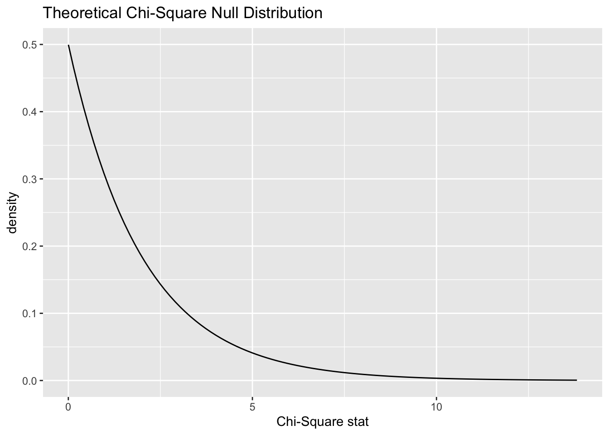

# Chi-square goodness-of-fit test

<!-- Please don't mess with the next few lines! -->
<style>h5{font-size:2em;color:#0000FF}h6{font-size:1.5em;color:#0000FF}div.answer{margin-left:5%;border:1px solid #0000FF;border-left-width:10px;padding:25px} div.summary{background-color:rgba(30,144,255,0.1);border:3px double #0000FF;padding:25px}</style><p style="color:#ffffff">2.0</p>
<!-- Please don't mess with the previous few lines! -->


::: {.summary}

### Functions introduced in this chapter: {-}

`chisq.test`

:::


## Introduction

In this assignment we will learn how to run the chi-square goodness-of-fit test. A chi-square goodness-of-fit test is similar to a test for a single proportion except, instead of two categories (success/failure), we now try to understand the distribution among three or more categories.


### Install new packages

There are no new packages used in this chapter.

### Download the R notebook file

Check the upper-right corner in RStudio to make sure you're in your `intro_stats` project. Then click on the following link to download this chapter as an R notebook file (`.Rmd`).

<a  target="_blank" href = "https://raw.githubusercontent.com/Jingsai/intro_stats/main/docs/chapter_downloads/17-chi_square_goodness_of_fit.Rmd"
      Download = "17-chi_square_goodness_of_fit.Rmd">
      <button type = "button"> Right Click and Save the link as a File </button>
</a>

Once the file is downloaded, move it to your project folder in RStudio and open it there.

### Restart R and run all chunks

In RStudio, select "Restart R and Run All Chunks" from the "Run" menu.


## Load packages

We load the standard `tidyverse`, `janitor`, and `infer` packages and the `openintro` package for the `hsb2` data.


```r
library(tidyverse)
```

```
## ── Attaching packages ─────────────────────────────────────── tidyverse 1.3.2 ──
## ✔ ggplot2 3.3.6      ✔ purrr   0.3.4 
## ✔ tibble  3.1.8      ✔ dplyr   1.0.10
## ✔ tidyr   1.2.0      ✔ stringr 1.4.1 
## ✔ readr   2.1.2      ✔ forcats 0.5.2 
## ── Conflicts ────────────────────────────────────────── tidyverse_conflicts() ──
## ✖ dplyr::filter() masks stats::filter()
## ✖ dplyr::lag()    masks stats::lag()
```

```r
library(janitor)
```

```
## 
## Attaching package: 'janitor'
## 
## The following objects are masked from 'package:stats':
## 
##     chisq.test, fisher.test
```

```r
library(infer)
library(openintro)
```

```
## Loading required package: airports
## Loading required package: cherryblossom
## Loading required package: usdata
```


## Research question

We use a classic data set `mtcars` from a 1974 Motor Trend magazine to examine the distribution of the number of engine cylinders (with values 4, 6, or 8). We'll assume that this data set is representative of all cars from 1974.

In recent years, 4-cylinder vehicles and 6-cylinder vehicles have comprised about 38% of the market each, with nearly all the rest (24%) being 8-cylinder cars. (This ignores a very small number of cars manufactured with 3- or 5-cylinder engines.) Were car engines in 1974 manufactured according to the same distribution?

Here is the structure of the data:


```r
glimpse(mtcars)
```

```
## Rows: 32
## Columns: 11
## $ mpg  <dbl> 21.0, 21.0, 22.8, 21.4, 18.7, 18.1, 14.3, 24.4, 22.8, 19.2, 17.8,…
## $ cyl  <dbl> 6, 6, 4, 6, 8, 6, 8, 4, 4, 6, 6, 8, 8, 8, 8, 8, 8, 4, 4, 4, 4, 8,…
## $ disp <dbl> 160.0, 160.0, 108.0, 258.0, 360.0, 225.0, 360.0, 146.7, 140.8, 16…
## $ hp   <dbl> 110, 110, 93, 110, 175, 105, 245, 62, 95, 123, 123, 180, 180, 180…
## $ drat <dbl> 3.90, 3.90, 3.85, 3.08, 3.15, 2.76, 3.21, 3.69, 3.92, 3.92, 3.92,…
## $ wt   <dbl> 2.620, 2.875, 2.320, 3.215, 3.440, 3.460, 3.570, 3.190, 3.150, 3.…
## $ qsec <dbl> 16.46, 17.02, 18.61, 19.44, 17.02, 20.22, 15.84, 20.00, 22.90, 18…
## $ vs   <dbl> 0, 0, 1, 1, 0, 1, 0, 1, 1, 1, 1, 0, 0, 0, 0, 0, 0, 1, 1, 1, 1, 0,…
## $ am   <dbl> 1, 1, 1, 0, 0, 0, 0, 0, 0, 0, 0, 0, 0, 0, 0, 0, 0, 1, 1, 1, 0, 0,…
## $ gear <dbl> 4, 4, 4, 3, 3, 3, 3, 4, 4, 4, 4, 3, 3, 3, 3, 3, 3, 4, 4, 4, 3, 3,…
## $ carb <dbl> 4, 4, 1, 1, 2, 1, 4, 2, 2, 4, 4, 3, 3, 3, 4, 4, 4, 1, 2, 1, 1, 2,…
```

Note that the variable of interest `cyl` is not coded as a factor variable. Let's convert `cyl` to a factor variable first and add it to a new data frame called `mtcars2`. (Since the levels are already called 4, 6, and 8, we do not need to specify `levels` or `labels`.) Be sure to remember to use `mtcars2` from here on out, and not the original `mtcars`.


```r
mtcars2 <- mtcars %>%
  mutate(cyl_fct = factor(cyl))
mtcars2
```

```
##                      mpg cyl  disp  hp drat    wt  qsec vs am gear carb cyl_fct
## Mazda RX4           21.0   6 160.0 110 3.90 2.620 16.46  0  1    4    4       6
## Mazda RX4 Wag       21.0   6 160.0 110 3.90 2.875 17.02  0  1    4    4       6
## Datsun 710          22.8   4 108.0  93 3.85 2.320 18.61  1  1    4    1       4
## Hornet 4 Drive      21.4   6 258.0 110 3.08 3.215 19.44  1  0    3    1       6
## Hornet Sportabout   18.7   8 360.0 175 3.15 3.440 17.02  0  0    3    2       8
## Valiant             18.1   6 225.0 105 2.76 3.460 20.22  1  0    3    1       6
## Duster 360          14.3   8 360.0 245 3.21 3.570 15.84  0  0    3    4       8
## Merc 240D           24.4   4 146.7  62 3.69 3.190 20.00  1  0    4    2       4
## Merc 230            22.8   4 140.8  95 3.92 3.150 22.90  1  0    4    2       4
## Merc 280            19.2   6 167.6 123 3.92 3.440 18.30  1  0    4    4       6
## Merc 280C           17.8   6 167.6 123 3.92 3.440 18.90  1  0    4    4       6
## Merc 450SE          16.4   8 275.8 180 3.07 4.070 17.40  0  0    3    3       8
## Merc 450SL          17.3   8 275.8 180 3.07 3.730 17.60  0  0    3    3       8
## Merc 450SLC         15.2   8 275.8 180 3.07 3.780 18.00  0  0    3    3       8
## Cadillac Fleetwood  10.4   8 472.0 205 2.93 5.250 17.98  0  0    3    4       8
## Lincoln Continental 10.4   8 460.0 215 3.00 5.424 17.82  0  0    3    4       8
## Chrysler Imperial   14.7   8 440.0 230 3.23 5.345 17.42  0  0    3    4       8
## Fiat 128            32.4   4  78.7  66 4.08 2.200 19.47  1  1    4    1       4
## Honda Civic         30.4   4  75.7  52 4.93 1.615 18.52  1  1    4    2       4
## Toyota Corolla      33.9   4  71.1  65 4.22 1.835 19.90  1  1    4    1       4
## Toyota Corona       21.5   4 120.1  97 3.70 2.465 20.01  1  0    3    1       4
## Dodge Challenger    15.5   8 318.0 150 2.76 3.520 16.87  0  0    3    2       8
## AMC Javelin         15.2   8 304.0 150 3.15 3.435 17.30  0  0    3    2       8
## Camaro Z28          13.3   8 350.0 245 3.73 3.840 15.41  0  0    3    4       8
## Pontiac Firebird    19.2   8 400.0 175 3.08 3.845 17.05  0  0    3    2       8
## Fiat X1-9           27.3   4  79.0  66 4.08 1.935 18.90  1  1    4    1       4
## Porsche 914-2       26.0   4 120.3  91 4.43 2.140 16.70  0  1    5    2       4
## Lotus Europa        30.4   4  95.1 113 3.77 1.513 16.90  1  1    5    2       4
## Ford Pantera L      15.8   8 351.0 264 4.22 3.170 14.50  0  1    5    4       8
## Ferrari Dino        19.7   6 145.0 175 3.62 2.770 15.50  0  1    5    6       6
## Maserati Bora       15.0   8 301.0 335 3.54 3.570 14.60  0  1    5    8       8
## Volvo 142E          21.4   4 121.0 109 4.11 2.780 18.60  1  1    4    2       4
```


```r
glimpse(mtcars2)
```

```
## Rows: 32
## Columns: 12
## $ mpg     <dbl> 21.0, 21.0, 22.8, 21.4, 18.7, 18.1, 14.3, 24.4, 22.8, 19.2, 17…
## $ cyl     <dbl> 6, 6, 4, 6, 8, 6, 8, 4, 4, 6, 6, 8, 8, 8, 8, 8, 8, 4, 4, 4, 4,…
## $ disp    <dbl> 160.0, 160.0, 108.0, 258.0, 360.0, 225.0, 360.0, 146.7, 140.8,…
## $ hp      <dbl> 110, 110, 93, 110, 175, 105, 245, 62, 95, 123, 123, 180, 180, …
## $ drat    <dbl> 3.90, 3.90, 3.85, 3.08, 3.15, 2.76, 3.21, 3.69, 3.92, 3.92, 3.…
## $ wt      <dbl> 2.620, 2.875, 2.320, 3.215, 3.440, 3.460, 3.570, 3.190, 3.150,…
## $ qsec    <dbl> 16.46, 17.02, 18.61, 19.44, 17.02, 20.22, 15.84, 20.00, 22.90,…
## $ vs      <dbl> 0, 0, 1, 1, 0, 1, 0, 1, 1, 1, 1, 0, 0, 0, 0, 0, 0, 1, 1, 1, 1,…
## $ am      <dbl> 1, 1, 1, 0, 0, 0, 0, 0, 0, 0, 0, 0, 0, 0, 0, 0, 0, 1, 1, 1, 0,…
## $ gear    <dbl> 4, 4, 4, 3, 3, 3, 3, 4, 4, 4, 4, 3, 3, 3, 3, 3, 3, 4, 4, 4, 3,…
## $ carb    <dbl> 4, 4, 1, 1, 2, 1, 4, 2, 2, 4, 4, 3, 3, 3, 4, 4, 4, 1, 2, 1, 1,…
## $ cyl_fct <fct> 6, 6, 4, 6, 8, 6, 8, 4, 4, 6, 6, 8, 8, 8, 8, 8, 8, 4, 4, 4, 4,…
```


## Chi-squared

When we have three or more categories in a categorical variable, it is natural to ask how the observed counts in each category compare to the counts that we expect to see under the assumption of some null hypothesis. In other words, we're assuming that there is some "true" distribution to which we are going to compare our data. Sometimes, this null comes from substantive expert knowledge. (For example, we will be comparing the 1974 distribution to a known distribution from recent years.) Sometimes we're interested to see if our data deviates from a null distribution that predicts an equal number of observations in each category.

First of all, what is the actual distribution of cylinders in our data? Here's a frequency table.
 

```r
tabyl(mtcars2, cyl_fct) %>%
    adorn_totals() %>%
    adorn_pct_formatting()
```

```
##  cyl_fct  n percent
##        4 11   34.4%
##        6  7   21.9%
##        8 14   43.8%
##    Total 32  100.0%
```

The counts of our frequency table are the "observed" values, usually denoted by the letter $O$ (uppercase "O", which is a little unfortunate, because it also looks like a zero).

What are the expected counts? Well, since there are 32 cars, we need to multiply 32 by the percentages listed in the research question. For 4-cylinder and 6-cylinder cars, if the distribution of engines in 1974 were the same as today, there would be $32 * 0.38$ or about 12.2 cars we would expect to see in our sample that have 4-cylinder engines, and the same for 6-cylinder cars. For 8-cylinder cars, we expect $32 * 0.24$ or about 7.7 cars in our sample to have 8-cylinder engines. These "expected" counts are usually denoted by the letter $E$.

Why aren't the expected counts whole numbers? In any given data set, of course, we will see a whole number of cars with 4, 6, or 8 cylinders. However, since we're looking only at expected counts, they are the average over lots of possible sets of 32 cars under the assumption of the null. We don't need for these averages to be whole numbers.

How should the deviation between the data and the null distribution be measured? We could simply look at the difference between the observed counts and the expected counts $O - E$. However, there will be some positive values (cells where we have more than the expected number of cars) and some negative values (cells where we have fewer than the expected number of cars). These will all cancel out.

If this sounds vaguely familiar, it is because we encountered the same problem with the formula for the standard deviation. The differences $y - \bar{y}$ had the same issue. Do you recall the solution in that case? It was to square these values, making them all positive.

So instead of $O - E$, we will consider $(O - E)^{2}$. Finally, to make sure that cells with large expected values don't dominate, we divide by $E$:

$$
\frac{(O - E)^{2}}{E}.
$$

This puts each cell on equal footing. Now that we have a reasonable measure of the deviation between observed and expected counts for each cell, we define $\chi^{2}$ ("chi-squared", pronounced "kye-squared"---rhymes with "die-scared", or if that's too dark, how about "pie-shared"^[Rhyming is fun!]) as the sum of all these fractions, one for each cell:

$$
\chi^{2} = \sum \frac{(O - E)^{2}}{E}.
$$

A $\chi^{2}$ value of zero would indicate perfect agreement between observed and expected values. As the $\chi^{2}$ value gets larger and larger, this indicates more and more deviation between observed and expected values.

As an example, for our data, we calculate chi-squared as follows:

$$
\chi^{2} = \frac{(11 - 12.2)^{2}}{12.2} + \frac{(7 - 12.2)^{2}}{12.2} + \frac{(14 - 7.7)^{2}}{7.7} \approx 7.5.
$$

Or we could just do it in R with the `infer` package. To do so, we have to state explicitly the proportions that correspond to the null hypothesis. In this case, since the order of entries in the frequency table is 4-cylinder, 6-cylinder, then 8-cylinder, we need to give `infer` a vector of entries `c("4" = 0.38, "6" = 0.38, "8" = 0.24)` that represents the 38%, 38%, and 24% expected for 4, 6, and 8 cylinders respectively.


```r
obs_chisq <- mtcars2 %>%
  specify(response = cyl_fct) %>%
  hypothesize(null = "point",
              p = c("4" = 0.38,
                    "6" = 0.38,
                    "8" = 0.24)) %>%
  calculate(stat = "chisq")
obs_chisq
```

```
## Response: cyl_fct (factor)
## Null Hypothesis: point
## # A tibble: 1 × 1
##    stat
##   <dbl>
## 1  7.50
```


## The chi-square distribution

We know that even if the true distribution were 38%, 38%, 24%, we would not see exactly 12.2, 12.2, 7.7 in a sample of 32 cars. (In fact, the "true" distribution is physically impossible because these are not whole numbers!) So what kinds of numbers could we get?

Let's do a quick simulation to find out.

Under the assumption of the null, there should be a 38%, 38%, and 24% chance of seeing 4, 6, or 8 cylinders, respectively. To get a sense of the extent of sampling variability, we could use the `sample` command to see what happens in a sample of size 32 taken from a population where the true percentages are 38%, 38%, and 24%.


```r
set.seed(99999)
sample1 <- sample(c(4, 6, 8), size = 32, replace = TRUE,
       prob = c(0.38, 0.38, 0.24))
sample1
```

```
##  [1] 6 8 4 8 6 6 8 4 8 6 8 6 6 4 6 8 4 6 6 8 8 6 6 8 4 8 6 4 4 4 6 4
```


```r
sample1 %>%
  table()
```

```
## .
##  4  6  8 
##  9 13 10
```


```r
sample2 <- sample(c(4, 6, 8), size = 32, replace = TRUE,
       prob = c(0.38, 0.38, 0.24))
sample2
```

```
##  [1] 6 8 8 8 4 4 8 4 8 6 8 4 4 6 6 6 6 4 4 4 6 4 4 4 8 4 4 8 4 4 4 8
```


```r
sample2 %>%
  table()
```

```
## .
##  4  6  8 
## 16  7  9
```


```r
sample3 <- sample(c(4, 6, 8), size = 32, replace = TRUE,
       prob = c(0.38, 0.38, 0.24))
sample3
```

```
##  [1] 8 6 4 6 6 6 6 4 6 6 6 4 6 4 8 8 6 8 8 8 4 6 8 4 8 6 6 6 6 8 4 6
```


```r
sample3 %>%
  table()
```

```
## .
##  4  6  8 
##  7 16  9
```

We can calculate the chi-squared value for each of these samples to get a sense of the possibilities. The `chisq.test` command from base R is a little unusual because it requires a frequency table (generated from the `table` command) as input. We will never use the `chisq.test` command directly because we will always use `infer` to do this work. But just to see some examples:


```r
sample1 %>%
  table() %>%
  chisq.test()
```

```
## 
## 	Chi-squared test for given probabilities
## 
## data:  .
## X-squared = 0.8125, df = 2, p-value = 0.6661
```


```r
sample2 %>%
  table() %>%
  chisq.test()
```

```
## 
## 	Chi-squared test for given probabilities
## 
## data:  .
## X-squared = 4.1875, df = 2, p-value = 0.1232
```


```r
sample3 %>%
  table() %>%
  chisq.test()
```

```
## 
## 	Chi-squared test for given probabilities
## 
## data:  .
## X-squared = 4.1875, df = 2, p-value = 0.1232
```

##### Exercise 1 {-}

Look more carefully at the three random samples above. Why does sample 1 have a chi-squared closer to 0 while samples 2 and 3 have a chi-squared values that are a little larger? (Hint: look at the counts of 4s, 6s, and 8s in those samples. How do those counts compare to the expected number of 4s, 6s, and 8s?)

::: {.answer}

Please write up your answer here.

:::

*****


The `infer` pipeline below (the `generate` command specifically) takes the values "4", "6", or "8" and grabs them at random according to the probabilities specified until it has 32 values. In other words, it will randomly select "4" about 38% of the time, "6" about 38% of the time, and "8" about 24% of the time, until it gets a list of 32 total cars. Then it will calculate the chi-squared value for that simulated set of 32 cars. But because randomness is involved, the simulated samples are subject to sampling variability and the chi-square values obtained will differ from each other. This is exactly what we did above with the `sample` command and the `chisq` command, but the benefit now is that we get 1000 random samples very quickly.


```r
set.seed(99999)
cyl_test_sim <- mtcars2 %>%
  specify(response = cyl_fct) %>%
  hypothesize(null = "point",
              p = c("4" = 0.38,
                    "6" = 0.38,
                    "8" = 0.24)) %>%
  generate(reps = 1000, type = "draw") %>%
  calculate(stat = "chisq")
cyl_test_sim
```

```
## Response: cyl_fct (factor)
## Null Hypothesis: point
## # A tibble: 1,000 × 2
##    replicate  stat
##    <fct>     <dbl>
##  1 1         1.58 
##  2 2         3.63 
##  3 3         3.63 
##  4 4         0.669
##  5 5         2.31 
##  6 6         0.648
##  7 7         4.13 
##  8 8         7.08 
##  9 9         0.648
## 10 10        0.669
## # … with 990 more rows
```

The "stat" column above contains 1000 random values of $\chi^{2}$. Let's graph these values and include the chi-squared value for our actual data in the same graph.


```r
cyl_test_sim %>%
  visualize() +
  shade_p_value(obs_chisq, direction = "greater")
```


A few things are apparent:

1. The values are all positive. (The leftmost bar is sitting at 0, but it represents values greater than zero.) This makes sense when you remember that each piece of the $\chi^{2}$ calculation was positive. This is different from our earlier simulations that looked like normal models. (Z scores can be positive or negative, but not $\chi^{2}$.)

2. This is a severely right-skewed graph. Although most values are near zero, the occasional unusual sample can have a large value of $\chi^{2}$.

3. You can see that our sample (the red line) is pretty far to the right. It is an unusual value given the assumption of the null hypothesis. In fact, we can count the proportion of sampled values that are to the right of the red line:


```r
cyl_test_sim %>%
  get_p_value(obs_chisq, direction = "greater")
```

```
## # A tibble: 1 × 1
##   p_value
##     <dbl>
## 1   0.021
```

This is the simulated P-value. Keep this number in mind when we calculate the P-value using a sampling distribution model below.


## Chi-square as a sampling distribution model

Just like there was a mathematical model for our simulated data before (the normal model back then), there is also a mathematical model for this type of simulated data. It's called (not surprisingly) the *chi-square distribution*.

There is one new idea, though. Although all normal models have the same bell shape, there are many different chi-square models. This is because the number of cells can change the sampling distribution. Our engine cylinder example has three cells (corresponding to the categories "4", "6", and "8"). But what if there were 10 categories? The shape of the chi-square model would be different.

The terminology used by statisticians to distinguish these models is *degrees of freedom*, abbreviated $df$. The reason for this name and the mathematics behind it are somewhat technical. Suffice it to say for now that if there are $c$ cells, you use $c - 1$ degrees of freedom. For our car example, there are 3 cylinder categories, so $df = 2$.

Look at the graph below that shows the theoretical chi-square models for varying degrees of freedom.


```r
# Don't worry about the syntax here.
# You won't need to know how to do this on your own.
ggplot(data.frame(x = c(0, 20)), aes(x)) +
    stat_function(fun = dchisq, args = list(df = 2),
                  aes(color = "2")) +
    stat_function(fun = dchisq, args = list(df = 5),
                  aes(color = "5" )) +
    stat_function(fun = dchisq, args = list(df = 10),
                  aes(color = "10")) +
    scale_color_manual(name = "df",
                       values = c("2" = "red",
                                  "5" = "blue",
                                  "10" = "green"),
                       breaks =  c("2", "5", "10"))
```


The red curve (corresponding to $df = 2$) looks a lot like our simulation above. But as the degrees of freedom increase, the mode shifts further to the right.


## Chi-square goodness-of-fit test

The formal inferential procedure for examining whether data from a categorical variable fits a proposed distribution in the population is called a *chi-square goodness-of-fit test*.

We can use the chi-square model as the sampling distribution as long as the sample size is large enough. This is checked by calculating that the expected cell counts (not the observed cell counts!) are at least 5 in each cell.

The following `infer` pipeline will run a hypothesis test using the theoretical chi-squared distribution with 2 degrees of freedom.


```r
cyl_test <- mtcars2 %>%
  specify(response = cyl_fct) %>%
  assume(distribution = "chisq")
cyl_test
```

```
## A Chi-squared distribution with 2 degrees of freedom.
```

Here is the theoretical distribution:


```r
cyl_test %>%
  visualize()
```



And here it is will our test statistic (the chi-squared value for our observed data) marked:


```r
cyl_test %>%
  visualize() +
  shade_p_value(obs_chisq, direction = "greater")
```


Finally, here is the P-value associated with the shaded area to the right of the test statistic:


```r
cyl_test %>%
  get_p_value(obs_chisq, direction = "greater")
```

```
## # A tibble: 1 × 1
##   p_value
##     <dbl>
## 1  0.0235
```

Note that this P-value is quite similar to the P-value derived from the simulation earlier.

We'll walk through the engine cylinder example from top to bottom using the rubric. Most of this is just repeating work we've already done, but showing this work in the context of the rubric will help you as you take over in the "Your Turn" section later.


## Exploratory data analysis

### Use data documentation (help files, code books, Google, etc.) to determine as much as possible about the data provenance and structure.

Type `?mtcars` at the Console to read the help file. *Motor Trend* is a reputable publication and, therefore, we do not doubt the accuracy of the data. It's not clear, however, why these specific 32 cars were chosen and if they reflect a representative sample of cars on the road in 1974.


```r
mtcars
```

```
##                      mpg cyl  disp  hp drat    wt  qsec vs am gear carb
## Mazda RX4           21.0   6 160.0 110 3.90 2.620 16.46  0  1    4    4
## Mazda RX4 Wag       21.0   6 160.0 110 3.90 2.875 17.02  0  1    4    4
## Datsun 710          22.8   4 108.0  93 3.85 2.320 18.61  1  1    4    1
## Hornet 4 Drive      21.4   6 258.0 110 3.08 3.215 19.44  1  0    3    1
## Hornet Sportabout   18.7   8 360.0 175 3.15 3.440 17.02  0  0    3    2
## Valiant             18.1   6 225.0 105 2.76 3.460 20.22  1  0    3    1
## Duster 360          14.3   8 360.0 245 3.21 3.570 15.84  0  0    3    4
## Merc 240D           24.4   4 146.7  62 3.69 3.190 20.00  1  0    4    2
## Merc 230            22.8   4 140.8  95 3.92 3.150 22.90  1  0    4    2
## Merc 280            19.2   6 167.6 123 3.92 3.440 18.30  1  0    4    4
## Merc 280C           17.8   6 167.6 123 3.92 3.440 18.90  1  0    4    4
## Merc 450SE          16.4   8 275.8 180 3.07 4.070 17.40  0  0    3    3
## Merc 450SL          17.3   8 275.8 180 3.07 3.730 17.60  0  0    3    3
## Merc 450SLC         15.2   8 275.8 180 3.07 3.780 18.00  0  0    3    3
## Cadillac Fleetwood  10.4   8 472.0 205 2.93 5.250 17.98  0  0    3    4
## Lincoln Continental 10.4   8 460.0 215 3.00 5.424 17.82  0  0    3    4
## Chrysler Imperial   14.7   8 440.0 230 3.23 5.345 17.42  0  0    3    4
## Fiat 128            32.4   4  78.7  66 4.08 2.200 19.47  1  1    4    1
## Honda Civic         30.4   4  75.7  52 4.93 1.615 18.52  1  1    4    2
## Toyota Corolla      33.9   4  71.1  65 4.22 1.835 19.90  1  1    4    1
## Toyota Corona       21.5   4 120.1  97 3.70 2.465 20.01  1  0    3    1
## Dodge Challenger    15.5   8 318.0 150 2.76 3.520 16.87  0  0    3    2
## AMC Javelin         15.2   8 304.0 150 3.15 3.435 17.30  0  0    3    2
## Camaro Z28          13.3   8 350.0 245 3.73 3.840 15.41  0  0    3    4
## Pontiac Firebird    19.2   8 400.0 175 3.08 3.845 17.05  0  0    3    2
## Fiat X1-9           27.3   4  79.0  66 4.08 1.935 18.90  1  1    4    1
## Porsche 914-2       26.0   4 120.3  91 4.43 2.140 16.70  0  1    5    2
## Lotus Europa        30.4   4  95.1 113 3.77 1.513 16.90  1  1    5    2
## Ford Pantera L      15.8   8 351.0 264 4.22 3.170 14.50  0  1    5    4
## Ferrari Dino        19.7   6 145.0 175 3.62 2.770 15.50  0  1    5    6
## Maserati Bora       15.0   8 301.0 335 3.54 3.570 14.60  0  1    5    8
## Volvo 142E          21.4   4 121.0 109 4.11 2.780 18.60  1  1    4    2
```


```r
glimpse(mtcars)
```

```
## Rows: 32
## Columns: 11
## $ mpg  <dbl> 21.0, 21.0, 22.8, 21.4, 18.7, 18.1, 14.3, 24.4, 22.8, 19.2, 17.8,…
## $ cyl  <dbl> 6, 6, 4, 6, 8, 6, 8, 4, 4, 6, 6, 8, 8, 8, 8, 8, 8, 4, 4, 4, 4, 8,…
## $ disp <dbl> 160.0, 160.0, 108.0, 258.0, 360.0, 225.0, 360.0, 146.7, 140.8, 16…
## $ hp   <dbl> 110, 110, 93, 110, 175, 105, 245, 62, 95, 123, 123, 180, 180, 180…
## $ drat <dbl> 3.90, 3.90, 3.85, 3.08, 3.15, 2.76, 3.21, 3.69, 3.92, 3.92, 3.92,…
## $ wt   <dbl> 2.620, 2.875, 2.320, 3.215, 3.440, 3.460, 3.570, 3.190, 3.150, 3.…
## $ qsec <dbl> 16.46, 17.02, 18.61, 19.44, 17.02, 20.22, 15.84, 20.00, 22.90, 18…
## $ vs   <dbl> 0, 0, 1, 1, 0, 1, 0, 1, 1, 1, 1, 0, 0, 0, 0, 0, 0, 1, 1, 1, 1, 0,…
## $ am   <dbl> 1, 1, 1, 0, 0, 0, 0, 0, 0, 0, 0, 0, 0, 0, 0, 0, 0, 1, 1, 1, 0, 0,…
## $ gear <dbl> 4, 4, 4, 3, 3, 3, 3, 4, 4, 4, 4, 3, 3, 3, 3, 3, 3, 4, 4, 4, 3, 3,…
## $ carb <dbl> 4, 4, 1, 1, 2, 1, 4, 2, 2, 4, 4, 3, 3, 3, 4, 4, 4, 1, 2, 1, 1, 2,…
```

### Prepare the data for analysis.


```r
# Although we've already done this above, 
# we include it here again for completeness.
mtcars2 <- mtcars %>%
  mutate(cyl_fct = factor(cyl))
mtcars2
```

```
##                      mpg cyl  disp  hp drat    wt  qsec vs am gear carb cyl_fct
## Mazda RX4           21.0   6 160.0 110 3.90 2.620 16.46  0  1    4    4       6
## Mazda RX4 Wag       21.0   6 160.0 110 3.90 2.875 17.02  0  1    4    4       6
## Datsun 710          22.8   4 108.0  93 3.85 2.320 18.61  1  1    4    1       4
## Hornet 4 Drive      21.4   6 258.0 110 3.08 3.215 19.44  1  0    3    1       6
## Hornet Sportabout   18.7   8 360.0 175 3.15 3.440 17.02  0  0    3    2       8
## Valiant             18.1   6 225.0 105 2.76 3.460 20.22  1  0    3    1       6
## Duster 360          14.3   8 360.0 245 3.21 3.570 15.84  0  0    3    4       8
## Merc 240D           24.4   4 146.7  62 3.69 3.190 20.00  1  0    4    2       4
## Merc 230            22.8   4 140.8  95 3.92 3.150 22.90  1  0    4    2       4
## Merc 280            19.2   6 167.6 123 3.92 3.440 18.30  1  0    4    4       6
## Merc 280C           17.8   6 167.6 123 3.92 3.440 18.90  1  0    4    4       6
## Merc 450SE          16.4   8 275.8 180 3.07 4.070 17.40  0  0    3    3       8
## Merc 450SL          17.3   8 275.8 180 3.07 3.730 17.60  0  0    3    3       8
## Merc 450SLC         15.2   8 275.8 180 3.07 3.780 18.00  0  0    3    3       8
## Cadillac Fleetwood  10.4   8 472.0 205 2.93 5.250 17.98  0  0    3    4       8
## Lincoln Continental 10.4   8 460.0 215 3.00 5.424 17.82  0  0    3    4       8
## Chrysler Imperial   14.7   8 440.0 230 3.23 5.345 17.42  0  0    3    4       8
## Fiat 128            32.4   4  78.7  66 4.08 2.200 19.47  1  1    4    1       4
## Honda Civic         30.4   4  75.7  52 4.93 1.615 18.52  1  1    4    2       4
## Toyota Corolla      33.9   4  71.1  65 4.22 1.835 19.90  1  1    4    1       4
## Toyota Corona       21.5   4 120.1  97 3.70 2.465 20.01  1  0    3    1       4
## Dodge Challenger    15.5   8 318.0 150 2.76 3.520 16.87  0  0    3    2       8
## AMC Javelin         15.2   8 304.0 150 3.15 3.435 17.30  0  0    3    2       8
## Camaro Z28          13.3   8 350.0 245 3.73 3.840 15.41  0  0    3    4       8
## Pontiac Firebird    19.2   8 400.0 175 3.08 3.845 17.05  0  0    3    2       8
## Fiat X1-9           27.3   4  79.0  66 4.08 1.935 18.90  1  1    4    1       4
## Porsche 914-2       26.0   4 120.3  91 4.43 2.140 16.70  0  1    5    2       4
## Lotus Europa        30.4   4  95.1 113 3.77 1.513 16.90  1  1    5    2       4
## Ford Pantera L      15.8   8 351.0 264 4.22 3.170 14.50  0  1    5    4       8
## Ferrari Dino        19.7   6 145.0 175 3.62 2.770 15.50  0  1    5    6       6
## Maserati Bora       15.0   8 301.0 335 3.54 3.570 14.60  0  1    5    8       8
## Volvo 142E          21.4   4 121.0 109 4.11 2.780 18.60  1  1    4    2       4
```


```r
glimpse(mtcars2)
```

```
## Rows: 32
## Columns: 12
## $ mpg     <dbl> 21.0, 21.0, 22.8, 21.4, 18.7, 18.1, 14.3, 24.4, 22.8, 19.2, 17…
## $ cyl     <dbl> 6, 6, 4, 6, 8, 6, 8, 4, 4, 6, 6, 8, 8, 8, 8, 8, 8, 4, 4, 4, 4,…
## $ disp    <dbl> 160.0, 160.0, 108.0, 258.0, 360.0, 225.0, 360.0, 146.7, 140.8,…
## $ hp      <dbl> 110, 110, 93, 110, 175, 105, 245, 62, 95, 123, 123, 180, 180, …
## $ drat    <dbl> 3.90, 3.90, 3.85, 3.08, 3.15, 2.76, 3.21, 3.69, 3.92, 3.92, 3.…
## $ wt      <dbl> 2.620, 2.875, 2.320, 3.215, 3.440, 3.460, 3.570, 3.190, 3.150,…
## $ qsec    <dbl> 16.46, 17.02, 18.61, 19.44, 17.02, 20.22, 15.84, 20.00, 22.90,…
## $ vs      <dbl> 0, 0, 1, 1, 0, 1, 0, 1, 1, 1, 1, 0, 0, 0, 0, 0, 0, 1, 1, 1, 1,…
## $ am      <dbl> 1, 1, 1, 0, 0, 0, 0, 0, 0, 0, 0, 0, 0, 0, 0, 0, 0, 1, 1, 1, 0,…
## $ gear    <dbl> 4, 4, 4, 3, 3, 3, 3, 4, 4, 4, 4, 3, 3, 3, 3, 3, 3, 4, 4, 4, 3,…
## $ carb    <dbl> 4, 4, 1, 1, 2, 1, 4, 2, 2, 4, 4, 3, 3, 3, 4, 4, 4, 1, 2, 1, 1,…
## $ cyl_fct <fct> 6, 6, 4, 6, 8, 6, 8, 4, 4, 6, 6, 8, 8, 8, 8, 8, 8, 4, 4, 4, 4,…
```

### Make tables or plots to explore the data visually.


```r
tabyl(mtcars2, cyl_fct) %>%
    adorn_totals() %>%
    adorn_pct_formatting()
```

```
##  cyl_fct  n percent
##        4 11   34.4%
##        6  7   21.9%
##        8 14   43.8%
##    Total 32  100.0%
```


## Hypotheses

### Identify the sample (or samples) and a reasonable population (or populations) of interest.

The sample is a set of 32 cars from a 1974 Motor Trends magazine. The population is all cars from 1974.

### Express the null and alternative hypotheses as contextually meaningful full sentences.

$H_{0}:$ In 1974, the proportion of cars with 4, 6, and 8 cylinders was 38%, 38%, and 24%, respectively.

$H_{A}:$ In 1974, the proportion of cars with 4, 6, and 8 cylinders was not 38%, 38%, and 24%.

### Express the null and alternative hypotheses in symbols (when possible).

$H_{0}: p_{4} = 0.38, p_{6} = 0.38, p_{8} = 0.24$

There is no easy way to express the alternate hypothesis in symbols because any deviation in any of the categories can lead to rejection of the null. You can't just say $p_{4} \neq 0.38, p_{6} \neq 0.38, p_{8} \neq 0.24$ because one of these categories might have the correct proportion with the other two different and that would still be consistent with the alternative hypothesis.

So the only requirement here is to express the null in symbols.


## Model

### Identify the sampling distribution model.

We use a $\chi^{2}$ model with 2 degrees of freedom.

Commentary: Unlike the normal model, there are infinitely many different $\chi^{2}$ models, so you have to specify the degrees of freedom when you identify it as the sampling distribution model.

### Check the relevant conditions to ensure that model assumptions are met.

* Random
    - We do not know how Motor Trends magazine sampled these 32 cars, so we're not sure if this list is random or representative of all cars from 1974. We should be cautious in our conclusions.

* 10%
    - As long as there are at least 320 different car models, we are okay. This sounds like a lot, so this condition might not quite be met. Again, we need to be careful. (Also note that the population is not all automobiles manufactured in 1974. It is all *types* of automobile manufactured in 1974. There's a big difference.)

* Expected cell counts
    - This condition says that under the null, we should see at least 5 cars in each category. The expected counts are $32(0.38) = 12.2$, $32(0.38) = 12.2$, and $32(0.24) = 7.7$. So this condition is met.
    

Commentary: The expected counts condition is necessary for using the theoretical chi-squared distribution. If we were using simulation instead, we would not need this condition.


## Mechanics

### Compute the test statistic.


```r
obs_chisq <- mtcars2 %>%
  specify(response = cyl_fct) %>%
  hypothesize(null = "point",
              p = c("4" = 0.38,
                    "6" = 0.38,
                    "8" = 0.24)) %>%
  calculate(stat = "chisq")
obs_chisq
```

```
## Response: cyl_fct (factor)
## Null Hypothesis: point
## # A tibble: 1 × 1
##    stat
##   <dbl>
## 1  7.50
```

### Report the test statistic in context (when possible).

The value of $\chi^{2}$ is 7.5010965.

Commentary: The $\chi^{2}$ test statistic is, of course, the same value we computed manually by hand earlier. Also, the formula for $\chi^{2}$ is a complicated function of observed and expected values, making it difficult to say anything about this number in the context of cars and engine cylinders. So even though the requirement is to "report the test statistic in context," there's not much one can say here other than just to report the test statistic.

### Plot the null distribution.


```r
cyl_test <- mtcars2 %>%
  specify(response = cyl_fct) %>%
  assume(distribution = "chisq")
cyl_test
```

```
## A Chi-squared distribution with 2 degrees of freedom.
```


```r
cyl_test %>%
  visualize() +
  shade_p_value(obs_chisq, direction = "greater")
```


Commentary: We will use the theoretical distribution 


### Calculate the P-value.


```r
cyl_test_p <- cyl_test %>%
  get_p_value(obs_chisq, direction = "greater")
cyl_test_p
```

```
## # A tibble: 1 × 1
##   p_value
##     <dbl>
## 1  0.0235
```

### Interpret the P-value as a probability given the null.

The P-value is 0.0235049. If the true distribution of cars in 1974 were 38% 4-cylinder, 38% 6-cylinder, and 24% 8-cylinder, there would be a 2.3504856% chance of seeing data at least as extreme as what we saw.


## Conclusion

### State the statistical conclusion.

We reject the null.

### State (but do not overstate) a contextually meaningful conclusion.

There is sufficient evidence that in 1974, the distribution of cars was not 38% 4-cylinder, 38% 6-cylinder, and 24% 8-cylinder.

### Express reservations or uncertainty about the generalizability of the conclusion.

As long as we restrict our attention to cars in 1974, we are pretty safe, although we are still uncertain if the sample we had was representative of all cars in 1974.

### Identify the possibility of either a Type I or Type II error and state what making such an error means in the context of the hypotheses.

If we made a Type I error, that would mean the true distribution of cars in 1974 was 38% 4-cylinder, 38% 6-cylinder, and 24% 8-cylinder, but our sample showed otherwise.


## Confidence interval

There is no confidence interval for a chi-square test. Since our test is not about measuring some parameter of interest (like $p$ or $p_{1} - p_{2}$), there is no interval to produce.


## Your turn

Use the `hsb2` data and determine if the proportion of high school students who attend general programs, academic programs, and vocational programs is 15%, 60%, and 25% respectively.

The rubric outline is reproduced below. You may refer to the worked example above and modify it accordingly. Remember to strip out all the commentary. That is just exposition for your benefit in understanding the steps, but is not meant to form part of the formal inference process.

Another word of warning: the copy/paste process is not a substitute for your brain. You will often need to modify more than just the names of the data frames and variables to adapt the worked examples to your own work. Do not blindly copy and paste code without understanding what it does. And you should **never** copy and paste text. All the sentences and paragraphs you write are expressions of your own analysis. They must reflect your own understanding of the inferential process.

**Also, so that your answers here don't mess up the code chunks above, use new variable names everywhere.**


##### Exploratory data analysis {-}

###### Use data documentation (help files, code books, Google, etc.) to determine as much as possible about the data provenance and structure. {-}

::: {.answer}

Please write up your answer here


```r
# Add code here to print the data
```


```r
# Add code here to glimpse the variables
```

:::

###### Prepare the data for analysis. [Not always necessary.] {-}

::: {.answer}


```r
# Add code here to prepare the data for analysis.
```

:::

###### Make tables or plots to explore the data visually. {-}

::: {.answer}


```r
# Add code here to make tables or plots.
```

:::


##### Hypotheses {-}

###### Identify the sample (or samples) and a reasonable population (or populations) of interest. {-}

::: {.answer}

Please write up your answer here.

:::

###### Express the null and alternative hypotheses as contextually meaningful full sentences. {-}

::: {.answer}

$H_{0}:$ Null hypothesis goes here.

$H_{A}:$ Alternative hypothesis goes here.

:::

###### Express the null and alternative hypotheses in symbols (when possible). {-}

::: {.answer}

$H_{0}: math$

$H_{A}: math$

:::


##### Model {-}

###### Identify the sampling distribution model. {-}

::: {.answer}

Please write up your answer here.

:::

###### Check the relevant conditions to ensure that model assumptions are met. {-}

::: {.answer}

Please write up your answer here. (Some conditions may require R code as well.)

:::


##### Mechanics {-}

###### Compute the test statistic. {-}

::: {.answer}


```r
# Add code here to compute the test statistic.
```

:::

###### Report the test statistic in context (when possible). {-}

::: {.answer}

Please write up your answer here.

:::

###### Plot the null distribution. {-}

::: {.answer}


```r
# Add code here to plot the null distribution.
```

:::

###### Calculate the P-value. {-}

::: {.answer}


```r
# Add code here to calculate the P-value.
```

:::

###### Interpret the P-value as a probability given the null. {-}

::: {.answer}

Please write up your answer here.

:::


##### Conclusion {-}

###### State the statistical conclusion. {-}

::: {.answer}

Please write up your answer here.

:::

###### State (but do not overstate) a contextually meaningful conclusion. {-}

::: {.answer}

Please write up your answer here.

:::

###### Express reservations or uncertainty about the generalizability of the conclusion. {-}

::: {.answer}

Please write up your answer here.

:::

###### Identify the possibility of either a Type I or Type II error and state what making such an error means in the context of the hypotheses. {-}

::: {.answer}

Please write up your answer here.

:::

## Bonus section: residuals

The chi-square test can tell us if there is some difference from the expected distribution of counts across the categories, but it doesn't tell us which category has a higher or lower count than expected. For that, we'll need to turn to another tool: *residuals*. 

For technical reasons, the `infer` package doesn't provide residuals, so we'll have to turn to slightly different tools. Here's how this works; we'll return to the example of distribution of cars across the different categories of number of cylinders.

The function we'll use is called `chisq.test`. It requires us to give it input in the form of a table of counts, together with the proportions we wish to compare to:


```r
table(mtcars2$cyl_fct) %>%
  chisq.test(p = c(.38, .38, .24)) -> cyl_chisq.test
cyl_chisq.test
```

```
## 
## 	Chi-squared test for given probabilities
## 
## data:  .
## X-squared = 7.5011, df = 2, p-value = 0.0235
```

Notice that the chi-squared value 7.5011 and the p-value 0.0235 are the same as those we calculated using `infer` tools above.

Here's how to obtain the table of residuals:


```r
cyl_chisq.test$residuals
```

```
## 
##          4          6          8 
## -0.3326528 -1.4797315  2.2805336
```

What do these numbers mean in the real world? Not much. (Essentially, they are the values that were squared to become the individual cell contributions to the overall chi-squared score of the table.) 

What we'll do with them is look for the most positive and most negative values. 
- We see that the 8-cylinder column has the most positive value: this means that the number of 8-cylinder cars in 1974 was substantially *higher* than we expected.
- We see that the 6-cylinder column has the most negative value: this means that the number of 6-cylinder cars in 1974 was substantially *lower* than we expected.

### Your turn

Determine which of the high school program types is the most substantially overrepresented and the most substantially underrepresented, according to our hypothesized distribution.

::: {.answer}


```r
# Add code here to produce the chisq.test result.

# Add code here to examine the residuals.
```

Please write your answer here.

:::


## Conclusion

When a categorical variable has three or more categories, we can run a chi-square goodness-of-fit test to determine if the distribution of counts across those categories matches some pre-specified null hypothesis. The key new mathematical tool we need is the chi-square distribution, a way of measuring the deviation between observed counts and expected counts according to the null.

### Preparing and submitting your assignment

1. From the "Run" menu, select "Restart R and Run All Chunks".
2. Deal with any code errors that crop up. Repeat steps 1–-2 until there are no more code errors.
3. Spell check your document by clicking the icon with "ABC" and a check mark.
4. Hit the "Preview" button one last time to generate the final draft of the `.nb.html` file.
5. Proofread the HTML file carefully. If there are errors, go back and fix them, then repeat steps 1--5 again.

If you have completed this chapter as part of a statistics course, follow the directions you receive from your professor to submit your assignment.


