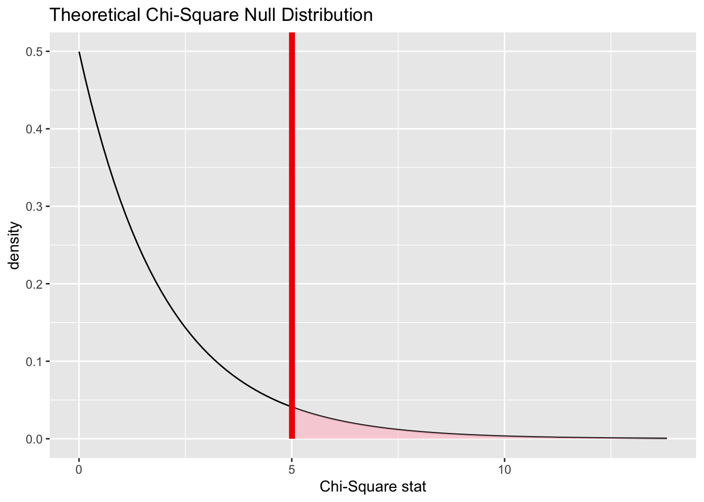

# Chi-square test for independence

<!-- Please don't mess with the next few lines! -->
<style>h5{font-size:2em;color:#0000FF}h6{font-size:1.5em;color:#0000FF}div.answer{margin-left:5%;border:1px solid #0000FF;border-left-width:10px;padding:25px} div.summary{background-color:rgba(30,144,255,0.1);border:3px double #0000FF;padding:25px}</style><p style="color:#ffffff">2.0</p>
<!-- Please don't mess with the previous few lines! -->


::: {.summary}

### Functions introduced in this chapter: {-}

No new R functions are introduced here.

:::


## Introduction

In this chapter we will learn how to run the chi-square test for independence.

A chi-square test for independence tests the relationship between two categorical variables. This is an extension of the test for two proportions, except now applied in situations where either the predictor or response variables (or both) have three or more categories.

### Install new packages

There are no new packages used in this chapter.

### Download the R notebook file

Check the upper-right corner in RStudio to make sure you're in your `intro_stats` project. Then click on the following link to download this chapter as an R notebook file (`.Rmd`).

<a href = "https://jingsai.github.io/intro_stats/chapter_downloads/18-chi_square_test_for_independence.Rmd" download>https://jingsai.github.io/intro_stats/chapter_downloads/18-chi_square_test_for_independence.Rmd</a>

Once the file is downloaded, move it to your project folder in RStudio and open it there.

### Restart R and run all chunks

In RStudio, select "Restart R and Run All Chunks" from the "Run" menu.

## Load packages

We load the standard `tideverse`, `janitor`, and `infer` packages. We also use the `MASS` package for the `birthwt` data, and the `openintro` package for the `smoking` data.


```r
library(tidyverse)
```

```
## ── Attaching packages ─────────────────────────────────────── tidyverse 1.3.2 ──
## ✔ ggplot2 3.3.6      ✔ purrr   0.3.4 
## ✔ tibble  3.1.8      ✔ dplyr   1.0.10
## ✔ tidyr   1.2.0      ✔ stringr 1.4.1 
## ✔ readr   2.1.2      ✔ forcats 0.5.2 
## ── Conflicts ────────────────────────────────────────── tidyverse_conflicts() ──
## ✖ dplyr::filter() masks stats::filter()
## ✖ dplyr::lag()    masks stats::lag()
```

```r
library(janitor)
```

```
## 
## Attaching package: 'janitor'
## 
## The following objects are masked from 'package:stats':
## 
##     chisq.test, fisher.test
```

```r
library(infer)
library(MASS)
```

```
## 
## Attaching package: 'MASS'
## 
## The following object is masked from 'package:dplyr':
## 
##     select
```

```r
library(openintro)
```

```
## Loading required package: airports
## Loading required package: cherryblossom
## Loading required package: usdata
## 
## Attaching package: 'openintro'
## 
## The following objects are masked from 'package:MASS':
## 
##     housing, mammals
```


## Research question

Are mothers from certain racial groups more or less likely to have low birth weight babies? In other words, are low birth weight and race associated?

Let's look at the data. The `birthwt` data was collected at Baystate Medical Center, Springfield, Mass during 1986. In terms of addressing the research question, we are, of course, limited to conclusions about women in that area of the country in the mid-1980s.


```r
birthwt
```

```
##     low age lwt race smoke ptl ht ui ftv  bwt
## 85    0  19 182    2     0   0  0  1   0 2523
## 86    0  33 155    3     0   0  0  0   3 2551
## 87    0  20 105    1     1   0  0  0   1 2557
## 88    0  21 108    1     1   0  0  1   2 2594
## 89    0  18 107    1     1   0  0  1   0 2600
## 91    0  21 124    3     0   0  0  0   0 2622
## 92    0  22 118    1     0   0  0  0   1 2637
## 93    0  17 103    3     0   0  0  0   1 2637
## 94    0  29 123    1     1   0  0  0   1 2663
## 95    0  26 113    1     1   0  0  0   0 2665
## 96    0  19  95    3     0   0  0  0   0 2722
## 97    0  19 150    3     0   0  0  0   1 2733
## 98    0  22  95    3     0   0  1  0   0 2751
## 99    0  30 107    3     0   1  0  1   2 2750
## 100   0  18 100    1     1   0  0  0   0 2769
## 101   0  18 100    1     1   0  0  0   0 2769
## 102   0  15  98    2     0   0  0  0   0 2778
## 103   0  25 118    1     1   0  0  0   3 2782
## 104   0  20 120    3     0   0  0  1   0 2807
## 105   0  28 120    1     1   0  0  0   1 2821
## 106   0  32 121    3     0   0  0  0   2 2835
## 107   0  31 100    1     0   0  0  1   3 2835
## 108   0  36 202    1     0   0  0  0   1 2836
## 109   0  28 120    3     0   0  0  0   0 2863
## 111   0  25 120    3     0   0  0  1   2 2877
## 112   0  28 167    1     0   0  0  0   0 2877
## 113   0  17 122    1     1   0  0  0   0 2906
## 114   0  29 150    1     0   0  0  0   2 2920
## 115   0  26 168    2     1   0  0  0   0 2920
## 116   0  17 113    2     0   0  0  0   1 2920
## 117   0  17 113    2     0   0  0  0   1 2920
## 118   0  24  90    1     1   1  0  0   1 2948
## 119   0  35 121    2     1   1  0  0   1 2948
## 120   0  25 155    1     0   0  0  0   1 2977
## 121   0  25 125    2     0   0  0  0   0 2977
## 123   0  29 140    1     1   0  0  0   2 2977
## 124   0  19 138    1     1   0  0  0   2 2977
## 125   0  27 124    1     1   0  0  0   0 2922
## 126   0  31 215    1     1   0  0  0   2 3005
## 127   0  33 109    1     1   0  0  0   1 3033
## 128   0  21 185    2     1   0  0  0   2 3042
## 129   0  19 189    1     0   0  0  0   2 3062
## 130   0  23 130    2     0   0  0  0   1 3062
## 131   0  21 160    1     0   0  0  0   0 3062
## 132   0  18  90    1     1   0  0  1   0 3062
## 133   0  18  90    1     1   0  0  1   0 3062
## 134   0  32 132    1     0   0  0  0   4 3080
## 135   0  19 132    3     0   0  0  0   0 3090
## 136   0  24 115    1     0   0  0  0   2 3090
## 137   0  22  85    3     1   0  0  0   0 3090
## 138   0  22 120    1     0   0  1  0   1 3100
## 139   0  23 128    3     0   0  0  0   0 3104
## 140   0  22 130    1     1   0  0  0   0 3132
## 141   0  30  95    1     1   0  0  0   2 3147
## 142   0  19 115    3     0   0  0  0   0 3175
## 143   0  16 110    3     0   0  0  0   0 3175
## 144   0  21 110    3     1   0  0  1   0 3203
## 145   0  30 153    3     0   0  0  0   0 3203
## 146   0  20 103    3     0   0  0  0   0 3203
## 147   0  17 119    3     0   0  0  0   0 3225
## 148   0  17 119    3     0   0  0  0   0 3225
## 149   0  23 119    3     0   0  0  0   2 3232
## 150   0  24 110    3     0   0  0  0   0 3232
## 151   0  28 140    1     0   0  0  0   0 3234
## 154   0  26 133    3     1   2  0  0   0 3260
## 155   0  20 169    3     0   1  0  1   1 3274
## 156   0  24 115    3     0   0  0  0   2 3274
## 159   0  28 250    3     1   0  0  0   6 3303
## 160   0  20 141    1     0   2  0  1   1 3317
## 161   0  22 158    2     0   1  0  0   2 3317
## 162   0  22 112    1     1   2  0  0   0 3317
## 163   0  31 150    3     1   0  0  0   2 3321
## 164   0  23 115    3     1   0  0  0   1 3331
## 166   0  16 112    2     0   0  0  0   0 3374
## 167   0  16 135    1     1   0  0  0   0 3374
## 168   0  18 229    2     0   0  0  0   0 3402
## 169   0  25 140    1     0   0  0  0   1 3416
## 170   0  32 134    1     1   1  0  0   4 3430
## 172   0  20 121    2     1   0  0  0   0 3444
## 173   0  23 190    1     0   0  0  0   0 3459
## 174   0  22 131    1     0   0  0  0   1 3460
## 175   0  32 170    1     0   0  0  0   0 3473
## 176   0  30 110    3     0   0  0  0   0 3544
## 177   0  20 127    3     0   0  0  0   0 3487
## 179   0  23 123    3     0   0  0  0   0 3544
## 180   0  17 120    3     1   0  0  0   0 3572
## 181   0  19 105    3     0   0  0  0   0 3572
## 182   0  23 130    1     0   0  0  0   0 3586
## 183   0  36 175    1     0   0  0  0   0 3600
## 184   0  22 125    1     0   0  0  0   1 3614
## 185   0  24 133    1     0   0  0  0   0 3614
## 186   0  21 134    3     0   0  0  0   2 3629
## 187   0  19 235    1     1   0  1  0   0 3629
## 188   0  25  95    1     1   3  0  1   0 3637
## 189   0  16 135    1     1   0  0  0   0 3643
## 190   0  29 135    1     0   0  0  0   1 3651
## 191   0  29 154    1     0   0  0  0   1 3651
## 192   0  19 147    1     1   0  0  0   0 3651
## 193   0  19 147    1     1   0  0  0   0 3651
## 195   0  30 137    1     0   0  0  0   1 3699
## 196   0  24 110    1     0   0  0  0   1 3728
## 197   0  19 184    1     1   0  1  0   0 3756
## 199   0  24 110    3     0   1  0  0   0 3770
## 200   0  23 110    1     0   0  0  0   1 3770
## 201   0  20 120    3     0   0  0  0   0 3770
## 202   0  25 241    2     0   0  1  0   0 3790
## 203   0  30 112    1     0   0  0  0   1 3799
## 204   0  22 169    1     0   0  0  0   0 3827
## 205   0  18 120    1     1   0  0  0   2 3856
## 206   0  16 170    2     0   0  0  0   4 3860
## 207   0  32 186    1     0   0  0  0   2 3860
## 208   0  18 120    3     0   0  0  0   1 3884
## 209   0  29 130    1     1   0  0  0   2 3884
## 210   0  33 117    1     0   0  0  1   1 3912
## 211   0  20 170    1     1   0  0  0   0 3940
## 212   0  28 134    3     0   0  0  0   1 3941
## 213   0  14 135    1     0   0  0  0   0 3941
## 214   0  28 130    3     0   0  0  0   0 3969
## 215   0  25 120    1     0   0  0  0   2 3983
## 216   0  16  95    3     0   0  0  0   1 3997
## 217   0  20 158    1     0   0  0  0   1 3997
## 218   0  26 160    3     0   0  0  0   0 4054
## 219   0  21 115    1     0   0  0  0   1 4054
## 220   0  22 129    1     0   0  0  0   0 4111
## 221   0  25 130    1     0   0  0  0   2 4153
## 222   0  31 120    1     0   0  0  0   2 4167
## 223   0  35 170    1     0   1  0  0   1 4174
## 224   0  19 120    1     1   0  0  0   0 4238
## 225   0  24 116    1     0   0  0  0   1 4593
## 226   0  45 123    1     0   0  0  0   1 4990
## 4     1  28 120    3     1   1  0  1   0  709
## 10    1  29 130    1     0   0  0  1   2 1021
## 11    1  34 187    2     1   0  1  0   0 1135
## 13    1  25 105    3     0   1  1  0   0 1330
## 15    1  25  85    3     0   0  0  1   0 1474
## 16    1  27 150    3     0   0  0  0   0 1588
## 17    1  23  97    3     0   0  0  1   1 1588
## 18    1  24 128    2     0   1  0  0   1 1701
## 19    1  24 132    3     0   0  1  0   0 1729
## 20    1  21 165    1     1   0  1  0   1 1790
## 22    1  32 105    1     1   0  0  0   0 1818
## 23    1  19  91    1     1   2  0  1   0 1885
## 24    1  25 115    3     0   0  0  0   0 1893
## 25    1  16 130    3     0   0  0  0   1 1899
## 26    1  25  92    1     1   0  0  0   0 1928
## 27    1  20 150    1     1   0  0  0   2 1928
## 28    1  21 200    2     0   0  0  1   2 1928
## 29    1  24 155    1     1   1  0  0   0 1936
## 30    1  21 103    3     0   0  0  0   0 1970
## 31    1  20 125    3     0   0  0  1   0 2055
## 32    1  25  89    3     0   2  0  0   1 2055
## 33    1  19 102    1     0   0  0  0   2 2082
## 34    1  19 112    1     1   0  0  1   0 2084
## 35    1  26 117    1     1   1  0  0   0 2084
## 36    1  24 138    1     0   0  0  0   0 2100
## 37    1  17 130    3     1   1  0  1   0 2125
## 40    1  20 120    2     1   0  0  0   3 2126
## 42    1  22 130    1     1   1  0  1   1 2187
## 43    1  27 130    2     0   0  0  1   0 2187
## 44    1  20  80    3     1   0  0  1   0 2211
## 45    1  17 110    1     1   0  0  0   0 2225
## 46    1  25 105    3     0   1  0  0   1 2240
## 47    1  20 109    3     0   0  0  0   0 2240
## 49    1  18 148    3     0   0  0  0   0 2282
## 50    1  18 110    2     1   1  0  0   0 2296
## 51    1  20 121    1     1   1  0  1   0 2296
## 52    1  21 100    3     0   1  0  0   4 2301
## 54    1  26  96    3     0   0  0  0   0 2325
## 56    1  31 102    1     1   1  0  0   1 2353
## 57    1  15 110    1     0   0  0  0   0 2353
## 59    1  23 187    2     1   0  0  0   1 2367
## 60    1  20 122    2     1   0  0  0   0 2381
## 61    1  24 105    2     1   0  0  0   0 2381
## 62    1  15 115    3     0   0  0  1   0 2381
## 63    1  23 120    3     0   0  0  0   0 2410
## 65    1  30 142    1     1   1  0  0   0 2410
## 67    1  22 130    1     1   0  0  0   1 2410
## 68    1  17 120    1     1   0  0  0   3 2414
## 69    1  23 110    1     1   1  0  0   0 2424
## 71    1  17 120    2     0   0  0  0   2 2438
## 75    1  26 154    3     0   1  1  0   1 2442
## 76    1  20 105    3     0   0  0  0   3 2450
## 77    1  26 190    1     1   0  0  0   0 2466
## 78    1  14 101    3     1   1  0  0   0 2466
## 79    1  28  95    1     1   0  0  0   2 2466
## 81    1  14 100    3     0   0  0  0   2 2495
## 82    1  23  94    3     1   0  0  0   0 2495
## 83    1  17 142    2     0   0  1  0   0 2495
## 84    1  21 130    1     1   0  1  0   3 2495
```


```r
glimpse(birthwt)
```

```
## Rows: 189
## Columns: 10
## $ low   <int> 0, 0, 0, 0, 0, 0, 0, 0, 0, 0, 0, 0, 0, 0, 0, 0, 0, 0, 0, 0, 0, 0…
## $ age   <int> 19, 33, 20, 21, 18, 21, 22, 17, 29, 26, 19, 19, 22, 30, 18, 18, …
## $ lwt   <int> 182, 155, 105, 108, 107, 124, 118, 103, 123, 113, 95, 150, 95, 1…
## $ race  <int> 2, 3, 1, 1, 1, 3, 1, 3, 1, 1, 3, 3, 3, 3, 1, 1, 2, 1, 3, 1, 3, 1…
## $ smoke <int> 0, 0, 1, 1, 1, 0, 0, 0, 1, 1, 0, 0, 0, 0, 1, 1, 0, 1, 0, 1, 0, 0…
## $ ptl   <int> 0, 0, 0, 0, 0, 0, 0, 0, 0, 0, 0, 0, 0, 1, 0, 0, 0, 0, 0, 0, 0, 0…
## $ ht    <int> 0, 0, 0, 0, 0, 0, 0, 0, 0, 0, 0, 0, 1, 0, 0, 0, 0, 0, 0, 0, 0, 0…
## $ ui    <int> 1, 0, 0, 1, 1, 0, 0, 0, 0, 0, 0, 0, 0, 1, 0, 0, 0, 0, 1, 0, 0, 1…
## $ ftv   <int> 0, 3, 1, 2, 0, 0, 1, 1, 1, 0, 0, 1, 0, 2, 0, 0, 0, 3, 0, 1, 2, 3…
## $ bwt   <int> 2523, 2551, 2557, 2594, 2600, 2622, 2637, 2637, 2663, 2665, 2722…
```

The `low` variable is an indicator of birth weight less than 2.5 kg. So even though birth weight is numerical, we have a convenient categorical variable that serves as a marker of low birth weight, gathering all low birth weight babies into a single group. The `race` variable is categorical, coded as 1 = white, 2 = black, 3 = other.

Neither variable appears in the data frame as a factor variable, so we will need to change that. The new tibble will be called `birthwt2`.


```r
birthwt2 <- birthwt %>%
  mutate(low_fct = factor(low, levels = c(0, 1),
                          labels = c("no", "yes")),
         race_fct = factor(race, levels = c(1, 2, 3),
                           labels = c("white", "black", "other")))
birthwt2
```

```
##     low age lwt race smoke ptl ht ui ftv  bwt low_fct race_fct
## 85    0  19 182    2     0   0  0  1   0 2523      no    black
## 86    0  33 155    3     0   0  0  0   3 2551      no    other
## 87    0  20 105    1     1   0  0  0   1 2557      no    white
## 88    0  21 108    1     1   0  0  1   2 2594      no    white
## 89    0  18 107    1     1   0  0  1   0 2600      no    white
## 91    0  21 124    3     0   0  0  0   0 2622      no    other
## 92    0  22 118    1     0   0  0  0   1 2637      no    white
## 93    0  17 103    3     0   0  0  0   1 2637      no    other
## 94    0  29 123    1     1   0  0  0   1 2663      no    white
## 95    0  26 113    1     1   0  0  0   0 2665      no    white
## 96    0  19  95    3     0   0  0  0   0 2722      no    other
## 97    0  19 150    3     0   0  0  0   1 2733      no    other
## 98    0  22  95    3     0   0  1  0   0 2751      no    other
## 99    0  30 107    3     0   1  0  1   2 2750      no    other
## 100   0  18 100    1     1   0  0  0   0 2769      no    white
## 101   0  18 100    1     1   0  0  0   0 2769      no    white
## 102   0  15  98    2     0   0  0  0   0 2778      no    black
## 103   0  25 118    1     1   0  0  0   3 2782      no    white
## 104   0  20 120    3     0   0  0  1   0 2807      no    other
## 105   0  28 120    1     1   0  0  0   1 2821      no    white
## 106   0  32 121    3     0   0  0  0   2 2835      no    other
## 107   0  31 100    1     0   0  0  1   3 2835      no    white
## 108   0  36 202    1     0   0  0  0   1 2836      no    white
## 109   0  28 120    3     0   0  0  0   0 2863      no    other
## 111   0  25 120    3     0   0  0  1   2 2877      no    other
## 112   0  28 167    1     0   0  0  0   0 2877      no    white
## 113   0  17 122    1     1   0  0  0   0 2906      no    white
## 114   0  29 150    1     0   0  0  0   2 2920      no    white
## 115   0  26 168    2     1   0  0  0   0 2920      no    black
## 116   0  17 113    2     0   0  0  0   1 2920      no    black
## 117   0  17 113    2     0   0  0  0   1 2920      no    black
## 118   0  24  90    1     1   1  0  0   1 2948      no    white
## 119   0  35 121    2     1   1  0  0   1 2948      no    black
## 120   0  25 155    1     0   0  0  0   1 2977      no    white
## 121   0  25 125    2     0   0  0  0   0 2977      no    black
## 123   0  29 140    1     1   0  0  0   2 2977      no    white
## 124   0  19 138    1     1   0  0  0   2 2977      no    white
## 125   0  27 124    1     1   0  0  0   0 2922      no    white
## 126   0  31 215    1     1   0  0  0   2 3005      no    white
## 127   0  33 109    1     1   0  0  0   1 3033      no    white
## 128   0  21 185    2     1   0  0  0   2 3042      no    black
## 129   0  19 189    1     0   0  0  0   2 3062      no    white
## 130   0  23 130    2     0   0  0  0   1 3062      no    black
## 131   0  21 160    1     0   0  0  0   0 3062      no    white
## 132   0  18  90    1     1   0  0  1   0 3062      no    white
## 133   0  18  90    1     1   0  0  1   0 3062      no    white
## 134   0  32 132    1     0   0  0  0   4 3080      no    white
## 135   0  19 132    3     0   0  0  0   0 3090      no    other
## 136   0  24 115    1     0   0  0  0   2 3090      no    white
## 137   0  22  85    3     1   0  0  0   0 3090      no    other
## 138   0  22 120    1     0   0  1  0   1 3100      no    white
## 139   0  23 128    3     0   0  0  0   0 3104      no    other
## 140   0  22 130    1     1   0  0  0   0 3132      no    white
## 141   0  30  95    1     1   0  0  0   2 3147      no    white
## 142   0  19 115    3     0   0  0  0   0 3175      no    other
## 143   0  16 110    3     0   0  0  0   0 3175      no    other
## 144   0  21 110    3     1   0  0  1   0 3203      no    other
## 145   0  30 153    3     0   0  0  0   0 3203      no    other
## 146   0  20 103    3     0   0  0  0   0 3203      no    other
## 147   0  17 119    3     0   0  0  0   0 3225      no    other
## 148   0  17 119    3     0   0  0  0   0 3225      no    other
## 149   0  23 119    3     0   0  0  0   2 3232      no    other
## 150   0  24 110    3     0   0  0  0   0 3232      no    other
## 151   0  28 140    1     0   0  0  0   0 3234      no    white
## 154   0  26 133    3     1   2  0  0   0 3260      no    other
## 155   0  20 169    3     0   1  0  1   1 3274      no    other
## 156   0  24 115    3     0   0  0  0   2 3274      no    other
## 159   0  28 250    3     1   0  0  0   6 3303      no    other
## 160   0  20 141    1     0   2  0  1   1 3317      no    white
## 161   0  22 158    2     0   1  0  0   2 3317      no    black
## 162   0  22 112    1     1   2  0  0   0 3317      no    white
## 163   0  31 150    3     1   0  0  0   2 3321      no    other
## 164   0  23 115    3     1   0  0  0   1 3331      no    other
## 166   0  16 112    2     0   0  0  0   0 3374      no    black
## 167   0  16 135    1     1   0  0  0   0 3374      no    white
## 168   0  18 229    2     0   0  0  0   0 3402      no    black
## 169   0  25 140    1     0   0  0  0   1 3416      no    white
## 170   0  32 134    1     1   1  0  0   4 3430      no    white
## 172   0  20 121    2     1   0  0  0   0 3444      no    black
## 173   0  23 190    1     0   0  0  0   0 3459      no    white
## 174   0  22 131    1     0   0  0  0   1 3460      no    white
## 175   0  32 170    1     0   0  0  0   0 3473      no    white
## 176   0  30 110    3     0   0  0  0   0 3544      no    other
## 177   0  20 127    3     0   0  0  0   0 3487      no    other
## 179   0  23 123    3     0   0  0  0   0 3544      no    other
## 180   0  17 120    3     1   0  0  0   0 3572      no    other
## 181   0  19 105    3     0   0  0  0   0 3572      no    other
## 182   0  23 130    1     0   0  0  0   0 3586      no    white
## 183   0  36 175    1     0   0  0  0   0 3600      no    white
## 184   0  22 125    1     0   0  0  0   1 3614      no    white
## 185   0  24 133    1     0   0  0  0   0 3614      no    white
## 186   0  21 134    3     0   0  0  0   2 3629      no    other
## 187   0  19 235    1     1   0  1  0   0 3629      no    white
## 188   0  25  95    1     1   3  0  1   0 3637      no    white
## 189   0  16 135    1     1   0  0  0   0 3643      no    white
## 190   0  29 135    1     0   0  0  0   1 3651      no    white
## 191   0  29 154    1     0   0  0  0   1 3651      no    white
## 192   0  19 147    1     1   0  0  0   0 3651      no    white
## 193   0  19 147    1     1   0  0  0   0 3651      no    white
## 195   0  30 137    1     0   0  0  0   1 3699      no    white
## 196   0  24 110    1     0   0  0  0   1 3728      no    white
## 197   0  19 184    1     1   0  1  0   0 3756      no    white
## 199   0  24 110    3     0   1  0  0   0 3770      no    other
## 200   0  23 110    1     0   0  0  0   1 3770      no    white
## 201   0  20 120    3     0   0  0  0   0 3770      no    other
## 202   0  25 241    2     0   0  1  0   0 3790      no    black
## 203   0  30 112    1     0   0  0  0   1 3799      no    white
## 204   0  22 169    1     0   0  0  0   0 3827      no    white
## 205   0  18 120    1     1   0  0  0   2 3856      no    white
## 206   0  16 170    2     0   0  0  0   4 3860      no    black
## 207   0  32 186    1     0   0  0  0   2 3860      no    white
## 208   0  18 120    3     0   0  0  0   1 3884      no    other
## 209   0  29 130    1     1   0  0  0   2 3884      no    white
## 210   0  33 117    1     0   0  0  1   1 3912      no    white
## 211   0  20 170    1     1   0  0  0   0 3940      no    white
## 212   0  28 134    3     0   0  0  0   1 3941      no    other
## 213   0  14 135    1     0   0  0  0   0 3941      no    white
## 214   0  28 130    3     0   0  0  0   0 3969      no    other
## 215   0  25 120    1     0   0  0  0   2 3983      no    white
## 216   0  16  95    3     0   0  0  0   1 3997      no    other
## 217   0  20 158    1     0   0  0  0   1 3997      no    white
## 218   0  26 160    3     0   0  0  0   0 4054      no    other
## 219   0  21 115    1     0   0  0  0   1 4054      no    white
## 220   0  22 129    1     0   0  0  0   0 4111      no    white
## 221   0  25 130    1     0   0  0  0   2 4153      no    white
## 222   0  31 120    1     0   0  0  0   2 4167      no    white
## 223   0  35 170    1     0   1  0  0   1 4174      no    white
## 224   0  19 120    1     1   0  0  0   0 4238      no    white
## 225   0  24 116    1     0   0  0  0   1 4593      no    white
## 226   0  45 123    1     0   0  0  0   1 4990      no    white
## 4     1  28 120    3     1   1  0  1   0  709     yes    other
## 10    1  29 130    1     0   0  0  1   2 1021     yes    white
## 11    1  34 187    2     1   0  1  0   0 1135     yes    black
## 13    1  25 105    3     0   1  1  0   0 1330     yes    other
## 15    1  25  85    3     0   0  0  1   0 1474     yes    other
## 16    1  27 150    3     0   0  0  0   0 1588     yes    other
## 17    1  23  97    3     0   0  0  1   1 1588     yes    other
## 18    1  24 128    2     0   1  0  0   1 1701     yes    black
## 19    1  24 132    3     0   0  1  0   0 1729     yes    other
## 20    1  21 165    1     1   0  1  0   1 1790     yes    white
## 22    1  32 105    1     1   0  0  0   0 1818     yes    white
## 23    1  19  91    1     1   2  0  1   0 1885     yes    white
## 24    1  25 115    3     0   0  0  0   0 1893     yes    other
## 25    1  16 130    3     0   0  0  0   1 1899     yes    other
## 26    1  25  92    1     1   0  0  0   0 1928     yes    white
## 27    1  20 150    1     1   0  0  0   2 1928     yes    white
## 28    1  21 200    2     0   0  0  1   2 1928     yes    black
## 29    1  24 155    1     1   1  0  0   0 1936     yes    white
## 30    1  21 103    3     0   0  0  0   0 1970     yes    other
## 31    1  20 125    3     0   0  0  1   0 2055     yes    other
## 32    1  25  89    3     0   2  0  0   1 2055     yes    other
## 33    1  19 102    1     0   0  0  0   2 2082     yes    white
## 34    1  19 112    1     1   0  0  1   0 2084     yes    white
## 35    1  26 117    1     1   1  0  0   0 2084     yes    white
## 36    1  24 138    1     0   0  0  0   0 2100     yes    white
## 37    1  17 130    3     1   1  0  1   0 2125     yes    other
## 40    1  20 120    2     1   0  0  0   3 2126     yes    black
## 42    1  22 130    1     1   1  0  1   1 2187     yes    white
## 43    1  27 130    2     0   0  0  1   0 2187     yes    black
## 44    1  20  80    3     1   0  0  1   0 2211     yes    other
## 45    1  17 110    1     1   0  0  0   0 2225     yes    white
## 46    1  25 105    3     0   1  0  0   1 2240     yes    other
## 47    1  20 109    3     0   0  0  0   0 2240     yes    other
## 49    1  18 148    3     0   0  0  0   0 2282     yes    other
## 50    1  18 110    2     1   1  0  0   0 2296     yes    black
## 51    1  20 121    1     1   1  0  1   0 2296     yes    white
## 52    1  21 100    3     0   1  0  0   4 2301     yes    other
## 54    1  26  96    3     0   0  0  0   0 2325     yes    other
## 56    1  31 102    1     1   1  0  0   1 2353     yes    white
## 57    1  15 110    1     0   0  0  0   0 2353     yes    white
## 59    1  23 187    2     1   0  0  0   1 2367     yes    black
## 60    1  20 122    2     1   0  0  0   0 2381     yes    black
## 61    1  24 105    2     1   0  0  0   0 2381     yes    black
## 62    1  15 115    3     0   0  0  1   0 2381     yes    other
## 63    1  23 120    3     0   0  0  0   0 2410     yes    other
## 65    1  30 142    1     1   1  0  0   0 2410     yes    white
## 67    1  22 130    1     1   0  0  0   1 2410     yes    white
## 68    1  17 120    1     1   0  0  0   3 2414     yes    white
## 69    1  23 110    1     1   1  0  0   0 2424     yes    white
## 71    1  17 120    2     0   0  0  0   2 2438     yes    black
## 75    1  26 154    3     0   1  1  0   1 2442     yes    other
## 76    1  20 105    3     0   0  0  0   3 2450     yes    other
## 77    1  26 190    1     1   0  0  0   0 2466     yes    white
## 78    1  14 101    3     1   1  0  0   0 2466     yes    other
## 79    1  28  95    1     1   0  0  0   2 2466     yes    white
## 81    1  14 100    3     0   0  0  0   2 2495     yes    other
## 82    1  23  94    3     1   0  0  0   0 2495     yes    other
## 83    1  17 142    2     0   0  1  0   0 2495     yes    black
## 84    1  21 130    1     1   0  1  0   3 2495     yes    white
```


```r
glimpse(birthwt2)
```

```
## Rows: 189
## Columns: 12
## $ low      <int> 0, 0, 0, 0, 0, 0, 0, 0, 0, 0, 0, 0, 0, 0, 0, 0, 0, 0, 0, 0, 0…
## $ age      <int> 19, 33, 20, 21, 18, 21, 22, 17, 29, 26, 19, 19, 22, 30, 18, 1…
## $ lwt      <int> 182, 155, 105, 108, 107, 124, 118, 103, 123, 113, 95, 150, 95…
## $ race     <int> 2, 3, 1, 1, 1, 3, 1, 3, 1, 1, 3, 3, 3, 3, 1, 1, 2, 1, 3, 1, 3…
## $ smoke    <int> 0, 0, 1, 1, 1, 0, 0, 0, 1, 1, 0, 0, 0, 0, 1, 1, 0, 1, 0, 1, 0…
## $ ptl      <int> 0, 0, 0, 0, 0, 0, 0, 0, 0, 0, 0, 0, 0, 1, 0, 0, 0, 0, 0, 0, 0…
## $ ht       <int> 0, 0, 0, 0, 0, 0, 0, 0, 0, 0, 0, 0, 1, 0, 0, 0, 0, 0, 0, 0, 0…
## $ ui       <int> 1, 0, 0, 1, 1, 0, 0, 0, 0, 0, 0, 0, 0, 1, 0, 0, 0, 0, 1, 0, 0…
## $ ftv      <int> 0, 3, 1, 2, 0, 0, 1, 1, 1, 0, 0, 1, 0, 2, 0, 0, 0, 3, 0, 1, 2…
## $ bwt      <int> 2523, 2551, 2557, 2594, 2600, 2622, 2637, 2637, 2663, 2665, 2…
## $ low_fct  <fct> no, no, no, no, no, no, no, no, no, no, no, no, no, no, no, n…
## $ race_fct <fct> black, other, white, white, white, other, white, other, white…
```


## Chi-square test for independence

In a previous chapter, we learned about the chi-square goodness-of-fit test. With a single categorical variable, we summarized data in a frequency table. Each cell of the table had an observed count from the data that we compared to an expected count from the assumption of a null hypothesis. The chi-square statistic measured the discrepancy between observed and expected.

With two categorical variables, we use a contingency table instead of a frequency table. But the principle of the chi-square statistic is the same: each cell in the contingency table has an observed count and an expected count. This forms the basis of a chi-square test for independence.

Below is the contingency table for these two variables. Normally, we only care about column totals because we care how the response variable (here, `low_fct`) is distributed in each group of the predictor variable (i.e., each racial group). But for the calculation of chi-squared, we will need both row and column totals.


```r
tabyl(birthwt2, low_fct, race_fct) %>%
    adorn_totals(where = c("row", "col"))
```

```
##  low_fct white black other Total
##       no    73    15    42   130
##      yes    23    11    25    59
##    Total    96    26    67   189
```

A test for independence has a simple null hypothesis: the two variables are independent. This gives us a way to compute expected counts. To see how, look at the sum of all the normal weight babies ($73 + 15 + 42 = 130$) and all the low birth weight babies ($23 + 11 + 25 = 59$). In other words, if race is ignored, there were 130 normal weight babies and 59 low birth weight babies out of 189 total babies. 59 of 189 is 0.31217 or 31.217%, and 130 of 189 is 0.68783 or 68.783%.

Now, if low birth weight and race are truly independent, it shouldn't matter if the mothers were white, black, or some other race. In other words, of 96 white mothers, we should still expect 68.783% of them to have normal weight babies and 31.217% of them to have low birth weight babies. 68.783% of 96 is 66.032. **This is the expected cell count for normal birth weight babies of white women.** 31.217% of 96 is 29.968. **This is the expected cell count for low birth weight babies of white women.**  The same analysis can be done for the next two columns as well.

##### Exercise 1 {-}

Complete the list of expected cell counts in the table above. In other words, apply the percentages 68.783% and 31.217% to the totals of the "black" and "other" columns. Put them in the table below:

::: {.answer}

|     | white  | black  | other  |
|-----|--------|--------|--------|
| no  | 66.032 | ?      | ?      |
| yes | 29.968 | ?      | ?      |

:::

*****


Unlike the goodness-of-fit test that requires one to specify expected counts for each cell, the test for independence uses only the data to determine the expected counts. For any given cell, if $R$ is the row total, $C$ is the column total, and $n$ is the grand total (the sample size), the expected count in any cell is simply

$$
E = \frac{R C}{n}.
$$

This is equivalent to the explanation in the previous paragraph. Using low birth weight babies among white mothers as an example, $R/n$ is $59/189$ which is 0.31217. Then we multiply this by the column total $C = 96$ to get

$$
\left(\frac{R}{n}\right) C = \frac{R C}{n} = \frac{59 \times 96}{189} =  29.96825.
$$

Everything else works almost the same as it did for a chi-square goodness-of-fit test. We still compute $\chi^{2}$ by adding up deviations across all cells:

$$
\chi^{2} = \sum \frac{(O - E)^{2}}{E}.
$$

Even under the assumption of the null, there will still be some sampling variability. Like any hypothesis test, our job is to determine whether the deviations we see are possible due to pure chance alone. The random values of $\chi^{2}$ that result from sampling variability will follow a chi-square model. But how many degrees of freedom are there? This is a little different from the goodness-of-fit test. Instead of the number of cells minus one, we use the following formula:

$$
df = (\#rows - 1)(\#columns - 1).
$$

In our example we have 2 rows ("yes", "no") and 3 columns ("white", "black", "other"); therefore,

$$
df = (2 - 1)(3 - 1) = 1 \times 2 = 2
$$

and we have 2 degrees of freedom (even though there are 6 cells).

Let's run through the rubric in its entirety.


## Exploratory data analysis

### Use data documentation (help files, code books, Google, etc.) to determine as much as possible about the data provenance and structure.

You should type `?birthwt` at the Console to read the help file. We don't have any information about how these mothers were selected. The "Source" at the end of the help file is a statistics textbook, so we'd have to track down that book to see where they got the data and if traced back to a primary source.


```r
birthwt
```

```
##     low age lwt race smoke ptl ht ui ftv  bwt
## 85    0  19 182    2     0   0  0  1   0 2523
## 86    0  33 155    3     0   0  0  0   3 2551
## 87    0  20 105    1     1   0  0  0   1 2557
## 88    0  21 108    1     1   0  0  1   2 2594
## 89    0  18 107    1     1   0  0  1   0 2600
## 91    0  21 124    3     0   0  0  0   0 2622
## 92    0  22 118    1     0   0  0  0   1 2637
## 93    0  17 103    3     0   0  0  0   1 2637
## 94    0  29 123    1     1   0  0  0   1 2663
## 95    0  26 113    1     1   0  0  0   0 2665
## 96    0  19  95    3     0   0  0  0   0 2722
## 97    0  19 150    3     0   0  0  0   1 2733
## 98    0  22  95    3     0   0  1  0   0 2751
## 99    0  30 107    3     0   1  0  1   2 2750
## 100   0  18 100    1     1   0  0  0   0 2769
## 101   0  18 100    1     1   0  0  0   0 2769
## 102   0  15  98    2     0   0  0  0   0 2778
## 103   0  25 118    1     1   0  0  0   3 2782
## 104   0  20 120    3     0   0  0  1   0 2807
## 105   0  28 120    1     1   0  0  0   1 2821
## 106   0  32 121    3     0   0  0  0   2 2835
## 107   0  31 100    1     0   0  0  1   3 2835
## 108   0  36 202    1     0   0  0  0   1 2836
## 109   0  28 120    3     0   0  0  0   0 2863
## 111   0  25 120    3     0   0  0  1   2 2877
## 112   0  28 167    1     0   0  0  0   0 2877
## 113   0  17 122    1     1   0  0  0   0 2906
## 114   0  29 150    1     0   0  0  0   2 2920
## 115   0  26 168    2     1   0  0  0   0 2920
## 116   0  17 113    2     0   0  0  0   1 2920
## 117   0  17 113    2     0   0  0  0   1 2920
## 118   0  24  90    1     1   1  0  0   1 2948
## 119   0  35 121    2     1   1  0  0   1 2948
## 120   0  25 155    1     0   0  0  0   1 2977
## 121   0  25 125    2     0   0  0  0   0 2977
## 123   0  29 140    1     1   0  0  0   2 2977
## 124   0  19 138    1     1   0  0  0   2 2977
## 125   0  27 124    1     1   0  0  0   0 2922
## 126   0  31 215    1     1   0  0  0   2 3005
## 127   0  33 109    1     1   0  0  0   1 3033
## 128   0  21 185    2     1   0  0  0   2 3042
## 129   0  19 189    1     0   0  0  0   2 3062
## 130   0  23 130    2     0   0  0  0   1 3062
## 131   0  21 160    1     0   0  0  0   0 3062
## 132   0  18  90    1     1   0  0  1   0 3062
## 133   0  18  90    1     1   0  0  1   0 3062
## 134   0  32 132    1     0   0  0  0   4 3080
## 135   0  19 132    3     0   0  0  0   0 3090
## 136   0  24 115    1     0   0  0  0   2 3090
## 137   0  22  85    3     1   0  0  0   0 3090
## 138   0  22 120    1     0   0  1  0   1 3100
## 139   0  23 128    3     0   0  0  0   0 3104
## 140   0  22 130    1     1   0  0  0   0 3132
## 141   0  30  95    1     1   0  0  0   2 3147
## 142   0  19 115    3     0   0  0  0   0 3175
## 143   0  16 110    3     0   0  0  0   0 3175
## 144   0  21 110    3     1   0  0  1   0 3203
## 145   0  30 153    3     0   0  0  0   0 3203
## 146   0  20 103    3     0   0  0  0   0 3203
## 147   0  17 119    3     0   0  0  0   0 3225
## 148   0  17 119    3     0   0  0  0   0 3225
## 149   0  23 119    3     0   0  0  0   2 3232
## 150   0  24 110    3     0   0  0  0   0 3232
## 151   0  28 140    1     0   0  0  0   0 3234
## 154   0  26 133    3     1   2  0  0   0 3260
## 155   0  20 169    3     0   1  0  1   1 3274
## 156   0  24 115    3     0   0  0  0   2 3274
## 159   0  28 250    3     1   0  0  0   6 3303
## 160   0  20 141    1     0   2  0  1   1 3317
## 161   0  22 158    2     0   1  0  0   2 3317
## 162   0  22 112    1     1   2  0  0   0 3317
## 163   0  31 150    3     1   0  0  0   2 3321
## 164   0  23 115    3     1   0  0  0   1 3331
## 166   0  16 112    2     0   0  0  0   0 3374
## 167   0  16 135    1     1   0  0  0   0 3374
## 168   0  18 229    2     0   0  0  0   0 3402
## 169   0  25 140    1     0   0  0  0   1 3416
## 170   0  32 134    1     1   1  0  0   4 3430
## 172   0  20 121    2     1   0  0  0   0 3444
## 173   0  23 190    1     0   0  0  0   0 3459
## 174   0  22 131    1     0   0  0  0   1 3460
## 175   0  32 170    1     0   0  0  0   0 3473
## 176   0  30 110    3     0   0  0  0   0 3544
## 177   0  20 127    3     0   0  0  0   0 3487
## 179   0  23 123    3     0   0  0  0   0 3544
## 180   0  17 120    3     1   0  0  0   0 3572
## 181   0  19 105    3     0   0  0  0   0 3572
## 182   0  23 130    1     0   0  0  0   0 3586
## 183   0  36 175    1     0   0  0  0   0 3600
## 184   0  22 125    1     0   0  0  0   1 3614
## 185   0  24 133    1     0   0  0  0   0 3614
## 186   0  21 134    3     0   0  0  0   2 3629
## 187   0  19 235    1     1   0  1  0   0 3629
## 188   0  25  95    1     1   3  0  1   0 3637
## 189   0  16 135    1     1   0  0  0   0 3643
## 190   0  29 135    1     0   0  0  0   1 3651
## 191   0  29 154    1     0   0  0  0   1 3651
## 192   0  19 147    1     1   0  0  0   0 3651
## 193   0  19 147    1     1   0  0  0   0 3651
## 195   0  30 137    1     0   0  0  0   1 3699
## 196   0  24 110    1     0   0  0  0   1 3728
## 197   0  19 184    1     1   0  1  0   0 3756
## 199   0  24 110    3     0   1  0  0   0 3770
## 200   0  23 110    1     0   0  0  0   1 3770
## 201   0  20 120    3     0   0  0  0   0 3770
## 202   0  25 241    2     0   0  1  0   0 3790
## 203   0  30 112    1     0   0  0  0   1 3799
## 204   0  22 169    1     0   0  0  0   0 3827
## 205   0  18 120    1     1   0  0  0   2 3856
## 206   0  16 170    2     0   0  0  0   4 3860
## 207   0  32 186    1     0   0  0  0   2 3860
## 208   0  18 120    3     0   0  0  0   1 3884
## 209   0  29 130    1     1   0  0  0   2 3884
## 210   0  33 117    1     0   0  0  1   1 3912
## 211   0  20 170    1     1   0  0  0   0 3940
## 212   0  28 134    3     0   0  0  0   1 3941
## 213   0  14 135    1     0   0  0  0   0 3941
## 214   0  28 130    3     0   0  0  0   0 3969
## 215   0  25 120    1     0   0  0  0   2 3983
## 216   0  16  95    3     0   0  0  0   1 3997
## 217   0  20 158    1     0   0  0  0   1 3997
## 218   0  26 160    3     0   0  0  0   0 4054
## 219   0  21 115    1     0   0  0  0   1 4054
## 220   0  22 129    1     0   0  0  0   0 4111
## 221   0  25 130    1     0   0  0  0   2 4153
## 222   0  31 120    1     0   0  0  0   2 4167
## 223   0  35 170    1     0   1  0  0   1 4174
## 224   0  19 120    1     1   0  0  0   0 4238
## 225   0  24 116    1     0   0  0  0   1 4593
## 226   0  45 123    1     0   0  0  0   1 4990
## 4     1  28 120    3     1   1  0  1   0  709
## 10    1  29 130    1     0   0  0  1   2 1021
## 11    1  34 187    2     1   0  1  0   0 1135
## 13    1  25 105    3     0   1  1  0   0 1330
## 15    1  25  85    3     0   0  0  1   0 1474
## 16    1  27 150    3     0   0  0  0   0 1588
## 17    1  23  97    3     0   0  0  1   1 1588
## 18    1  24 128    2     0   1  0  0   1 1701
## 19    1  24 132    3     0   0  1  0   0 1729
## 20    1  21 165    1     1   0  1  0   1 1790
## 22    1  32 105    1     1   0  0  0   0 1818
## 23    1  19  91    1     1   2  0  1   0 1885
## 24    1  25 115    3     0   0  0  0   0 1893
## 25    1  16 130    3     0   0  0  0   1 1899
## 26    1  25  92    1     1   0  0  0   0 1928
## 27    1  20 150    1     1   0  0  0   2 1928
## 28    1  21 200    2     0   0  0  1   2 1928
## 29    1  24 155    1     1   1  0  0   0 1936
## 30    1  21 103    3     0   0  0  0   0 1970
## 31    1  20 125    3     0   0  0  1   0 2055
## 32    1  25  89    3     0   2  0  0   1 2055
## 33    1  19 102    1     0   0  0  0   2 2082
## 34    1  19 112    1     1   0  0  1   0 2084
## 35    1  26 117    1     1   1  0  0   0 2084
## 36    1  24 138    1     0   0  0  0   0 2100
## 37    1  17 130    3     1   1  0  1   0 2125
## 40    1  20 120    2     1   0  0  0   3 2126
## 42    1  22 130    1     1   1  0  1   1 2187
## 43    1  27 130    2     0   0  0  1   0 2187
## 44    1  20  80    3     1   0  0  1   0 2211
## 45    1  17 110    1     1   0  0  0   0 2225
## 46    1  25 105    3     0   1  0  0   1 2240
## 47    1  20 109    3     0   0  0  0   0 2240
## 49    1  18 148    3     0   0  0  0   0 2282
## 50    1  18 110    2     1   1  0  0   0 2296
## 51    1  20 121    1     1   1  0  1   0 2296
## 52    1  21 100    3     0   1  0  0   4 2301
## 54    1  26  96    3     0   0  0  0   0 2325
## 56    1  31 102    1     1   1  0  0   1 2353
## 57    1  15 110    1     0   0  0  0   0 2353
## 59    1  23 187    2     1   0  0  0   1 2367
## 60    1  20 122    2     1   0  0  0   0 2381
## 61    1  24 105    2     1   0  0  0   0 2381
## 62    1  15 115    3     0   0  0  1   0 2381
## 63    1  23 120    3     0   0  0  0   0 2410
## 65    1  30 142    1     1   1  0  0   0 2410
## 67    1  22 130    1     1   0  0  0   1 2410
## 68    1  17 120    1     1   0  0  0   3 2414
## 69    1  23 110    1     1   1  0  0   0 2424
## 71    1  17 120    2     0   0  0  0   2 2438
## 75    1  26 154    3     0   1  1  0   1 2442
## 76    1  20 105    3     0   0  0  0   3 2450
## 77    1  26 190    1     1   0  0  0   0 2466
## 78    1  14 101    3     1   1  0  0   0 2466
## 79    1  28  95    1     1   0  0  0   2 2466
## 81    1  14 100    3     0   0  0  0   2 2495
## 82    1  23  94    3     1   0  0  0   0 2495
## 83    1  17 142    2     0   0  1  0   0 2495
## 84    1  21 130    1     1   0  1  0   3 2495
```


```r
glimpse(birthwt)
```

```
## Rows: 189
## Columns: 10
## $ low   <int> 0, 0, 0, 0, 0, 0, 0, 0, 0, 0, 0, 0, 0, 0, 0, 0, 0, 0, 0, 0, 0, 0…
## $ age   <int> 19, 33, 20, 21, 18, 21, 22, 17, 29, 26, 19, 19, 22, 30, 18, 18, …
## $ lwt   <int> 182, 155, 105, 108, 107, 124, 118, 103, 123, 113, 95, 150, 95, 1…
## $ race  <int> 2, 3, 1, 1, 1, 3, 1, 3, 1, 1, 3, 3, 3, 3, 1, 1, 2, 1, 3, 1, 3, 1…
## $ smoke <int> 0, 0, 1, 1, 1, 0, 0, 0, 1, 1, 0, 0, 0, 0, 1, 1, 0, 1, 0, 1, 0, 0…
## $ ptl   <int> 0, 0, 0, 0, 0, 0, 0, 0, 0, 0, 0, 0, 0, 1, 0, 0, 0, 0, 0, 0, 0, 0…
## $ ht    <int> 0, 0, 0, 0, 0, 0, 0, 0, 0, 0, 0, 0, 1, 0, 0, 0, 0, 0, 0, 0, 0, 0…
## $ ui    <int> 1, 0, 0, 1, 1, 0, 0, 0, 0, 0, 0, 0, 0, 1, 0, 0, 0, 0, 1, 0, 0, 1…
## $ ftv   <int> 0, 3, 1, 2, 0, 0, 1, 1, 1, 0, 0, 1, 0, 2, 0, 0, 0, 3, 0, 1, 2, 3…
## $ bwt   <int> 2523, 2551, 2557, 2594, 2600, 2622, 2637, 2637, 2663, 2665, 2722…
```

### Prepare the data for analysis.


```r
# Although we've already done this above, 
# we include it here again for completeness.
birthwt2 <- birthwt %>%
  mutate(low_fct = factor(low, levels = c(0, 1),
                          labels = c("no", "yes")),
         race_fct = factor(race, levels = c(1, 2, 3),
                           labels = c("white", "black", "other")))
birthwt2
```

```
##     low age lwt race smoke ptl ht ui ftv  bwt low_fct race_fct
## 85    0  19 182    2     0   0  0  1   0 2523      no    black
## 86    0  33 155    3     0   0  0  0   3 2551      no    other
## 87    0  20 105    1     1   0  0  0   1 2557      no    white
## 88    0  21 108    1     1   0  0  1   2 2594      no    white
## 89    0  18 107    1     1   0  0  1   0 2600      no    white
## 91    0  21 124    3     0   0  0  0   0 2622      no    other
## 92    0  22 118    1     0   0  0  0   1 2637      no    white
## 93    0  17 103    3     0   0  0  0   1 2637      no    other
## 94    0  29 123    1     1   0  0  0   1 2663      no    white
## 95    0  26 113    1     1   0  0  0   0 2665      no    white
## 96    0  19  95    3     0   0  0  0   0 2722      no    other
## 97    0  19 150    3     0   0  0  0   1 2733      no    other
## 98    0  22  95    3     0   0  1  0   0 2751      no    other
## 99    0  30 107    3     0   1  0  1   2 2750      no    other
## 100   0  18 100    1     1   0  0  0   0 2769      no    white
## 101   0  18 100    1     1   0  0  0   0 2769      no    white
## 102   0  15  98    2     0   0  0  0   0 2778      no    black
## 103   0  25 118    1     1   0  0  0   3 2782      no    white
## 104   0  20 120    3     0   0  0  1   0 2807      no    other
## 105   0  28 120    1     1   0  0  0   1 2821      no    white
## 106   0  32 121    3     0   0  0  0   2 2835      no    other
## 107   0  31 100    1     0   0  0  1   3 2835      no    white
## 108   0  36 202    1     0   0  0  0   1 2836      no    white
## 109   0  28 120    3     0   0  0  0   0 2863      no    other
## 111   0  25 120    3     0   0  0  1   2 2877      no    other
## 112   0  28 167    1     0   0  0  0   0 2877      no    white
## 113   0  17 122    1     1   0  0  0   0 2906      no    white
## 114   0  29 150    1     0   0  0  0   2 2920      no    white
## 115   0  26 168    2     1   0  0  0   0 2920      no    black
## 116   0  17 113    2     0   0  0  0   1 2920      no    black
## 117   0  17 113    2     0   0  0  0   1 2920      no    black
## 118   0  24  90    1     1   1  0  0   1 2948      no    white
## 119   0  35 121    2     1   1  0  0   1 2948      no    black
## 120   0  25 155    1     0   0  0  0   1 2977      no    white
## 121   0  25 125    2     0   0  0  0   0 2977      no    black
## 123   0  29 140    1     1   0  0  0   2 2977      no    white
## 124   0  19 138    1     1   0  0  0   2 2977      no    white
## 125   0  27 124    1     1   0  0  0   0 2922      no    white
## 126   0  31 215    1     1   0  0  0   2 3005      no    white
## 127   0  33 109    1     1   0  0  0   1 3033      no    white
## 128   0  21 185    2     1   0  0  0   2 3042      no    black
## 129   0  19 189    1     0   0  0  0   2 3062      no    white
## 130   0  23 130    2     0   0  0  0   1 3062      no    black
## 131   0  21 160    1     0   0  0  0   0 3062      no    white
## 132   0  18  90    1     1   0  0  1   0 3062      no    white
## 133   0  18  90    1     1   0  0  1   0 3062      no    white
## 134   0  32 132    1     0   0  0  0   4 3080      no    white
## 135   0  19 132    3     0   0  0  0   0 3090      no    other
## 136   0  24 115    1     0   0  0  0   2 3090      no    white
## 137   0  22  85    3     1   0  0  0   0 3090      no    other
## 138   0  22 120    1     0   0  1  0   1 3100      no    white
## 139   0  23 128    3     0   0  0  0   0 3104      no    other
## 140   0  22 130    1     1   0  0  0   0 3132      no    white
## 141   0  30  95    1     1   0  0  0   2 3147      no    white
## 142   0  19 115    3     0   0  0  0   0 3175      no    other
## 143   0  16 110    3     0   0  0  0   0 3175      no    other
## 144   0  21 110    3     1   0  0  1   0 3203      no    other
## 145   0  30 153    3     0   0  0  0   0 3203      no    other
## 146   0  20 103    3     0   0  0  0   0 3203      no    other
## 147   0  17 119    3     0   0  0  0   0 3225      no    other
## 148   0  17 119    3     0   0  0  0   0 3225      no    other
## 149   0  23 119    3     0   0  0  0   2 3232      no    other
## 150   0  24 110    3     0   0  0  0   0 3232      no    other
## 151   0  28 140    1     0   0  0  0   0 3234      no    white
## 154   0  26 133    3     1   2  0  0   0 3260      no    other
## 155   0  20 169    3     0   1  0  1   1 3274      no    other
## 156   0  24 115    3     0   0  0  0   2 3274      no    other
## 159   0  28 250    3     1   0  0  0   6 3303      no    other
## 160   0  20 141    1     0   2  0  1   1 3317      no    white
## 161   0  22 158    2     0   1  0  0   2 3317      no    black
## 162   0  22 112    1     1   2  0  0   0 3317      no    white
## 163   0  31 150    3     1   0  0  0   2 3321      no    other
## 164   0  23 115    3     1   0  0  0   1 3331      no    other
## 166   0  16 112    2     0   0  0  0   0 3374      no    black
## 167   0  16 135    1     1   0  0  0   0 3374      no    white
## 168   0  18 229    2     0   0  0  0   0 3402      no    black
## 169   0  25 140    1     0   0  0  0   1 3416      no    white
## 170   0  32 134    1     1   1  0  0   4 3430      no    white
## 172   0  20 121    2     1   0  0  0   0 3444      no    black
## 173   0  23 190    1     0   0  0  0   0 3459      no    white
## 174   0  22 131    1     0   0  0  0   1 3460      no    white
## 175   0  32 170    1     0   0  0  0   0 3473      no    white
## 176   0  30 110    3     0   0  0  0   0 3544      no    other
## 177   0  20 127    3     0   0  0  0   0 3487      no    other
## 179   0  23 123    3     0   0  0  0   0 3544      no    other
## 180   0  17 120    3     1   0  0  0   0 3572      no    other
## 181   0  19 105    3     0   0  0  0   0 3572      no    other
## 182   0  23 130    1     0   0  0  0   0 3586      no    white
## 183   0  36 175    1     0   0  0  0   0 3600      no    white
## 184   0  22 125    1     0   0  0  0   1 3614      no    white
## 185   0  24 133    1     0   0  0  0   0 3614      no    white
## 186   0  21 134    3     0   0  0  0   2 3629      no    other
## 187   0  19 235    1     1   0  1  0   0 3629      no    white
## 188   0  25  95    1     1   3  0  1   0 3637      no    white
## 189   0  16 135    1     1   0  0  0   0 3643      no    white
## 190   0  29 135    1     0   0  0  0   1 3651      no    white
## 191   0  29 154    1     0   0  0  0   1 3651      no    white
## 192   0  19 147    1     1   0  0  0   0 3651      no    white
## 193   0  19 147    1     1   0  0  0   0 3651      no    white
## 195   0  30 137    1     0   0  0  0   1 3699      no    white
## 196   0  24 110    1     0   0  0  0   1 3728      no    white
## 197   0  19 184    1     1   0  1  0   0 3756      no    white
## 199   0  24 110    3     0   1  0  0   0 3770      no    other
## 200   0  23 110    1     0   0  0  0   1 3770      no    white
## 201   0  20 120    3     0   0  0  0   0 3770      no    other
## 202   0  25 241    2     0   0  1  0   0 3790      no    black
## 203   0  30 112    1     0   0  0  0   1 3799      no    white
## 204   0  22 169    1     0   0  0  0   0 3827      no    white
## 205   0  18 120    1     1   0  0  0   2 3856      no    white
## 206   0  16 170    2     0   0  0  0   4 3860      no    black
## 207   0  32 186    1     0   0  0  0   2 3860      no    white
## 208   0  18 120    3     0   0  0  0   1 3884      no    other
## 209   0  29 130    1     1   0  0  0   2 3884      no    white
## 210   0  33 117    1     0   0  0  1   1 3912      no    white
## 211   0  20 170    1     1   0  0  0   0 3940      no    white
## 212   0  28 134    3     0   0  0  0   1 3941      no    other
## 213   0  14 135    1     0   0  0  0   0 3941      no    white
## 214   0  28 130    3     0   0  0  0   0 3969      no    other
## 215   0  25 120    1     0   0  0  0   2 3983      no    white
## 216   0  16  95    3     0   0  0  0   1 3997      no    other
## 217   0  20 158    1     0   0  0  0   1 3997      no    white
## 218   0  26 160    3     0   0  0  0   0 4054      no    other
## 219   0  21 115    1     0   0  0  0   1 4054      no    white
## 220   0  22 129    1     0   0  0  0   0 4111      no    white
## 221   0  25 130    1     0   0  0  0   2 4153      no    white
## 222   0  31 120    1     0   0  0  0   2 4167      no    white
## 223   0  35 170    1     0   1  0  0   1 4174      no    white
## 224   0  19 120    1     1   0  0  0   0 4238      no    white
## 225   0  24 116    1     0   0  0  0   1 4593      no    white
## 226   0  45 123    1     0   0  0  0   1 4990      no    white
## 4     1  28 120    3     1   1  0  1   0  709     yes    other
## 10    1  29 130    1     0   0  0  1   2 1021     yes    white
## 11    1  34 187    2     1   0  1  0   0 1135     yes    black
## 13    1  25 105    3     0   1  1  0   0 1330     yes    other
## 15    1  25  85    3     0   0  0  1   0 1474     yes    other
## 16    1  27 150    3     0   0  0  0   0 1588     yes    other
## 17    1  23  97    3     0   0  0  1   1 1588     yes    other
## 18    1  24 128    2     0   1  0  0   1 1701     yes    black
## 19    1  24 132    3     0   0  1  0   0 1729     yes    other
## 20    1  21 165    1     1   0  1  0   1 1790     yes    white
## 22    1  32 105    1     1   0  0  0   0 1818     yes    white
## 23    1  19  91    1     1   2  0  1   0 1885     yes    white
## 24    1  25 115    3     0   0  0  0   0 1893     yes    other
## 25    1  16 130    3     0   0  0  0   1 1899     yes    other
## 26    1  25  92    1     1   0  0  0   0 1928     yes    white
## 27    1  20 150    1     1   0  0  0   2 1928     yes    white
## 28    1  21 200    2     0   0  0  1   2 1928     yes    black
## 29    1  24 155    1     1   1  0  0   0 1936     yes    white
## 30    1  21 103    3     0   0  0  0   0 1970     yes    other
## 31    1  20 125    3     0   0  0  1   0 2055     yes    other
## 32    1  25  89    3     0   2  0  0   1 2055     yes    other
## 33    1  19 102    1     0   0  0  0   2 2082     yes    white
## 34    1  19 112    1     1   0  0  1   0 2084     yes    white
## 35    1  26 117    1     1   1  0  0   0 2084     yes    white
## 36    1  24 138    1     0   0  0  0   0 2100     yes    white
## 37    1  17 130    3     1   1  0  1   0 2125     yes    other
## 40    1  20 120    2     1   0  0  0   3 2126     yes    black
## 42    1  22 130    1     1   1  0  1   1 2187     yes    white
## 43    1  27 130    2     0   0  0  1   0 2187     yes    black
## 44    1  20  80    3     1   0  0  1   0 2211     yes    other
## 45    1  17 110    1     1   0  0  0   0 2225     yes    white
## 46    1  25 105    3     0   1  0  0   1 2240     yes    other
## 47    1  20 109    3     0   0  0  0   0 2240     yes    other
## 49    1  18 148    3     0   0  0  0   0 2282     yes    other
## 50    1  18 110    2     1   1  0  0   0 2296     yes    black
## 51    1  20 121    1     1   1  0  1   0 2296     yes    white
## 52    1  21 100    3     0   1  0  0   4 2301     yes    other
## 54    1  26  96    3     0   0  0  0   0 2325     yes    other
## 56    1  31 102    1     1   1  0  0   1 2353     yes    white
## 57    1  15 110    1     0   0  0  0   0 2353     yes    white
## 59    1  23 187    2     1   0  0  0   1 2367     yes    black
## 60    1  20 122    2     1   0  0  0   0 2381     yes    black
## 61    1  24 105    2     1   0  0  0   0 2381     yes    black
## 62    1  15 115    3     0   0  0  1   0 2381     yes    other
## 63    1  23 120    3     0   0  0  0   0 2410     yes    other
## 65    1  30 142    1     1   1  0  0   0 2410     yes    white
## 67    1  22 130    1     1   0  0  0   1 2410     yes    white
## 68    1  17 120    1     1   0  0  0   3 2414     yes    white
## 69    1  23 110    1     1   1  0  0   0 2424     yes    white
## 71    1  17 120    2     0   0  0  0   2 2438     yes    black
## 75    1  26 154    3     0   1  1  0   1 2442     yes    other
## 76    1  20 105    3     0   0  0  0   3 2450     yes    other
## 77    1  26 190    1     1   0  0  0   0 2466     yes    white
## 78    1  14 101    3     1   1  0  0   0 2466     yes    other
## 79    1  28  95    1     1   0  0  0   2 2466     yes    white
## 81    1  14 100    3     0   0  0  0   2 2495     yes    other
## 82    1  23  94    3     1   0  0  0   0 2495     yes    other
## 83    1  17 142    2     0   0  1  0   0 2495     yes    black
## 84    1  21 130    1     1   0  1  0   3 2495     yes    white
```

### Make tables or plots to explore the data visually.


```r
tabyl(birthwt2, low_fct, race_fct) %>%
    adorn_totals()
```

```
##  low_fct white black other
##       no    73    15    42
##      yes    23    11    25
##    Total    96    26    67
```


```r
tabyl(birthwt2, low_fct, race_fct) %>%
    adorn_totals() %>%
    adorn_percentages("col") %>%
    adorn_pct_formatting()
```

```
##  low_fct  white  black  other
##       no  76.0%  57.7%  62.7%
##      yes  24.0%  42.3%  37.3%
##    Total 100.0% 100.0% 100.0%
```

Commentary: Earlier we used row and column total to explain how expected cell counts arise. Here, however, we will revert back to our previous standard practice of generating one contingency table with counts and another with column percentages.


## Hypotheses

### Identify the sample (or samples) and a reasonable population (or populations) of interest.

The sample consists of 189 mothers who gave birth at the Baystate Medical Center in Springfield, Massachusetts in 1986. The population is presumably all mothers, although it's safest to conclude only about mothers who gave birth at this hospital.

### Express the null and alternative hypotheses as contextually meaningful full sentences.

$H_{0}:$ Low birth weight and race are independent.

$H_{A}:$ Low birth weight and race are associated.

### Express the null and alternative hypotheses in symbols (when possible).

For a chi-square test for independence, this section is not applicable. With multiple categories in the response and predictor variables, there are no specific parameters of interest to express symbolically.


## Model

### Identify the sampling distribution model.

We will use a chi-square model with 2 degrees of freedom.

### Check the relevant conditions to ensure that model assumptions are met.

* Random
    - We hope that these 189 women are representative of all women who gave birth in this hospital (or, at best, in that region) around that time.
    
* 10%
    - We don't know how many women gave birth at this hospital, but perhaps over many years we might have more than 1890 women.

* Expected cell counts
    - You checked the cell counts as a part of Exercise 1. Note that all expected cell counts are larger than 5, so the condition is met.


## Mechanics

### Compute the test statistic.


```r
obs_chisq <- birthwt2 %>%
  specify(response = low_fct, explanatory = race_fct) %>%
  hypothesize(null = "independence") %>%
  calculate(stat = "chisq")
obs_chisq
```

```
## Response: low_fct (factor)
## Explanatory: race_fct (factor)
## Null Hypothesis: independence
## # A tibble: 1 × 1
##    stat
##   <dbl>
## 1  5.00
```

### Report the test statistic in context (when possible).

The value of $\chi^{2}$ is 5.004813.

Commentary: As in the last chapter, there's not much context to report with a value of $\chi^{2}$, so the most we can do here is just report it in a full sentence.

### Plot the null distribution.


```r
low_race_test <- birthwt2 %>%
  specify(response = low_fct, explanatory = race_fct) %>%
  assume(distribution = "chisq")
low_race_test
```

```
## A Chi-squared distribution with 2 degrees of freedom.
```


```r
low_race_test %>%
  visualize() +
  shade_p_value(obs_chisq, direction = "greater")
```



### Calculate the P-value.


```r
low_race_test_p <- low_race_test %>%
  get_p_value(obs_chisq, direction = "greater")
low_race_test_p
```

```
## # A tibble: 1 × 1
##   p_value
##     <dbl>
## 1  0.0819
```

### Interpret the P-value as a probability given the null.

The P-value is 0.0818877. If low birth weight and race were independent, there would be a 8.1887698% chance of seeing results at least as extreme as we saw in the data.


## Conclusion

### State the statistical conclusion.

We fail to reject the null hypothesis.

### State (but do not overstate) a contextually meaningful conclusion.

There is insufficient evidence that low birth weight and race are associated.

### Express reservations or uncertainty about the generalizability of the conclusion.

Given our uncertainly about how the data was collected, it's not clear what our conclusion means. Also, failing to reject the null is really a "non-conclusion" in that it leaves us basically knowing nothing. We don't have evidence of such an association (and there are good reasons to believe there may not be one), but failing to reject the null does not prove anything.

### Identify the possibility of either a Type I or Type II error and state what making such an error means in the context of the hypotheses.

It's possible that we have made a Type II error. It may be that low birth weight and race are associated, but our sample has not given enough evidence of such an association.


## Confidence interval

There are no parameters of interest in a chi-square test, so there is no confidence interval to report.


## Your turn

Use the `smoking` data set from the `openintro` package. Run a chi-square test for independence to determine if smoking status is associated with marital status.

The rubric outline is reproduced below. You may refer to the worked example above and modify it accordingly. Remember to strip out all the commentary. That is just exposition for your benefit in understanding the steps, but is not meant to form part of the formal inference process.

Another word of warning: the copy/paste process is not a substitute for your brain. You will often need to modify more than just the names of the data frames and variables to adapt the worked examples to your own work. Do not blindly copy and paste code without understanding what it does. And you should **never** copy and paste text. All the sentences and paragraphs you write are expressions of your own analysis. They must reflect your own understanding of the inferential process.

**Also, so that your answers here don't mess up the code chunks above, use new variable names everywhere.**

##### Exploratory data analysis {-}

###### Use data documentation (help files, code books, Google, etc.) to determine as much as possible about the data provenance and structure. {-}

::: {.answer}

Please write up your answer here


```r
# Add code here to print the data
```


```r
# Add code here to glimpse the variables
```

:::

###### Prepare the data for analysis. [Not always necessary.] {-}

::: {.answer}


```r
# Add code here to prepare the data for analysis.
```

:::

###### Make tables or plots to explore the data visually. {-}

::: {.answer}


```r
# Add code here to make tables or plots.
```

:::


##### Hypotheses {-}

###### Identify the sample (or samples) and a reasonable population (or populations) of interest. {-}

::: {.answer}

Please write up your answer here.

:::

###### Express the null and alternative hypotheses as contextually meaningful full sentences. {-}

::: {.answer}

$H_{0}:$ Null hypothesis goes here.

$H_{A}:$ Alternative hypothesis goes here.

:::

###### Express the null and alternative hypotheses in symbols (when possible). {-}

::: {.answer}

$H_{0}: math$

$H_{A}: math$

:::


##### Model {-}

###### Identify the sampling distribution model. {-}

::: {.answer}

Please write up your answer here.

:::

###### Check the relevant conditions to ensure that model assumptions are met. {-}

::: {.answer}

Please write up your answer here. (Some conditions may require R code as well.)

:::


##### Mechanics {-}

###### Compute the test statistic. {-}

::: {.answer}


```r
# Add code here to compute the test statistic.
```

:::

###### Report the test statistic in context (when possible). {-}

::: {.answer}

Please write up your answer here.

:::

###### Plot the null distribution. {-}

::: {.answer}


```r
# Add code here to plot the null distribution.
```

:::

###### Calculate the P-value. {-}

::: {.answer}


```r
# Add code here to calculate the P-value.
```

:::

###### Interpret the P-value as a probability given the null. {-}

::: {.answer}

Please write up your answer here.

:::


##### Conclusion {-}

###### State the statistical conclusion. {-}

::: {.answer}

Please write up your answer here.

:::

###### State (but do not overstate) a contextually meaningful conclusion. {-}

::: {.answer}

Please write up your answer here.

:::

###### Express reservations or uncertainty about the generalizability of the conclusion. {-}

::: {.answer}

Please write up your answer here.

:::

###### Identify the possibility of either a Type I or Type II error and state what making such an error means in the context of the hypotheses. {-}

::: {.answer}

Please write up your answer here.

:::


## Bonus section: Residuals

Just like with the chi-square test for goodness of fit, rejecting the null hypothesis using the chi-square test for independence informs us that two variables are associated, but it doesn't tell us the useful information about which combinations of variables have higher and lower counts than expected. And just like the chi-square test for goodness of fit, we can examine the *residuals table* to find that information.

**A word of caution**: You should only examine the residuals if your test was statistically significant! The residuals table for tests in which we fail to reject the null hypothesis can be misleading. 

Because we failed to reject the null hypothesis in the `low_race_test`, it would be unwise for us to examine the residuals table in that test. Instead, we'll use a different example. 

The `diabetes2` dataset in the `openintro` package contains information about an experiment evaluating three treatments for Type 2 diabetes in patients aged 10-17 who were being treated with metformin. The three treatments summarized in the `treatment` variable were: continued treatment with metformin (`met`), treatment with metformin combined with rosiglitazone (`rosi`), or a lifestyle intervention program (`lifestyle`). Each patient had a primary `outcome`, which was either "lacked glycemic control" (`failure`) or did not lack that control (`success`). Here is the summary of the results of the experiment:


```r
tabyl(diabetes2, treatment, outcome) 
```

```
##  treatment failure success
##  lifestyle     109     125
##        met     120     112
##       rosi      90     143
```

For the sake of a streamlined presentation, we'll omit the usual details of condition-checking, hypothesis-writing, etc., and skip right to the conclusion.


```r
tabyl(diabetes2, treatment, outcome) %>%
  chisq.test() -> outcome_treatment_chisq.test
outcome_treatment_chisq.test
```

```
## 
## 	Pearson's Chi-squared test
## 
## data:  .
## X-squared = 8.1645, df = 2, p-value = 0.01687
```

Notice that the p-value obtained from the test is below our usual significance level \(\alpha = 0.05\), so it makes sense for us to examine the residuals. 


```r
outcome_treatment_chisq.test$residuals
```

```
##  treatment    failure    success
##  lifestyle  0.2138881 -0.1959703
##        met  1.3725470 -1.2575659
##       rosi -1.5839451  1.4512548
```

Again, these values don't mean much in the real world; our job is to look at the most positive and most negative values.

- Since the `rosi` and `failure` cell has the most negative value, the count of people who failed to achieve glycemic control with rosiglitazone is the most *below* expected. (That's a good result!)
- Since the `rosi` and `success` cell has the most positive value, the count of people who succeeded in achieving glycemic control with rosiglitazone is the most *above* expected. (That's also a good result!)

Overall, we can conclude that the rosiglitazone treatment was quite successful in helping people achieve their glycemic control goals.

### Your turn

Examine the residuals table to determine which marital statuses are most associated with smoking or not smoking.

::: {.answer}


```r
# Add code here to produce the chisq.test result.

# Add code here to examine the residuals table.
```

Please write your answer here.

:::

## Conclusion

With two categorical variables, we can run a chi-square test for independence to test the null hypothesis that the two variables are independent. While technically we can run this test for any two categorical variables, if both variables have only two levels, we would usually choose to run a test for two proportions. The chi-square test for independence is useful when one or both of the response and predictor variables have three or more levels. The expected cell counts are derived from the data and then the chi-squared statistic is computed as usual. Using the correct degrees of freedom, we can test how much the observed cell counts deviate from the expected cell counts and derive a P-value.


### Preparing and submitting your assignment

1. From the "Run" menu, select "Restart R and Run All Chunks".
2. Deal with any code errors that crop up. Repeat steps 1–-2 until there are no more code errors.
3. Spell check your document by clicking the icon with "ABC" and a check mark.
4. Hit the "Preview" button one last time to generate the final draft of the `.nb.html` file.
5. Proofread the HTML file carefully. If there are errors, go back and fix them, then repeat steps 1--5 again.

If you have completed this chapter as part of a statistics course, follow the directions you receive from your professor to submit your assignment.


