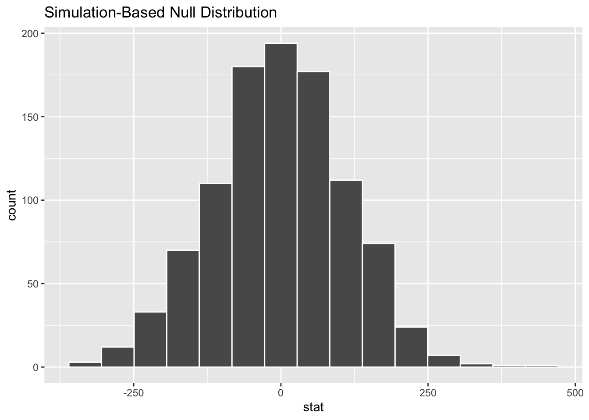
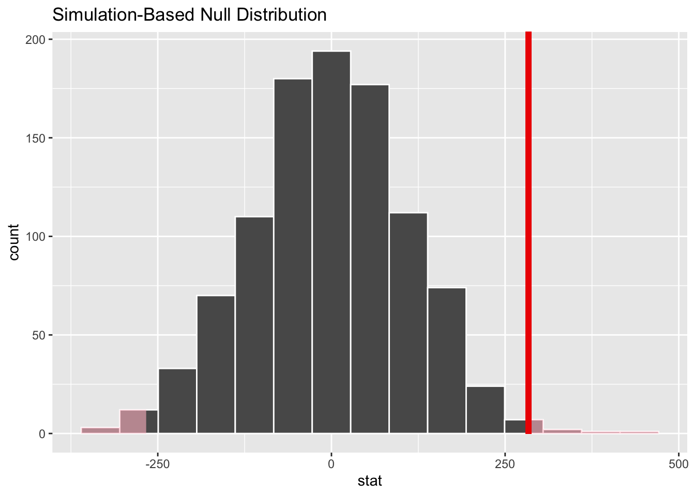
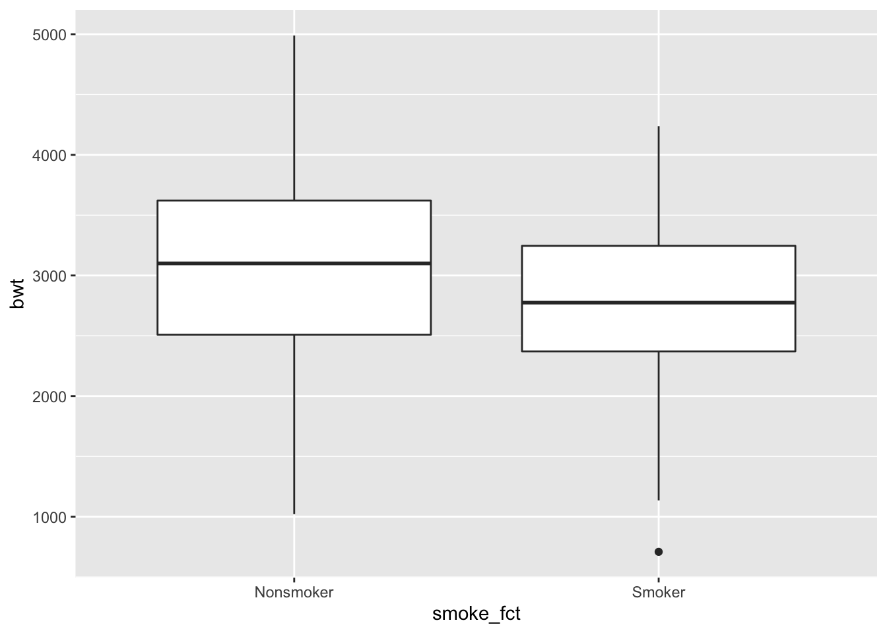
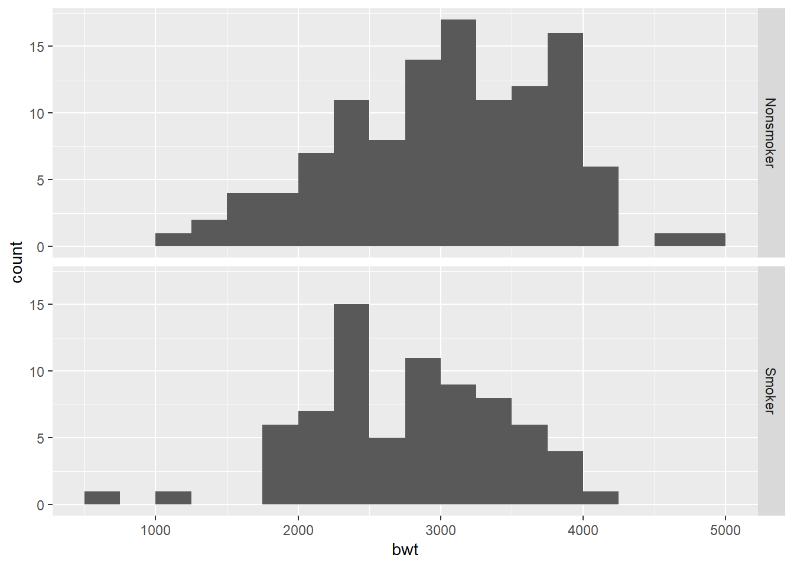
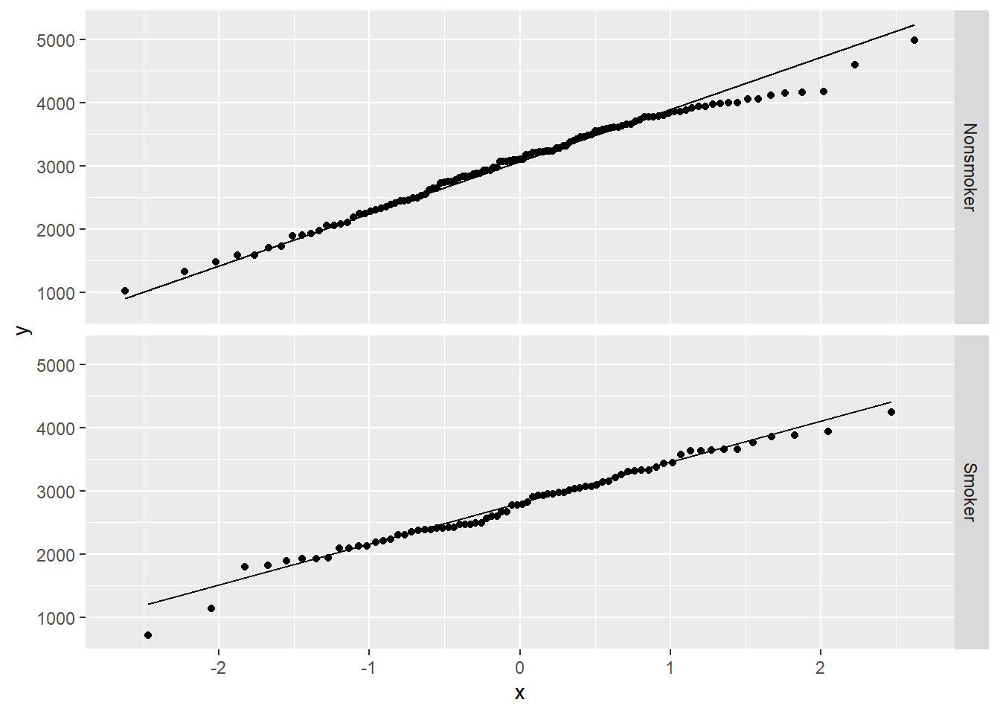
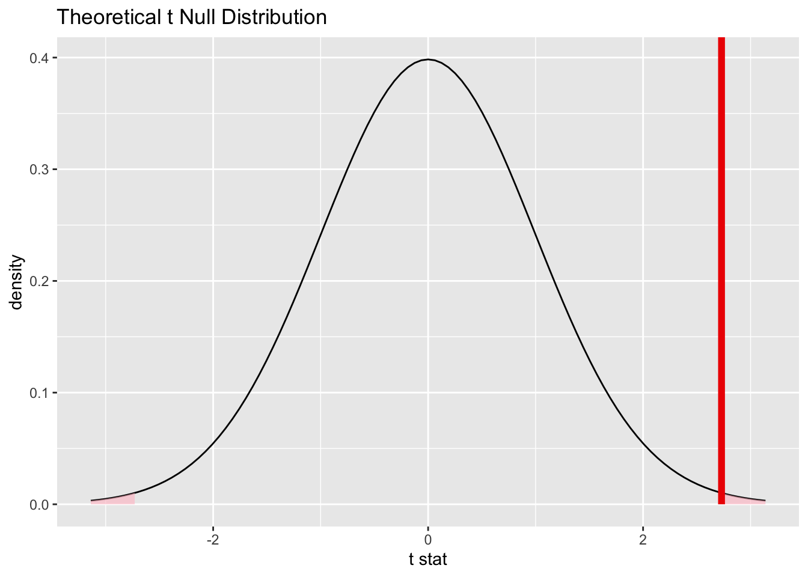

# Inference for two independent means

<!-- Please don't mess with the next few lines! -->
<style>h5{font-size:2em;color:#0000FF}h6{font-size:1.5em;color:#0000FF}div.answer{margin-left:5%;border:1px solid #0000FF;border-left-width:10px;padding:25px} div.summary{background-color:rgba(30,144,255,0.1);border:3px double #0000FF;padding:25px}</style><p style="color:#ffffff">2.0</p>
<!-- Please don't mess with the previous few lines! -->


::: {.summary}

### Functions introduced in this chapter: {-}

No new R functions are introduced here.

:::


## Introduction

If we have a numerical variable and a categorical variable with two categories, we can think of the numerical variable as response and the categorical variable as predictor. The idea is that the two categories sort your numerical data into two groups which can be compared. Assuming the two groups are independent of each other, we can use them as samples of two larger populations. This leads to inference to decide if the difference between the means of the two groups is statistically significant and then estimate the difference between the means of the two populations represented. The relevant hypothesis test is called a two-sample t test (or Welch's t test, to be specific).


### Install new packages

There are no new packages used in this chapter.

### Download the R notebook file

Check the upper-right corner in RStudio to make sure you're in your `intro_stats` project. Then click on the following link to download this chapter as an R notebook file (`.Rmd`).

<a href = "https://jingsai.github.io/intro_stats/chapter_downloads/21-inference_for_two_independent_means.Rmd" download>https://jingsai.github.io/intro_stats/chapter_downloads/21-inference_for_two_independent_means.Rmd</a>

Once the file is downloaded, move it to your project folder in RStudio and open it there.

### Restart R and run all chunks

In RStudio, select "Restart R and Run All Chunks" from the "Run" menu.


## Load packages

We load the standard `tidyverse`, `janitor`, and `infer` packages. We also use the `MASS` package for the `birthwt` data.


```r
library(tidyverse)
```

```
## ── Attaching packages ─────────────────────────────────────── tidyverse 1.3.2 ──
## ✔ ggplot2 3.3.6      ✔ purrr   0.3.4 
## ✔ tibble  3.1.8      ✔ dplyr   1.0.10
## ✔ tidyr   1.2.0      ✔ stringr 1.4.1 
## ✔ readr   2.1.2      ✔ forcats 0.5.2 
## ── Conflicts ────────────────────────────────────────── tidyverse_conflicts() ──
## ✖ dplyr::filter() masks stats::filter()
## ✖ dplyr::lag()    masks stats::lag()
```

```r
library(janitor)
```

```
## 
## Attaching package: 'janitor'
## 
## The following objects are masked from 'package:stats':
## 
##     chisq.test, fisher.test
```

```r
library(infer)
library(MASS)
```

```
## 
## Attaching package: 'MASS'
## 
## The following object is masked from 'package:dplyr':
## 
##     select
```


## Research question

Recall the `birthwt` data that was collected at Baystate Medical Center, Springfield, Mass during 1986. In a previous chapter, we measured low birth weight babies using a categorical variable that served as an indicator for low birth weight.

##### Exercise 1 {-}

How was it determined if a baby was considered "low birth weight" for purposes of constructing the variable `low`? Use the help file to find out.

::: {.answer}

Please write up your answer here.

:::

*****


We have the actual birth weight of the babies in this data. So, rather than using a coarse classification into a binary "yes or no" variable, why not use the full precision of the birth weight measured in grams? This is a very precisely measured numerical variable.

We'd like to compare mean birth weights among two groups: women who smoked during pregnancy, and women who didn't.


## Data preparation

The actual mean weights in each sample (the smoking women and the nonsmoking women) can be found using a `group_by` and `summarise` pipeline:


```r
birthwt %>%
  group_by(smoke) %>%
  summarise(mean(bwt))
```

```
## # A tibble: 2 × 2
##   smoke `mean(bwt)`
##   <int>       <dbl>
## 1     0       3056.
## 2     1       2772.
```

Note that 0 means "nonsmoker" and 1 means "smoker". Looks like We need to address the fact the `smoke` variable is recorded as a numerical variable instead of a categorical variable. Here is `birthwt2` that we will use from here on out:


```r
birthwt2 <- birthwt %>%
    mutate(smoke_fct = factor(smoke, levels = c(0, 1), labels = c("Nonsmoker", "Smoker")))
birthwt2
```

```
##     low age lwt race smoke ptl ht ui ftv  bwt smoke_fct
## 85    0  19 182    2     0   0  0  1   0 2523 Nonsmoker
## 86    0  33 155    3     0   0  0  0   3 2551 Nonsmoker
## 87    0  20 105    1     1   0  0  0   1 2557    Smoker
## 88    0  21 108    1     1   0  0  1   2 2594    Smoker
## 89    0  18 107    1     1   0  0  1   0 2600    Smoker
## 91    0  21 124    3     0   0  0  0   0 2622 Nonsmoker
## 92    0  22 118    1     0   0  0  0   1 2637 Nonsmoker
## 93    0  17 103    3     0   0  0  0   1 2637 Nonsmoker
## 94    0  29 123    1     1   0  0  0   1 2663    Smoker
## 95    0  26 113    1     1   0  0  0   0 2665    Smoker
## 96    0  19  95    3     0   0  0  0   0 2722 Nonsmoker
## 97    0  19 150    3     0   0  0  0   1 2733 Nonsmoker
## 98    0  22  95    3     0   0  1  0   0 2751 Nonsmoker
## 99    0  30 107    3     0   1  0  1   2 2750 Nonsmoker
## 100   0  18 100    1     1   0  0  0   0 2769    Smoker
## 101   0  18 100    1     1   0  0  0   0 2769    Smoker
## 102   0  15  98    2     0   0  0  0   0 2778 Nonsmoker
## 103   0  25 118    1     1   0  0  0   3 2782    Smoker
## 104   0  20 120    3     0   0  0  1   0 2807 Nonsmoker
## 105   0  28 120    1     1   0  0  0   1 2821    Smoker
## 106   0  32 121    3     0   0  0  0   2 2835 Nonsmoker
## 107   0  31 100    1     0   0  0  1   3 2835 Nonsmoker
## 108   0  36 202    1     0   0  0  0   1 2836 Nonsmoker
## 109   0  28 120    3     0   0  0  0   0 2863 Nonsmoker
## 111   0  25 120    3     0   0  0  1   2 2877 Nonsmoker
## 112   0  28 167    1     0   0  0  0   0 2877 Nonsmoker
## 113   0  17 122    1     1   0  0  0   0 2906    Smoker
## 114   0  29 150    1     0   0  0  0   2 2920 Nonsmoker
## 115   0  26 168    2     1   0  0  0   0 2920    Smoker
## 116   0  17 113    2     0   0  0  0   1 2920 Nonsmoker
## 117   0  17 113    2     0   0  0  0   1 2920 Nonsmoker
## 118   0  24  90    1     1   1  0  0   1 2948    Smoker
## 119   0  35 121    2     1   1  0  0   1 2948    Smoker
## 120   0  25 155    1     0   0  0  0   1 2977 Nonsmoker
## 121   0  25 125    2     0   0  0  0   0 2977 Nonsmoker
## 123   0  29 140    1     1   0  0  0   2 2977    Smoker
## 124   0  19 138    1     1   0  0  0   2 2977    Smoker
## 125   0  27 124    1     1   0  0  0   0 2922    Smoker
## 126   0  31 215    1     1   0  0  0   2 3005    Smoker
## 127   0  33 109    1     1   0  0  0   1 3033    Smoker
## 128   0  21 185    2     1   0  0  0   2 3042    Smoker
## 129   0  19 189    1     0   0  0  0   2 3062 Nonsmoker
## 130   0  23 130    2     0   0  0  0   1 3062 Nonsmoker
## 131   0  21 160    1     0   0  0  0   0 3062 Nonsmoker
## 132   0  18  90    1     1   0  0  1   0 3062    Smoker
## 133   0  18  90    1     1   0  0  1   0 3062    Smoker
## 134   0  32 132    1     0   0  0  0   4 3080 Nonsmoker
## 135   0  19 132    3     0   0  0  0   0 3090 Nonsmoker
## 136   0  24 115    1     0   0  0  0   2 3090 Nonsmoker
## 137   0  22  85    3     1   0  0  0   0 3090    Smoker
## 138   0  22 120    1     0   0  1  0   1 3100 Nonsmoker
## 139   0  23 128    3     0   0  0  0   0 3104 Nonsmoker
## 140   0  22 130    1     1   0  0  0   0 3132    Smoker
## 141   0  30  95    1     1   0  0  0   2 3147    Smoker
## 142   0  19 115    3     0   0  0  0   0 3175 Nonsmoker
## 143   0  16 110    3     0   0  0  0   0 3175 Nonsmoker
## 144   0  21 110    3     1   0  0  1   0 3203    Smoker
## 145   0  30 153    3     0   0  0  0   0 3203 Nonsmoker
## 146   0  20 103    3     0   0  0  0   0 3203 Nonsmoker
## 147   0  17 119    3     0   0  0  0   0 3225 Nonsmoker
## 148   0  17 119    3     0   0  0  0   0 3225 Nonsmoker
## 149   0  23 119    3     0   0  0  0   2 3232 Nonsmoker
## 150   0  24 110    3     0   0  0  0   0 3232 Nonsmoker
## 151   0  28 140    1     0   0  0  0   0 3234 Nonsmoker
## 154   0  26 133    3     1   2  0  0   0 3260    Smoker
## 155   0  20 169    3     0   1  0  1   1 3274 Nonsmoker
## 156   0  24 115    3     0   0  0  0   2 3274 Nonsmoker
## 159   0  28 250    3     1   0  0  0   6 3303    Smoker
## 160   0  20 141    1     0   2  0  1   1 3317 Nonsmoker
## 161   0  22 158    2     0   1  0  0   2 3317 Nonsmoker
## 162   0  22 112    1     1   2  0  0   0 3317    Smoker
## 163   0  31 150    3     1   0  0  0   2 3321    Smoker
## 164   0  23 115    3     1   0  0  0   1 3331    Smoker
## 166   0  16 112    2     0   0  0  0   0 3374 Nonsmoker
## 167   0  16 135    1     1   0  0  0   0 3374    Smoker
## 168   0  18 229    2     0   0  0  0   0 3402 Nonsmoker
## 169   0  25 140    1     0   0  0  0   1 3416 Nonsmoker
## 170   0  32 134    1     1   1  0  0   4 3430    Smoker
## 172   0  20 121    2     1   0  0  0   0 3444    Smoker
## 173   0  23 190    1     0   0  0  0   0 3459 Nonsmoker
## 174   0  22 131    1     0   0  0  0   1 3460 Nonsmoker
## 175   0  32 170    1     0   0  0  0   0 3473 Nonsmoker
## 176   0  30 110    3     0   0  0  0   0 3544 Nonsmoker
## 177   0  20 127    3     0   0  0  0   0 3487 Nonsmoker
## 179   0  23 123    3     0   0  0  0   0 3544 Nonsmoker
## 180   0  17 120    3     1   0  0  0   0 3572    Smoker
## 181   0  19 105    3     0   0  0  0   0 3572 Nonsmoker
## 182   0  23 130    1     0   0  0  0   0 3586 Nonsmoker
## 183   0  36 175    1     0   0  0  0   0 3600 Nonsmoker
## 184   0  22 125    1     0   0  0  0   1 3614 Nonsmoker
## 185   0  24 133    1     0   0  0  0   0 3614 Nonsmoker
## 186   0  21 134    3     0   0  0  0   2 3629 Nonsmoker
## 187   0  19 235    1     1   0  1  0   0 3629    Smoker
## 188   0  25  95    1     1   3  0  1   0 3637    Smoker
## 189   0  16 135    1     1   0  0  0   0 3643    Smoker
## 190   0  29 135    1     0   0  0  0   1 3651 Nonsmoker
## 191   0  29 154    1     0   0  0  0   1 3651 Nonsmoker
## 192   0  19 147    1     1   0  0  0   0 3651    Smoker
## 193   0  19 147    1     1   0  0  0   0 3651    Smoker
## 195   0  30 137    1     0   0  0  0   1 3699 Nonsmoker
## 196   0  24 110    1     0   0  0  0   1 3728 Nonsmoker
## 197   0  19 184    1     1   0  1  0   0 3756    Smoker
## 199   0  24 110    3     0   1  0  0   0 3770 Nonsmoker
## 200   0  23 110    1     0   0  0  0   1 3770 Nonsmoker
## 201   0  20 120    3     0   0  0  0   0 3770 Nonsmoker
## 202   0  25 241    2     0   0  1  0   0 3790 Nonsmoker
## 203   0  30 112    1     0   0  0  0   1 3799 Nonsmoker
## 204   0  22 169    1     0   0  0  0   0 3827 Nonsmoker
## 205   0  18 120    1     1   0  0  0   2 3856    Smoker
## 206   0  16 170    2     0   0  0  0   4 3860 Nonsmoker
## 207   0  32 186    1     0   0  0  0   2 3860 Nonsmoker
## 208   0  18 120    3     0   0  0  0   1 3884 Nonsmoker
## 209   0  29 130    1     1   0  0  0   2 3884    Smoker
## 210   0  33 117    1     0   0  0  1   1 3912 Nonsmoker
## 211   0  20 170    1     1   0  0  0   0 3940    Smoker
## 212   0  28 134    3     0   0  0  0   1 3941 Nonsmoker
## 213   0  14 135    1     0   0  0  0   0 3941 Nonsmoker
## 214   0  28 130    3     0   0  0  0   0 3969 Nonsmoker
## 215   0  25 120    1     0   0  0  0   2 3983 Nonsmoker
## 216   0  16  95    3     0   0  0  0   1 3997 Nonsmoker
## 217   0  20 158    1     0   0  0  0   1 3997 Nonsmoker
## 218   0  26 160    3     0   0  0  0   0 4054 Nonsmoker
## 219   0  21 115    1     0   0  0  0   1 4054 Nonsmoker
## 220   0  22 129    1     0   0  0  0   0 4111 Nonsmoker
## 221   0  25 130    1     0   0  0  0   2 4153 Nonsmoker
## 222   0  31 120    1     0   0  0  0   2 4167 Nonsmoker
## 223   0  35 170    1     0   1  0  0   1 4174 Nonsmoker
## 224   0  19 120    1     1   0  0  0   0 4238    Smoker
## 225   0  24 116    1     0   0  0  0   1 4593 Nonsmoker
## 226   0  45 123    1     0   0  0  0   1 4990 Nonsmoker
## 4     1  28 120    3     1   1  0  1   0  709    Smoker
## 10    1  29 130    1     0   0  0  1   2 1021 Nonsmoker
## 11    1  34 187    2     1   0  1  0   0 1135    Smoker
## 13    1  25 105    3     0   1  1  0   0 1330 Nonsmoker
## 15    1  25  85    3     0   0  0  1   0 1474 Nonsmoker
## 16    1  27 150    3     0   0  0  0   0 1588 Nonsmoker
## 17    1  23  97    3     0   0  0  1   1 1588 Nonsmoker
## 18    1  24 128    2     0   1  0  0   1 1701 Nonsmoker
## 19    1  24 132    3     0   0  1  0   0 1729 Nonsmoker
## 20    1  21 165    1     1   0  1  0   1 1790    Smoker
## 22    1  32 105    1     1   0  0  0   0 1818    Smoker
## 23    1  19  91    1     1   2  0  1   0 1885    Smoker
## 24    1  25 115    3     0   0  0  0   0 1893 Nonsmoker
## 25    1  16 130    3     0   0  0  0   1 1899 Nonsmoker
## 26    1  25  92    1     1   0  0  0   0 1928    Smoker
## 27    1  20 150    1     1   0  0  0   2 1928    Smoker
## 28    1  21 200    2     0   0  0  1   2 1928 Nonsmoker
## 29    1  24 155    1     1   1  0  0   0 1936    Smoker
## 30    1  21 103    3     0   0  0  0   0 1970 Nonsmoker
## 31    1  20 125    3     0   0  0  1   0 2055 Nonsmoker
## 32    1  25  89    3     0   2  0  0   1 2055 Nonsmoker
## 33    1  19 102    1     0   0  0  0   2 2082 Nonsmoker
## 34    1  19 112    1     1   0  0  1   0 2084    Smoker
## 35    1  26 117    1     1   1  0  0   0 2084    Smoker
## 36    1  24 138    1     0   0  0  0   0 2100 Nonsmoker
## 37    1  17 130    3     1   1  0  1   0 2125    Smoker
## 40    1  20 120    2     1   0  0  0   3 2126    Smoker
## 42    1  22 130    1     1   1  0  1   1 2187    Smoker
## 43    1  27 130    2     0   0  0  1   0 2187 Nonsmoker
## 44    1  20  80    3     1   0  0  1   0 2211    Smoker
## 45    1  17 110    1     1   0  0  0   0 2225    Smoker
## 46    1  25 105    3     0   1  0  0   1 2240 Nonsmoker
## 47    1  20 109    3     0   0  0  0   0 2240 Nonsmoker
## 49    1  18 148    3     0   0  0  0   0 2282 Nonsmoker
## 50    1  18 110    2     1   1  0  0   0 2296    Smoker
## 51    1  20 121    1     1   1  0  1   0 2296    Smoker
## 52    1  21 100    3     0   1  0  0   4 2301 Nonsmoker
## 54    1  26  96    3     0   0  0  0   0 2325 Nonsmoker
## 56    1  31 102    1     1   1  0  0   1 2353    Smoker
## 57    1  15 110    1     0   0  0  0   0 2353 Nonsmoker
## 59    1  23 187    2     1   0  0  0   1 2367    Smoker
## 60    1  20 122    2     1   0  0  0   0 2381    Smoker
## 61    1  24 105    2     1   0  0  0   0 2381    Smoker
## 62    1  15 115    3     0   0  0  1   0 2381 Nonsmoker
## 63    1  23 120    3     0   0  0  0   0 2410 Nonsmoker
## 65    1  30 142    1     1   1  0  0   0 2410    Smoker
## 67    1  22 130    1     1   0  0  0   1 2410    Smoker
## 68    1  17 120    1     1   0  0  0   3 2414    Smoker
## 69    1  23 110    1     1   1  0  0   0 2424    Smoker
## 71    1  17 120    2     0   0  0  0   2 2438 Nonsmoker
## 75    1  26 154    3     0   1  1  0   1 2442 Nonsmoker
## 76    1  20 105    3     0   0  0  0   3 2450 Nonsmoker
## 77    1  26 190    1     1   0  0  0   0 2466    Smoker
## 78    1  14 101    3     1   1  0  0   0 2466    Smoker
## 79    1  28  95    1     1   0  0  0   2 2466    Smoker
## 81    1  14 100    3     0   0  0  0   2 2495 Nonsmoker
## 82    1  23  94    3     1   0  0  0   0 2495    Smoker
## 83    1  17 142    2     0   0  1  0   0 2495 Nonsmoker
## 84    1  21 130    1     1   0  1  0   3 2495    Smoker
```


```r
glimpse(birthwt2)
```

```
## Rows: 189
## Columns: 11
## $ low       <int> 0, 0, 0, 0, 0, 0, 0, 0, 0, 0, 0, 0, 0, 0, 0, 0, 0, 0, 0, 0, …
## $ age       <int> 19, 33, 20, 21, 18, 21, 22, 17, 29, 26, 19, 19, 22, 30, 18, …
## $ lwt       <int> 182, 155, 105, 108, 107, 124, 118, 103, 123, 113, 95, 150, 9…
## $ race      <int> 2, 3, 1, 1, 1, 3, 1, 3, 1, 1, 3, 3, 3, 3, 1, 1, 2, 1, 3, 1, …
## $ smoke     <int> 0, 0, 1, 1, 1, 0, 0, 0, 1, 1, 0, 0, 0, 0, 1, 1, 0, 1, 0, 1, …
## $ ptl       <int> 0, 0, 0, 0, 0, 0, 0, 0, 0, 0, 0, 0, 0, 1, 0, 0, 0, 0, 0, 0, …
## $ ht        <int> 0, 0, 0, 0, 0, 0, 0, 0, 0, 0, 0, 0, 1, 0, 0, 0, 0, 0, 0, 0, …
## $ ui        <int> 1, 0, 0, 1, 1, 0, 0, 0, 0, 0, 0, 0, 0, 1, 0, 0, 0, 0, 1, 0, …
## $ ftv       <int> 0, 3, 1, 2, 0, 0, 1, 1, 1, 0, 0, 1, 0, 2, 0, 0, 0, 3, 0, 1, …
## $ bwt       <int> 2523, 2551, 2557, 2594, 2600, 2622, 2637, 2637, 2663, 2665, …
## $ smoke_fct <fct> Nonsmoker, Nonsmoker, Smoker, Smoker, Smoker, Nonsmoker, Non…
```

The difference between the means is now calculated using `infer` tools. We will store the result as `obs_diff` for "observed difference".


```r
obs_diff <- birthwt2 %>%
  specify(response = bwt, explanatory = smoke_fct) %>% 
  calculate(stat = "diff in means", order = c("Nonsmoker", "Smoker"))
obs_diff
```

```
## Response: bwt (numeric)
## Explanatory: smoke_fct (factor)
## # A tibble: 1 × 1
##    stat
##   <dbl>
## 1  284.
```


##### Exercise 2 {-}

What would happen if we used `order = c("Smoker", "Nonsmoker")` instead? Why might we have a slight preference for `order = c("Nonsmoker", "Smoker")`?

::: {.answer}

Please write up your answer here.

:::

*****


Note that it will not actually make a difference to the inferential process in which order we subtract. However, we do have to be consistent to use the same order throughout. When interpreting the test statistic, effect size, and confidence interval, we will need to pay attention to the order of subtraction to make sure we are interpreting our results correctly.


## Every day I'm shuffling

Whenever there are two groups, the obvious null hypothesis is that there is no difference between them.

Consider the `smoke` variable. If there were truly no difference in mean birth weights between women who smoked and women who didn't, then it shouldn't matter if we know the smoking status or not. It becomes irrelevant under the assumption of the null.

We can simulate this assumption by shuffling the list of smoking status. More concretely, we can randomly assign a smoking status label to each mother and then calculate the average birth weight in each group. Since the smoking labels are random, there's no reason to expect a difference between the two average weights other than random fluctuations due to sampling variability.

For example, here is the actual smoking status of the women:


```r
birthwt2$smoke_fct
```

```
##   [1] Nonsmoker Nonsmoker Smoker    Smoker    Smoker    Nonsmoker Nonsmoker
##   [8] Nonsmoker Smoker    Smoker    Nonsmoker Nonsmoker Nonsmoker Nonsmoker
##  [15] Smoker    Smoker    Nonsmoker Smoker    Nonsmoker Smoker    Nonsmoker
##  [22] Nonsmoker Nonsmoker Nonsmoker Nonsmoker Nonsmoker Smoker    Nonsmoker
##  [29] Smoker    Nonsmoker Nonsmoker Smoker    Smoker    Nonsmoker Nonsmoker
##  [36] Smoker    Smoker    Smoker    Smoker    Smoker    Smoker    Nonsmoker
##  [43] Nonsmoker Nonsmoker Smoker    Smoker    Nonsmoker Nonsmoker Nonsmoker
##  [50] Smoker    Nonsmoker Nonsmoker Smoker    Smoker    Nonsmoker Nonsmoker
##  [57] Smoker    Nonsmoker Nonsmoker Nonsmoker Nonsmoker Nonsmoker Nonsmoker
##  [64] Nonsmoker Smoker    Nonsmoker Nonsmoker Smoker    Nonsmoker Nonsmoker
##  [71] Smoker    Smoker    Smoker    Nonsmoker Smoker    Nonsmoker Nonsmoker
##  [78] Smoker    Smoker    Nonsmoker Nonsmoker Nonsmoker Nonsmoker Nonsmoker
##  [85] Nonsmoker Smoker    Nonsmoker Nonsmoker Nonsmoker Nonsmoker Nonsmoker
##  [92] Nonsmoker Smoker    Smoker    Smoker    Nonsmoker Nonsmoker Smoker   
##  [99] Smoker    Nonsmoker Nonsmoker Smoker    Nonsmoker Nonsmoker Nonsmoker
## [106] Nonsmoker Nonsmoker Nonsmoker Smoker    Nonsmoker Nonsmoker Nonsmoker
## [113] Smoker    Nonsmoker Smoker    Nonsmoker Nonsmoker Nonsmoker Nonsmoker
## [120] Nonsmoker Nonsmoker Nonsmoker Nonsmoker Nonsmoker Nonsmoker Nonsmoker
## [127] Nonsmoker Smoker    Nonsmoker Nonsmoker Smoker    Nonsmoker Smoker   
## [134] Nonsmoker Nonsmoker Nonsmoker Nonsmoker Nonsmoker Nonsmoker Smoker   
## [141] Smoker    Smoker    Nonsmoker Nonsmoker Smoker    Smoker    Nonsmoker
## [148] Smoker    Nonsmoker Nonsmoker Nonsmoker Nonsmoker Smoker    Smoker   
## [155] Nonsmoker Smoker    Smoker    Smoker    Nonsmoker Smoker    Smoker   
## [162] Nonsmoker Nonsmoker Nonsmoker Smoker    Smoker    Nonsmoker Nonsmoker
## [169] Smoker    Nonsmoker Smoker    Smoker    Smoker    Nonsmoker Nonsmoker
## [176] Smoker    Smoker    Smoker    Smoker    Nonsmoker Nonsmoker Nonsmoker
## [183] Smoker    Smoker    Smoker    Nonsmoker Smoker    Nonsmoker Smoker   
## Levels: Nonsmoker Smoker
```

But we're going to use values that have been randomly shuffled, like this one, for example:


```r
set.seed(1729)
sample(birthwt2$smoke_fct)
```

```
##   [1] Nonsmoker Smoker    Nonsmoker Nonsmoker Smoker    Nonsmoker Smoker   
##   [8] Nonsmoker Smoker    Nonsmoker Nonsmoker Smoker    Smoker    Nonsmoker
##  [15] Nonsmoker Nonsmoker Nonsmoker Smoker    Smoker    Nonsmoker Nonsmoker
##  [22] Nonsmoker Smoker    Nonsmoker Nonsmoker Nonsmoker Nonsmoker Smoker   
##  [29] Nonsmoker Nonsmoker Nonsmoker Nonsmoker Smoker    Smoker    Nonsmoker
##  [36] Smoker    Smoker    Smoker    Nonsmoker Nonsmoker Nonsmoker Nonsmoker
##  [43] Nonsmoker Nonsmoker Nonsmoker Smoker    Nonsmoker Nonsmoker Nonsmoker
##  [50] Smoker    Nonsmoker Nonsmoker Smoker    Nonsmoker Smoker    Nonsmoker
##  [57] Nonsmoker Nonsmoker Smoker    Nonsmoker Nonsmoker Smoker    Smoker   
##  [64] Nonsmoker Nonsmoker Smoker    Nonsmoker Nonsmoker Smoker    Nonsmoker
##  [71] Nonsmoker Nonsmoker Nonsmoker Smoker    Nonsmoker Nonsmoker Smoker   
##  [78] Smoker    Smoker    Smoker    Smoker    Smoker    Smoker    Nonsmoker
##  [85] Smoker    Nonsmoker Smoker    Smoker    Smoker    Nonsmoker Nonsmoker
##  [92] Nonsmoker Nonsmoker Smoker    Smoker    Nonsmoker Nonsmoker Smoker   
##  [99] Smoker    Nonsmoker Nonsmoker Smoker    Nonsmoker Smoker    Nonsmoker
## [106] Nonsmoker Nonsmoker Smoker    Nonsmoker Smoker    Smoker    Smoker   
## [113] Nonsmoker Smoker    Smoker    Nonsmoker Nonsmoker Smoker    Nonsmoker
## [120] Nonsmoker Nonsmoker Nonsmoker Smoker    Smoker    Smoker    Smoker   
## [127] Nonsmoker Nonsmoker Nonsmoker Smoker    Smoker    Smoker    Nonsmoker
## [134] Nonsmoker Nonsmoker Smoker    Nonsmoker Nonsmoker Nonsmoker Smoker   
## [141] Nonsmoker Nonsmoker Smoker    Nonsmoker Nonsmoker Smoker    Nonsmoker
## [148] Smoker    Nonsmoker Nonsmoker Smoker    Nonsmoker Smoker    Smoker   
## [155] Smoker    Nonsmoker Nonsmoker Nonsmoker Smoker    Smoker    Nonsmoker
## [162] Nonsmoker Nonsmoker Nonsmoker Nonsmoker Nonsmoker Nonsmoker Nonsmoker
## [169] Nonsmoker Smoker    Smoker    Nonsmoker Smoker    Nonsmoker Nonsmoker
## [176] Nonsmoker Smoker    Smoker    Nonsmoker Nonsmoker Nonsmoker Nonsmoker
## [183] Smoker    Nonsmoker Nonsmoker Nonsmoker Smoker    Nonsmoker Nonsmoker
## Levels: Nonsmoker Smoker
```

The `infer` package will perform this random shuffling over and over again. Given the now arbitrary labels of "Nonsmoker" and "Smoker" (which are meaningless because each women was assigned to one of these labels randomly with no regard to her actual smoking status), `infer` will calculate the mean birth weights among the first group of women (labeled "Nonsmokers" but not really consisting of all nonsmokers) and the second group of women (labeled "Smokers" but not really consisting of all smokers). Finally `infer` will compute the difference between those two means. And it will do this process 1000 times.


```r
set.seed(1729)
bwt_smoke_test <- birthwt2 %>%
  specify(response = bwt, explanatory = smoke_fct) %>%
  hypothesize(null = "independence") %>%
  generate(reps = 1000, type = "permute") %>%
  calculate(stat = "diff in means", order = c("Nonsmoker", "Smoker"))
bwt_smoke_test
```

```
## Response: bwt (numeric)
## Explanatory: smoke_fct (factor)
## Null Hypothesis: independence
## # A tibble: 1,000 × 2
##    replicate   stat
##        <int>  <dbl>
##  1         1 -173. 
##  2         2  -79.3
##  3         3  -95.8
##  4         4 -253. 
##  5         5   31.3
##  6         6 -229. 
##  7         7   63.4
##  8         8   13.8
##  9         9   22.6
## 10        10 -118. 
## # … with 990 more rows
```

##### Exercise 3 {-}

Before we graph these simulated values, what do you guess will be the mean value? Keep in mind that we have computed differences in the mean birth weights between two groups of women. But because we have shuffled the smoking labels randomly, we aren't really calculating the difference in mean birth weights of nonsmokers vs smokers. We're just computing the difference in mean birth weights of randomly assigned groups of women.

::: {.answer}

Please write up your answer here.

:::

*****


Here's the visualization:


```r
bwt_smoke_test %>%
    visualize()
```



No surprise that this histogram looks nearly normal, centered at zero: the simulation is working under the assumption of the null hypothesis of no difference between the groups.

Here is the same plot but including our sample difference:


```r
bwt_smoke_test %>%
    visualize() +
    shade_p_value(obs_stat = obs_diff, direction = "two_sided")
```



Our observed difference (from the sampled data) is quite far out into the tail of this simulated sampling distribution, so it appears that our actual data would be somewhat unlikely due to pure chance alone if the null hypothesis were true.

We can even find a P-value by calculating how many of our sampled values are as extreme or more extreme than the observed data difference.


```r
bwt_smoke_test %>%
    get_p_value(obs_stat = obs_diff, direction = "two-sided")
```

```
## # A tibble: 1 × 1
##   p_value
##     <dbl>
## 1   0.016
```

Indeed, this is a small P-value.


## The sampling distribution model

In the previous section, we simulated the sampling distribution under the assumption of a null hypothesis of no difference between the groups. It certainly looked like a normal model, but which normal model? The center is obviously zero, but what about the standard deviation?

Let's assume that both groups come from populations that are normally distributed with normal models $N(\mu_{1}, \sigma_{1})$ and $N(\mu_{2}, \sigma_{2})$. If we take samples of size $n_{1}$ from group 1 and $n_{2}$ from group 2, some fancy math shows that the distribution of the differences between sample means is

$$
N\left(\mu_{1} - \mu_{2}, \sqrt{\frac{\sigma_{1}^{2}}{n_{1}} + \frac{\sigma_{2}^{2}}{n_{2}}}\right).
$$

Under the assumption of the null, the difference of the means is zero ($\mu_{1} - \mu_{2} =  0$). Unfortunately, though, we make no assumption on the standard deviations. It should be clear that the only solution is to substitute the sample standard deviations $s_{1}$ and $s_{2}$ for the population standard deviations $\sigma_{1}$ and $\sigma_{2}$.^[When we were testing two proportions with categorical data, one option (described in an optional appendix in that chapter) was to pool the data. With numerical data, we can calculate a pooled mean, but that doesn't help with the unknown standard deviations. Nothing in the null hypothesis suggests that the standard deviations of the two groups should be the same. In the extremely rare situation in which one can assume equal standard deviations in the two groups, then there is a way to run a pooled t test. But this "extra" assumption of equal standard deviations is typically questionable at best.]

$$
SE = \sqrt{\frac{s_{1}^{2}}{n_{1}} + \frac{s_{2}^{2}}{n_{2}}}.
$$

However, $s_{1}$ and $s_{2}$ are not perfect estimates of $\sigma_{1}$ and $\sigma_{2}$; they are subject to sampling variability too. This extra variability means that a normal model is no longer appropriate as the sampling distribution model.

In the one-sample case, a Student t model with $df = n - 1$ was the right choice. In the two-sample case, we don't know the right answer. And I don't mean that we haven't learned it yet in our stats class. I mean, statisticians have not found a formula for the correct sampling distribution. It is a famous unsolved problem, called the Behrens-Fisher problem.

Several researchers have proposed solutions that are "close" though. One compelling one is called "Welch's t test". Welch showed that even though it's not quite right, a Student t model is very close as long as you pick the degrees of freedom carefully. Unfortunately, the way to compute the right degrees of freedom is crazy complicated. Fortunately, R is good at crazy complicated computations.

Let's go through the full rubric.


## Exploratory data analysis

### Use data documentation (help files, code books, Google, etc.) to determine as much as possible about the data provenance and structure.

Type `birthwt` at the Console to read the help file. We have the same concerns about the lack of details as we did in Chapter 16.


```r
birthwt
```

```
##     low age lwt race smoke ptl ht ui ftv  bwt
## 85    0  19 182    2     0   0  0  1   0 2523
## 86    0  33 155    3     0   0  0  0   3 2551
## 87    0  20 105    1     1   0  0  0   1 2557
## 88    0  21 108    1     1   0  0  1   2 2594
## 89    0  18 107    1     1   0  0  1   0 2600
## 91    0  21 124    3     0   0  0  0   0 2622
## 92    0  22 118    1     0   0  0  0   1 2637
## 93    0  17 103    3     0   0  0  0   1 2637
## 94    0  29 123    1     1   0  0  0   1 2663
## 95    0  26 113    1     1   0  0  0   0 2665
## 96    0  19  95    3     0   0  0  0   0 2722
## 97    0  19 150    3     0   0  0  0   1 2733
## 98    0  22  95    3     0   0  1  0   0 2751
## 99    0  30 107    3     0   1  0  1   2 2750
## 100   0  18 100    1     1   0  0  0   0 2769
## 101   0  18 100    1     1   0  0  0   0 2769
## 102   0  15  98    2     0   0  0  0   0 2778
## 103   0  25 118    1     1   0  0  0   3 2782
## 104   0  20 120    3     0   0  0  1   0 2807
## 105   0  28 120    1     1   0  0  0   1 2821
## 106   0  32 121    3     0   0  0  0   2 2835
## 107   0  31 100    1     0   0  0  1   3 2835
## 108   0  36 202    1     0   0  0  0   1 2836
## 109   0  28 120    3     0   0  0  0   0 2863
## 111   0  25 120    3     0   0  0  1   2 2877
## 112   0  28 167    1     0   0  0  0   0 2877
## 113   0  17 122    1     1   0  0  0   0 2906
## 114   0  29 150    1     0   0  0  0   2 2920
## 115   0  26 168    2     1   0  0  0   0 2920
## 116   0  17 113    2     0   0  0  0   1 2920
## 117   0  17 113    2     0   0  0  0   1 2920
## 118   0  24  90    1     1   1  0  0   1 2948
## 119   0  35 121    2     1   1  0  0   1 2948
## 120   0  25 155    1     0   0  0  0   1 2977
## 121   0  25 125    2     0   0  0  0   0 2977
## 123   0  29 140    1     1   0  0  0   2 2977
## 124   0  19 138    1     1   0  0  0   2 2977
## 125   0  27 124    1     1   0  0  0   0 2922
## 126   0  31 215    1     1   0  0  0   2 3005
## 127   0  33 109    1     1   0  0  0   1 3033
## 128   0  21 185    2     1   0  0  0   2 3042
## 129   0  19 189    1     0   0  0  0   2 3062
## 130   0  23 130    2     0   0  0  0   1 3062
## 131   0  21 160    1     0   0  0  0   0 3062
## 132   0  18  90    1     1   0  0  1   0 3062
## 133   0  18  90    1     1   0  0  1   0 3062
## 134   0  32 132    1     0   0  0  0   4 3080
## 135   0  19 132    3     0   0  0  0   0 3090
## 136   0  24 115    1     0   0  0  0   2 3090
## 137   0  22  85    3     1   0  0  0   0 3090
## 138   0  22 120    1     0   0  1  0   1 3100
## 139   0  23 128    3     0   0  0  0   0 3104
## 140   0  22 130    1     1   0  0  0   0 3132
## 141   0  30  95    1     1   0  0  0   2 3147
## 142   0  19 115    3     0   0  0  0   0 3175
## 143   0  16 110    3     0   0  0  0   0 3175
## 144   0  21 110    3     1   0  0  1   0 3203
## 145   0  30 153    3     0   0  0  0   0 3203
## 146   0  20 103    3     0   0  0  0   0 3203
## 147   0  17 119    3     0   0  0  0   0 3225
## 148   0  17 119    3     0   0  0  0   0 3225
## 149   0  23 119    3     0   0  0  0   2 3232
## 150   0  24 110    3     0   0  0  0   0 3232
## 151   0  28 140    1     0   0  0  0   0 3234
## 154   0  26 133    3     1   2  0  0   0 3260
## 155   0  20 169    3     0   1  0  1   1 3274
## 156   0  24 115    3     0   0  0  0   2 3274
## 159   0  28 250    3     1   0  0  0   6 3303
## 160   0  20 141    1     0   2  0  1   1 3317
## 161   0  22 158    2     0   1  0  0   2 3317
## 162   0  22 112    1     1   2  0  0   0 3317
## 163   0  31 150    3     1   0  0  0   2 3321
## 164   0  23 115    3     1   0  0  0   1 3331
## 166   0  16 112    2     0   0  0  0   0 3374
## 167   0  16 135    1     1   0  0  0   0 3374
## 168   0  18 229    2     0   0  0  0   0 3402
## 169   0  25 140    1     0   0  0  0   1 3416
## 170   0  32 134    1     1   1  0  0   4 3430
## 172   0  20 121    2     1   0  0  0   0 3444
## 173   0  23 190    1     0   0  0  0   0 3459
## 174   0  22 131    1     0   0  0  0   1 3460
## 175   0  32 170    1     0   0  0  0   0 3473
## 176   0  30 110    3     0   0  0  0   0 3544
## 177   0  20 127    3     0   0  0  0   0 3487
## 179   0  23 123    3     0   0  0  0   0 3544
## 180   0  17 120    3     1   0  0  0   0 3572
## 181   0  19 105    3     0   0  0  0   0 3572
## 182   0  23 130    1     0   0  0  0   0 3586
## 183   0  36 175    1     0   0  0  0   0 3600
## 184   0  22 125    1     0   0  0  0   1 3614
## 185   0  24 133    1     0   0  0  0   0 3614
## 186   0  21 134    3     0   0  0  0   2 3629
## 187   0  19 235    1     1   0  1  0   0 3629
## 188   0  25  95    1     1   3  0  1   0 3637
## 189   0  16 135    1     1   0  0  0   0 3643
## 190   0  29 135    1     0   0  0  0   1 3651
## 191   0  29 154    1     0   0  0  0   1 3651
## 192   0  19 147    1     1   0  0  0   0 3651
## 193   0  19 147    1     1   0  0  0   0 3651
## 195   0  30 137    1     0   0  0  0   1 3699
## 196   0  24 110    1     0   0  0  0   1 3728
## 197   0  19 184    1     1   0  1  0   0 3756
## 199   0  24 110    3     0   1  0  0   0 3770
## 200   0  23 110    1     0   0  0  0   1 3770
## 201   0  20 120    3     0   0  0  0   0 3770
## 202   0  25 241    2     0   0  1  0   0 3790
## 203   0  30 112    1     0   0  0  0   1 3799
## 204   0  22 169    1     0   0  0  0   0 3827
## 205   0  18 120    1     1   0  0  0   2 3856
## 206   0  16 170    2     0   0  0  0   4 3860
## 207   0  32 186    1     0   0  0  0   2 3860
## 208   0  18 120    3     0   0  0  0   1 3884
## 209   0  29 130    1     1   0  0  0   2 3884
## 210   0  33 117    1     0   0  0  1   1 3912
## 211   0  20 170    1     1   0  0  0   0 3940
## 212   0  28 134    3     0   0  0  0   1 3941
## 213   0  14 135    1     0   0  0  0   0 3941
## 214   0  28 130    3     0   0  0  0   0 3969
## 215   0  25 120    1     0   0  0  0   2 3983
## 216   0  16  95    3     0   0  0  0   1 3997
## 217   0  20 158    1     0   0  0  0   1 3997
## 218   0  26 160    3     0   0  0  0   0 4054
## 219   0  21 115    1     0   0  0  0   1 4054
## 220   0  22 129    1     0   0  0  0   0 4111
## 221   0  25 130    1     0   0  0  0   2 4153
## 222   0  31 120    1     0   0  0  0   2 4167
## 223   0  35 170    1     0   1  0  0   1 4174
## 224   0  19 120    1     1   0  0  0   0 4238
## 225   0  24 116    1     0   0  0  0   1 4593
## 226   0  45 123    1     0   0  0  0   1 4990
## 4     1  28 120    3     1   1  0  1   0  709
## 10    1  29 130    1     0   0  0  1   2 1021
## 11    1  34 187    2     1   0  1  0   0 1135
## 13    1  25 105    3     0   1  1  0   0 1330
## 15    1  25  85    3     0   0  0  1   0 1474
## 16    1  27 150    3     0   0  0  0   0 1588
## 17    1  23  97    3     0   0  0  1   1 1588
## 18    1  24 128    2     0   1  0  0   1 1701
## 19    1  24 132    3     0   0  1  0   0 1729
## 20    1  21 165    1     1   0  1  0   1 1790
## 22    1  32 105    1     1   0  0  0   0 1818
## 23    1  19  91    1     1   2  0  1   0 1885
## 24    1  25 115    3     0   0  0  0   0 1893
## 25    1  16 130    3     0   0  0  0   1 1899
## 26    1  25  92    1     1   0  0  0   0 1928
## 27    1  20 150    1     1   0  0  0   2 1928
## 28    1  21 200    2     0   0  0  1   2 1928
## 29    1  24 155    1     1   1  0  0   0 1936
## 30    1  21 103    3     0   0  0  0   0 1970
## 31    1  20 125    3     0   0  0  1   0 2055
## 32    1  25  89    3     0   2  0  0   1 2055
## 33    1  19 102    1     0   0  0  0   2 2082
## 34    1  19 112    1     1   0  0  1   0 2084
## 35    1  26 117    1     1   1  0  0   0 2084
## 36    1  24 138    1     0   0  0  0   0 2100
## 37    1  17 130    3     1   1  0  1   0 2125
## 40    1  20 120    2     1   0  0  0   3 2126
## 42    1  22 130    1     1   1  0  1   1 2187
## 43    1  27 130    2     0   0  0  1   0 2187
## 44    1  20  80    3     1   0  0  1   0 2211
## 45    1  17 110    1     1   0  0  0   0 2225
## 46    1  25 105    3     0   1  0  0   1 2240
## 47    1  20 109    3     0   0  0  0   0 2240
## 49    1  18 148    3     0   0  0  0   0 2282
## 50    1  18 110    2     1   1  0  0   0 2296
## 51    1  20 121    1     1   1  0  1   0 2296
## 52    1  21 100    3     0   1  0  0   4 2301
## 54    1  26  96    3     0   0  0  0   0 2325
## 56    1  31 102    1     1   1  0  0   1 2353
## 57    1  15 110    1     0   0  0  0   0 2353
## 59    1  23 187    2     1   0  0  0   1 2367
## 60    1  20 122    2     1   0  0  0   0 2381
## 61    1  24 105    2     1   0  0  0   0 2381
## 62    1  15 115    3     0   0  0  1   0 2381
## 63    1  23 120    3     0   0  0  0   0 2410
## 65    1  30 142    1     1   1  0  0   0 2410
## 67    1  22 130    1     1   0  0  0   1 2410
## 68    1  17 120    1     1   0  0  0   3 2414
## 69    1  23 110    1     1   1  0  0   0 2424
## 71    1  17 120    2     0   0  0  0   2 2438
## 75    1  26 154    3     0   1  1  0   1 2442
## 76    1  20 105    3     0   0  0  0   3 2450
## 77    1  26 190    1     1   0  0  0   0 2466
## 78    1  14 101    3     1   1  0  0   0 2466
## 79    1  28  95    1     1   0  0  0   2 2466
## 81    1  14 100    3     0   0  0  0   2 2495
## 82    1  23  94    3     1   0  0  0   0 2495
## 83    1  17 142    2     0   0  1  0   0 2495
## 84    1  21 130    1     1   0  1  0   3 2495
```


```r
glimpse(birthwt)
```

```
## Rows: 189
## Columns: 10
## $ low   <int> 0, 0, 0, 0, 0, 0, 0, 0, 0, 0, 0, 0, 0, 0, 0, 0, 0, 0, 0, 0, 0, 0…
## $ age   <int> 19, 33, 20, 21, 18, 21, 22, 17, 29, 26, 19, 19, 22, 30, 18, 18, …
## $ lwt   <int> 182, 155, 105, 108, 107, 124, 118, 103, 123, 113, 95, 150, 95, 1…
## $ race  <int> 2, 3, 1, 1, 1, 3, 1, 3, 1, 1, 3, 3, 3, 3, 1, 1, 2, 1, 3, 1, 3, 1…
## $ smoke <int> 0, 0, 1, 1, 1, 0, 0, 0, 1, 1, 0, 0, 0, 0, 1, 1, 0, 1, 0, 1, 0, 0…
## $ ptl   <int> 0, 0, 0, 0, 0, 0, 0, 0, 0, 0, 0, 0, 0, 1, 0, 0, 0, 0, 0, 0, 0, 0…
## $ ht    <int> 0, 0, 0, 0, 0, 0, 0, 0, 0, 0, 0, 0, 1, 0, 0, 0, 0, 0, 0, 0, 0, 0…
## $ ui    <int> 1, 0, 0, 1, 1, 0, 0, 0, 0, 0, 0, 0, 0, 1, 0, 0, 0, 0, 1, 0, 0, 1…
## $ ftv   <int> 0, 3, 1, 2, 0, 0, 1, 1, 1, 0, 0, 1, 0, 2, 0, 0, 0, 3, 0, 1, 2, 3…
## $ bwt   <int> 2523, 2551, 2557, 2594, 2600, 2622, 2637, 2637, 2663, 2665, 2722…
```

### Prepare the data for analysis.

We need to be sure `smoke` is a factor variable, so we create the new tibble `birthwt2` with the mutated variable `smoke_fct`.


```r
birthwt2 <- birthwt %>%
    mutate(smoke_fct = factor(smoke, levels = c(0, 1), labels = c("Nonsmoker", "Smoker")))
birthwt2
```

```
##     low age lwt race smoke ptl ht ui ftv  bwt smoke_fct
## 85    0  19 182    2     0   0  0  1   0 2523 Nonsmoker
## 86    0  33 155    3     0   0  0  0   3 2551 Nonsmoker
## 87    0  20 105    1     1   0  0  0   1 2557    Smoker
## 88    0  21 108    1     1   0  0  1   2 2594    Smoker
## 89    0  18 107    1     1   0  0  1   0 2600    Smoker
## 91    0  21 124    3     0   0  0  0   0 2622 Nonsmoker
## 92    0  22 118    1     0   0  0  0   1 2637 Nonsmoker
## 93    0  17 103    3     0   0  0  0   1 2637 Nonsmoker
## 94    0  29 123    1     1   0  0  0   1 2663    Smoker
## 95    0  26 113    1     1   0  0  0   0 2665    Smoker
## 96    0  19  95    3     0   0  0  0   0 2722 Nonsmoker
## 97    0  19 150    3     0   0  0  0   1 2733 Nonsmoker
## 98    0  22  95    3     0   0  1  0   0 2751 Nonsmoker
## 99    0  30 107    3     0   1  0  1   2 2750 Nonsmoker
## 100   0  18 100    1     1   0  0  0   0 2769    Smoker
## 101   0  18 100    1     1   0  0  0   0 2769    Smoker
## 102   0  15  98    2     0   0  0  0   0 2778 Nonsmoker
## 103   0  25 118    1     1   0  0  0   3 2782    Smoker
## 104   0  20 120    3     0   0  0  1   0 2807 Nonsmoker
## 105   0  28 120    1     1   0  0  0   1 2821    Smoker
## 106   0  32 121    3     0   0  0  0   2 2835 Nonsmoker
## 107   0  31 100    1     0   0  0  1   3 2835 Nonsmoker
## 108   0  36 202    1     0   0  0  0   1 2836 Nonsmoker
## 109   0  28 120    3     0   0  0  0   0 2863 Nonsmoker
## 111   0  25 120    3     0   0  0  1   2 2877 Nonsmoker
## 112   0  28 167    1     0   0  0  0   0 2877 Nonsmoker
## 113   0  17 122    1     1   0  0  0   0 2906    Smoker
## 114   0  29 150    1     0   0  0  0   2 2920 Nonsmoker
## 115   0  26 168    2     1   0  0  0   0 2920    Smoker
## 116   0  17 113    2     0   0  0  0   1 2920 Nonsmoker
## 117   0  17 113    2     0   0  0  0   1 2920 Nonsmoker
## 118   0  24  90    1     1   1  0  0   1 2948    Smoker
## 119   0  35 121    2     1   1  0  0   1 2948    Smoker
## 120   0  25 155    1     0   0  0  0   1 2977 Nonsmoker
## 121   0  25 125    2     0   0  0  0   0 2977 Nonsmoker
## 123   0  29 140    1     1   0  0  0   2 2977    Smoker
## 124   0  19 138    1     1   0  0  0   2 2977    Smoker
## 125   0  27 124    1     1   0  0  0   0 2922    Smoker
## 126   0  31 215    1     1   0  0  0   2 3005    Smoker
## 127   0  33 109    1     1   0  0  0   1 3033    Smoker
## 128   0  21 185    2     1   0  0  0   2 3042    Smoker
## 129   0  19 189    1     0   0  0  0   2 3062 Nonsmoker
## 130   0  23 130    2     0   0  0  0   1 3062 Nonsmoker
## 131   0  21 160    1     0   0  0  0   0 3062 Nonsmoker
## 132   0  18  90    1     1   0  0  1   0 3062    Smoker
## 133   0  18  90    1     1   0  0  1   0 3062    Smoker
## 134   0  32 132    1     0   0  0  0   4 3080 Nonsmoker
## 135   0  19 132    3     0   0  0  0   0 3090 Nonsmoker
## 136   0  24 115    1     0   0  0  0   2 3090 Nonsmoker
## 137   0  22  85    3     1   0  0  0   0 3090    Smoker
## 138   0  22 120    1     0   0  1  0   1 3100 Nonsmoker
## 139   0  23 128    3     0   0  0  0   0 3104 Nonsmoker
## 140   0  22 130    1     1   0  0  0   0 3132    Smoker
## 141   0  30  95    1     1   0  0  0   2 3147    Smoker
## 142   0  19 115    3     0   0  0  0   0 3175 Nonsmoker
## 143   0  16 110    3     0   0  0  0   0 3175 Nonsmoker
## 144   0  21 110    3     1   0  0  1   0 3203    Smoker
## 145   0  30 153    3     0   0  0  0   0 3203 Nonsmoker
## 146   0  20 103    3     0   0  0  0   0 3203 Nonsmoker
## 147   0  17 119    3     0   0  0  0   0 3225 Nonsmoker
## 148   0  17 119    3     0   0  0  0   0 3225 Nonsmoker
## 149   0  23 119    3     0   0  0  0   2 3232 Nonsmoker
## 150   0  24 110    3     0   0  0  0   0 3232 Nonsmoker
## 151   0  28 140    1     0   0  0  0   0 3234 Nonsmoker
## 154   0  26 133    3     1   2  0  0   0 3260    Smoker
## 155   0  20 169    3     0   1  0  1   1 3274 Nonsmoker
## 156   0  24 115    3     0   0  0  0   2 3274 Nonsmoker
## 159   0  28 250    3     1   0  0  0   6 3303    Smoker
## 160   0  20 141    1     0   2  0  1   1 3317 Nonsmoker
## 161   0  22 158    2     0   1  0  0   2 3317 Nonsmoker
## 162   0  22 112    1     1   2  0  0   0 3317    Smoker
## 163   0  31 150    3     1   0  0  0   2 3321    Smoker
## 164   0  23 115    3     1   0  0  0   1 3331    Smoker
## 166   0  16 112    2     0   0  0  0   0 3374 Nonsmoker
## 167   0  16 135    1     1   0  0  0   0 3374    Smoker
## 168   0  18 229    2     0   0  0  0   0 3402 Nonsmoker
## 169   0  25 140    1     0   0  0  0   1 3416 Nonsmoker
## 170   0  32 134    1     1   1  0  0   4 3430    Smoker
## 172   0  20 121    2     1   0  0  0   0 3444    Smoker
## 173   0  23 190    1     0   0  0  0   0 3459 Nonsmoker
## 174   0  22 131    1     0   0  0  0   1 3460 Nonsmoker
## 175   0  32 170    1     0   0  0  0   0 3473 Nonsmoker
## 176   0  30 110    3     0   0  0  0   0 3544 Nonsmoker
## 177   0  20 127    3     0   0  0  0   0 3487 Nonsmoker
## 179   0  23 123    3     0   0  0  0   0 3544 Nonsmoker
## 180   0  17 120    3     1   0  0  0   0 3572    Smoker
## 181   0  19 105    3     0   0  0  0   0 3572 Nonsmoker
## 182   0  23 130    1     0   0  0  0   0 3586 Nonsmoker
## 183   0  36 175    1     0   0  0  0   0 3600 Nonsmoker
## 184   0  22 125    1     0   0  0  0   1 3614 Nonsmoker
## 185   0  24 133    1     0   0  0  0   0 3614 Nonsmoker
## 186   0  21 134    3     0   0  0  0   2 3629 Nonsmoker
## 187   0  19 235    1     1   0  1  0   0 3629    Smoker
## 188   0  25  95    1     1   3  0  1   0 3637    Smoker
## 189   0  16 135    1     1   0  0  0   0 3643    Smoker
## 190   0  29 135    1     0   0  0  0   1 3651 Nonsmoker
## 191   0  29 154    1     0   0  0  0   1 3651 Nonsmoker
## 192   0  19 147    1     1   0  0  0   0 3651    Smoker
## 193   0  19 147    1     1   0  0  0   0 3651    Smoker
## 195   0  30 137    1     0   0  0  0   1 3699 Nonsmoker
## 196   0  24 110    1     0   0  0  0   1 3728 Nonsmoker
## 197   0  19 184    1     1   0  1  0   0 3756    Smoker
## 199   0  24 110    3     0   1  0  0   0 3770 Nonsmoker
## 200   0  23 110    1     0   0  0  0   1 3770 Nonsmoker
## 201   0  20 120    3     0   0  0  0   0 3770 Nonsmoker
## 202   0  25 241    2     0   0  1  0   0 3790 Nonsmoker
## 203   0  30 112    1     0   0  0  0   1 3799 Nonsmoker
## 204   0  22 169    1     0   0  0  0   0 3827 Nonsmoker
## 205   0  18 120    1     1   0  0  0   2 3856    Smoker
## 206   0  16 170    2     0   0  0  0   4 3860 Nonsmoker
## 207   0  32 186    1     0   0  0  0   2 3860 Nonsmoker
## 208   0  18 120    3     0   0  0  0   1 3884 Nonsmoker
## 209   0  29 130    1     1   0  0  0   2 3884    Smoker
## 210   0  33 117    1     0   0  0  1   1 3912 Nonsmoker
## 211   0  20 170    1     1   0  0  0   0 3940    Smoker
## 212   0  28 134    3     0   0  0  0   1 3941 Nonsmoker
## 213   0  14 135    1     0   0  0  0   0 3941 Nonsmoker
## 214   0  28 130    3     0   0  0  0   0 3969 Nonsmoker
## 215   0  25 120    1     0   0  0  0   2 3983 Nonsmoker
## 216   0  16  95    3     0   0  0  0   1 3997 Nonsmoker
## 217   0  20 158    1     0   0  0  0   1 3997 Nonsmoker
## 218   0  26 160    3     0   0  0  0   0 4054 Nonsmoker
## 219   0  21 115    1     0   0  0  0   1 4054 Nonsmoker
## 220   0  22 129    1     0   0  0  0   0 4111 Nonsmoker
## 221   0  25 130    1     0   0  0  0   2 4153 Nonsmoker
## 222   0  31 120    1     0   0  0  0   2 4167 Nonsmoker
## 223   0  35 170    1     0   1  0  0   1 4174 Nonsmoker
## 224   0  19 120    1     1   0  0  0   0 4238    Smoker
## 225   0  24 116    1     0   0  0  0   1 4593 Nonsmoker
## 226   0  45 123    1     0   0  0  0   1 4990 Nonsmoker
## 4     1  28 120    3     1   1  0  1   0  709    Smoker
## 10    1  29 130    1     0   0  0  1   2 1021 Nonsmoker
## 11    1  34 187    2     1   0  1  0   0 1135    Smoker
## 13    1  25 105    3     0   1  1  0   0 1330 Nonsmoker
## 15    1  25  85    3     0   0  0  1   0 1474 Nonsmoker
## 16    1  27 150    3     0   0  0  0   0 1588 Nonsmoker
## 17    1  23  97    3     0   0  0  1   1 1588 Nonsmoker
## 18    1  24 128    2     0   1  0  0   1 1701 Nonsmoker
## 19    1  24 132    3     0   0  1  0   0 1729 Nonsmoker
## 20    1  21 165    1     1   0  1  0   1 1790    Smoker
## 22    1  32 105    1     1   0  0  0   0 1818    Smoker
## 23    1  19  91    1     1   2  0  1   0 1885    Smoker
## 24    1  25 115    3     0   0  0  0   0 1893 Nonsmoker
## 25    1  16 130    3     0   0  0  0   1 1899 Nonsmoker
## 26    1  25  92    1     1   0  0  0   0 1928    Smoker
## 27    1  20 150    1     1   0  0  0   2 1928    Smoker
## 28    1  21 200    2     0   0  0  1   2 1928 Nonsmoker
## 29    1  24 155    1     1   1  0  0   0 1936    Smoker
## 30    1  21 103    3     0   0  0  0   0 1970 Nonsmoker
## 31    1  20 125    3     0   0  0  1   0 2055 Nonsmoker
## 32    1  25  89    3     0   2  0  0   1 2055 Nonsmoker
## 33    1  19 102    1     0   0  0  0   2 2082 Nonsmoker
## 34    1  19 112    1     1   0  0  1   0 2084    Smoker
## 35    1  26 117    1     1   1  0  0   0 2084    Smoker
## 36    1  24 138    1     0   0  0  0   0 2100 Nonsmoker
## 37    1  17 130    3     1   1  0  1   0 2125    Smoker
## 40    1  20 120    2     1   0  0  0   3 2126    Smoker
## 42    1  22 130    1     1   1  0  1   1 2187    Smoker
## 43    1  27 130    2     0   0  0  1   0 2187 Nonsmoker
## 44    1  20  80    3     1   0  0  1   0 2211    Smoker
## 45    1  17 110    1     1   0  0  0   0 2225    Smoker
## 46    1  25 105    3     0   1  0  0   1 2240 Nonsmoker
## 47    1  20 109    3     0   0  0  0   0 2240 Nonsmoker
## 49    1  18 148    3     0   0  0  0   0 2282 Nonsmoker
## 50    1  18 110    2     1   1  0  0   0 2296    Smoker
## 51    1  20 121    1     1   1  0  1   0 2296    Smoker
## 52    1  21 100    3     0   1  0  0   4 2301 Nonsmoker
## 54    1  26  96    3     0   0  0  0   0 2325 Nonsmoker
## 56    1  31 102    1     1   1  0  0   1 2353    Smoker
## 57    1  15 110    1     0   0  0  0   0 2353 Nonsmoker
## 59    1  23 187    2     1   0  0  0   1 2367    Smoker
## 60    1  20 122    2     1   0  0  0   0 2381    Smoker
## 61    1  24 105    2     1   0  0  0   0 2381    Smoker
## 62    1  15 115    3     0   0  0  1   0 2381 Nonsmoker
## 63    1  23 120    3     0   0  0  0   0 2410 Nonsmoker
## 65    1  30 142    1     1   1  0  0   0 2410    Smoker
## 67    1  22 130    1     1   0  0  0   1 2410    Smoker
## 68    1  17 120    1     1   0  0  0   3 2414    Smoker
## 69    1  23 110    1     1   1  0  0   0 2424    Smoker
## 71    1  17 120    2     0   0  0  0   2 2438 Nonsmoker
## 75    1  26 154    3     0   1  1  0   1 2442 Nonsmoker
## 76    1  20 105    3     0   0  0  0   3 2450 Nonsmoker
## 77    1  26 190    1     1   0  0  0   0 2466    Smoker
## 78    1  14 101    3     1   1  0  0   0 2466    Smoker
## 79    1  28  95    1     1   0  0  0   2 2466    Smoker
## 81    1  14 100    3     0   0  0  0   2 2495 Nonsmoker
## 82    1  23  94    3     1   0  0  0   0 2495    Smoker
## 83    1  17 142    2     0   0  1  0   0 2495 Nonsmoker
## 84    1  21 130    1     1   0  1  0   3 2495    Smoker
```


```r
glimpse(birthwt2)
```

```
## Rows: 189
## Columns: 11
## $ low       <int> 0, 0, 0, 0, 0, 0, 0, 0, 0, 0, 0, 0, 0, 0, 0, 0, 0, 0, 0, 0, …
## $ age       <int> 19, 33, 20, 21, 18, 21, 22, 17, 29, 26, 19, 19, 22, 30, 18, …
## $ lwt       <int> 182, 155, 105, 108, 107, 124, 118, 103, 123, 113, 95, 150, 9…
## $ race      <int> 2, 3, 1, 1, 1, 3, 1, 3, 1, 1, 3, 3, 3, 3, 1, 1, 2, 1, 3, 1, …
## $ smoke     <int> 0, 0, 1, 1, 1, 0, 0, 0, 1, 1, 0, 0, 0, 0, 1, 1, 0, 1, 0, 1, …
## $ ptl       <int> 0, 0, 0, 0, 0, 0, 0, 0, 0, 0, 0, 0, 0, 1, 0, 0, 0, 0, 0, 0, …
## $ ht        <int> 0, 0, 0, 0, 0, 0, 0, 0, 0, 0, 0, 0, 1, 0, 0, 0, 0, 0, 0, 0, …
## $ ui        <int> 1, 0, 0, 1, 1, 0, 0, 0, 0, 0, 0, 0, 0, 1, 0, 0, 0, 0, 1, 0, …
## $ ftv       <int> 0, 3, 1, 2, 0, 0, 1, 1, 1, 0, 0, 1, 0, 2, 0, 0, 0, 3, 0, 1, …
## $ bwt       <int> 2523, 2551, 2557, 2594, 2600, 2622, 2637, 2637, 2663, 2665, …
## $ smoke_fct <fct> Nonsmoker, Nonsmoker, Smoker, Smoker, Smoker, Nonsmoker, Non…
```

### Make tables or plots to explore the data visually.

How many women are in each group?


```r
tabyl(birthwt2, smoke_fct) %>%
  adorn_totals()
```

```
##  smoke_fct   n   percent
##  Nonsmoker 115 0.6084656
##     Smoker  74 0.3915344
##      Total 189 1.0000000
```

With a numerical response variable and a categorical predictor variable, there are two useful plots: a side-by-side boxplot and a stacked histogram.


```r
ggplot(birthwt2, aes(y = bwt, x = smoke_fct)) +
    geom_boxplot()
```




```r
ggplot(birthwt2, aes(x = bwt)) +
    geom_histogram(binwidth = 250, boundary = 0) +
    facet_grid(smoke_fct ~ .)
```



The histograms for both groups look sort of normal, but the nonsmoker group may be a little left skewed and the smoker group may have some low outliers. Here are the QQ plots to give us another way to ascertain normality of the data.


```r
ggplot(birthwt2, aes(sample = bwt)) +
    geom_qq() +
    geom_qq_line() +
    facet_grid(smoke_fct ~ .)
```



There's a little deviation from normality, but nothing too crazy.

Commentary: The boxplots and histograms show why statistical inference is so important. It's clear that there is some difference between the two groups, but it's not obvious if that difference will turn out to be statistically significant. There appears to be a lot of variability in both groups, and both groups have a fair number of lighter and heavier babies.


## Hypotheses

### Identify the sample (or samples) and a reasonable population (or populations) of interest.

The samples consist of 115 nonsmoking mothers and 74 smoking mothers. The populations are those women who do not smoke during pregnancy and those women who do smoke during pregnancy.

### Express the null and alternative hypotheses as contextually meaningful full sentences.

$H_{0}:$ There is no difference in the birth weight of babies born to mothers who do not smoke versus mothers who do smoke.

$H_{A}:$ There is a difference in the birth weight of babies born to mothers who do not smoke versus mothers who do smoke.

### Express the null and alternative hypotheses in symbols (when possible).

$H_{0}: \mu_{Nonsmoker} - \mu_{Smoker} = 0$

$H_{A}: \mu_{Nonsmoker} - \mu_{Smoker} \neq 0$

Commentary: As mentioned before, the order in which you subtract will not change the inference, but it will affect your interpretation of the results. Also, once you've chosen a direction to subtract, be consistent about that choice throughout the rubric.


## Model

### Identify the sampling distribution model.

We use a t model with the number of degrees of freedom to be determined.

Commentary: For Welch's t test, the degrees of freedom won't usually be a whole number. Be sure you understand that the formula is no longer $df = n - 1$. That doesn't even make any sense as there isn't a single $n$ in a *two*-sample test. The `infer` package will tell us how many degrees of freedom to use later in the Mechanics section.

### Check the relevant conditions to ensure that model assumptions are met.

* Random (for both groups)
    - We have very little information about these women. We hope that the 115 nonsmoking mothers at this hospital are representative of other nonsmoking mothers, at least in that region at that time. And same for the 74 smoking mothers.

* 10% (for both groups)
    - 115 is less than 10% of all nonsmoking mothers and 74 is less than 10% of all smoking mothers.
    
* Nearly normal (for both groups)
    - Since the sample sizes are more than 30 in each group, we meet the condition.


## Mechanics

### Compute the test statistic.


```r
obs_diff <- birthwt2 %>%
  specify(response = bwt, explanatory = smoke_fct) %>%
  calculate(stat = "diff in means", order = c("Nonsmoker", "Smoker"))
obs_diff
```

```
## Response: bwt (numeric)
## Explanatory: smoke_fct (factor)
## # A tibble: 1 × 1
##    stat
##   <dbl>
## 1  284.
```


```r
obs_diff_t <- birthwt2 %>%
  specify(response = bwt, explanatory = smoke_fct) %>%
  calculate(stat = "t", order = c("Nonsmoker", "Smoker"))
obs_diff_t
```

```
## Response: bwt (numeric)
## Explanatory: smoke_fct (factor)
## # A tibble: 1 × 1
##    stat
##   <dbl>
## 1  2.73
```

### Report the test statistic in context (when possible).

The difference in the mean birth weight of babies born to nonsmoking mothers and smoking mothers is 283.7767333 grams. This was obtained by subtracting nonsmoking mothers minus smoking mothers. In other words, the fact that this is positive indicates that nonsmoking mothers had heavier babies, on average, than smoking mothers.

The t score is 2.7298857. The sample difference in birth weights is about 2.7 standard errors higher than the null value of zero.

Commentary: Remember that whenever you are computing the difference between two quantities, you must indicate the direction of that difference you so your reader knows how to interpret the value, whether it is positive or negative.

### Plot the null distribution.


```r
bwt_smoke_test_t <- birthwt2 %>%
  specify(response = bwt, explanatory = smoke_fct) %>%
  hypothesise(null = "independence") %>%
  assume("t")
bwt_smoke_test_t
```

```
## A T distribution with 170 degrees of freedom.
```


```r
bwt_smoke_test_t %>%
  visualize() +
  shade_p_value(obs_stat = obs_diff_t, direction = "two-sided")
```




Commentary: We use the name `bwt_smoke_test_t` (using the assumption of a Student t model) as a new variable name so that it doesn't overwrite the variable `bwt_smoke_test` we performed earlier as a permutation test (the one with the shuffling). This results of using `bwt_smoke_test` versus `bwt_smoke_test_t` will be very similar.

Note that the `infer` output tells us there are 170 degrees of freedom. (It turns out to be 170.1.) Note that this number is the result of a complicated formula, and it's not just a simple function of the sample sizes 115 and 74.

Finally, note that the alternative hypothesis indicated a two-sided test, so we need to specify a "two-sided" P-value in the `shade_p_value` command.

### Calculate the P-value.


```r
bwt_smoke_p <- bwt_smoke_test_t %>%
  get_p_value(obs_stat = obs_diff_t, direction = "two-sided")
bwt_smoke_p
```

```
## # A tibble: 1 × 1
##   p_value
##     <dbl>
## 1 0.00700
```

### Interpret the P-value as a probability given the null.

The P-value is 0.0070025. If there were no difference in the mean birth weights between nonsmoking and smoking women, there would be a 0.7002548% chance of seeing data at least as extreme as what we saw.


## Conclusion

### State the statistical conclusion.

We reject the null hypothesis.

### State (but do not overstate) a contextually meaningful conclusion.

We have sufficient evidence that there is a difference in the mean birth weight of babies born to mothers who do not smoke versus mothers who do smoke.

### Express reservations or uncertainty about the generalizability of the conclusion.

As when we looked at this data before, our uncertainly about the data provenance means that we don't know if the difference observed in these samples at this one hospital at this one time are generalizable to larger populations. Also keep in mind that this data is observational, so we cannot draw any causal conclusion about the "effect" of smoking on birth weight.

### Identify the possibility of either a Type I or Type II error and state what making such an error means in the context of the hypotheses.

If we've made a Type I error, then that means that there might be no difference in the birth weights of babies from nonsmoking versus smoking mothers, but we got some unusual samples that showed a difference.


## Confidence interval

### Check the relevant conditions to ensure that model assumptions are met.

There are no additional conditions to check.

### Calculate the confidence interval.


```r
bwt_smoke_ci <- bwt_smoke_test_t %>%
  get_confidence_interval(point_estimate = obs_diff, level = 0.95)
bwt_smoke_ci
```

```
## # A tibble: 1 × 2
##   lower_ci upper_ci
##      <dbl>    <dbl>
## 1     78.6     489.
```

Commentary: Pay close attention to when we use `obs_diff` and `obs_diff_t`. In the hypothesis test, we assumed a t distribution for the null and so we have to use the t score `obs_diff_t` to shade the P-value. However, for a confidence interval, we are building the interval centered on our sample difference `obs_diff`.

### State (but do not overstate) a contextually meaningful interpretation.

We are 95% confident that the true difference in birth weight between nonsmoking and smoking mothers is captured in the interval (78.5748631 g, 488.9786034 g). We obtained this by subtracting nonsmokers minus smokers.

Commentary: Again, remember to indicate the direction of the difference by indicating the order of subtraction.

### If running a two-sided test, explain how the confidence interval reinforces the conclusion of the hypothesis test.

Since zero is not contained in the confidence interval, zero is not a plausible value for the true difference in birth weights between the two groups of mothers.

### When comparing two groups, comment on the effect size and the practical significance of the result.

In order to know if smoking is a risk factor for low birth weight, we would need to know what a difference of 80 g or 490 grams means for babies. Although most of us presumably don't have any special training in obstetrics, we could do a quick internet search to see that even half a kilogram is not a large amount of weight difference between two babies. Having said that, though, any difference in birth weight that might be attributable to smoking could be a concern to doctors. In any event, our data is observational, so we cannot make causal claims here.


## Your turn

Continue to use the `birthwt` data set. This time, see if a history of hypertension is associated with a difference in the mean birth weight of babies. In the "Prepare the data for analysis" section, you will need to create a new tibble---call it `birthwt3`---in which you convert the `ht` variable to a factor variable.

The rubric outline is reproduced below. You may refer to the worked example above and modify it accordingly. Remember to strip out all the commentary. That is just exposition for your benefit in understanding the steps, but is not meant to form part of the formal inference process.

Another word of warning: the copy/paste process is not a substitute for your brain. You will often need to modify more than just the names of the data frames and variables to adapt the worked examples to your own work. Do not blindly copy and paste code without understanding what it does. And you should **never** copy and paste text. All the sentences and paragraphs you write are expressions of your own analysis. They must reflect your own understanding of the inferential process.

**Also, so that your answers here don't mess up the code chunks above, use new variable names everywhere.**


##### Exploratory data analysis {-}

###### Use data documentation (help files, code books, Google, etc.) to determine as much as possible about the data provenance and structure. {-}

::: {.answer}

Please write up your answer here


```r
# Add code here to print the data
```


```r
# Add code here to glimpse the variables
```

:::

###### Prepare the data for analysis. [Not always necessary.] {-}

::: {.answer}


```r
# Add code here to prepare the data for analysis.
```

:::

###### Make tables or plots to explore the data visually. {-}

::: {.answer}


```r
# Add code here to make tables or plots.
```

:::


##### Hypotheses {-}

###### Identify the sample (or samples) and a reasonable population (or populations) of interest. {-}

::: {.answer}

Please write up your answer here.

:::

###### Express the null and alternative hypotheses as contextually meaningful full sentences. {-}

::: {.answer}

$H_{0}:$ Null hypothesis goes here.

$H_{A}:$ Alternative hypothesis goes here.

:::

###### Express the null and alternative hypotheses in symbols (when possible). {-}

::: {.answer}

$H_{0}: math$

$H_{A}: math$

:::


##### Model {-}

###### Identify the sampling distribution model. {-}

::: {.answer}

Please write up your answer here.

:::

###### Check the relevant conditions to ensure that model assumptions are met. {-}

::: {.answer}

Please write up your answer here. (Some conditions may require R code as well.)

:::


##### Mechanics {-}

###### Compute the test statistic. {-}

::: {.answer}


```r
# Add code here to compute the test statistic.
```

:::

###### Report the test statistic in context (when possible). {-}

::: {.answer}

Please write up your answer here.

:::

###### Plot the null distribution. {-}

::: {.answer}


```r
# IF CONDUCTING A SIMULATION...
set.seed(1)
# Add code here to simulate the null distribution.
```


```r
# Add code here to plot the null distribution.
```

:::

###### Calculate the P-value. {-}

::: {.answer}


```r
# Add code here to calculate the P-value.
```

:::

###### Interpret the P-value as a probability given the null. {-}

::: {.answer}

Please write up your answer here.

:::


##### Conclusion {-}

###### State the statistical conclusion. {-}

::: {.answer}

Please write up your answer here.

:::

###### State (but do not overstate) a contextually meaningful conclusion. {-}

::: {.answer}

Please write up your answer here.

:::

###### Express reservations or uncertainty about the generalizability of the conclusion. {-}

::: {.answer}

Please write up your answer here.

:::

###### Identify the possibility of either a Type I or Type II error and state what making such an error means in the context of the hypotheses. {-}

::: {.answer}

Please write up your answer here.

:::

##### Confidence interval {-}

###### Check the relevant conditions to ensure that model assumptions are met. {-}

::: {.answer}

Please write up your answer here. (Some conditions may require R code as well.)

:::

###### Calculate and graph the confidence interval. {-}

::: {.answer}


```r
# Add code here to calculate the confidence interval.
```


```r
# Add code here to graph the confidence interval.
```

:::

###### State (but do not overstate) a contextually meaningful interpretation. {-}

::: {.answer}

Please write up your answer here.

:::

###### If running a two-sided test, explain how the confidence interval reinforces the conclusion of the hypothesis test. [Not always applicable.] {-}

::: {.answer}

Please write up your answer here.

:::

###### When comparing two groups, comment on the effect size and the practical significance of the result. [Not always applicable.] {-}

::: {.answer}

Please write up your answer here.

:::


## Conclusion

A numerical variable can be split into two groups using a categorical variable. As long as the groups are independent of each other, we can use inference to determine if there is a statistically significant difference between the mean values of the response variable for each group. Such a test can be run by simulation (using a permutation test) or by meeting the conditions for and assuming a t distribution (with a complicated formula for the degrees of freedom).

### Preparing and submitting your assignment

1. From the "Run" menu, select "Restart R and Run All Chunks".
2. Deal with any code errors that crop up. Repeat steps 1–-2 until there are no more code errors.
3. Spell check your document by clicking the icon with "ABC" and a check mark.
4. Hit the "Preview" button one last time to generate the final draft of the `.nb.html` file.
5. Proofread the HTML file carefully. If there are errors, go back and fix them, then repeat steps 1--5 again.

If you have completed this chapter as part of a statistics course, follow the directions you receive from your professor to submit your assignment.
