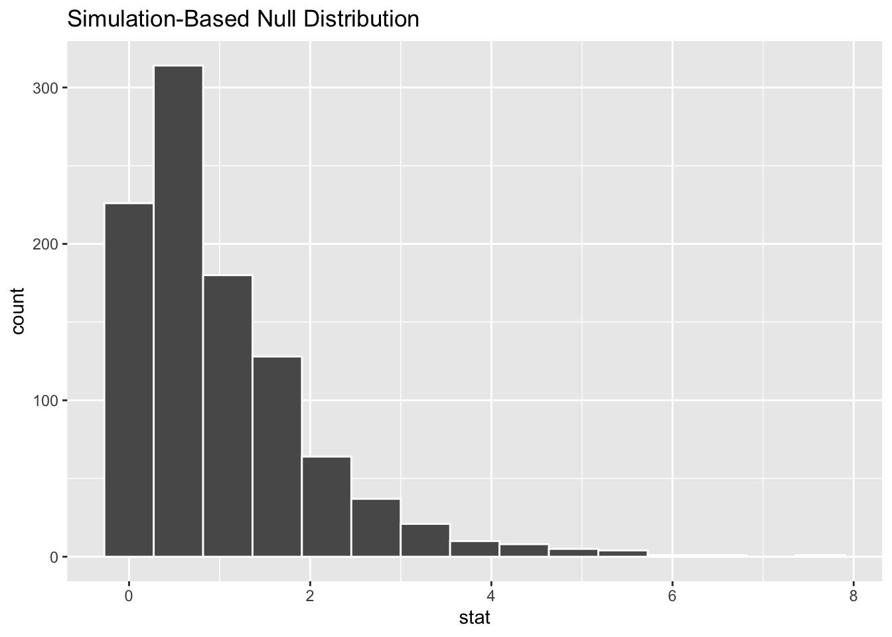
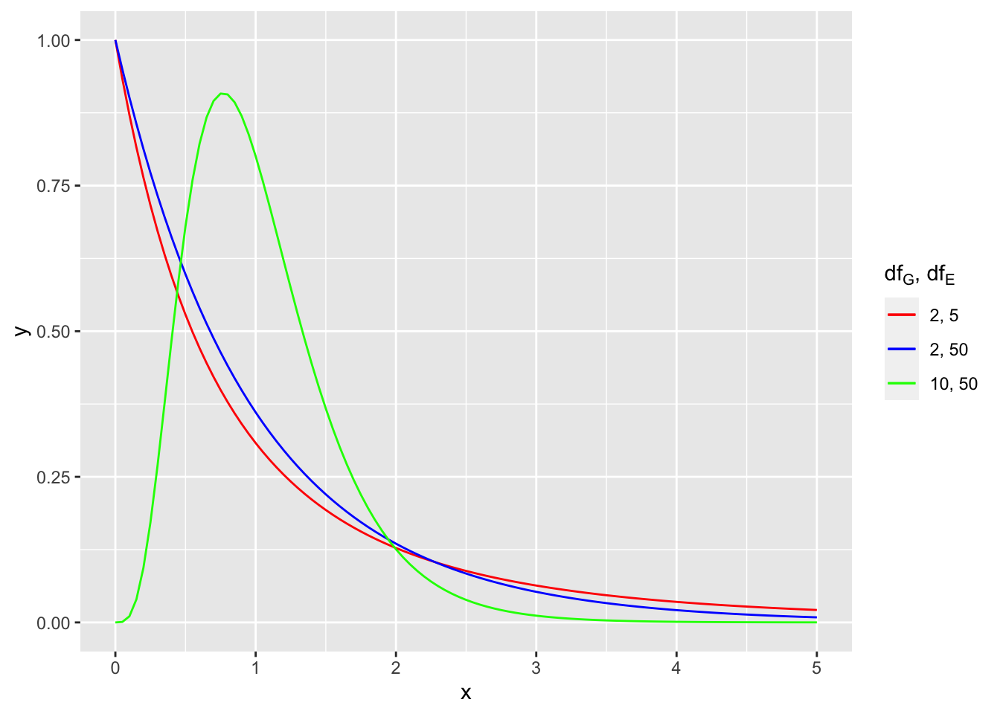
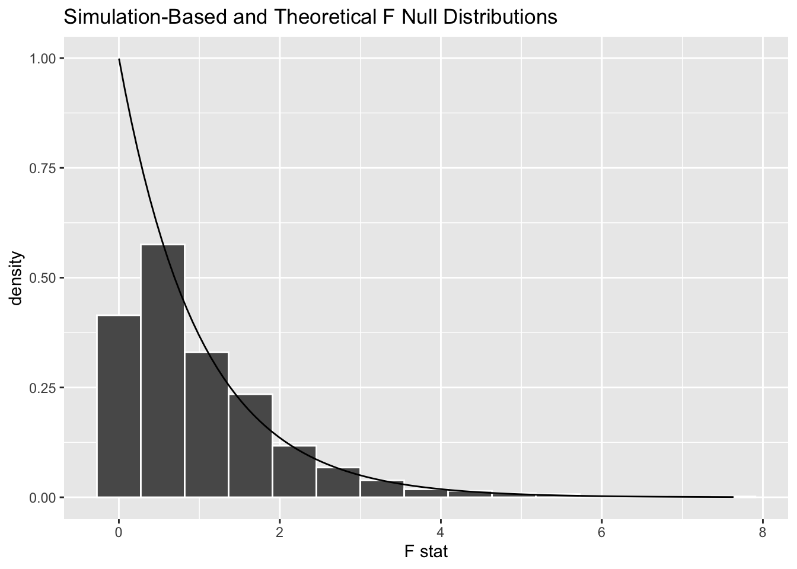
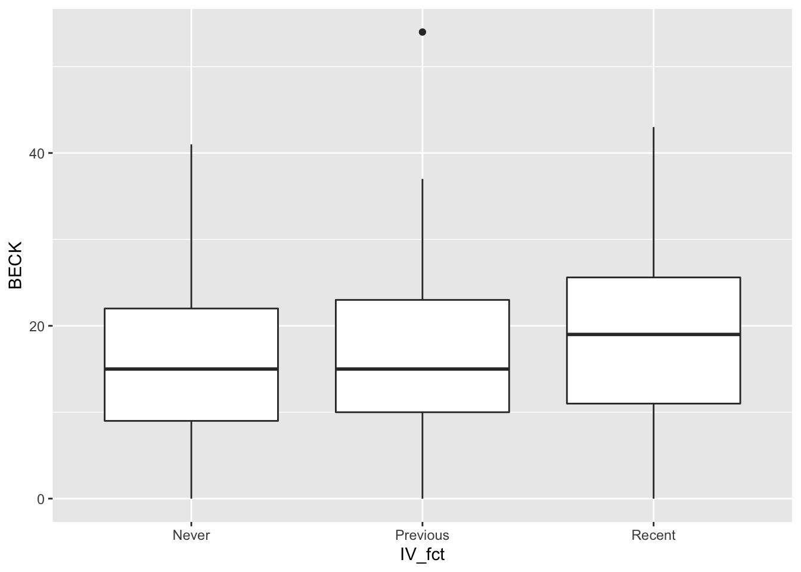
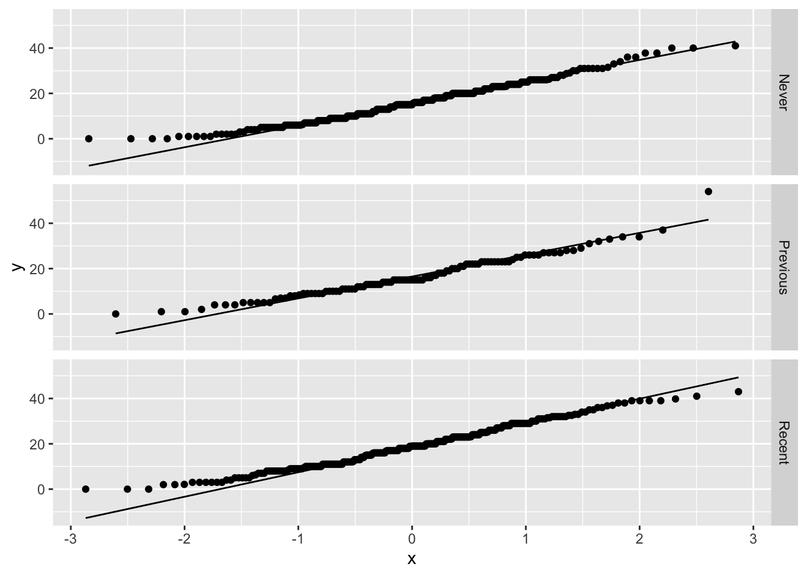
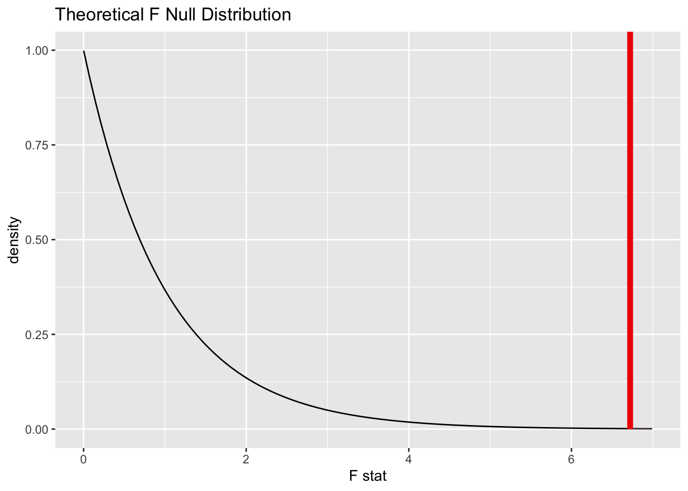

# ANOVA

<!-- Please don't mess with the next few lines! -->
<style>h5{font-size:2em;color:#0000FF}h6{font-size:1.5em;color:#0000FF}div.answer{margin-left:5%;border:1px solid #0000FF;border-left-width:10px;padding:25px} div.summary{background-color:rgba(30,144,255,0.1);border:3px double #0000FF;padding:25px}</style><p style="color:#ffffff">2.0</p>
<!-- Please don't mess with the previous few lines! -->


::: {.summary}

### Functions introduced in this chapter: {-}

No new R functions are introduced here.

:::


## Introduction

ANOVA stands for "Analysis of Variance". In this chapter, we will study the most basic form of ANOVA, called "one-way ANOVA". We've already considered the one-sample and two-sample t tests for means. ANOVA is what you do when you want to compare means for three or more groups.

### Install new packages

If you are using R and RStudio on your own machine instead of accessing RStudio Workbench through a browser, you'll need to type the following command at the Console:

```
install.packages("quantreg")
```

### Download the R notebook file

Check the upper-right corner in RStudio to make sure you're in your `intro_stats` project. Then click on the following link to download this chapter as an R notebook file (`.Rmd`).

<a href = "https://jingsai.github.io/intro_stats/chapter_downloads/22-anova.Rmd" download>https://jingsai.github.io/intro_stats/chapter_downloads/22-anova.Rmd</a>

Once the file is downloaded, move it to your project folder in RStudio and open it there.

### Restart R and run all chunks

In RStudio, select "Restart R and Run All Chunks" from the "Run" menu.


## Load packages

We load the standard `tidyverse`, `janitor`, and `infer` packages. The `quantreg` package contains the `uis` data (which must be explicitly loaded using the `data` command) and the `palmerpenguins` package for the `penguins` data.


```r
library(tidyverse)
```

```
## ── Attaching packages ─────────────────────────────────────── tidyverse 1.3.2 ──
## ✔ ggplot2 3.3.6      ✔ purrr   0.3.4 
## ✔ tibble  3.1.8      ✔ dplyr   1.0.10
## ✔ tidyr   1.2.0      ✔ stringr 1.4.1 
## ✔ readr   2.1.2      ✔ forcats 0.5.2 
## ── Conflicts ────────────────────────────────────────── tidyverse_conflicts() ──
## ✖ dplyr::filter() masks stats::filter()
## ✖ dplyr::lag()    masks stats::lag()
```

```r
library(janitor)
```

```
## 
## Attaching package: 'janitor'
## 
## The following objects are masked from 'package:stats':
## 
##     chisq.test, fisher.test
```

```r
library(infer)
library(quantreg)
```

```
## Loading required package: SparseM
## 
## Attaching package: 'SparseM'
## 
## The following object is masked from 'package:base':
## 
##     backsolve
```

```r
data(uis)
library(palmerpenguins)
```


## Research question

The `uis` data set from the `quantreg` package contains data from the UIS Drug Treatment Study. Is a history of IV drug use associated with depression?

##### Exercise 1 {-}

The help file for the `uis` data is particularly uninformative. The source, like so many we see in R packages, is a statistics textbook. If you happen to have access to a copy of the textbook, it's pretty easy to look it up and see what the authors say about it. But it's not likely you have such access.

See if you can find out more about where the data came from. This is tricky and you're going have to dig deep.

Hint #1: Your first hits will be from the University of Illinois-Springfield. That is not the correct source.

Hint #2: You may have more success finding sources that quote from the textbook and mention more detail about the data as it's explained in the textbook. In fact, you might even stumble across actual pages from the textbook with the direct explanation, but that is much harder. **You should not try to find and download PDF files of the book itself. Not only is that illegal, but it might also come along with nasty computer viruses.**

::: {.answer}

Please write up your answer here.

:::


## Data preparation and exploration

Let's look at the UIS data:


```r
uis
```

```
##      ID AGE   BECK HC IV NDT RACE TREAT SITE LEN.T TIME CENSOR        Y
## 1     1  39  9.000  4  3   1    0     1    0   123  188      1 5.236442
## 2     2  33 34.000  4  2   8    0     1    0    25   26      1 3.258097
## 3     3  33 10.000  2  3   3    0     1    0     7  207      1 5.332719
## 4     4  32 20.000  4  3   1    0     0    0    66  144      1 4.969813
## 5     5  24  5.000  2  1   5    1     1    0   173  551      0 6.311735
## 6     6  30 32.550  3  3   1    0     1    0    16   32      1 3.465736
## 7     7  39 19.000  4  3  34    0     1    0   179  459      1 6.129050
## 8     8  27 10.000  4  3   2    0     1    0    21   22      1 3.091042
## 9     9  40 29.000  2  3   3    0     1    0   176  210      1 5.347108
## 10   10  36 25.000  2  3   7    0     1    0   124  184      1 5.214936
## 11   12  38 18.900  2  3   8    0     1    0   176  212      1 5.356586
## 12   13  29 16.000  3  1   1    0     1    0    79   87      1 4.465908
## 13   14  32 36.000  3  3   2    1     1    0   182  598      0 6.393591
## 14   15  41 19.000  1  3   8    0     1    0   174  260      1 5.560682
## 15   16  31 18.000  1  3   1    0     1    0   181  210      1 5.347108
## 16   17  27 12.000  2  3   3    0     1    0    61   84      1 4.430817
## 17   18  28 34.000  1  3   6    0     1    0   177  196      1 5.278115
## 18   19  28 23.000  4  2   1    0     1    0    19   19      1 2.944439
## 19   20  36 26.000  3  1  15    1     1    0    27  441      1 6.089045
## 20   21  32 18.900  2  3   5    0     1    0   175  449      1 6.107023
## 21   22  33 15.000  3  1   1    0     0    0    12  659      0 6.490724
## 22   23  28 25.200  1  3   8    0     0    0    21   21      1 3.044522
## 23   24  29  6.632  4  2   0    0     0    0    48   53      1 3.970292
## 24   25  35  2.100  2  3   9    0     0    0    90  225      1 5.416100
## 25   26  45 26.000  1  3   6    0     0    0    91  161      1 5.081404
## 26   27  35 39.789  4  3   5    0     0    0    87   87      1 4.465908
## 27   28  24 20.000  3  1   3    0     0    0    88   89      1 4.488636
## 28   29  36 16.000  1  3   7    0     0    0     9   44      1 3.784190
## 29   31  39 22.000  1  3   9    0     0    0    94  523      0 6.259581
## 30   32  36  9.947  4  2  10    0     0    0    91  226      1 5.420535
## 31   33  37  9.450  4  3   1    0     0    0    90  259      1 5.556828
## 32   34  30 39.000  2  3   1    0     0    0    89  289      1 5.666427
## 33   35  44 41.000  1  3   5    0     0    0    89  103      1 4.634729
## 34   36  28 31.000  3  1   6    1     0    0   100  624      0 6.436150
## 35   37  25 20.000  3  1   3    1     0    0    67   68      1 4.219508
## 36   38  30  8.000  2  3   7    0     1    0    25   57      1 4.043051
## 37   39  24  9.000  4  1   1    0     0    0    12   65      1 4.174387
## 38   40  27 20.000  3  1   1    0     0    0    79   79      1 4.369448
## 39   41  30  8.000  3  1   2    1     0    0    79  559      0 6.326149
## 40   42  34  8.000  2  3   0    0     1    0    78   79      1 4.369448
## 41   43  33 23.000  4  2   2    0     1    0    84   87      1 4.465908
## 42   44  34 18.000  3  3   6    0     1    0    91   91      1 4.510860
## 43   45  36 13.000  2  3   1    0     1    0   162  297      1 5.693732
## 44   46  27 23.000  1  3   0    0     1    0    45   45      1 3.806662
## 45   47  35  9.000  4  3   1    1     1    0    61  246      1 5.505332
## 46   48  24 14.000  1  3   0    0     1    0    19   37      1 3.610918
## 47   49  28 23.000  4  1   2    1     1    0    37   37      1 3.610918
## 48   50  46 10.000  1  3   8    0     1    0    51  538      0 6.287859
## 49   51  26 11.000  3  3   1    0     1    0    60  541      0 6.293419
## 50   52  42 16.000  1  3  25    0     1    0   177  184      1 5.214936
## 51   53  30  0.000  3  1   0    0     1    0    43  122      1 4.804021
## 52   55  30 12.000  4  1   3    1     1    0    21  156      1 5.049856
## 53   56  27 21.000  2  3   2    0     0    0    88  121      1 4.795791
## 54   57  38  0.000  1  3   6    0     0    0    96  231      1 5.442418
## 55   58  48  8.000  4  3  10    0     0    0   111  111      1 4.709530
## 56   59  36 25.000  1  3  10    0     0    0    38   38      1 3.637586
## 57   60  28  6.300  3  1   7    0     0    0    15   15      1 2.708050
## 58   61  31 20.000  4  2   5    0     0    0    50   54      1 3.988984
## 59   62  28  4.000  2  3   5    0     0    0    61  127      1 4.844187
## 60   63  28 20.000  3  1   1    0     0    0    31  105      1 4.653960
## 61   64  26 17.000  2  1   2    1     0    0    11   11      1 2.397895
## 62   65  34  3.000  4  3   6    0     0    0    90  153      1 5.030438
## 63   66  26 29.000  2  3   5    0     0    0    11   11      1 2.397895
## 64   68  31 26.000  1  3   5    0     0    0    46   46      1 3.828641
## 65   69  41 12.000  1  3   0    1     0    0    38  655      0 6.484635
## 66   70  30 24.000  4  3   0    0     0    0    90  166      1 5.111988
## 67   72  39 15.750  4  3   5    0     0    0    88   95      1 4.553877
## 68   74  33  9.000  2  3  12    0     0    0    91  151      1 5.017280
## 69   75  33 18.000  4  2   6    0     0    0    85  220      1 5.393628
## 70   76  29 20.000  4  1   0    1     0    0    90  227      1 5.424950
## 71   77  36 17.000  1  3   5    0     0    0    52  343      1 5.837730
## 72   78  26  3.000  4  3   3    0     0    0    88  119      1 4.779123
## 73   79  37 27.000  1  3  13    0     0    0    43   43      1 3.761200
## 74   81  29 31.500  1  3   8    0     0    0    37   47      1 3.850148
## 75   83  30 19.000  3  1   0    1     0    0    87  805      0 6.690842
## 76   84  35 15.000  3  2   2    0     0    0    20  321      1 5.771441
## 77   85  33 22.000  3  1   1    0     0    0     9  167      1 5.117994
## 78   87  36 16.000  2  3   1    0     0    0    85  491      1 6.196444
## 79   88  28 17.000  1  3   2    0     0    0    18   35      1 3.555348
## 80   89  31 32.550  1  3  12    1     0    0    71  123      1 4.812184
## 81   90  23 24.000  1  3   2    0     0    0    88  597      0 6.391917
## 82   91  33 22.000  3  2   1    0     0    0    67  762      0 6.635947
## 83   93  37 18.000  2  3   4    0     0    0    30   31      1 3.433987
## 84   94  25 17.850  3  1   1    0     1    0    68  228      1 5.429346
## 85   95  56  5.000  2  2   9    1     1    0   182  553      0 6.315358
## 86   96  23 39.000  1  3   1    0     1    0   182  190      1 5.247024
## 87   97  26 21.000  3  1   1    0     1    0   146  307      1 5.726848
## 88   98  26 11.000  1  3   1    0     1    0    40   73      1 4.290459
## 89   99  23 14.000  3  1   1    0     1    0   177  208      1 5.337538
## 90  100  28 31.000  4  2   2    1     1    0   181  267      1 5.587249
## 91  102  30 14.000  1  3  15    0     1    0   168  169      1 5.129899
## 92  104  25  6.000  2  3   5    0     1    0    90  655      0 6.484635
## 93  105  33 16.000  1  3   5    0     1    0    61   70      1 4.248495
## 94  106  22  6.000  3  1   3    1     1    0    63  398      1 5.986452
## 95  108  25 20.000  4  2   8    1     1    0   121  122      1 4.804021
## 96  111  38  9.000  3  1   1    1     0    0    89   96      1 4.564348
## 97  112  35 11.000  2  1   3    0     1    0    51 1172      0 7.066467
## 98  113  35 15.000  3  1   1    0     0    0    88  734      0 6.598509
## 99  114  25 13.000  3  3   1    0     0    0    25   26      1 3.258097
## 100 115  33 31.000  3  1   3    1     0    0    83   84      1 4.430817
## 101 116  30  5.000  3  1   2    1     0    0    89  171      1 5.141664
## 102 117  45 10.000  2  3   1    0     0    0    24  159      1 5.068904
## 103 119  42 23.000  2  3  20    0     0    0     7    7      1 1.945910
## 104 120  29 16.000  4  1   1    1     0    0    85  763      0 6.637258
## 105 121  24 37.800  3  1   0    0     0    0    89  104      1 4.644391
## 106 122  33 10.000  2  3   4    0     0    0    91  162      1 5.087596
## 107 123  32  9.000  3  1   0    0     0    0    89   90      1 4.499810
## 108 124  26 15.000  3  1   0    0     0    0    82  373      1 5.921578
## 109 125  28  2.000  1  3   3    0     0    0    84  115      1 4.744932
## 110 127  37 34.000  2  3   1    0     0    0    30   30      1 3.401197
## 111 128  23 11.000  4  1   6    0     0    0     7    8      1 2.079442
## 112 129  40 31.000  2  3   3    1     0    0    84  168      1 5.123964
## 113 130  36 36.750  3  3   0    0     0    0    70   70      1 4.248495
## 114 131  23 26.000  3  2   2    0     0    0    76  130      1 4.867534
## 115 132  35  5.000  4  1   1    1     0    0    89  285      1 5.652489
## 116 133  25 19.000  2  3   1    0     1    0   178  569      0 6.343880
## 117 134  35 21.000  2  3   6    0     1    0    87   87      1 4.465908
## 118 135  46  1.000  4  2   0    0     1    0   175  310      1 5.736572
## 119 136  32  6.000  4  1   3    0     1    0    87   87      1 4.465908
## 120 137  35 23.000  3  1  16    1     1    0   110  544      0 6.298949
## 121 138  34 38.000  3  3   1    0     1    0    21  156      1 5.049856
## 122 139  43 24.000  3  1   3    0     1    0   139  658      0 6.489205
## 123 140  39  3.000  4  3  15    0     1    0   181  273      1 5.609472
## 124 141  27 16.800  4  3   2    1     1    0    33  168      1 5.123964
## 125 142  38 35.000  1  3   1    0     1    0    39   83      1 4.418841
## 126 143  37 11.000  2  3   7    0     1    0     4    4      1 1.386294
## 127 144  44  2.000  1  3   4    1     1    0   184  708      0 6.562444
## 128 145  25 16.000  4  1   1    1     1    0   123  137      1 4.919981
## 129 146  34 15.000  3  1   1    0     1    0   176  259      1 5.556828
## 130 147  34 11.000  3  3   2    1     1    0   174  560      0 6.327937
## 131 148  38 11.000  1  3   1    1     1    0   181  586      0 6.373320
## 132 149  24 22.000  2  3   2    1     1    0   113  190      1 5.247024
## 133 151  42 18.000  2  3   3    0     1    0   164  544      0 6.298949
## 134 153  34 29.000  4  3   1    1     0    0    84  494      1 6.202536
## 135 154  45 27.000  1  3   8    0     0    0    80  541      0 6.293419
## 136 155  40 16.000  2  3   4    0     0    0    91   94      1 4.543295
## 137 156  27  9.000  4  1   3    1     0    0    97  567      0 6.340359
## 138 157  24  0.000  4  1   3    0     0    0    51   55      1 4.007333
## 139 158  27 15.000  1  3   3    0     0    0    91   93      1 4.532599
## 140 159  34 24.000  3  1   4    0     0    0    90  276      1 5.620401
## 141 160  36  3.000  2  3   6    0     0    0    46   46      1 3.828641
## 142 162  31  9.000  3  1   1    0     0    0    76  250      1 5.521461
## 143 163  40  5.000  2  3   2    0     0    0    75  106      1 4.663439
## 144 164  40 13.000  1  3   4    1     0    0    91  552      0 6.313548
## 145 165  37 29.000  2  3   5    0     0    0    90   90      1 4.499810
## 146 166  25 11.000  4  3   6    0     0    0     3  203      1 5.313206
## 147 167  41 22.000  2  3   3    1     1    0     8   67      1 4.204693
## 148 168  22  9.000  4  1   1    0     1    0    33  559      1 6.326149
## 149 169  31 18.000  2  3   8    1     1    0    31  106      1 4.663439
## 150 170  29 40.000  1  1   1    1     1    0   174  374      1 5.924256
## 151 171  27 25.000  3  1   2    0     1    0    34  630      0 6.445720
## 152 172  22 26.000  4  2   3    0     1    0    60   61      1 4.110874
## 153 174  37 11.000  1  2   5    1     1    0    78  547      0 6.304449
## 154 175  36  6.000  3  1   2    1     1    0   182  568      0 6.342121
## 155 176  24 20.000  3  1   1    0     1    0   182  490      1 6.194405
## 156 177  28  9.000  4  1   0    1     1    0    78  222      1 5.402677
## 157 178  24  6.000  4  1   1    0     1    0    55   56      1 4.025352
## 158 179  28  0.000  3  1   2    0     1    0   223  282      1 5.641907
## 159 180  24  5.000  3  1  20    1     1    0    25   35      1 3.555348
## 160 181  24 15.000  4  1   0    0     1    0    63  603      0 6.401917
## 161 183  29 14.700  3  1   1    0     1    0   133  148      1 4.997212
## 162 184  37  3.000  1  3   5    1     1    0   154  354      1 5.869297
## 163 185  26 31.000  1  1   2    0     1    0    70  164      1 5.099866
## 164 186  29 14.000  3  2   1    0     1    0    66   94      1 4.543295
## 165 187  29 28.000  2  3   4    0     1    0    40   65      1 4.174387
## 166 188  33 18.000  4  1   1    0     1    0    75  567      0 6.340359
## 167 189  29 12.000  4  2   2    0     1    0   187  634      0 6.452049
## 168 190  32  5.000  1  1   2    1     1    0   183  633      0 6.450470
## 169 192  33 11.000  4  1   8    1     1    0   182  477      1 6.167516
## 170 193  26 21.000  4  2   2    0     1    0   192  436      1 6.077642
## 171 195  24 23.000  2  3   4    1     1    0   162  362      1 5.891644
## 172 196  46 32.000  2  3   2    0     1    0   193  552      0 6.313548
## 173 197  23 26.000  4  1   2    0     1    0   111  144      1 4.969813
## 174 198  40 19.950  4  3   8    0     1    0   182  242      1 5.488938
## 175 199  48 17.000  3  1   4    0     1    0   180  564      0 6.335054
## 176 200  33 16.000  3  1   0    0     1    0    93  299      1 5.700444
## 177 201  21 26.250  4  1   7    0     1    0   167  167      1 5.117994
## 178 202  38 29.000  3  1   2    0     1    0   196  380      1 5.940171
## 179 203  28 23.000  4  2   4    0     1    0   106  120      1 4.787492
## 180 205  39  9.000  1  3   6    0     1    0   158  218      1 5.384495
## 181 206  37 26.000  1  2   1    1     0    0    91  115      1 4.744932
## 182 207  32 22.000  3  1   4    1     0    0    89  224      1 5.411646
## 183 208  39 23.000  3  2   2    1     0    0    89  132      1 4.882802
## 184 209  28  0.000  1  3  10    0     0    0    88  148      1 4.997212
## 185 210  26 30.000  3  1   0    1     0    0    95  593      0 6.385194
## 186 211  31 21.000  1  3   0    0     0    0     5   26      1 3.258097
## 187 213  34 19.000  4  3   8    0     0    0    32   32      1 3.465736
## 188 214  26 28.000  4  2   2    1     0    0    92  292      1 5.676754
## 189 215  29  8.000  4  1   3    0     0    0    66   89      1 4.488636
## 190 217  25 11.000  3  1   8    0     0    0    90  364      1 5.897154
## 191 218  34 15.000  3  2   3    1     0    0    93  142      1 4.955827
## 192 219  32  8.000  3  1   2    0     0    0    89  188      1 5.236442
## 193 221  38 14.000  4  2   0    0     0    0    91   92      1 4.521789
## 194 222  32  7.000  1  3   8    0     0    0    56   56      1 4.025352
## 195 223  31 13.000  2  3   7    0     0    0    90  110      1 4.700480
## 196 224  40 10.000  3  1   3    0     0    0    73  555      0 6.318968
## 197 225  28 17.000  4  1   5    1     0    0    85  220      1 5.393628
## 198 226  40 18.000  1  3   3    0     0    0    23   23      1 3.135494
## 199 227  32  5.000  2  3   3    0     0    0    85  285      1 5.652489
## 200 228  29 20.000  3  3   5    0     0    0    90   90      1 4.499810
## 201 229  25 31.000  3  1   4    0     0    0    53   59      1 4.077537
## 202 230  32 15.000  2  3   2    0     0    0    96  156      1 5.049856
## 203 232  37  4.000  2  2   2    0     0    0    83  142      1 4.955827
## 204 233  38 15.000  3  3   8    0     0    0    54   57      1 4.043051
## 205 234  31 14.000  3  2   9    0     0    0    79  279      1 5.631212
## 206 235  30 27.000  1  3   3    1     0    0    81  118      1 4.770685
## 207 236  34 30.000  4  1   4    1     0    0    18  567      0 6.340359
## 208 237  33 23.000  1  3   4    0     1    0   184  562      0 6.331502
## 209 238  36 13.000  3  2  10    1     1    0    39  239      1 5.476464
## 210 239  32 26.000  4  1   0    0     1    0   177  578      0 6.359574
## 211 240  29 10.000  2  3   2    1     1    0   122  551      0 6.311735
## 212 241  32  4.000  1  1   4    1     1    0   178  313      1 5.746203
## 213 242  34  0.000  3  1   7    0     1    0   173  560      0 6.327937
## 214 243  26 35.000  1  3  31    0     1    0    53   54      1 3.988984
## 215 244  25 32.000  1  3   5    1     1    0    94  198      1 5.288267
## 216 245  30  2.000  4  1   2    1     1    0   163  164      1 5.099866
## 217 246  33 15.000  3  2   6    0     1    0   160  325      1 5.783825
## 218 247  40 23.000  4  2   6    0     1    0    61   62      1 4.127134
## 219 248  26 13.000  3  1  12    0     1    0    41   45      1 3.806662
## 220 249  26 29.000  1  3   5    1     1    0    53   53      1 3.970292
## 221 250  35 22.105  4  3   4    0     1    0    53  253      1 5.533389
## 222 251  26 15.000  2  2  11    0     1    0    13   51      1 3.931826
## 223 252  33  7.000  4  1   3    1     1    0   183  540      0 6.291569
## 224 253  27  7.000  1  3   4    0     1    0   182  317      1 5.758902
## 225 254  29 33.000  3  3   3    0     1    0   183  437      1 6.079933
## 226 255  29 23.000  3  3   9    0     1    0    63  136      1 4.912655
## 227 256  39 21.000  2  3   7    0     1    0   111  115      1 4.744932
## 228 257  43 19.000  3  2   2    1     1    0   174  175      1 5.164786
## 229 258  35  8.000  3  3   3    0     1    0   173  442      1 6.091310
## 230 259  26 24.000  4  1   2    1     1    0   119  122      1 4.804021
## 231 260  27 28.737  4  1   3    0     1    0   180  181      1 5.198497
## 232 261  28 20.000  4  1   2    1     1    0    98  180      1 5.192957
## 233 262  30 14.000  3  1   4    0     1    0    50   51      1 3.931826
## 234 263  31 17.000  4  2   1    1     1    0   178  541      0 6.293419
## 235 264  26 19.000  2  3  16    0     1    0   100  121      1 4.795791
## 236 265  36  5.000  4  2   4    0     1    0    93  328      1 5.793014
## 237 267  25  8.000  2  3   3    0     1    0   165  166      1 5.111988
## 238 268  26 22.000  3  1   0    1     1    0    93  556      0 6.320768
## 239 269  30 11.000  2  3   5    0     0    0    44  104      1 4.644391
## 240 270  28 13.000  3  1   5    0     0    0    77  102      1 4.624973
## 241 272  34 11.053  3  1   0    1     0    0    91  144      1 4.969813
## 242 273  31 24.000  3  1   2    0     0    0    95  545      0 6.300786
## 243 274  30 19.000  4  3   1    0     0    0    82  537      0 6.285998
## 244 275  35 27.000  3  2   5    1     0    0    76  625      0 6.437752
## 245 276  30  4.000  4  2   3    1     0    0     5    6      1 1.791759
## 246 277  37 38.000  1  3   7    0     0    0    69  307      1 5.726848
## 247 278  29 11.000  4  1  12    1     0    0    90  290      1 5.669881
## 248 279  23 21.000  4  1   8    0     0    0    19   20      1 2.995732
## 249 280  23  1.000  1  1   4    0     0    0    60   74      1 4.304065
## 250 281  44  4.000  4  1   0    0     0    0    69  100      1 4.605170
## 251 282  43  7.000  4  2   8    1     0    0    85  555      0 6.318968
## 252 283  38 20.000  2  3   3    0     0    0    92  152      1 5.023881
## 253 284  33 17.000  3  1   3    1     0    0    55  115      1 4.744932
## 254 285  36  6.300  1  3   9    0     0    0    20   92      1 4.521789
## 255 286  26 12.000  1  3   2    0     0    0    87  554      0 6.317165
## 256 287  30 16.000  4  1   0    0     0    0    91   92      1 4.521789
## 257 288  34 31.500  4  1   0    0     0    0     9   69      1 4.234107
## 258 289  32 30.000  2  3   6    0     0    0    22   25      1 3.218876
## 259 290  30  1.000  3  1   1    0     0    0    87  501      0 6.216606
## 260 291  37 32.000  2  3  10    1     0    0    86   86      1 4.454347
## 261 292  35 29.000  2  3   7    0     0    0    85   99      1 4.595120
## 262 293  30  6.000  3  1   0    0     0    0    83   87      1 4.465908
## 263 294  34 17.000  4  1   6    1     0    0    83  136      1 4.912655
## 264 295  40 13.000  1  2   6    0     0    0    92  106      1 4.663439
## 265 296  28 15.000  4  2   3    1     0    0    85  220      1 5.393628
## 266 297  32 11.000  3  1   6    0     0    0    36   36      1 3.583519
## 267 298  45 17.000  1  3   2    1     0    0    87  162      1 5.087596
## 268 299  24 23.000  2  1   0    0     1    0    56  116      1 4.753590
## 269 300  43 23.000  1  3   5    1     1    0    94  175      1 5.164786
## 270 301  38 15.000  1  3   0    1     1    0    74  209      1 5.342334
## 271 302  33 19.000  2  3   1    0     1    0   186  545      0 6.300786
## 272 303  26 21.000  4  2   2    1     1    0   178  245      1 5.501258
## 273 304  40  8.000  4  3   3    0     1    0    84  176      1 5.170484
## 274 305  27 34.000  4  2   0    0     1    0    13   14      1 2.639057
## 275 306  39 21.000  2  3  12    0     1    0    85  113      1 4.727388
## 276 308  29 27.000  4  2   3    1     1    0     9  354      1 5.869297
## 277 309  28 32.000  4  2   4    0     1    0   162  174      1 5.159055
## 278 310  37 29.000  1  3  20    0     0    0    23   23      1 3.135494
## 279 311  37 22.000  2  3  20    0     0    0    26   26      1 3.258097
## 280 312  40 12.000  4  2   9    0     0    0    84   98      1 4.584967
## 281 313  25 36.000  1  3   5    0     0    0    23   23      1 3.135494
## 282 314  40 15.000  1  1   2    0     0    0    86  555      0 6.318968
## 283 315  40  3.000  1  3   4    1     0    0    90  290      1 5.669881
## 284 316  34 24.000  2  3   8    0     0    0    73  543      0 6.297109
## 285 317  41 18.000  2  3   7    0     0    0    76  274      1 5.613128
## 286 321  23  2.000  4  1   1    0     1    0    18  119      1 4.779123
## 287 322  36 14.000  3  1   3    0     1    0    94  164      1 5.099866
## 288 323  28 19.000  4  1   2    1     1    0    76  548      0 6.306275
## 289 324  23  7.000  3  1   3    0     1    0    40  175      1 5.164786
## 290 325  27  8.000  3  1   3    0     1    0   176  539      0 6.289716
## 291 326  32 27.000  4  2   0    0     1    0   104  155      1 5.043425
## 292 327  38 25.000  4  3  15    0     1    0     5   14      1 2.639057
## 293 328  38 28.000  4  1   6    1     1    0   179  187      1 5.231109
## 294 329  45 39.000  1  3   8    0     1    0    35   65      1 4.174387
## 295 330  26 18.000  2  2   1    0     1    0    24  159      1 5.068904
## 296 331  29  8.000  1  3  35    0     1    0    82   96      1 4.564348
## 297 332  33 31.000  4  1   3    0     1    0    28  243      1 5.493061
## 298 333  25  6.000  3  1   0    1     1    0    81   85      1 4.442651
## 299 334  36 19.000  4  1   2    0     1    0     4    4      1 1.386294
## 300 335  37 19.000  2  3   4    0     1    0    97  121      1 4.795791
## 301 336  29 16.000  4  1   0    1     1    0    78  659      1 6.490724
## 302 337  29 15.000  4  1   3    1     1    0   181  260      1 5.560682
## 303 338  35 54.000  4  2   1    0     1    0    29  621      0 6.431331
## 304 339  33 19.000  4  1   1    0     1    0   139  199      1 5.293305
## 305 340  31 12.000  4  3   2    0     1    0   152  565      0 6.336826
## 306 341  37 24.000  3  2   5    1     1    0    90  183      1 5.209486
## 307 342  32 37.000  3  3   4    0     1    0    62  122      1 4.804021
## 308 343  33  9.000  3  2  13    0     1    0   110  170      1 5.135798
## 309 344  36 18.000  3  1  14    1     1    0    15   15      1 2.708050
## 310 345  26  4.000  1  1   5    0     1    0    68  268      1 5.590987
## 311 346  35 15.000  3  1   0    1     1    0    19   79      1 4.369448
## 312 347  25 19.000  1  3   6    1     0    0    23   23      1 3.135494
## 313 348  33 26.000  1  3  30    0     0    0    92  100      1 4.605170
## 314 349  36 28.000  2  3   8    0     0    0    94   98      1 4.584967
## 315 350  38 14.000  3  3   6    0     0    0    31   81      1 4.394449
## 316 351  36 15.000  3  2   3    1     0    0    28  546      0 6.302619
## 317 352  36 18.000  2  3  10    0     0    0    58   58      1 4.060443
## 318 353  35 29.000  3  3   6    0     0    0   113  569      0 6.343880
## 319 354  35 10.000  3  1   3    1     0    0    70  575      0 6.354370
## 320 356  39 16.000  2  3   4    0     0    0    90   91      1 4.510860
## 321 357  37  0.000  4  3   6    0     0    0    55   57      1 4.043051
## 322 358  30 31.000  2  3   5    0     0    0    89  499      1 6.212606
## 323 359  26 33.000  1  3   7    1     0    0    71  123      1 4.812184
## 324 360  39 21.000  4  1   5    0     0    0    84  143      1 4.962845
## 325 362  32 18.000  3  1   4    0     0    0    78  471      1 6.154858
## 326 363  26 37.800  3  1   4    1     0    0    60   74      1 4.304065
## 327 364  33 20.000  2  3   6    0     0    0    82   85      1 4.442651
## 328 365  36 11.000  4  2   5    0     0    0    81   95      1 4.553877
## 329 366  42 26.000  2  3   3    0     1    0    35   36      1 3.583519
## 330 367  37 43.000  1  3  22    0     1    0    16   19      1 2.944439
## 331 368  37 12.000  2  2   1    1     1    0     7   38      1 3.637586
## 332 369  32 22.000  3  1   4    1     1    0    30  539      0 6.289716
## 333 370  23 36.000  4  1   3    1     1    0   106  567      0 6.340359
## 334 371  21 16.000  4  1  10    0     1    0   174  186      1 5.225747
## 335 372  23 41.000  3  1   1    0     1    0   144  546      0 6.302619
## 336 373  34 16.000  4  2   1    0     1    0    24   24      1 3.178054
## 337 374  33  8.000  4  2   3    0     1    0    17  540      0 6.291569
## 338 375  33 10.000  3  1   4    1     1    0    97  157      1 5.056246
## 339 376  26 18.000  3  3   0    0     1    0    26   86      1 4.454347
## 340 377  28 27.000  4  1   2    1     1    0    31  231      1 5.442418
## 341 379  27 28.000  1  3   3    0     0    0    14   14      1 2.639057
## 342 380  22 23.000  1  3   2    0     0    0    75   75      1 4.317488
## 343 381  31 32.000  3  3   6    1     0    0    20  147      1 4.990433
## 344 382  29 23.100  3  1   4    0     0    0   104  105      1 4.653960
## 345 383  44 11.000  4  3  12    0     0    0    85  324      1 5.780744
## 346 384  26  7.000  3  1   0    1     0    0   110  538      0 6.287859
## 347 385  44 24.000  2  3  16    0     0    0   100  300      1 5.703782
## 348 386  34 12.000  1  3   1    0     0    0    73   73      1 4.290459
## 349 387  36 25.000  2  3   6    0     0    0    65   65      1 4.174387
## 350 388  43  4.000  2  3  20    0     0    0    75  568      1 6.342121
## 351 389  37  5.000  3  1   1    0     0    0    83   84      1 4.430817
## 352 390  44 13.000  4  2  17    0     1    0    15   22      1 3.091042
## 353 391  31 17.000  1  3  30    1     1    0    44   44      1 3.784190
## 354 392  24 24.000  2  1   3    0     1    0     7    7      1 1.945910
## 355 394  37 32.000  3  3   4    0     1    0    20   21      1 3.044522
## 356 395  41 19.000  1  3  12    1     1    0   175  537      0 6.285998
## 357 396  32  9.000  3  1   3    1     1    0    71  186      1 5.225747
## 358 397  23  6.000  3  1   2    0     1    0    26   40      1 3.688879
## 359 398  33 10.000  2  3   3    0     1    0   161  287      1 5.659482
## 360 399  43 11.000  4  1   9    0     1    0    36  538      0 6.287859
## 361 400  33 16.000  4  3   8    0     1    0    30   30      1 3.401197
## 362 401  41 25.000  4  2   3    0     1    0   179  516      1 6.246107
## 363 402  41 17.000  2  3   2    0     1    0   199  268      1 5.590987
## 364 403  37 24.000  2  3   3    0     1    0   182  568      0 6.342121
## 365 404  26 27.000  1  1   3    0     0    0   112  131      1 4.875197
## 366 405  33 24.000  1  3   6    0     0    0     8  399      1 5.988961
## 367 406  30 26.000  3  1   2    0     0    0    18   78      1 4.356709
## 368 407  33 17.000  4  1   6    1     0    0    20   80      1 4.382027
## 369 408  33 26.000  2  3   3    0     0    0    88  102      1 4.624973
## 370 410  37 13.000  3  1   6    0     0    0    88  124      1 4.820282
## 371 411  44 11.000  2  3  20    0     0    0    76   80      1 4.382027
## 372 412  20  8.000  4  1   1    0     0    0    22   23      1 3.135494
## 373 413  33 12.000  1  3   4    0     0    0   110  274      1 5.613128
## 374 415  36 31.000  2  3   3    0     0    0    85  459      1 6.129050
## 375 416  34  8.400  2  3   3    0     0    0    10   10      1 2.302585
## 376 417  35 10.000  1  3  17    0     1    0   157  176      1 5.170484
## 377 418  38 16.000  2  3  26    0     1    0   133  332      1 5.805135
## 378 419  24 13.000  3  1   3    0     1    0    83  119      1 4.779123
## 379 420  24 18.000  3  1   4    0     1    0   152  217      1 5.379897
## 380 421  32 13.000  3  1   4    0     1    0   169  285      1 5.652489
## 381 422  35 11.000  4  2   3    0     1    0    89  576      0 6.356108
## 382 423  33 21.000  1  3   5    0     1    0    92  106      1 4.663439
## 383 424  29 37.000  2  2   4    1     1    0    21   81      1 4.394449
## 384 425  42 32.000  2  3  30    0     1    0    31   47      1 3.850148
## 385 426  23 33.000  4  1   1    0     1    0    31   76      1 4.330733
## 386 427  28 11.000  4  3  16    0     1    0   133  348      1 5.852202
## 387 429  43 29.000  2  3   4    0     1    0   153  306      1 5.723585
## 388 430  33 23.000  2  1   0    0     0    0    90  192      1 5.257495
## 389 431  37 15.000  1  3  20    0     0    0   102  216      1 5.375278
## 390 432  49 22.000  2  3   7    0     0    0    85  189      1 5.241747
## 391 434  36 25.000  3  1   1    1     0    0    89  193      1 5.262690
## 392 435  27 30.000  1  3  13    0     0    0    28   28      1 3.332205
## 393 436  35 23.000  1  3   1    0     0    0    90  150      1 5.010635
## 394 437  25 10.000  3  2   3    0     0    0    84   99      1 4.595120
## 395 438  33  8.000  1  3   3    0     0    0    85  510      0 6.234411
## 396 439  34 16.000  1  3   7    0     0    0    36  306      1 5.723585
## 397 440  38  9.000  1  3  10    1     0    0    74  101      1 4.615121
## 398 441  36 12.158  2  3   0    1     0    0    42  102      1 4.624973
## 399 442  27  5.000  1  3   1    0     0    0    90  510      0 6.234411
## 400 444  40 19.000  1  3   0    1     0    0   108  503      0 6.220590
## 401 445  32 23.000  3  3   3    0     0    1    49   52      1 3.951244
## 402 446  38 28.000  3  3   1    1     0    1   219  547      0 6.304449
## 403 447  38 16.000  1  3   6    0     0    1   108  168      1 5.123964
## 404 448  23 25.000  4  1   0    0     0    1   178  461      1 6.133398
## 405 449  26 22.000  4  2   2    0     0    1    42  538      0 6.287859
## 406 450  36 28.000  2  3   7    0     0    1   182  349      1 5.855072
## 407 451  30 28.000  4  1   5    0     0    1     6   44      1 3.784190
## 408 452  31 18.000  4  2   3    0     1    1   351  548      0 6.306275
## 409 453  23 15.000  3  1   1    0     1    1    12   12      1 2.484907
## 410 454  43  9.000  1  3   0    1     1    1     6    6      1 1.791759
## 411 455  24 26.000  4  1   1    0     1    1    91  575      0 6.354370
## 412 456  42 19.000  4  1   1    0     1    1   245  589      0 6.378426
## 413 457  35 26.000  4  2   1    0     1    1   372  408      1 6.011267
## 414 458  21 10.000  4  1   0    0     1    1   218  232      1 5.446737
## 415 459  45  1.000  4  2   0    1     1    1    46  143      1 4.962845
## 416 460  43 30.000  2  3   6    0     1    1   363  582      0 6.366470
## 417 461  24  7.000  4  1   0    1     1    1   133  134      1 4.897840
## 418 462  37 11.000  3  3   1    0     1    1     7    7      1 1.945910
## 419 463  40 10.000  4  2   0    0     1    1   112  548      0 6.306275
## 420 464  27 11.000  3  2   2    0     0    1    21   81      1 4.394449
## 421 465  29 11.000  2  3   1    0     0    1   169  170      1 5.135798
## 422 466  34 12.000  4  3   6    0     0    1    28   29      1 3.367296
## 423 467  29 29.000  3  3  20    0     0    1    47   78      1 4.356709
## 424 468  35 27.000  1  3   5    0     0    1    20   81      1 4.394449
## 425 469  39 20.000  1  3   4    0     1    1   352  369      1 5.910797
## 426 470  41  9.000  4  2   0    0     1    1    66   69      1 4.234107
## 427 471  37 18.000  4  1   6    1     1    1    55  115      1 4.744932
## 428 472  30 10.000  3  2   7    0     1    1   344  361      1 5.888878
## 429 473  31  1.000  4  1   0    0     1    1   153  245      1 5.501258
## 430 474  40  5.000  4  2   8    0     0    1   184  233      1 5.451038
## 431 475  32 20.000  4  1   0    0     0    1   183  227      1 5.424950
## 432 476  32  7.000  4  2   3    1     0    1    22   97      1 4.574711
## 433 477  27  7.000  4  1   0    0     0    1   183  547      0 6.304449
## 434 478  23 26.000  3  1   0    0     0    1   140  224      1 5.411646
## 435 479  23  4.000  4  1   2    0     0    1    19  211      1 5.351858
## 436 480  43 11.000  2  3  12    0     0    1   184  220      1 5.393628
## 437 481  24 20.000  4  1   0    0     0    1    50   54      1 3.988984
## 438 482  36 11.000  4  1   2    1     0    1   132  192      1 5.257495
## 439 483  29 31.000  1  3   1    0     0    1   128  138      1 4.927254
## 440 484  39 13.000  4  2   1    0     1    1   107  107      1 4.672829
## 441 485  23  6.000  4  1   0    0     1    1   368  597      0 6.391917
## 442 486  27 17.000  3  3   4    0     1    1   219  226      1 5.420535
## 443 487  26  5.000  4  2   5    0     1    1   374  434      1 6.073045
## 444 488  26 27.000  3  1   1    1     1    1    92  106      1 4.663439
## 445 489  25  9.000  4  1   0    0     1    1    45  180      1 5.192957
## 446 490  34 10.000  3  1   0    0     1    1   366  557      0 6.322565
## 447 491  45  5.000  4  3   2    0     1    1   368  556      0 6.320768
## 448 492  23 17.000  4  1   1    0     0    1    78  619      0 6.428105
## 449 493  26  7.000  4  1   0    0     0    1   184  546      0 6.302619
## 450 495  24 27.000  1  2   2    0     0    1   187  233      1 5.451038
## 451 496  30 23.000  2  3   2    1     0    1   101  102      1 4.624973
## 452 497  22 26.000  3  1   0    0     0    1   141  548      0 6.306275
## 453 498  25 10.000  3  1   1    0     0    1    24   99      1 4.595120
## 454 499  30  8.400  3  2  40    0     0    1    36   36      1 3.583519
## 455 501  33 23.000  4  1   0    1     1    1    56   78      1 4.356709
## 456 502  34 15.000  3  2   8    0     1    1   367  502      1 6.218600
## 457 503  29 24.000  3  1   2    0     1    1    70   71      1 4.262680
## 458 504  39 33.000  4  2   6    0     1    1    58   59      1 4.077537
## 459 506  26 21.000  3  1   4    0     1    1   366  533      0 6.278521
## 460 507  32 23.000  2  3   6    0     1    1    10   10      1 2.302585
## 461 508  42 23.100  1  3   2    0     0    1   214  274      1 5.613128
## 462 509  39 25.000  1  2   8    0     0    1   197  255      1 5.541264
## 463 510  36  2.000  4  1   0    1     0    1    89  503      0 6.220590
## 464 511  22 20.000  3  1   1    0     0    1    56  256      1 5.545177
## 465 512  27 23.000  4  1   1    0     0    1     9    9      1 2.197225
## 466 514  28  9.000  4  1   0    0     0    1   186  386      1 5.955837
## 467 515  36 28.000  3  2   1    0     1    1   303  547      0 6.304449
## 468 516  31 13.000  3  1   3    0     1    1    32   45      1 3.806662
## 469 517  27 22.000  3  2   4    0     1    1     8   58      1 4.060443
## 470 518  23 17.000  3  1   1    0     1    1    63  124      1 4.820282
## 471 519  24 20.000  3  2  20    0     0    1   108  540      0 6.291569
## 472 520  38  5.000  3  2   1    0     0    1   183  243      1 5.493061
## 473 521  25  8.000  4  1   1    0     1    1   151  549      0 6.308098
## 474 522  26 20.000  3  1   0    0     0    1     7   12      1 2.484907
## 475 523  22 34.000  3  1   2    0     0    1    38   51      1 3.931826
## 476 524  33 13.000  4  1   2    0     1    1   176  562      0 6.331502
## 477 525  30 23.000  1  3   7    0     1    1    93   94      1 4.543295
## 478 526  45  8.000  4  3   3    0     0    1   200  204      1 5.318120
## 479 527  24 15.000  3  2   0    0     0    1   178  238      1 5.472271
## 480 528  27 22.000  4  1   0    0     1    1    78  140      1 4.941642
## 481 529  36 19.000  4  2  10    0     1    1   119  120      1 4.787492
## 482 530  38 23.000  4  2   2    1     0    1   154  154      1 5.036953
## 483 531  31 17.000  2  3   2    0     1    1   163  177      1 5.176150
## 484 532  40 22.000  4  2   7    0     1    1   118  119      1 4.779123
## 485 533  22 12.000  3  1   0    1     1    1    76   83      1 4.418841
## 486 534  31 13.000  4  1   0    1     1    1   116  130      1 4.867534
## 487 536  39  7.000  3  3   3    1     0    1    88  159      1 5.068904
## 488 538  33 14.000  3  1   1    0     0    1    33   33      1 3.496508
## 489 539  27 10.000  3  3   2    0     1    1    70   72      1 4.276666
## 490 540  37  7.000  4  1   2    1     1    1    68  161      1 5.081404
## 491 541  35 16.000  4  2  25    0     0    1   191  191      1 5.252273
## 492 542  25 11.000  3  1   5    0     0    1    35  181      1 5.198497
## 493 543  27 11.000  3  1   1    1     1    1    32  546      0 6.302619
## 494 544  34 15.000  4  1   0    0     0    1    28  540      0 6.291569
## 495 545  30 15.000  3  1   3    0     0    1    15   76      1 4.330733
## 496 546  35 17.000  1  3   7    0     0    1     7    7      1 1.945910
## 497 547  34 23.000  4  1   0    0     0    1    43   44      1 3.784190
## 498 548  25 23.000  3  2   5    0     0    1    89  103      1 4.634729
## 499 549  34 18.000  3  1   1    0     0    1    38   79      1 4.369448
## 500 550  24 23.000  4  3   3    0     0    1   204  339      1 5.826000
## 501 551  24 20.000  4  1   2    0     0    1    76   90      1 4.499810
## 502 552  40 36.000  4  1   3    0     0    1   195  542      0 6.295266
## 503 553  33  9.000  3  1   1    1     0    1   184  384      1 5.950643
## 504 554  38 14.000  4  2   1    1     1    1   254  255      1 5.541264
## 505 555  32  1.000  3  1   0    0     1    1   371  431      1 6.066108
## 506 556  33  3.000  4  1   1    0     0    1   196  587      0 6.375025
## 507 557  28 40.000  3  1   2    1     0    1   198  198      1 5.288267
## 508 558  31 13.000  3  3   2    0     0    1   170  551      0 6.311735
## 509 559  31 39.000  2  3   4    0     1    1    50  110      1 4.700480
## 510 560  33 24.000  4  1   0    0     1    1   163  541      0 6.293419
## 511 561  24 26.000  3  1  11    0     0    1   182  242      1 5.488938
## 512 562  26 18.000  3  1   3    0     0    1   150  537      0 6.285998
## 513 563  31 19.000  2  3   7    0     1    1    34   56      1 4.025352
## 514 564  40 14.700  2  3   4    0     1    1    34   34      1 3.526361
## 515 566  34  2.000  3  1   3    0     1    1   366  549      0 6.308098
## 516 567  30 11.000  3  2   7    0     0    1   133  133      1 4.890349
## 517 568  36  0.000  3  2   3    0     0    1    69  226      1 5.420535
## 518 569  38 17.000  2  3   6    0     1    1   366  401      1 5.993961
## 519 570  31 20.000  1  3   6    1     1    1    14   14      1 2.639057
## 520 571  27 22.000  2  2   2    0     0    1   184  548      0 6.306275
## 521 572  32 21.000  1  3  15    0     1    1    89  224      1 5.411646
## 522 573  35 23.000  3  1   5    1     0    1   183  540      0 6.291569
## 523 574  44 29.000  2  3  13    0     0    1   177  237      1 5.468060
## 524 575  31  5.000  2  3  10    0     1    1   154  354      1 5.869297
## 525 576  28 23.000  3  2  20    0     0    1   123  123      1 4.812184
## 526 577  40  8.000  4  2   1    0     0    1   146  170      1 5.135798
## 527 578  25 12.000  3  1  10    1     1    1   203  203      1 5.313206
## 528 579  32 10.000  1  3   6    0     1    1   360  360      1 5.886104
## 529 580  29 15.750  4  1   2    0     0    1    79  139      1 4.934474
## 530 581  40  2.000  2  2   5    0     1    1   201  215      1 5.370638
## 531 582  27  9.000  4  2   0    0     1    1   129  129      1 4.859812
## 532 583  26  2.000  3  1   1    0     1    1   365  396      1 5.981414
## 533 584  34 15.000  3  1   4    1     1    1   159  547      0 6.304449
## 534 585  49  4.000  4  2   2    0     0    1   177  547      0 6.304449
## 535 586  21 25.000  1  3   1    0     1    1    71   71      1 4.262680
## 536 587  39 23.000  3  3   2    0     1    1   108  168      1 5.123964
## 537 588  33 15.000  4  2   4    0     1    1   198  228      1 5.429346
## 538 589  32  3.000  3  1   1    0     1    1   372  551      0 6.311735
## 539 590  35  9.000  4  2   6    0     0    1    25  654      0 6.483107
## 540 591  31 20.000  4  1   0    1     1    1    48   51      1 3.931826
## 541 592  28  5.000  4  1   3    0     0    1   191  548      0 6.306275
## 542 593  27 29.000  3  2   5    0     1    1   171  231      1 5.442418
## 543 594  29 21.000  2  1   1    1     1    1   145  280      1 5.634790
## 544 595  30  1.000  2  1  20    0     0    1   183  184      1 5.214936
## 545 596  27 18.000  4  1   3    1     0    1    72   86      1 4.454347
## 546 598  40 15.000  4  2   1    0     1    1    44   46      1 3.828641
## 547 599  37 20.000  3  1   2    1     1    1   140  200      1 5.298317
## 548 600  33 10.000  4  1   0    0     0    1   184  244      1 5.497168
## 549 601  28 20.000  4  1   2    0     0    1    94  182      1 5.204007
## 550 602  40 15.000  4  2   8    0     1    1   296  296      1 5.690359
## 551 603  48 20.000  4  1   0    1     0    1    23   24      1 3.178054
## 552 604  38 25.000  3  1   1    0     0    1   128  142      1 4.955827
## 553 605  35 13.000  4  1   0    0     0    1   106  120      1 4.787492
## 554 606  37 13.000  4  2   0    0     0    1    46   47      1 3.850148
## 555 607  25 15.000  3  1   0    1     1    1   150  519      1 6.251904
## 556 608  26  8.000  4  1   2    0     1    1    48  248      1 5.513429
## 557 609  30  9.000  3  3   3    0     0    1    29   31      1 3.433987
## 558 610  28 16.000  4  2   2    0     0    1   179  567      0 6.340359
## 559 611  23 11.000  2  3   4    0     0    1   170  353      1 5.866468
## 560 612  36 31.000  4  1   1    0     1    1   365  458      1 6.126869
## 561 613  36 13.000  4  2   4    0     1    1   400  554      0 6.317165
## 562 614  24  5.000  4  1   0    1     0    1    56  116      1 4.753590
## 563 615  33  9.000  3  2   5    0     0    1    24   74      1 4.304065
## 564 616  38 15.000  4  2   6    0     0    1    10   10      1 2.302585
## 565 617  41 20.000  3  3  21    0     1    1   354  355      1 5.872118
## 566 618  31 21.000  3  1   0    1     1    1   232  232      1 5.446737
## 567 619  31 23.000  4  2  11    0     1    1    54   68      1 4.219508
## 568 620  37  5.000  4  1   0    1     1    1    48   48      1 3.871201
## 569 621  37 17.000  4  2   4    1     0    1    57   60      1 4.094345
## 570 622  33 13.000  4  1   0    0     0    1    46   50      1 3.912023
## 571 624  53  9.000  4  2   6    0     0    1    39  126      1 4.836282
## 572 625  37 20.000  2  3   4    0     0    1    17   18      1 2.890372
## 573 626  28 10.000  4  2   3    0     1    1    21   35      1 3.555348
## 574 627  35 17.000  1  3   2    0     0    1   184  379      1 5.937536
## 575 628  46 31.500  1  3  15    1     1    1     9  377      1 5.932245
##            ND1          ND2      LNDT       FRAC IV3
## 1    5.0000000  -8.04718956 0.6931472 0.68333333   1
## 2    1.1111111  -0.11706724 2.1972246 0.13888889   0
## 3    2.5000000  -2.29072683 1.3862944 0.03888889   1
## 4    5.0000000  -8.04718956 0.6931472 0.73333333   1
## 5    1.6666667  -0.85137604 1.7917595 0.96111111   0
## 6    5.0000000  -8.04718956 0.6931472 0.08888889   1
## 7    0.2857143   0.35793228 3.5553481 0.99444444   1
## 8    3.3333333  -4.01324268 1.0986123 0.11666667   1
## 9    2.5000000  -2.29072683 1.3862944 0.97777778   1
## 10   1.2500000  -0.27892944 2.0794415 0.68888889   1
## 11   1.1111111  -0.11706724 2.1972246 0.97777778   1
## 12   5.0000000  -8.04718956 0.6931472 0.43888889   0
## 13   3.3333333  -4.01324268 1.0986123 1.01111111   1
## 14   1.1111111  -0.11706724 2.1972246 0.96666667   1
## 15   5.0000000  -8.04718956 0.6931472 1.00555556   1
## 16   2.5000000  -2.29072683 1.3862944 0.33888889   1
## 17   1.4285714  -0.50953563 1.9459101 0.98333333   1
## 18   5.0000000  -8.04718956 0.6931472 0.10555556   0
## 19   0.6250000   0.29375227 2.7725887 0.15000000   0
## 20   1.6666667  -0.85137604 1.7917595 0.97222222   1
## 21   5.0000000  -8.04718956 0.6931472 0.13333333   0
## 22   1.1111111  -0.11706724 2.1972246 0.23333333   1
## 23  10.0000000 -23.02585093 0.0000000 0.53333333   0
## 24   1.0000000   0.00000000 2.3025851 1.00000000   1
## 25   1.4285714  -0.50953563 1.9459101 1.01111111   1
## 26   1.6666667  -0.85137604 1.7917595 0.96666667   1
## 27   2.5000000  -2.29072683 1.3862944 0.97777778   0
## 28   1.2500000  -0.27892944 2.0794415 0.10000000   1
## 29   1.0000000   0.00000000 2.3025851 1.04444444   1
## 30   0.9090909   0.08664562 2.3978953 1.01111111   0
## 31   5.0000000  -8.04718956 0.6931472 1.00000000   1
## 32   5.0000000  -8.04718956 0.6931472 0.98888889   1
## 33   1.6666667  -0.85137604 1.7917595 0.98888889   1
## 34   1.4285714  -0.50953563 1.9459101 1.11111111   0
## 35   2.5000000  -2.29072683 1.3862944 0.74444444   0
## 36   1.2500000  -0.27892944 2.0794415 0.13888889   1
## 37   5.0000000  -8.04718956 0.6931472 0.13333333   0
## 38   5.0000000  -8.04718956 0.6931472 0.87777778   0
## 39   3.3333333  -4.01324268 1.0986123 0.87777778   0
## 40  10.0000000 -23.02585093 0.0000000 0.43333333   1
## 41   3.3333333  -4.01324268 1.0986123 0.46666667   0
## 42   1.4285714  -0.50953563 1.9459101 0.50555556   1
## 43   5.0000000  -8.04718956 0.6931472 0.90000000   1
## 44  10.0000000 -23.02585093 0.0000000 0.25000000   1
## 45   5.0000000  -8.04718956 0.6931472 0.33888889   1
## 46  10.0000000 -23.02585093 0.0000000 0.10555556   1
## 47   3.3333333  -4.01324268 1.0986123 0.20555556   0
## 48   1.1111111  -0.11706724 2.1972246 0.28333333   1
## 49   5.0000000  -8.04718956 0.6931472 0.33333333   1
## 50   0.3846154   0.36750440 3.2580965 0.98333333   1
## 51  10.0000000 -23.02585093 0.0000000 0.23888889   0
## 52   2.5000000  -2.29072683 1.3862944 0.11666667   0
## 53   3.3333333  -4.01324268 1.0986123 0.97777778   1
## 54   1.4285714  -0.50953563 1.9459101 1.06666667   1
## 55   0.9090909   0.08664562 2.3978953 1.23333333   1
## 56   0.9090909   0.08664562 2.3978953 0.42222222   1
## 57   1.2500000  -0.27892944 2.0794415 0.16666667   0
## 58   1.6666667  -0.85137604 1.7917595 0.55555556   0
## 59   1.6666667  -0.85137604 1.7917595 0.67777778   1
## 60   5.0000000  -8.04718956 0.6931472 0.34444444   0
## 61   3.3333333  -4.01324268 1.0986123 0.12222222   0
## 62   1.4285714  -0.50953563 1.9459101 1.00000000   1
## 63   1.6666667  -0.85137604 1.7917595 0.12222222   1
## 64   1.6666667  -0.85137604 1.7917595 0.51111111   1
## 65  10.0000000 -23.02585093 0.0000000 0.42222222   1
## 66  10.0000000 -23.02585093 0.0000000 1.00000000   1
## 67   1.6666667  -0.85137604 1.7917595 0.97777778   1
## 68   0.7692308   0.20181866 2.5649494 1.01111111   1
## 69   1.4285714  -0.50953563 1.9459101 0.94444444   0
## 70  10.0000000 -23.02585093 0.0000000 1.00000000   0
## 71   1.6666667  -0.85137604 1.7917595 0.57777778   1
## 72   2.5000000  -2.29072683 1.3862944 0.97777778   1
## 73   0.7142857   0.24033731 2.6390573 0.47777778   1
## 74   1.1111111  -0.11706724 2.1972246 0.41111111   1
## 75  10.0000000 -23.02585093 0.0000000 0.96666667   0
## 76   3.3333333  -4.01324268 1.0986123 0.22222222   0
## 77   5.0000000  -8.04718956 0.6931472 0.10000000   0
## 78   5.0000000  -8.04718956 0.6931472 0.94444444   1
## 79   3.3333333  -4.01324268 1.0986123 0.20000000   1
## 80   0.7692308   0.20181866 2.5649494 0.78888889   1
## 81   3.3333333  -4.01324268 1.0986123 0.97777778   1
## 82   5.0000000  -8.04718956 0.6931472 0.74444444   0
## 83   2.0000000  -1.38629436 1.6094379 0.33333333   1
## 84   5.0000000  -8.04718956 0.6931472 0.37777778   0
## 85   1.0000000   0.00000000 2.3025851 1.01111111   0
## 86   5.0000000  -8.04718956 0.6931472 1.01111111   1
## 87   5.0000000  -8.04718956 0.6931472 0.81111111   0
## 88   5.0000000  -8.04718956 0.6931472 0.22222222   1
## 89   5.0000000  -8.04718956 0.6931472 0.98333333   0
## 90   3.3333333  -4.01324268 1.0986123 1.00555556   0
## 91   0.6250000   0.29375227 2.7725887 0.93333333   1
## 92   1.6666667  -0.85137604 1.7917595 0.50000000   1
## 93   1.6666667  -0.85137604 1.7917595 0.33888889   1
## 94   2.5000000  -2.29072683 1.3862944 0.35000000   0
## 95   1.1111111  -0.11706724 2.1972246 0.67222222   0
## 96   5.0000000  -8.04718956 0.6931472 0.98888889   0
## 97   2.5000000  -2.29072683 1.3862944 0.28333333   0
## 98   5.0000000  -8.04718956 0.6931472 0.97777778   0
## 99   5.0000000  -8.04718956 0.6931472 0.27777778   1
## 100  2.5000000  -2.29072683 1.3862944 0.92222222   0
## 101  3.3333333  -4.01324268 1.0986123 0.98888889   0
## 102  5.0000000  -8.04718956 0.6931472 0.26666667   1
## 103  0.4761905   0.35330350 3.0445224 0.07777778   1
## 104  5.0000000  -8.04718956 0.6931472 0.94444444   0
## 105 10.0000000 -23.02585093 0.0000000 0.98888889   0
## 106  2.0000000  -1.38629436 1.6094379 1.01111111   1
## 107 10.0000000 -23.02585093 0.0000000 0.98888889   0
## 108 10.0000000 -23.02585093 0.0000000 0.91111111   0
## 109  2.5000000  -2.29072683 1.3862944 0.93333333   1
## 110  5.0000000  -8.04718956 0.6931472 0.33333333   1
## 111  1.4285714  -0.50953563 1.9459101 0.07777778   0
## 112  2.5000000  -2.29072683 1.3862944 0.93333333   1
## 113 10.0000000 -23.02585093 0.0000000 0.77777778   1
## 114  3.3333333  -4.01324268 1.0986123 0.84444444   0
## 115  5.0000000  -8.04718956 0.6931472 0.98888889   0
## 116  5.0000000  -8.04718956 0.6931472 0.98888889   1
## 117  1.4285714  -0.50953563 1.9459101 0.48333333   1
## 118 10.0000000 -23.02585093 0.0000000 0.97222222   0
## 119  2.5000000  -2.29072683 1.3862944 0.48333333   0
## 120  0.5882353   0.31213427 2.8332133 0.61111111   0
## 121  5.0000000  -8.04718956 0.6931472 0.11666667   1
## 122  2.5000000  -2.29072683 1.3862944 0.77222222   0
## 123  0.6250000   0.29375227 2.7725887 1.00555556   1
## 124  3.3333333  -4.01324268 1.0986123 0.18333333   1
## 125  5.0000000  -8.04718956 0.6931472 0.21666667   1
## 126  1.2500000  -0.27892944 2.0794415 0.02222222   1
## 127  2.0000000  -1.38629436 1.6094379 1.02222222   1
## 128  5.0000000  -8.04718956 0.6931472 0.68333333   0
## 129  5.0000000  -8.04718956 0.6931472 0.97777778   0
## 130  3.3333333  -4.01324268 1.0986123 0.96666667   1
## 131  5.0000000  -8.04718956 0.6931472 1.00555556   1
## 132  3.3333333  -4.01324268 1.0986123 0.62777778   1
## 133  2.5000000  -2.29072683 1.3862944 0.91111111   1
## 134  5.0000000  -8.04718956 0.6931472 0.93333333   1
## 135  1.1111111  -0.11706724 2.1972246 0.88888889   1
## 136  2.0000000  -1.38629436 1.6094379 1.01111111   1
## 137  2.5000000  -2.29072683 1.3862944 1.07777778   0
## 138  2.5000000  -2.29072683 1.3862944 0.56666667   0
## 139  2.5000000  -2.29072683 1.3862944 1.01111111   1
## 140  2.0000000  -1.38629436 1.6094379 1.00000000   0
## 141  1.4285714  -0.50953563 1.9459101 0.51111111   1
## 142  5.0000000  -8.04718956 0.6931472 0.84444444   0
## 143  3.3333333  -4.01324268 1.0986123 0.83333333   1
## 144  2.0000000  -1.38629436 1.6094379 1.01111111   1
## 145  1.6666667  -0.85137604 1.7917595 1.00000000   1
## 146  1.4285714  -0.50953563 1.9459101 0.03333333   1
## 147  2.5000000  -2.29072683 1.3862944 0.04444444   1
## 148  5.0000000  -8.04718956 0.6931472 0.18333333   0
## 149  1.1111111  -0.11706724 2.1972246 0.17222222   1
## 150  5.0000000  -8.04718956 0.6931472 0.96666667   0
## 151  3.3333333  -4.01324268 1.0986123 0.18888889   0
## 152  2.5000000  -2.29072683 1.3862944 0.33333333   0
## 153  1.6666667  -0.85137604 1.7917595 0.43333333   0
## 154  3.3333333  -4.01324268 1.0986123 1.01111111   0
## 155  5.0000000  -8.04718956 0.6931472 1.01111111   0
## 156 10.0000000 -23.02585093 0.0000000 0.43333333   0
## 157  5.0000000  -8.04718956 0.6931472 0.30555556   0
## 158  3.3333333  -4.01324268 1.0986123 1.23888889   0
## 159  0.4761905   0.35330350 3.0445224 0.13888889   0
## 160 10.0000000 -23.02585093 0.0000000 0.35000000   0
## 161  5.0000000  -8.04718956 0.6931472 0.73888889   0
## 162  1.6666667  -0.85137604 1.7917595 0.85555556   1
## 163  3.3333333  -4.01324268 1.0986123 0.38888889   0
## 164  5.0000000  -8.04718956 0.6931472 0.36666667   0
## 165  2.0000000  -1.38629436 1.6094379 0.22222222   1
## 166  5.0000000  -8.04718956 0.6931472 0.41666667   0
## 167  3.3333333  -4.01324268 1.0986123 1.03888889   0
## 168  3.3333333  -4.01324268 1.0986123 1.01666667   0
## 169  1.1111111  -0.11706724 2.1972246 1.01111111   0
## 170  3.3333333  -4.01324268 1.0986123 1.06666667   0
## 171  2.0000000  -1.38629436 1.6094379 0.90000000   1
## 172  3.3333333  -4.01324268 1.0986123 1.07222222   1
## 173  3.3333333  -4.01324268 1.0986123 0.61666667   0
## 174  1.1111111  -0.11706724 2.1972246 1.01111111   1
## 175  2.0000000  -1.38629436 1.6094379 1.00000000   0
## 176 10.0000000 -23.02585093 0.0000000 0.51666667   0
## 177  1.2500000  -0.27892944 2.0794415 0.92777778   0
## 178  3.3333333  -4.01324268 1.0986123 1.08888889   0
## 179  2.0000000  -1.38629436 1.6094379 0.58888889   0
## 180  1.4285714  -0.50953563 1.9459101 0.87777778   1
## 181  5.0000000  -8.04718956 0.6931472 1.01111111   0
## 182  2.0000000  -1.38629436 1.6094379 0.98888889   0
## 183  3.3333333  -4.01324268 1.0986123 0.98888889   0
## 184  0.9090909   0.08664562 2.3978953 0.97777778   1
## 185 10.0000000 -23.02585093 0.0000000 1.05555556   0
## 186 10.0000000 -23.02585093 0.0000000 0.05555556   1
## 187  1.1111111  -0.11706724 2.1972246 0.35555556   1
## 188  3.3333333  -4.01324268 1.0986123 1.02222222   0
## 189  2.5000000  -2.29072683 1.3862944 0.73333333   0
## 190  1.1111111  -0.11706724 2.1972246 1.00000000   0
## 191  2.5000000  -2.29072683 1.3862944 1.03333333   0
## 192  3.3333333  -4.01324268 1.0986123 0.98888889   0
## 193 10.0000000 -23.02585093 0.0000000 1.01111111   0
## 194  1.1111111  -0.11706724 2.1972246 0.62222222   1
## 195  1.2500000  -0.27892944 2.0794415 1.00000000   1
## 196  2.5000000  -2.29072683 1.3862944 0.81111111   0
## 197  1.6666667  -0.85137604 1.7917595 0.94444444   0
## 198  2.5000000  -2.29072683 1.3862944 0.25555556   1
## 199  2.5000000  -2.29072683 1.3862944 0.94444444   1
## 200  1.6666667  -0.85137604 1.7917595 1.00000000   1
## 201  2.0000000  -1.38629436 1.6094379 0.58888889   0
## 202  3.3333333  -4.01324268 1.0986123 1.06666667   1
## 203  3.3333333  -4.01324268 1.0986123 0.92222222   0
## 204  1.1111111  -0.11706724 2.1972246 0.60000000   1
## 205  1.0000000   0.00000000 2.3025851 0.87777778   0
## 206  2.5000000  -2.29072683 1.3862944 0.90000000   1
## 207  2.0000000  -1.38629436 1.6094379 0.20000000   0
## 208  2.0000000  -1.38629436 1.6094379 1.02222222   1
## 209  0.9090909   0.08664562 2.3978953 0.21666667   0
## 210 10.0000000 -23.02585093 0.0000000 0.98333333   0
## 211  3.3333333  -4.01324268 1.0986123 0.67777778   1
## 212  2.0000000  -1.38629436 1.6094379 0.98888889   0
## 213  1.2500000  -0.27892944 2.0794415 0.96111111   0
## 214  0.3125000   0.36348463 3.4657359 0.29444444   1
## 215  1.6666667  -0.85137604 1.7917595 0.52222222   1
## 216  3.3333333  -4.01324268 1.0986123 0.90555556   0
## 217  1.4285714  -0.50953563 1.9459101 0.88888889   0
## 218  1.4285714  -0.50953563 1.9459101 0.33888889   0
## 219  0.7692308   0.20181866 2.5649494 0.22777778   0
## 220  1.6666667  -0.85137604 1.7917595 0.29444444   1
## 221  2.0000000  -1.38629436 1.6094379 0.29444444   1
## 222  0.8333333   0.15193463 2.4849066 0.07222222   0
## 223  2.5000000  -2.29072683 1.3862944 1.01666667   0
## 224  2.0000000  -1.38629436 1.6094379 1.01111111   1
## 225  2.5000000  -2.29072683 1.3862944 1.01666667   1
## 226  1.0000000   0.00000000 2.3025851 0.35000000   1
## 227  1.2500000  -0.27892944 2.0794415 0.61666667   1
## 228  3.3333333  -4.01324268 1.0986123 0.96666667   0
## 229  2.5000000  -2.29072683 1.3862944 0.96111111   1
## 230  3.3333333  -4.01324268 1.0986123 0.66111111   0
## 231  2.5000000  -2.29072683 1.3862944 1.00000000   0
## 232  3.3333333  -4.01324268 1.0986123 0.54444444   0
## 233  2.0000000  -1.38629436 1.6094379 0.27777778   0
## 234  5.0000000  -8.04718956 0.6931472 0.98888889   0
## 235  0.5882353   0.31213427 2.8332133 0.55555556   1
## 236  2.0000000  -1.38629436 1.6094379 0.51666667   0
## 237  2.5000000  -2.29072683 1.3862944 0.91666667   1
## 238 10.0000000 -23.02585093 0.0000000 0.51666667   0
## 239  1.6666667  -0.85137604 1.7917595 0.48888889   1
## 240  1.6666667  -0.85137604 1.7917595 0.85555556   0
## 241 10.0000000 -23.02585093 0.0000000 1.01111111   0
## 242  3.3333333  -4.01324268 1.0986123 1.05555556   0
## 243  5.0000000  -8.04718956 0.6931472 0.91111111   1
## 244  1.6666667  -0.85137604 1.7917595 0.84444444   0
## 245  2.5000000  -2.29072683 1.3862944 0.05555556   0
## 246  1.2500000  -0.27892944 2.0794415 0.76666667   1
## 247  0.7692308   0.20181866 2.5649494 1.00000000   0
## 248  1.1111111  -0.11706724 2.1972246 0.21111111   0
## 249  2.0000000  -1.38629436 1.6094379 0.66666667   0
## 250 10.0000000 -23.02585093 0.0000000 0.76666667   0
## 251  1.1111111  -0.11706724 2.1972246 0.94444444   0
## 252  2.5000000  -2.29072683 1.3862944 1.02222222   1
## 253  2.5000000  -2.29072683 1.3862944 0.61111111   0
## 254  1.0000000   0.00000000 2.3025851 0.22222222   1
## 255  3.3333333  -4.01324268 1.0986123 0.96666667   1
## 256 10.0000000 -23.02585093 0.0000000 1.01111111   0
## 257 10.0000000 -23.02585093 0.0000000 0.10000000   0
## 258  1.4285714  -0.50953563 1.9459101 0.24444444   1
## 259  5.0000000  -8.04718956 0.6931472 0.96666667   0
## 260  0.9090909   0.08664562 2.3978953 0.95555556   1
## 261  1.2500000  -0.27892944 2.0794415 0.94444444   1
## 262 10.0000000 -23.02585093 0.0000000 0.92222222   0
## 263  1.4285714  -0.50953563 1.9459101 0.92222222   0
## 264  1.4285714  -0.50953563 1.9459101 1.02222222   0
## 265  2.5000000  -2.29072683 1.3862944 0.94444444   0
## 266  1.4285714  -0.50953563 1.9459101 0.40000000   0
## 267  3.3333333  -4.01324268 1.0986123 0.96666667   1
## 268 10.0000000 -23.02585093 0.0000000 0.31111111   0
## 269  1.6666667  -0.85137604 1.7917595 0.52222222   1
## 270 10.0000000 -23.02585093 0.0000000 0.41111111   1
## 271  5.0000000  -8.04718956 0.6931472 1.03333333   1
## 272  3.3333333  -4.01324268 1.0986123 0.98888889   0
## 273  2.5000000  -2.29072683 1.3862944 0.46666667   1
## 274 10.0000000 -23.02585093 0.0000000 0.07222222   0
## 275  0.7692308   0.20181866 2.5649494 0.47222222   1
## 276  2.5000000  -2.29072683 1.3862944 0.05000000   0
## 277  2.0000000  -1.38629436 1.6094379 0.90000000   0
## 278  0.4761905   0.35330350 3.0445224 0.25555556   1
## 279  0.4761905   0.35330350 3.0445224 0.28888889   1
## 280  1.0000000   0.00000000 2.3025851 0.93333333   0
## 281  1.6666667  -0.85137604 1.7917595 0.25555556   1
## 282  3.3333333  -4.01324268 1.0986123 0.95555556   0
## 283  2.0000000  -1.38629436 1.6094379 1.00000000   1
## 284  1.1111111  -0.11706724 2.1972246 0.81111111   1
## 285  1.2500000  -0.27892944 2.0794415 0.84444444   1
## 286  5.0000000  -8.04718956 0.6931472 0.10000000   0
## 287  2.5000000  -2.29072683 1.3862944 0.52222222   0
## 288  3.3333333  -4.01324268 1.0986123 0.42222222   0
## 289  2.5000000  -2.29072683 1.3862944 0.22222222   0
## 290  2.5000000  -2.29072683 1.3862944 0.97777778   0
## 291 10.0000000 -23.02585093 0.0000000 0.57777778   0
## 292  0.6250000   0.29375227 2.7725887 0.02777778   1
## 293  1.4285714  -0.50953563 1.9459101 0.99444444   0
## 294  1.1111111  -0.11706724 2.1972246 0.19444444   1
## 295  5.0000000  -8.04718956 0.6931472 0.13333333   0
## 296  0.2777778   0.35581496 3.5835189 0.45555556   1
## 297  2.5000000  -2.29072683 1.3862944 0.15555556   0
## 298 10.0000000 -23.02585093 0.0000000 0.45000000   0
## 299  3.3333333  -4.01324268 1.0986123 0.02222222   0
## 300  2.0000000  -1.38629436 1.6094379 0.53888889   1
## 301 10.0000000 -23.02585093 0.0000000 0.43333333   0
## 302  2.5000000  -2.29072683 1.3862944 1.00555556   0
## 303  5.0000000  -8.04718956 0.6931472 0.16111111   0
## 304  5.0000000  -8.04718956 0.6931472 0.77222222   0
## 305  3.3333333  -4.01324268 1.0986123 0.84444444   1
## 306  1.6666667  -0.85137604 1.7917595 0.50000000   0
## 307  2.0000000  -1.38629436 1.6094379 0.34444444   1
## 308  0.7142857   0.24033731 2.6390573 0.61111111   0
## 309  0.6666667   0.27031007 2.7080502 0.08333333   0
## 310  1.6666667  -0.85137604 1.7917595 0.37777778   0
## 311 10.0000000 -23.02585093 0.0000000 0.10555556   0
## 312  1.4285714  -0.50953563 1.9459101 0.25555556   1
## 313  0.3225806   0.36496842 3.4339872 1.02222222   1
## 314  1.1111111  -0.11706724 2.1972246 1.04444444   1
## 315  1.4285714  -0.50953563 1.9459101 0.34444444   1
## 316  2.5000000  -2.29072683 1.3862944 0.31111111   0
## 317  0.9090909   0.08664562 2.3978953 0.64444444   1
## 318  1.4285714  -0.50953563 1.9459101 1.25555556   1
## 319  2.5000000  -2.29072683 1.3862944 0.77777778   0
## 320  2.0000000  -1.38629436 1.6094379 1.00000000   1
## 321  1.4285714  -0.50953563 1.9459101 0.61111111   1
## 322  1.6666667  -0.85137604 1.7917595 0.98888889   1
## 323  1.2500000  -0.27892944 2.0794415 0.78888889   1
## 324  1.6666667  -0.85137604 1.7917595 0.93333333   0
## 325  2.0000000  -1.38629436 1.6094379 0.86666667   0
## 326  2.0000000  -1.38629436 1.6094379 0.66666667   0
## 327  1.4285714  -0.50953563 1.9459101 0.91111111   1
## 328  1.6666667  -0.85137604 1.7917595 0.90000000   0
## 329  2.5000000  -2.29072683 1.3862944 0.19444444   1
## 330  0.4347826   0.36213440 3.1354942 0.08888889   1
## 331  5.0000000  -8.04718956 0.6931472 0.03888889   0
## 332  2.0000000  -1.38629436 1.6094379 0.16666667   0
## 333  2.5000000  -2.29072683 1.3862944 0.58888889   0
## 334  0.9090909   0.08664562 2.3978953 0.96666667   0
## 335  5.0000000  -8.04718956 0.6931472 0.80000000   0
## 336  5.0000000  -8.04718956 0.6931472 0.13333333   0
## 337  2.5000000  -2.29072683 1.3862944 0.09444444   0
## 338  2.0000000  -1.38629436 1.6094379 0.53888889   0
## 339 10.0000000 -23.02585093 0.0000000 0.14444444   1
## 340  3.3333333  -4.01324268 1.0986123 0.17222222   0
## 341  2.5000000  -2.29072683 1.3862944 0.15555556   1
## 342  3.3333333  -4.01324268 1.0986123 0.83333333   1
## 343  1.4285714  -0.50953563 1.9459101 0.22222222   1
## 344  2.0000000  -1.38629436 1.6094379 1.15555556   0
## 345  0.7692308   0.20181866 2.5649494 0.94444444   1
## 346 10.0000000 -23.02585093 0.0000000 1.22222222   0
## 347  0.5882353   0.31213427 2.8332133 1.11111111   1
## 348  5.0000000  -8.04718956 0.6931472 0.81111111   1
## 349  1.4285714  -0.50953563 1.9459101 0.72222222   1
## 350  0.4761905   0.35330350 3.0445224 0.83333333   1
## 351  5.0000000  -8.04718956 0.6931472 0.92222222   0
## 352  0.5555556   0.32654815 2.8903718 0.08333333   0
## 353  0.3225806   0.36496842 3.4339872 0.24444444   1
## 354  2.5000000  -2.29072683 1.3862944 0.03888889   0
## 355  2.0000000  -1.38629436 1.6094379 0.11111111   1
## 356  0.7692308   0.20181866 2.5649494 0.97222222   1
## 357  2.5000000  -2.29072683 1.3862944 0.39444444   0
## 358  3.3333333  -4.01324268 1.0986123 0.14444444   0
## 359  2.5000000  -2.29072683 1.3862944 0.89444444   1
## 360  1.0000000   0.00000000 2.3025851 0.20000000   0
## 361  1.1111111  -0.11706724 2.1972246 0.16666667   1
## 362  2.5000000  -2.29072683 1.3862944 0.99444444   0
## 363  3.3333333  -4.01324268 1.0986123 1.10555556   1
## 364  2.5000000  -2.29072683 1.3862944 1.01111111   1
## 365  2.5000000  -2.29072683 1.3862944 1.24444444   0
## 366  1.4285714  -0.50953563 1.9459101 0.08888889   1
## 367  3.3333333  -4.01324268 1.0986123 0.20000000   0
## 368  1.4285714  -0.50953563 1.9459101 0.22222222   0
## 369  2.5000000  -2.29072683 1.3862944 0.97777778   1
## 370  1.4285714  -0.50953563 1.9459101 0.97777778   0
## 371  0.4761905   0.35330350 3.0445224 0.84444444   1
## 372  5.0000000  -8.04718956 0.6931472 0.24444444   0
## 373  2.0000000  -1.38629436 1.6094379 1.22222222   1
## 374  2.5000000  -2.29072683 1.3862944 0.94444444   1
## 375  2.5000000  -2.29072683 1.3862944 0.11111111   1
## 376  0.5555556   0.32654815 2.8903718 0.87222222   1
## 377  0.3703704   0.36787103 3.2958369 0.73888889   1
## 378  2.5000000  -2.29072683 1.3862944 0.46111111   0
## 379  2.0000000  -1.38629436 1.6094379 0.84444444   0
## 380  2.0000000  -1.38629436 1.6094379 0.93888889   0
## 381  2.5000000  -2.29072683 1.3862944 0.49444444   0
## 382  1.6666667  -0.85137604 1.7917595 0.51111111   1
## 383  2.0000000  -1.38629436 1.6094379 0.11666667   0
## 384  0.3225806   0.36496842 3.4339872 0.17222222   1
## 385  5.0000000  -8.04718956 0.6931472 0.17222222   0
## 386  0.5882353   0.31213427 2.8332133 0.73888889   1
## 387  2.0000000  -1.38629436 1.6094379 0.85000000   1
## 388 10.0000000 -23.02585093 0.0000000 1.00000000   0
## 389  0.4761905   0.35330350 3.0445224 1.13333333   1
## 390  1.2500000  -0.27892944 2.0794415 0.94444444   1
## 391  5.0000000  -8.04718956 0.6931472 0.98888889   0
## 392  0.7142857   0.24033731 2.6390573 0.31111111   1
## 393  5.0000000  -8.04718956 0.6931472 1.00000000   1
## 394  2.5000000  -2.29072683 1.3862944 0.93333333   0
## 395  2.5000000  -2.29072683 1.3862944 0.94444444   1
## 396  1.2500000  -0.27892944 2.0794415 0.40000000   1
## 397  0.9090909   0.08664562 2.3978953 0.82222222   1
## 398 10.0000000 -23.02585093 0.0000000 0.46666667   1
## 399  5.0000000  -8.04718956 0.6931472 1.00000000   1
## 400 10.0000000 -23.02585093 0.0000000 1.20000000   1
## 401  2.5000000  -2.29072683 1.3862944 0.54444444   1
## 402  5.0000000  -8.04718956 0.6931472 2.43333333   1
## 403  1.4285714  -0.50953563 1.9459101 1.20000000   1
## 404 10.0000000 -23.02585093 0.0000000 1.97777778   0
## 405  3.3333333  -4.01324268 1.0986123 0.46666667   0
## 406  1.2500000  -0.27892944 2.0794415 2.02222222   1
## 407  1.6666667  -0.85137604 1.7917595 0.06666667   0
## 408  2.5000000  -2.29072683 1.3862944 1.95000000   0
## 409  5.0000000  -8.04718956 0.6931472 0.06666667   0
## 410 10.0000000 -23.02585093 0.0000000 0.03333333   1
## 411  5.0000000  -8.04718956 0.6931472 0.50555556   0
## 412  5.0000000  -8.04718956 0.6931472 1.36111111   0
## 413  5.0000000  -8.04718956 0.6931472 2.06666667   0
## 414 10.0000000 -23.02585093 0.0000000 1.21111111   0
## 415 10.0000000 -23.02585093 0.0000000 0.25555556   0
## 416  1.4285714  -0.50953563 1.9459101 2.01666667   1
## 417 10.0000000 -23.02585093 0.0000000 0.73888889   0
## 418  5.0000000  -8.04718956 0.6931472 0.03888889   1
## 419 10.0000000 -23.02585093 0.0000000 0.62222222   0
## 420  3.3333333  -4.01324268 1.0986123 0.23333333   0
## 421  5.0000000  -8.04718956 0.6931472 1.87777778   1
## 422  1.4285714  -0.50953563 1.9459101 0.31111111   1
## 423  0.4761905   0.35330350 3.0445224 0.52222222   1
## 424  1.6666667  -0.85137604 1.7917595 0.22222222   1
## 425  2.0000000  -1.38629436 1.6094379 1.95555556   1
## 426 10.0000000 -23.02585093 0.0000000 0.36666667   0
## 427  1.4285714  -0.50953563 1.9459101 0.30555556   0
## 428  1.2500000  -0.27892944 2.0794415 1.91111111   0
## 429 10.0000000 -23.02585093 0.0000000 0.85000000   0
## 430  1.1111111  -0.11706724 2.1972246 2.04444444   0
## 431 10.0000000 -23.02585093 0.0000000 2.03333333   0
## 432  2.5000000  -2.29072683 1.3862944 0.24444444   0
## 433 10.0000000 -23.02585093 0.0000000 2.03333333   0
## 434 10.0000000 -23.02585093 0.0000000 1.55555556   0
## 435  3.3333333  -4.01324268 1.0986123 0.21111111   0
## 436  0.7692308   0.20181866 2.5649494 2.04444444   1
## 437 10.0000000 -23.02585093 0.0000000 0.55555556   0
## 438  3.3333333  -4.01324268 1.0986123 1.46666667   0
## 439  5.0000000  -8.04718956 0.6931472 1.42222222   1
## 440  5.0000000  -8.04718956 0.6931472 0.59444444   0
## 441 10.0000000 -23.02585093 0.0000000 2.04444444   0
## 442  2.0000000  -1.38629436 1.6094379 1.21666667   1
## 443  1.6666667  -0.85137604 1.7917595 2.07777778   0
## 444  5.0000000  -8.04718956 0.6931472 0.51111111   0
## 445 10.0000000 -23.02585093 0.0000000 0.25000000   0
## 446 10.0000000 -23.02585093 0.0000000 2.03333333   0
## 447  3.3333333  -4.01324268 1.0986123 2.04444444   1
## 448  5.0000000  -8.04718956 0.6931472 0.86666667   0
## 449 10.0000000 -23.02585093 0.0000000 2.04444444   0
## 450  3.3333333  -4.01324268 1.0986123 2.07777778   0
## 451  3.3333333  -4.01324268 1.0986123 1.12222222   1
## 452 10.0000000 -23.02585093 0.0000000 1.56666667   0
## 453  5.0000000  -8.04718956 0.6931472 0.26666667   0
## 454  0.2439024   0.34414316 3.7135721 0.40000000   0
## 455 10.0000000 -23.02585093 0.0000000 0.31111111   0
## 456  1.1111111  -0.11706724 2.1972246 2.03888889   0
## 457  3.3333333  -4.01324268 1.0986123 0.38888889   0
## 458  1.4285714  -0.50953563 1.9459101 0.32222222   0
## 459  2.0000000  -1.38629436 1.6094379 2.03333333   0
## 460  1.4285714  -0.50953563 1.9459101 0.05555556   1
## 461  3.3333333  -4.01324268 1.0986123 2.37777778   1
## 462  1.1111111  -0.11706724 2.1972246 2.18888889   0
## 463 10.0000000 -23.02585093 0.0000000 0.98888889   0
## 464  5.0000000  -8.04718956 0.6931472 0.62222222   0
## 465  5.0000000  -8.04718956 0.6931472 0.10000000   0
## 466 10.0000000 -23.02585093 0.0000000 2.06666667   0
## 467  5.0000000  -8.04718956 0.6931472 1.68333333   0
## 468  2.5000000  -2.29072683 1.3862944 0.17777778   0
## 469  2.0000000  -1.38629436 1.6094379 0.04444444   0
## 470  5.0000000  -8.04718956 0.6931472 0.35000000   0
## 471  0.4761905   0.35330350 3.0445224 1.20000000   0
## 472  5.0000000  -8.04718956 0.6931472 2.03333333   0
## 473  5.0000000  -8.04718956 0.6931472 0.83888889   0
## 474 10.0000000 -23.02585093 0.0000000 0.07777778   0
## 475  3.3333333  -4.01324268 1.0986123 0.42222222   0
## 476  3.3333333  -4.01324268 1.0986123 0.97777778   0
## 477  1.2500000  -0.27892944 2.0794415 0.51666667   1
## 478  2.5000000  -2.29072683 1.3862944 2.22222222   1
## 479 10.0000000 -23.02585093 0.0000000 1.97777778   0
## 480 10.0000000 -23.02585093 0.0000000 0.43333333   0
## 481  0.9090909   0.08664562 2.3978953 0.66111111   0
## 482  3.3333333  -4.01324268 1.0986123 1.71111111   0
## 483  3.3333333  -4.01324268 1.0986123 0.90555556   1
## 484  1.2500000  -0.27892944 2.0794415 0.65555556   0
## 485 10.0000000 -23.02585093 0.0000000 0.42222222   0
## 486 10.0000000 -23.02585093 0.0000000 0.64444444   0
## 487  2.5000000  -2.29072683 1.3862944 0.97777778   1
## 488  5.0000000  -8.04718956 0.6931472 0.36666667   0
## 489  3.3333333  -4.01324268 1.0986123 0.38888889   1
## 490  3.3333333  -4.01324268 1.0986123 0.37777778   0
## 491  0.3846154   0.36750440 3.2580965 2.12222222   0
## 492  1.6666667  -0.85137604 1.7917595 0.38888889   0
## 493  5.0000000  -8.04718956 0.6931472 0.17777778   0
## 494 10.0000000 -23.02585093 0.0000000 0.31111111   0
## 495  2.5000000  -2.29072683 1.3862944 0.16666667   0
## 496  1.2500000  -0.27892944 2.0794415 0.07777778   1
## 497 10.0000000 -23.02585093 0.0000000 0.47777778   0
## 498  1.6666667  -0.85137604 1.7917595 0.98888889   0
## 499  5.0000000  -8.04718956 0.6931472 0.42222222   0
## 500  2.5000000  -2.29072683 1.3862944 2.26666667   1
## 501  3.3333333  -4.01324268 1.0986123 0.84444444   0
## 502  2.5000000  -2.29072683 1.3862944 2.16666667   0
## 503  5.0000000  -8.04718956 0.6931472 2.04444444   0
## 504  5.0000000  -8.04718956 0.6931472 1.41111111   0
## 505 10.0000000 -23.02585093 0.0000000 2.06111111   0
## 506  5.0000000  -8.04718956 0.6931472 2.17777778   0
## 507  3.3333333  -4.01324268 1.0986123 2.20000000   0
## 508  3.3333333  -4.01324268 1.0986123 1.88888889   1
## 509  2.0000000  -1.38629436 1.6094379 0.27777778   1
## 510 10.0000000 -23.02585093 0.0000000 0.90555556   0
## 511  0.8333333   0.15193463 2.4849066 2.02222222   0
## 512  2.5000000  -2.29072683 1.3862944 1.66666667   0
## 513  1.2500000  -0.27892944 2.0794415 0.18888889   1
## 514  2.0000000  -1.38629436 1.6094379 0.18888889   1
## 515  2.5000000  -2.29072683 1.3862944 2.03333333   0
## 516  1.2500000  -0.27892944 2.0794415 1.47777778   0
## 517  2.5000000  -2.29072683 1.3862944 0.76666667   0
## 518  1.4285714  -0.50953563 1.9459101 2.03333333   1
## 519  1.4285714  -0.50953563 1.9459101 0.07777778   1
## 520  3.3333333  -4.01324268 1.0986123 2.04444444   0
## 521  0.6250000   0.29375227 2.7725887 0.49444444   1
## 522  1.6666667  -0.85137604 1.7917595 2.03333333   0
## 523  0.7142857   0.24033731 2.6390573 1.96666667   1
## 524  0.9090909   0.08664562 2.3978953 0.85555556   1
## 525  0.4761905   0.35330350 3.0445224 1.36666667   0
## 526  5.0000000  -8.04718956 0.6931472 1.62222222   0
## 527  0.9090909   0.08664562 2.3978953 1.12777778   0
## 528  1.4285714  -0.50953563 1.9459101 2.00000000   1
## 529  3.3333333  -4.01324268 1.0986123 0.87777778   0
## 530  1.6666667  -0.85137604 1.7917595 1.11666667   0
## 531 10.0000000 -23.02585093 0.0000000 0.71666667   0
## 532  5.0000000  -8.04718956 0.6931472 2.02777778   0
## 533  2.0000000  -1.38629436 1.6094379 0.88333333   0
## 534  3.3333333  -4.01324268 1.0986123 1.96666667   0
## 535  5.0000000  -8.04718956 0.6931472 0.39444444   1
## 536  3.3333333  -4.01324268 1.0986123 0.60000000   1
## 537  2.0000000  -1.38629436 1.6094379 1.10000000   0
## 538  5.0000000  -8.04718956 0.6931472 2.06666667   0
## 539  1.4285714  -0.50953563 1.9459101 0.27777778   0
## 540 10.0000000 -23.02585093 0.0000000 0.26666667   0
## 541  2.5000000  -2.29072683 1.3862944 2.12222222   0
## 542  1.6666667  -0.85137604 1.7917595 0.95000000   0
## 543  5.0000000  -8.04718956 0.6931472 0.80555556   0
## 544  0.4761905   0.35330350 3.0445224 2.03333333   0
## 545  2.5000000  -2.29072683 1.3862944 0.80000000   0
## 546  5.0000000  -8.04718956 0.6931472 0.24444444   0
## 547  3.3333333  -4.01324268 1.0986123 0.77777778   0
## 548 10.0000000 -23.02585093 0.0000000 2.04444444   0
## 549  3.3333333  -4.01324268 1.0986123 1.04444444   0
## 550  1.1111111  -0.11706724 2.1972246 1.64444444   0
## 551 10.0000000 -23.02585093 0.0000000 0.25555556   0
## 552  5.0000000  -8.04718956 0.6931472 1.42222222   0
## 553 10.0000000 -23.02585093 0.0000000 1.17777778   0
## 554 10.0000000 -23.02585093 0.0000000 0.51111111   0
## 555 10.0000000 -23.02585093 0.0000000 0.83333333   0
## 556  3.3333333  -4.01324268 1.0986123 0.26666667   0
## 557  2.5000000  -2.29072683 1.3862944 0.32222222   1
## 558  3.3333333  -4.01324268 1.0986123 1.98888889   0
## 559  2.0000000  -1.38629436 1.6094379 1.88888889   1
## 560  5.0000000  -8.04718956 0.6931472 2.02777778   0
## 561  2.0000000  -1.38629436 1.6094379 2.22222222   0
## 562 10.0000000 -23.02585093 0.0000000 0.62222222   0
## 563  1.6666667  -0.85137604 1.7917595 0.26666667   0
## 564  1.4285714  -0.50953563 1.9459101 0.11111111   0
## 565  0.4545455   0.35838971 3.0910425 1.96666667   1
## 566 10.0000000 -23.02585093 0.0000000 1.28888889   0
## 567  0.8333333   0.15193463 2.4849066 0.30000000   0
## 568 10.0000000 -23.02585093 0.0000000 0.26666667   0
## 569  2.0000000  -1.38629436 1.6094379 0.63333333   0
## 570 10.0000000 -23.02585093 0.0000000 0.51111111   0
## 571  1.4285714  -0.50953563 1.9459101 0.43333333   0
## 572  2.0000000  -1.38629436 1.6094379 0.18888889   1
## 573  2.5000000  -2.29072683 1.3862944 0.11666667   0
## 574  3.3333333  -4.01324268 1.0986123 2.04444444   1
## 575  0.6250000   0.29375227 2.7725887 0.05000000   1
```


```r
glimpse(uis)
```

```
## Rows: 575
## Columns: 18
## $ ID     <dbl> 1, 2, 3, 4, 5, 6, 7, 8, 9, 10, 12, 13, 14, 15, 16, 17, 18, 19, …
## $ AGE    <dbl> 39, 33, 33, 32, 24, 30, 39, 27, 40, 36, 38, 29, 32, 41, 31, 27,…
## $ BECK   <dbl> 9.000, 34.000, 10.000, 20.000, 5.000, 32.550, 19.000, 10.000, 2…
## $ HC     <dbl> 4, 4, 2, 4, 2, 3, 4, 4, 2, 2, 2, 3, 3, 1, 1, 2, 1, 4, 3, 2, 3, …
## $ IV     <dbl> 3, 2, 3, 3, 1, 3, 3, 3, 3, 3, 3, 1, 3, 3, 3, 3, 3, 2, 1, 3, 1, …
## $ NDT    <dbl> 1, 8, 3, 1, 5, 1, 34, 2, 3, 7, 8, 1, 2, 8, 1, 3, 6, 1, 15, 5, 1…
## $ RACE   <dbl> 0, 0, 0, 0, 1, 0, 0, 0, 0, 0, 0, 0, 1, 0, 0, 0, 0, 0, 1, 0, 0, …
## $ TREAT  <dbl> 1, 1, 1, 0, 1, 1, 1, 1, 1, 1, 1, 1, 1, 1, 1, 1, 1, 1, 1, 1, 0, …
## $ SITE   <dbl> 0, 0, 0, 0, 0, 0, 0, 0, 0, 0, 0, 0, 0, 0, 0, 0, 0, 0, 0, 0, 0, …
## $ LEN.T  <dbl> 123, 25, 7, 66, 173, 16, 179, 21, 176, 124, 176, 79, 182, 174, …
## $ TIME   <dbl> 188, 26, 207, 144, 551, 32, 459, 22, 210, 184, 212, 87, 598, 26…
## $ CENSOR <dbl> 1, 1, 1, 1, 0, 1, 1, 1, 1, 1, 1, 1, 0, 1, 1, 1, 1, 1, 1, 1, 0, …
## $ Y      <dbl> 5.236442, 3.258097, 5.332719, 4.969813, 6.311735, 3.465736, 6.1…
## $ ND1    <dbl> 5.0000000, 1.1111111, 2.5000000, 5.0000000, 1.6666667, 5.000000…
## $ ND2    <dbl> -8.0471896, -0.1170672, -2.2907268, -8.0471896, -0.8513760, -8.…
## $ LNDT   <dbl> 0.6931472, 2.1972246, 1.3862944, 0.6931472, 1.7917595, 0.693147…
## $ FRAC   <dbl> 0.68333333, 0.13888889, 0.03888889, 0.73333333, 0.96111111, 0.0…
## $ IV3    <dbl> 1, 0, 1, 1, 0, 1, 1, 1, 1, 1, 1, 0, 1, 1, 1, 1, 1, 0, 0, 1, 0, …
```

To talk about the ANOVA procedure, we'll use the `BECK` and `IV` variables. We need to convert `IV` to a factor variable first (using the help file for guidance). We'll add it to a new tibble called `uis2`.


```r
uis2 <- uis %>%
  mutate(IV_fct = factor(IV, levels = c(1, 2, 3),
                         labels = c("Never", "Previous", "Recent")))
uis2
```

```
##      ID AGE   BECK HC IV NDT RACE TREAT SITE LEN.T TIME CENSOR        Y
## 1     1  39  9.000  4  3   1    0     1    0   123  188      1 5.236442
## 2     2  33 34.000  4  2   8    0     1    0    25   26      1 3.258097
## 3     3  33 10.000  2  3   3    0     1    0     7  207      1 5.332719
## 4     4  32 20.000  4  3   1    0     0    0    66  144      1 4.969813
## 5     5  24  5.000  2  1   5    1     1    0   173  551      0 6.311735
## 6     6  30 32.550  3  3   1    0     1    0    16   32      1 3.465736
## 7     7  39 19.000  4  3  34    0     1    0   179  459      1 6.129050
## 8     8  27 10.000  4  3   2    0     1    0    21   22      1 3.091042
## 9     9  40 29.000  2  3   3    0     1    0   176  210      1 5.347108
## 10   10  36 25.000  2  3   7    0     1    0   124  184      1 5.214936
## 11   12  38 18.900  2  3   8    0     1    0   176  212      1 5.356586
## 12   13  29 16.000  3  1   1    0     1    0    79   87      1 4.465908
## 13   14  32 36.000  3  3   2    1     1    0   182  598      0 6.393591
## 14   15  41 19.000  1  3   8    0     1    0   174  260      1 5.560682
## 15   16  31 18.000  1  3   1    0     1    0   181  210      1 5.347108
## 16   17  27 12.000  2  3   3    0     1    0    61   84      1 4.430817
## 17   18  28 34.000  1  3   6    0     1    0   177  196      1 5.278115
## 18   19  28 23.000  4  2   1    0     1    0    19   19      1 2.944439
## 19   20  36 26.000  3  1  15    1     1    0    27  441      1 6.089045
## 20   21  32 18.900  2  3   5    0     1    0   175  449      1 6.107023
## 21   22  33 15.000  3  1   1    0     0    0    12  659      0 6.490724
## 22   23  28 25.200  1  3   8    0     0    0    21   21      1 3.044522
## 23   24  29  6.632  4  2   0    0     0    0    48   53      1 3.970292
## 24   25  35  2.100  2  3   9    0     0    0    90  225      1 5.416100
## 25   26  45 26.000  1  3   6    0     0    0    91  161      1 5.081404
## 26   27  35 39.789  4  3   5    0     0    0    87   87      1 4.465908
## 27   28  24 20.000  3  1   3    0     0    0    88   89      1 4.488636
## 28   29  36 16.000  1  3   7    0     0    0     9   44      1 3.784190
## 29   31  39 22.000  1  3   9    0     0    0    94  523      0 6.259581
## 30   32  36  9.947  4  2  10    0     0    0    91  226      1 5.420535
## 31   33  37  9.450  4  3   1    0     0    0    90  259      1 5.556828
## 32   34  30 39.000  2  3   1    0     0    0    89  289      1 5.666427
## 33   35  44 41.000  1  3   5    0     0    0    89  103      1 4.634729
## 34   36  28 31.000  3  1   6    1     0    0   100  624      0 6.436150
## 35   37  25 20.000  3  1   3    1     0    0    67   68      1 4.219508
## 36   38  30  8.000  2  3   7    0     1    0    25   57      1 4.043051
## 37   39  24  9.000  4  1   1    0     0    0    12   65      1 4.174387
## 38   40  27 20.000  3  1   1    0     0    0    79   79      1 4.369448
## 39   41  30  8.000  3  1   2    1     0    0    79  559      0 6.326149
## 40   42  34  8.000  2  3   0    0     1    0    78   79      1 4.369448
## 41   43  33 23.000  4  2   2    0     1    0    84   87      1 4.465908
## 42   44  34 18.000  3  3   6    0     1    0    91   91      1 4.510860
## 43   45  36 13.000  2  3   1    0     1    0   162  297      1 5.693732
## 44   46  27 23.000  1  3   0    0     1    0    45   45      1 3.806662
## 45   47  35  9.000  4  3   1    1     1    0    61  246      1 5.505332
## 46   48  24 14.000  1  3   0    0     1    0    19   37      1 3.610918
## 47   49  28 23.000  4  1   2    1     1    0    37   37      1 3.610918
## 48   50  46 10.000  1  3   8    0     1    0    51  538      0 6.287859
## 49   51  26 11.000  3  3   1    0     1    0    60  541      0 6.293419
## 50   52  42 16.000  1  3  25    0     1    0   177  184      1 5.214936
## 51   53  30  0.000  3  1   0    0     1    0    43  122      1 4.804021
## 52   55  30 12.000  4  1   3    1     1    0    21  156      1 5.049856
## 53   56  27 21.000  2  3   2    0     0    0    88  121      1 4.795791
## 54   57  38  0.000  1  3   6    0     0    0    96  231      1 5.442418
## 55   58  48  8.000  4  3  10    0     0    0   111  111      1 4.709530
## 56   59  36 25.000  1  3  10    0     0    0    38   38      1 3.637586
## 57   60  28  6.300  3  1   7    0     0    0    15   15      1 2.708050
## 58   61  31 20.000  4  2   5    0     0    0    50   54      1 3.988984
## 59   62  28  4.000  2  3   5    0     0    0    61  127      1 4.844187
## 60   63  28 20.000  3  1   1    0     0    0    31  105      1 4.653960
## 61   64  26 17.000  2  1   2    1     0    0    11   11      1 2.397895
## 62   65  34  3.000  4  3   6    0     0    0    90  153      1 5.030438
## 63   66  26 29.000  2  3   5    0     0    0    11   11      1 2.397895
## 64   68  31 26.000  1  3   5    0     0    0    46   46      1 3.828641
## 65   69  41 12.000  1  3   0    1     0    0    38  655      0 6.484635
## 66   70  30 24.000  4  3   0    0     0    0    90  166      1 5.111988
## 67   72  39 15.750  4  3   5    0     0    0    88   95      1 4.553877
## 68   74  33  9.000  2  3  12    0     0    0    91  151      1 5.017280
## 69   75  33 18.000  4  2   6    0     0    0    85  220      1 5.393628
## 70   76  29 20.000  4  1   0    1     0    0    90  227      1 5.424950
## 71   77  36 17.000  1  3   5    0     0    0    52  343      1 5.837730
## 72   78  26  3.000  4  3   3    0     0    0    88  119      1 4.779123
## 73   79  37 27.000  1  3  13    0     0    0    43   43      1 3.761200
## 74   81  29 31.500  1  3   8    0     0    0    37   47      1 3.850148
## 75   83  30 19.000  3  1   0    1     0    0    87  805      0 6.690842
## 76   84  35 15.000  3  2   2    0     0    0    20  321      1 5.771441
## 77   85  33 22.000  3  1   1    0     0    0     9  167      1 5.117994
## 78   87  36 16.000  2  3   1    0     0    0    85  491      1 6.196444
## 79   88  28 17.000  1  3   2    0     0    0    18   35      1 3.555348
## 80   89  31 32.550  1  3  12    1     0    0    71  123      1 4.812184
## 81   90  23 24.000  1  3   2    0     0    0    88  597      0 6.391917
## 82   91  33 22.000  3  2   1    0     0    0    67  762      0 6.635947
## 83   93  37 18.000  2  3   4    0     0    0    30   31      1 3.433987
## 84   94  25 17.850  3  1   1    0     1    0    68  228      1 5.429346
## 85   95  56  5.000  2  2   9    1     1    0   182  553      0 6.315358
## 86   96  23 39.000  1  3   1    0     1    0   182  190      1 5.247024
## 87   97  26 21.000  3  1   1    0     1    0   146  307      1 5.726848
## 88   98  26 11.000  1  3   1    0     1    0    40   73      1 4.290459
## 89   99  23 14.000  3  1   1    0     1    0   177  208      1 5.337538
## 90  100  28 31.000  4  2   2    1     1    0   181  267      1 5.587249
## 91  102  30 14.000  1  3  15    0     1    0   168  169      1 5.129899
## 92  104  25  6.000  2  3   5    0     1    0    90  655      0 6.484635
## 93  105  33 16.000  1  3   5    0     1    0    61   70      1 4.248495
## 94  106  22  6.000  3  1   3    1     1    0    63  398      1 5.986452
## 95  108  25 20.000  4  2   8    1     1    0   121  122      1 4.804021
## 96  111  38  9.000  3  1   1    1     0    0    89   96      1 4.564348
## 97  112  35 11.000  2  1   3    0     1    0    51 1172      0 7.066467
## 98  113  35 15.000  3  1   1    0     0    0    88  734      0 6.598509
## 99  114  25 13.000  3  3   1    0     0    0    25   26      1 3.258097
## 100 115  33 31.000  3  1   3    1     0    0    83   84      1 4.430817
## 101 116  30  5.000  3  1   2    1     0    0    89  171      1 5.141664
## 102 117  45 10.000  2  3   1    0     0    0    24  159      1 5.068904
## 103 119  42 23.000  2  3  20    0     0    0     7    7      1 1.945910
## 104 120  29 16.000  4  1   1    1     0    0    85  763      0 6.637258
## 105 121  24 37.800  3  1   0    0     0    0    89  104      1 4.644391
## 106 122  33 10.000  2  3   4    0     0    0    91  162      1 5.087596
## 107 123  32  9.000  3  1   0    0     0    0    89   90      1 4.499810
## 108 124  26 15.000  3  1   0    0     0    0    82  373      1 5.921578
## 109 125  28  2.000  1  3   3    0     0    0    84  115      1 4.744932
## 110 127  37 34.000  2  3   1    0     0    0    30   30      1 3.401197
## 111 128  23 11.000  4  1   6    0     0    0     7    8      1 2.079442
## 112 129  40 31.000  2  3   3    1     0    0    84  168      1 5.123964
## 113 130  36 36.750  3  3   0    0     0    0    70   70      1 4.248495
## 114 131  23 26.000  3  2   2    0     0    0    76  130      1 4.867534
## 115 132  35  5.000  4  1   1    1     0    0    89  285      1 5.652489
## 116 133  25 19.000  2  3   1    0     1    0   178  569      0 6.343880
## 117 134  35 21.000  2  3   6    0     1    0    87   87      1 4.465908
## 118 135  46  1.000  4  2   0    0     1    0   175  310      1 5.736572
## 119 136  32  6.000  4  1   3    0     1    0    87   87      1 4.465908
## 120 137  35 23.000  3  1  16    1     1    0   110  544      0 6.298949
## 121 138  34 38.000  3  3   1    0     1    0    21  156      1 5.049856
## 122 139  43 24.000  3  1   3    0     1    0   139  658      0 6.489205
## 123 140  39  3.000  4  3  15    0     1    0   181  273      1 5.609472
## 124 141  27 16.800  4  3   2    1     1    0    33  168      1 5.123964
## 125 142  38 35.000  1  3   1    0     1    0    39   83      1 4.418841
## 126 143  37 11.000  2  3   7    0     1    0     4    4      1 1.386294
## 127 144  44  2.000  1  3   4    1     1    0   184  708      0 6.562444
## 128 145  25 16.000  4  1   1    1     1    0   123  137      1 4.919981
## 129 146  34 15.000  3  1   1    0     1    0   176  259      1 5.556828
## 130 147  34 11.000  3  3   2    1     1    0   174  560      0 6.327937
## 131 148  38 11.000  1  3   1    1     1    0   181  586      0 6.373320
## 132 149  24 22.000  2  3   2    1     1    0   113  190      1 5.247024
## 133 151  42 18.000  2  3   3    0     1    0   164  544      0 6.298949
## 134 153  34 29.000  4  3   1    1     0    0    84  494      1 6.202536
## 135 154  45 27.000  1  3   8    0     0    0    80  541      0 6.293419
## 136 155  40 16.000  2  3   4    0     0    0    91   94      1 4.543295
## 137 156  27  9.000  4  1   3    1     0    0    97  567      0 6.340359
## 138 157  24  0.000  4  1   3    0     0    0    51   55      1 4.007333
## 139 158  27 15.000  1  3   3    0     0    0    91   93      1 4.532599
## 140 159  34 24.000  3  1   4    0     0    0    90  276      1 5.620401
## 141 160  36  3.000  2  3   6    0     0    0    46   46      1 3.828641
## 142 162  31  9.000  3  1   1    0     0    0    76  250      1 5.521461
## 143 163  40  5.000  2  3   2    0     0    0    75  106      1 4.663439
## 144 164  40 13.000  1  3   4    1     0    0    91  552      0 6.313548
## 145 165  37 29.000  2  3   5    0     0    0    90   90      1 4.499810
## 146 166  25 11.000  4  3   6    0     0    0     3  203      1 5.313206
## 147 167  41 22.000  2  3   3    1     1    0     8   67      1 4.204693
## 148 168  22  9.000  4  1   1    0     1    0    33  559      1 6.326149
## 149 169  31 18.000  2  3   8    1     1    0    31  106      1 4.663439
## 150 170  29 40.000  1  1   1    1     1    0   174  374      1 5.924256
## 151 171  27 25.000  3  1   2    0     1    0    34  630      0 6.445720
## 152 172  22 26.000  4  2   3    0     1    0    60   61      1 4.110874
## 153 174  37 11.000  1  2   5    1     1    0    78  547      0 6.304449
## 154 175  36  6.000  3  1   2    1     1    0   182  568      0 6.342121
## 155 176  24 20.000  3  1   1    0     1    0   182  490      1 6.194405
## 156 177  28  9.000  4  1   0    1     1    0    78  222      1 5.402677
## 157 178  24  6.000  4  1   1    0     1    0    55   56      1 4.025352
## 158 179  28  0.000  3  1   2    0     1    0   223  282      1 5.641907
## 159 180  24  5.000  3  1  20    1     1    0    25   35      1 3.555348
## 160 181  24 15.000  4  1   0    0     1    0    63  603      0 6.401917
## 161 183  29 14.700  3  1   1    0     1    0   133  148      1 4.997212
## 162 184  37  3.000  1  3   5    1     1    0   154  354      1 5.869297
## 163 185  26 31.000  1  1   2    0     1    0    70  164      1 5.099866
## 164 186  29 14.000  3  2   1    0     1    0    66   94      1 4.543295
## 165 187  29 28.000  2  3   4    0     1    0    40   65      1 4.174387
## 166 188  33 18.000  4  1   1    0     1    0    75  567      0 6.340359
## 167 189  29 12.000  4  2   2    0     1    0   187  634      0 6.452049
## 168 190  32  5.000  1  1   2    1     1    0   183  633      0 6.450470
## 169 192  33 11.000  4  1   8    1     1    0   182  477      1 6.167516
## 170 193  26 21.000  4  2   2    0     1    0   192  436      1 6.077642
## 171 195  24 23.000  2  3   4    1     1    0   162  362      1 5.891644
## 172 196  46 32.000  2  3   2    0     1    0   193  552      0 6.313548
## 173 197  23 26.000  4  1   2    0     1    0   111  144      1 4.969813
## 174 198  40 19.950  4  3   8    0     1    0   182  242      1 5.488938
## 175 199  48 17.000  3  1   4    0     1    0   180  564      0 6.335054
## 176 200  33 16.000  3  1   0    0     1    0    93  299      1 5.700444
## 177 201  21 26.250  4  1   7    0     1    0   167  167      1 5.117994
## 178 202  38 29.000  3  1   2    0     1    0   196  380      1 5.940171
## 179 203  28 23.000  4  2   4    0     1    0   106  120      1 4.787492
## 180 205  39  9.000  1  3   6    0     1    0   158  218      1 5.384495
## 181 206  37 26.000  1  2   1    1     0    0    91  115      1 4.744932
## 182 207  32 22.000  3  1   4    1     0    0    89  224      1 5.411646
## 183 208  39 23.000  3  2   2    1     0    0    89  132      1 4.882802
## 184 209  28  0.000  1  3  10    0     0    0    88  148      1 4.997212
## 185 210  26 30.000  3  1   0    1     0    0    95  593      0 6.385194
## 186 211  31 21.000  1  3   0    0     0    0     5   26      1 3.258097
## 187 213  34 19.000  4  3   8    0     0    0    32   32      1 3.465736
## 188 214  26 28.000  4  2   2    1     0    0    92  292      1 5.676754
## 189 215  29  8.000  4  1   3    0     0    0    66   89      1 4.488636
## 190 217  25 11.000  3  1   8    0     0    0    90  364      1 5.897154
## 191 218  34 15.000  3  2   3    1     0    0    93  142      1 4.955827
## 192 219  32  8.000  3  1   2    0     0    0    89  188      1 5.236442
## 193 221  38 14.000  4  2   0    0     0    0    91   92      1 4.521789
## 194 222  32  7.000  1  3   8    0     0    0    56   56      1 4.025352
## 195 223  31 13.000  2  3   7    0     0    0    90  110      1 4.700480
## 196 224  40 10.000  3  1   3    0     0    0    73  555      0 6.318968
## 197 225  28 17.000  4  1   5    1     0    0    85  220      1 5.393628
## 198 226  40 18.000  1  3   3    0     0    0    23   23      1 3.135494
## 199 227  32  5.000  2  3   3    0     0    0    85  285      1 5.652489
## 200 228  29 20.000  3  3   5    0     0    0    90   90      1 4.499810
## 201 229  25 31.000  3  1   4    0     0    0    53   59      1 4.077537
## 202 230  32 15.000  2  3   2    0     0    0    96  156      1 5.049856
## 203 232  37  4.000  2  2   2    0     0    0    83  142      1 4.955827
## 204 233  38 15.000  3  3   8    0     0    0    54   57      1 4.043051
## 205 234  31 14.000  3  2   9    0     0    0    79  279      1 5.631212
## 206 235  30 27.000  1  3   3    1     0    0    81  118      1 4.770685
## 207 236  34 30.000  4  1   4    1     0    0    18  567      0 6.340359
## 208 237  33 23.000  1  3   4    0     1    0   184  562      0 6.331502
## 209 238  36 13.000  3  2  10    1     1    0    39  239      1 5.476464
## 210 239  32 26.000  4  1   0    0     1    0   177  578      0 6.359574
## 211 240  29 10.000  2  3   2    1     1    0   122  551      0 6.311735
## 212 241  32  4.000  1  1   4    1     1    0   178  313      1 5.746203
## 213 242  34  0.000  3  1   7    0     1    0   173  560      0 6.327937
## 214 243  26 35.000  1  3  31    0     1    0    53   54      1 3.988984
## 215 244  25 32.000  1  3   5    1     1    0    94  198      1 5.288267
## 216 245  30  2.000  4  1   2    1     1    0   163  164      1 5.099866
## 217 246  33 15.000  3  2   6    0     1    0   160  325      1 5.783825
## 218 247  40 23.000  4  2   6    0     1    0    61   62      1 4.127134
## 219 248  26 13.000  3  1  12    0     1    0    41   45      1 3.806662
## 220 249  26 29.000  1  3   5    1     1    0    53   53      1 3.970292
## 221 250  35 22.105  4  3   4    0     1    0    53  253      1 5.533389
## 222 251  26 15.000  2  2  11    0     1    0    13   51      1 3.931826
## 223 252  33  7.000  4  1   3    1     1    0   183  540      0 6.291569
## 224 253  27  7.000  1  3   4    0     1    0   182  317      1 5.758902
## 225 254  29 33.000  3  3   3    0     1    0   183  437      1 6.079933
## 226 255  29 23.000  3  3   9    0     1    0    63  136      1 4.912655
## 227 256  39 21.000  2  3   7    0     1    0   111  115      1 4.744932
## 228 257  43 19.000  3  2   2    1     1    0   174  175      1 5.164786
## 229 258  35  8.000  3  3   3    0     1    0   173  442      1 6.091310
## 230 259  26 24.000  4  1   2    1     1    0   119  122      1 4.804021
## 231 260  27 28.737  4  1   3    0     1    0   180  181      1 5.198497
## 232 261  28 20.000  4  1   2    1     1    0    98  180      1 5.192957
## 233 262  30 14.000  3  1   4    0     1    0    50   51      1 3.931826
## 234 263  31 17.000  4  2   1    1     1    0   178  541      0 6.293419
## 235 264  26 19.000  2  3  16    0     1    0   100  121      1 4.795791
## 236 265  36  5.000  4  2   4    0     1    0    93  328      1 5.793014
## 237 267  25  8.000  2  3   3    0     1    0   165  166      1 5.111988
## 238 268  26 22.000  3  1   0    1     1    0    93  556      0 6.320768
## 239 269  30 11.000  2  3   5    0     0    0    44  104      1 4.644391
## 240 270  28 13.000  3  1   5    0     0    0    77  102      1 4.624973
## 241 272  34 11.053  3  1   0    1     0    0    91  144      1 4.969813
## 242 273  31 24.000  3  1   2    0     0    0    95  545      0 6.300786
## 243 274  30 19.000  4  3   1    0     0    0    82  537      0 6.285998
## 244 275  35 27.000  3  2   5    1     0    0    76  625      0 6.437752
## 245 276  30  4.000  4  2   3    1     0    0     5    6      1 1.791759
## 246 277  37 38.000  1  3   7    0     0    0    69  307      1 5.726848
## 247 278  29 11.000  4  1  12    1     0    0    90  290      1 5.669881
## 248 279  23 21.000  4  1   8    0     0    0    19   20      1 2.995732
## 249 280  23  1.000  1  1   4    0     0    0    60   74      1 4.304065
## 250 281  44  4.000  4  1   0    0     0    0    69  100      1 4.605170
## 251 282  43  7.000  4  2   8    1     0    0    85  555      0 6.318968
## 252 283  38 20.000  2  3   3    0     0    0    92  152      1 5.023881
## 253 284  33 17.000  3  1   3    1     0    0    55  115      1 4.744932
## 254 285  36  6.300  1  3   9    0     0    0    20   92      1 4.521789
## 255 286  26 12.000  1  3   2    0     0    0    87  554      0 6.317165
## 256 287  30 16.000  4  1   0    0     0    0    91   92      1 4.521789
## 257 288  34 31.500  4  1   0    0     0    0     9   69      1 4.234107
## 258 289  32 30.000  2  3   6    0     0    0    22   25      1 3.218876
## 259 290  30  1.000  3  1   1    0     0    0    87  501      0 6.216606
## 260 291  37 32.000  2  3  10    1     0    0    86   86      1 4.454347
## 261 292  35 29.000  2  3   7    0     0    0    85   99      1 4.595120
## 262 293  30  6.000  3  1   0    0     0    0    83   87      1 4.465908
## 263 294  34 17.000  4  1   6    1     0    0    83  136      1 4.912655
## 264 295  40 13.000  1  2   6    0     0    0    92  106      1 4.663439
## 265 296  28 15.000  4  2   3    1     0    0    85  220      1 5.393628
## 266 297  32 11.000  3  1   6    0     0    0    36   36      1 3.583519
## 267 298  45 17.000  1  3   2    1     0    0    87  162      1 5.087596
## 268 299  24 23.000  2  1   0    0     1    0    56  116      1 4.753590
## 269 300  43 23.000  1  3   5    1     1    0    94  175      1 5.164786
## 270 301  38 15.000  1  3   0    1     1    0    74  209      1 5.342334
## 271 302  33 19.000  2  3   1    0     1    0   186  545      0 6.300786
## 272 303  26 21.000  4  2   2    1     1    0   178  245      1 5.501258
## 273 304  40  8.000  4  3   3    0     1    0    84  176      1 5.170484
## 274 305  27 34.000  4  2   0    0     1    0    13   14      1 2.639057
## 275 306  39 21.000  2  3  12    0     1    0    85  113      1 4.727388
## 276 308  29 27.000  4  2   3    1     1    0     9  354      1 5.869297
## 277 309  28 32.000  4  2   4    0     1    0   162  174      1 5.159055
## 278 310  37 29.000  1  3  20    0     0    0    23   23      1 3.135494
## 279 311  37 22.000  2  3  20    0     0    0    26   26      1 3.258097
## 280 312  40 12.000  4  2   9    0     0    0    84   98      1 4.584967
## 281 313  25 36.000  1  3   5    0     0    0    23   23      1 3.135494
## 282 314  40 15.000  1  1   2    0     0    0    86  555      0 6.318968
## 283 315  40  3.000  1  3   4    1     0    0    90  290      1 5.669881
## 284 316  34 24.000  2  3   8    0     0    0    73  543      0 6.297109
## 285 317  41 18.000  2  3   7    0     0    0    76  274      1 5.613128
## 286 321  23  2.000  4  1   1    0     1    0    18  119      1 4.779123
## 287 322  36 14.000  3  1   3    0     1    0    94  164      1 5.099866
## 288 323  28 19.000  4  1   2    1     1    0    76  548      0 6.306275
## 289 324  23  7.000  3  1   3    0     1    0    40  175      1 5.164786
## 290 325  27  8.000  3  1   3    0     1    0   176  539      0 6.289716
## 291 326  32 27.000  4  2   0    0     1    0   104  155      1 5.043425
## 292 327  38 25.000  4  3  15    0     1    0     5   14      1 2.639057
## 293 328  38 28.000  4  1   6    1     1    0   179  187      1 5.231109
## 294 329  45 39.000  1  3   8    0     1    0    35   65      1 4.174387
## 295 330  26 18.000  2  2   1    0     1    0    24  159      1 5.068904
## 296 331  29  8.000  1  3  35    0     1    0    82   96      1 4.564348
## 297 332  33 31.000  4  1   3    0     1    0    28  243      1 5.493061
## 298 333  25  6.000  3  1   0    1     1    0    81   85      1 4.442651
## 299 334  36 19.000  4  1   2    0     1    0     4    4      1 1.386294
## 300 335  37 19.000  2  3   4    0     1    0    97  121      1 4.795791
## 301 336  29 16.000  4  1   0    1     1    0    78  659      1 6.490724
## 302 337  29 15.000  4  1   3    1     1    0   181  260      1 5.560682
## 303 338  35 54.000  4  2   1    0     1    0    29  621      0 6.431331
## 304 339  33 19.000  4  1   1    0     1    0   139  199      1 5.293305
## 305 340  31 12.000  4  3   2    0     1    0   152  565      0 6.336826
## 306 341  37 24.000  3  2   5    1     1    0    90  183      1 5.209486
## 307 342  32 37.000  3  3   4    0     1    0    62  122      1 4.804021
## 308 343  33  9.000  3  2  13    0     1    0   110  170      1 5.135798
## 309 344  36 18.000  3  1  14    1     1    0    15   15      1 2.708050
## 310 345  26  4.000  1  1   5    0     1    0    68  268      1 5.590987
## 311 346  35 15.000  3  1   0    1     1    0    19   79      1 4.369448
## 312 347  25 19.000  1  3   6    1     0    0    23   23      1 3.135494
## 313 348  33 26.000  1  3  30    0     0    0    92  100      1 4.605170
## 314 349  36 28.000  2  3   8    0     0    0    94   98      1 4.584967
## 315 350  38 14.000  3  3   6    0     0    0    31   81      1 4.394449
## 316 351  36 15.000  3  2   3    1     0    0    28  546      0 6.302619
## 317 352  36 18.000  2  3  10    0     0    0    58   58      1 4.060443
## 318 353  35 29.000  3  3   6    0     0    0   113  569      0 6.343880
## 319 354  35 10.000  3  1   3    1     0    0    70  575      0 6.354370
## 320 356  39 16.000  2  3   4    0     0    0    90   91      1 4.510860
## 321 357  37  0.000  4  3   6    0     0    0    55   57      1 4.043051
## 322 358  30 31.000  2  3   5    0     0    0    89  499      1 6.212606
## 323 359  26 33.000  1  3   7    1     0    0    71  123      1 4.812184
## 324 360  39 21.000  4  1   5    0     0    0    84  143      1 4.962845
## 325 362  32 18.000  3  1   4    0     0    0    78  471      1 6.154858
## 326 363  26 37.800  3  1   4    1     0    0    60   74      1 4.304065
## 327 364  33 20.000  2  3   6    0     0    0    82   85      1 4.442651
## 328 365  36 11.000  4  2   5    0     0    0    81   95      1 4.553877
## 329 366  42 26.000  2  3   3    0     1    0    35   36      1 3.583519
## 330 367  37 43.000  1  3  22    0     1    0    16   19      1 2.944439
## 331 368  37 12.000  2  2   1    1     1    0     7   38      1 3.637586
## 332 369  32 22.000  3  1   4    1     1    0    30  539      0 6.289716
## 333 370  23 36.000  4  1   3    1     1    0   106  567      0 6.340359
## 334 371  21 16.000  4  1  10    0     1    0   174  186      1 5.225747
## 335 372  23 41.000  3  1   1    0     1    0   144  546      0 6.302619
## 336 373  34 16.000  4  2   1    0     1    0    24   24      1 3.178054
## 337 374  33  8.000  4  2   3    0     1    0    17  540      0 6.291569
## 338 375  33 10.000  3  1   4    1     1    0    97  157      1 5.056246
## 339 376  26 18.000  3  3   0    0     1    0    26   86      1 4.454347
## 340 377  28 27.000  4  1   2    1     1    0    31  231      1 5.442418
## 341 379  27 28.000  1  3   3    0     0    0    14   14      1 2.639057
## 342 380  22 23.000  1  3   2    0     0    0    75   75      1 4.317488
## 343 381  31 32.000  3  3   6    1     0    0    20  147      1 4.990433
## 344 382  29 23.100  3  1   4    0     0    0   104  105      1 4.653960
## 345 383  44 11.000  4  3  12    0     0    0    85  324      1 5.780744
## 346 384  26  7.000  3  1   0    1     0    0   110  538      0 6.287859
## 347 385  44 24.000  2  3  16    0     0    0   100  300      1 5.703782
## 348 386  34 12.000  1  3   1    0     0    0    73   73      1 4.290459
## 349 387  36 25.000  2  3   6    0     0    0    65   65      1 4.174387
## 350 388  43  4.000  2  3  20    0     0    0    75  568      1 6.342121
## 351 389  37  5.000  3  1   1    0     0    0    83   84      1 4.430817
## 352 390  44 13.000  4  2  17    0     1    0    15   22      1 3.091042
## 353 391  31 17.000  1  3  30    1     1    0    44   44      1 3.784190
## 354 392  24 24.000  2  1   3    0     1    0     7    7      1 1.945910
## 355 394  37 32.000  3  3   4    0     1    0    20   21      1 3.044522
## 356 395  41 19.000  1  3  12    1     1    0   175  537      0 6.285998
## 357 396  32  9.000  3  1   3    1     1    0    71  186      1 5.225747
## 358 397  23  6.000  3  1   2    0     1    0    26   40      1 3.688879
## 359 398  33 10.000  2  3   3    0     1    0   161  287      1 5.659482
## 360 399  43 11.000  4  1   9    0     1    0    36  538      0 6.287859
## 361 400  33 16.000  4  3   8    0     1    0    30   30      1 3.401197
## 362 401  41 25.000  4  2   3    0     1    0   179  516      1 6.246107
## 363 402  41 17.000  2  3   2    0     1    0   199  268      1 5.590987
## 364 403  37 24.000  2  3   3    0     1    0   182  568      0 6.342121
## 365 404  26 27.000  1  1   3    0     0    0   112  131      1 4.875197
## 366 405  33 24.000  1  3   6    0     0    0     8  399      1 5.988961
## 367 406  30 26.000  3  1   2    0     0    0    18   78      1 4.356709
## 368 407  33 17.000  4  1   6    1     0    0    20   80      1 4.382027
## 369 408  33 26.000  2  3   3    0     0    0    88  102      1 4.624973
## 370 410  37 13.000  3  1   6    0     0    0    88  124      1 4.820282
## 371 411  44 11.000  2  3  20    0     0    0    76   80      1 4.382027
## 372 412  20  8.000  4  1   1    0     0    0    22   23      1 3.135494
## 373 413  33 12.000  1  3   4    0     0    0   110  274      1 5.613128
## 374 415  36 31.000  2  3   3    0     0    0    85  459      1 6.129050
## 375 416  34  8.400  2  3   3    0     0    0    10   10      1 2.302585
## 376 417  35 10.000  1  3  17    0     1    0   157  176      1 5.170484
## 377 418  38 16.000  2  3  26    0     1    0   133  332      1 5.805135
## 378 419  24 13.000  3  1   3    0     1    0    83  119      1 4.779123
## 379 420  24 18.000  3  1   4    0     1    0   152  217      1 5.379897
## 380 421  32 13.000  3  1   4    0     1    0   169  285      1 5.652489
## 381 422  35 11.000  4  2   3    0     1    0    89  576      0 6.356108
## 382 423  33 21.000  1  3   5    0     1    0    92  106      1 4.663439
## 383 424  29 37.000  2  2   4    1     1    0    21   81      1 4.394449
## 384 425  42 32.000  2  3  30    0     1    0    31   47      1 3.850148
## 385 426  23 33.000  4  1   1    0     1    0    31   76      1 4.330733
## 386 427  28 11.000  4  3  16    0     1    0   133  348      1 5.852202
## 387 429  43 29.000  2  3   4    0     1    0   153  306      1 5.723585
## 388 430  33 23.000  2  1   0    0     0    0    90  192      1 5.257495
## 389 431  37 15.000  1  3  20    0     0    0   102  216      1 5.375278
## 390 432  49 22.000  2  3   7    0     0    0    85  189      1 5.241747
## 391 434  36 25.000  3  1   1    1     0    0    89  193      1 5.262690
## 392 435  27 30.000  1  3  13    0     0    0    28   28      1 3.332205
## 393 436  35 23.000  1  3   1    0     0    0    90  150      1 5.010635
## 394 437  25 10.000  3  2   3    0     0    0    84   99      1 4.595120
## 395 438  33  8.000  1  3   3    0     0    0    85  510      0 6.234411
## 396 439  34 16.000  1  3   7    0     0    0    36  306      1 5.723585
## 397 440  38  9.000  1  3  10    1     0    0    74  101      1 4.615121
## 398 441  36 12.158  2  3   0    1     0    0    42  102      1 4.624973
## 399 442  27  5.000  1  3   1    0     0    0    90  510      0 6.234411
## 400 444  40 19.000  1  3   0    1     0    0   108  503      0 6.220590
## 401 445  32 23.000  3  3   3    0     0    1    49   52      1 3.951244
## 402 446  38 28.000  3  3   1    1     0    1   219  547      0 6.304449
## 403 447  38 16.000  1  3   6    0     0    1   108  168      1 5.123964
## 404 448  23 25.000  4  1   0    0     0    1   178  461      1 6.133398
## 405 449  26 22.000  4  2   2    0     0    1    42  538      0 6.287859
## 406 450  36 28.000  2  3   7    0     0    1   182  349      1 5.855072
## 407 451  30 28.000  4  1   5    0     0    1     6   44      1 3.784190
## 408 452  31 18.000  4  2   3    0     1    1   351  548      0 6.306275
## 409 453  23 15.000  3  1   1    0     1    1    12   12      1 2.484907
## 410 454  43  9.000  1  3   0    1     1    1     6    6      1 1.791759
## 411 455  24 26.000  4  1   1    0     1    1    91  575      0 6.354370
## 412 456  42 19.000  4  1   1    0     1    1   245  589      0 6.378426
## 413 457  35 26.000  4  2   1    0     1    1   372  408      1 6.011267
## 414 458  21 10.000  4  1   0    0     1    1   218  232      1 5.446737
## 415 459  45  1.000  4  2   0    1     1    1    46  143      1 4.962845
## 416 460  43 30.000  2  3   6    0     1    1   363  582      0 6.366470
## 417 461  24  7.000  4  1   0    1     1    1   133  134      1 4.897840
## 418 462  37 11.000  3  3   1    0     1    1     7    7      1 1.945910
## 419 463  40 10.000  4  2   0    0     1    1   112  548      0 6.306275
## 420 464  27 11.000  3  2   2    0     0    1    21   81      1 4.394449
## 421 465  29 11.000  2  3   1    0     0    1   169  170      1 5.135798
## 422 466  34 12.000  4  3   6    0     0    1    28   29      1 3.367296
## 423 467  29 29.000  3  3  20    0     0    1    47   78      1 4.356709
## 424 468  35 27.000  1  3   5    0     0    1    20   81      1 4.394449
## 425 469  39 20.000  1  3   4    0     1    1   352  369      1 5.910797
## 426 470  41  9.000  4  2   0    0     1    1    66   69      1 4.234107
## 427 471  37 18.000  4  1   6    1     1    1    55  115      1 4.744932
## 428 472  30 10.000  3  2   7    0     1    1   344  361      1 5.888878
## 429 473  31  1.000  4  1   0    0     1    1   153  245      1 5.501258
## 430 474  40  5.000  4  2   8    0     0    1   184  233      1 5.451038
## 431 475  32 20.000  4  1   0    0     0    1   183  227      1 5.424950
## 432 476  32  7.000  4  2   3    1     0    1    22   97      1 4.574711
## 433 477  27  7.000  4  1   0    0     0    1   183  547      0 6.304449
## 434 478  23 26.000  3  1   0    0     0    1   140  224      1 5.411646
## 435 479  23  4.000  4  1   2    0     0    1    19  211      1 5.351858
## 436 480  43 11.000  2  3  12    0     0    1   184  220      1 5.393628
## 437 481  24 20.000  4  1   0    0     0    1    50   54      1 3.988984
## 438 482  36 11.000  4  1   2    1     0    1   132  192      1 5.257495
## 439 483  29 31.000  1  3   1    0     0    1   128  138      1 4.927254
## 440 484  39 13.000  4  2   1    0     1    1   107  107      1 4.672829
## 441 485  23  6.000  4  1   0    0     1    1   368  597      0 6.391917
## 442 486  27 17.000  3  3   4    0     1    1   219  226      1 5.420535
## 443 487  26  5.000  4  2   5    0     1    1   374  434      1 6.073045
## 444 488  26 27.000  3  1   1    1     1    1    92  106      1 4.663439
## 445 489  25  9.000  4  1   0    0     1    1    45  180      1 5.192957
## 446 490  34 10.000  3  1   0    0     1    1   366  557      0 6.322565
## 447 491  45  5.000  4  3   2    0     1    1   368  556      0 6.320768
## 448 492  23 17.000  4  1   1    0     0    1    78  619      0 6.428105
## 449 493  26  7.000  4  1   0    0     0    1   184  546      0 6.302619
## 450 495  24 27.000  1  2   2    0     0    1   187  233      1 5.451038
## 451 496  30 23.000  2  3   2    1     0    1   101  102      1 4.624973
## 452 497  22 26.000  3  1   0    0     0    1   141  548      0 6.306275
## 453 498  25 10.000  3  1   1    0     0    1    24   99      1 4.595120
## 454 499  30  8.400  3  2  40    0     0    1    36   36      1 3.583519
## 455 501  33 23.000  4  1   0    1     1    1    56   78      1 4.356709
## 456 502  34 15.000  3  2   8    0     1    1   367  502      1 6.218600
## 457 503  29 24.000  3  1   2    0     1    1    70   71      1 4.262680
## 458 504  39 33.000  4  2   6    0     1    1    58   59      1 4.077537
## 459 506  26 21.000  3  1   4    0     1    1   366  533      0 6.278521
## 460 507  32 23.000  2  3   6    0     1    1    10   10      1 2.302585
## 461 508  42 23.100  1  3   2    0     0    1   214  274      1 5.613128
## 462 509  39 25.000  1  2   8    0     0    1   197  255      1 5.541264
## 463 510  36  2.000  4  1   0    1     0    1    89  503      0 6.220590
## 464 511  22 20.000  3  1   1    0     0    1    56  256      1 5.545177
## 465 512  27 23.000  4  1   1    0     0    1     9    9      1 2.197225
## 466 514  28  9.000  4  1   0    0     0    1   186  386      1 5.955837
## 467 515  36 28.000  3  2   1    0     1    1   303  547      0 6.304449
## 468 516  31 13.000  3  1   3    0     1    1    32   45      1 3.806662
## 469 517  27 22.000  3  2   4    0     1    1     8   58      1 4.060443
## 470 518  23 17.000  3  1   1    0     1    1    63  124      1 4.820282
## 471 519  24 20.000  3  2  20    0     0    1   108  540      0 6.291569
## 472 520  38  5.000  3  2   1    0     0    1   183  243      1 5.493061
## 473 521  25  8.000  4  1   1    0     1    1   151  549      0 6.308098
## 474 522  26 20.000  3  1   0    0     0    1     7   12      1 2.484907
## 475 523  22 34.000  3  1   2    0     0    1    38   51      1 3.931826
## 476 524  33 13.000  4  1   2    0     1    1   176  562      0 6.331502
## 477 525  30 23.000  1  3   7    0     1    1    93   94      1 4.543295
## 478 526  45  8.000  4  3   3    0     0    1   200  204      1 5.318120
## 479 527  24 15.000  3  2   0    0     0    1   178  238      1 5.472271
## 480 528  27 22.000  4  1   0    0     1    1    78  140      1 4.941642
## 481 529  36 19.000  4  2  10    0     1    1   119  120      1 4.787492
## 482 530  38 23.000  4  2   2    1     0    1   154  154      1 5.036953
## 483 531  31 17.000  2  3   2    0     1    1   163  177      1 5.176150
## 484 532  40 22.000  4  2   7    0     1    1   118  119      1 4.779123
## 485 533  22 12.000  3  1   0    1     1    1    76   83      1 4.418841
## 486 534  31 13.000  4  1   0    1     1    1   116  130      1 4.867534
## 487 536  39  7.000  3  3   3    1     0    1    88  159      1 5.068904
## 488 538  33 14.000  3  1   1    0     0    1    33   33      1 3.496508
## 489 539  27 10.000  3  3   2    0     1    1    70   72      1 4.276666
## 490 540  37  7.000  4  1   2    1     1    1    68  161      1 5.081404
## 491 541  35 16.000  4  2  25    0     0    1   191  191      1 5.252273
## 492 542  25 11.000  3  1   5    0     0    1    35  181      1 5.198497
## 493 543  27 11.000  3  1   1    1     1    1    32  546      0 6.302619
## 494 544  34 15.000  4  1   0    0     0    1    28  540      0 6.291569
## 495 545  30 15.000  3  1   3    0     0    1    15   76      1 4.330733
## 496 546  35 17.000  1  3   7    0     0    1     7    7      1 1.945910
## 497 547  34 23.000  4  1   0    0     0    1    43   44      1 3.784190
## 498 548  25 23.000  3  2   5    0     0    1    89  103      1 4.634729
## 499 549  34 18.000  3  1   1    0     0    1    38   79      1 4.369448
## 500 550  24 23.000  4  3   3    0     0    1   204  339      1 5.826000
## 501 551  24 20.000  4  1   2    0     0    1    76   90      1 4.499810
## 502 552  40 36.000  4  1   3    0     0    1   195  542      0 6.295266
## 503 553  33  9.000  3  1   1    1     0    1   184  384      1 5.950643
## 504 554  38 14.000  4  2   1    1     1    1   254  255      1 5.541264
## 505 555  32  1.000  3  1   0    0     1    1   371  431      1 6.066108
## 506 556  33  3.000  4  1   1    0     0    1   196  587      0 6.375025
## 507 557  28 40.000  3  1   2    1     0    1   198  198      1 5.288267
## 508 558  31 13.000  3  3   2    0     0    1   170  551      0 6.311735
## 509 559  31 39.000  2  3   4    0     1    1    50  110      1 4.700480
## 510 560  33 24.000  4  1   0    0     1    1   163  541      0 6.293419
## 511 561  24 26.000  3  1  11    0     0    1   182  242      1 5.488938
## 512 562  26 18.000  3  1   3    0     0    1   150  537      0 6.285998
## 513 563  31 19.000  2  3   7    0     1    1    34   56      1 4.025352
## 514 564  40 14.700  2  3   4    0     1    1    34   34      1 3.526361
## 515 566  34  2.000  3  1   3    0     1    1   366  549      0 6.308098
## 516 567  30 11.000  3  2   7    0     0    1   133  133      1 4.890349
## 517 568  36  0.000  3  2   3    0     0    1    69  226      1 5.420535
## 518 569  38 17.000  2  3   6    0     1    1   366  401      1 5.993961
## 519 570  31 20.000  1  3   6    1     1    1    14   14      1 2.639057
## 520 571  27 22.000  2  2   2    0     0    1   184  548      0 6.306275
## 521 572  32 21.000  1  3  15    0     1    1    89  224      1 5.411646
## 522 573  35 23.000  3  1   5    1     0    1   183  540      0 6.291569
## 523 574  44 29.000  2  3  13    0     0    1   177  237      1 5.468060
## 524 575  31  5.000  2  3  10    0     1    1   154  354      1 5.869297
## 525 576  28 23.000  3  2  20    0     0    1   123  123      1 4.812184
## 526 577  40  8.000  4  2   1    0     0    1   146  170      1 5.135798
## 527 578  25 12.000  3  1  10    1     1    1   203  203      1 5.313206
## 528 579  32 10.000  1  3   6    0     1    1   360  360      1 5.886104
## 529 580  29 15.750  4  1   2    0     0    1    79  139      1 4.934474
## 530 581  40  2.000  2  2   5    0     1    1   201  215      1 5.370638
## 531 582  27  9.000  4  2   0    0     1    1   129  129      1 4.859812
## 532 583  26  2.000  3  1   1    0     1    1   365  396      1 5.981414
## 533 584  34 15.000  3  1   4    1     1    1   159  547      0 6.304449
## 534 585  49  4.000  4  2   2    0     0    1   177  547      0 6.304449
## 535 586  21 25.000  1  3   1    0     1    1    71   71      1 4.262680
## 536 587  39 23.000  3  3   2    0     1    1   108  168      1 5.123964
## 537 588  33 15.000  4  2   4    0     1    1   198  228      1 5.429346
## 538 589  32  3.000  3  1   1    0     1    1   372  551      0 6.311735
## 539 590  35  9.000  4  2   6    0     0    1    25  654      0 6.483107
## 540 591  31 20.000  4  1   0    1     1    1    48   51      1 3.931826
## 541 592  28  5.000  4  1   3    0     0    1   191  548      0 6.306275
## 542 593  27 29.000  3  2   5    0     1    1   171  231      1 5.442418
## 543 594  29 21.000  2  1   1    1     1    1   145  280      1 5.634790
## 544 595  30  1.000  2  1  20    0     0    1   183  184      1 5.214936
## 545 596  27 18.000  4  1   3    1     0    1    72   86      1 4.454347
## 546 598  40 15.000  4  2   1    0     1    1    44   46      1 3.828641
## 547 599  37 20.000  3  1   2    1     1    1   140  200      1 5.298317
## 548 600  33 10.000  4  1   0    0     0    1   184  244      1 5.497168
## 549 601  28 20.000  4  1   2    0     0    1    94  182      1 5.204007
## 550 602  40 15.000  4  2   8    0     1    1   296  296      1 5.690359
## 551 603  48 20.000  4  1   0    1     0    1    23   24      1 3.178054
## 552 604  38 25.000  3  1   1    0     0    1   128  142      1 4.955827
## 553 605  35 13.000  4  1   0    0     0    1   106  120      1 4.787492
## 554 606  37 13.000  4  2   0    0     0    1    46   47      1 3.850148
## 555 607  25 15.000  3  1   0    1     1    1   150  519      1 6.251904
## 556 608  26  8.000  4  1   2    0     1    1    48  248      1 5.513429
## 557 609  30  9.000  3  3   3    0     0    1    29   31      1 3.433987
## 558 610  28 16.000  4  2   2    0     0    1   179  567      0 6.340359
## 559 611  23 11.000  2  3   4    0     0    1   170  353      1 5.866468
## 560 612  36 31.000  4  1   1    0     1    1   365  458      1 6.126869
## 561 613  36 13.000  4  2   4    0     1    1   400  554      0 6.317165
## 562 614  24  5.000  4  1   0    1     0    1    56  116      1 4.753590
## 563 615  33  9.000  3  2   5    0     0    1    24   74      1 4.304065
## 564 616  38 15.000  4  2   6    0     0    1    10   10      1 2.302585
## 565 617  41 20.000  3  3  21    0     1    1   354  355      1 5.872118
## 566 618  31 21.000  3  1   0    1     1    1   232  232      1 5.446737
## 567 619  31 23.000  4  2  11    0     1    1    54   68      1 4.219508
## 568 620  37  5.000  4  1   0    1     1    1    48   48      1 3.871201
## 569 621  37 17.000  4  2   4    1     0    1    57   60      1 4.094345
## 570 622  33 13.000  4  1   0    0     0    1    46   50      1 3.912023
## 571 624  53  9.000  4  2   6    0     0    1    39  126      1 4.836282
## 572 625  37 20.000  2  3   4    0     0    1    17   18      1 2.890372
## 573 626  28 10.000  4  2   3    0     1    1    21   35      1 3.555348
## 574 627  35 17.000  1  3   2    0     0    1   184  379      1 5.937536
## 575 628  46 31.500  1  3  15    1     1    1     9  377      1 5.932245
##            ND1          ND2      LNDT       FRAC IV3   IV_fct
## 1    5.0000000  -8.04718956 0.6931472 0.68333333   1   Recent
## 2    1.1111111  -0.11706724 2.1972246 0.13888889   0 Previous
## 3    2.5000000  -2.29072683 1.3862944 0.03888889   1   Recent
## 4    5.0000000  -8.04718956 0.6931472 0.73333333   1   Recent
## 5    1.6666667  -0.85137604 1.7917595 0.96111111   0    Never
## 6    5.0000000  -8.04718956 0.6931472 0.08888889   1   Recent
## 7    0.2857143   0.35793228 3.5553481 0.99444444   1   Recent
## 8    3.3333333  -4.01324268 1.0986123 0.11666667   1   Recent
## 9    2.5000000  -2.29072683 1.3862944 0.97777778   1   Recent
## 10   1.2500000  -0.27892944 2.0794415 0.68888889   1   Recent
## 11   1.1111111  -0.11706724 2.1972246 0.97777778   1   Recent
## 12   5.0000000  -8.04718956 0.6931472 0.43888889   0    Never
## 13   3.3333333  -4.01324268 1.0986123 1.01111111   1   Recent
## 14   1.1111111  -0.11706724 2.1972246 0.96666667   1   Recent
## 15   5.0000000  -8.04718956 0.6931472 1.00555556   1   Recent
## 16   2.5000000  -2.29072683 1.3862944 0.33888889   1   Recent
## 17   1.4285714  -0.50953563 1.9459101 0.98333333   1   Recent
## 18   5.0000000  -8.04718956 0.6931472 0.10555556   0 Previous
## 19   0.6250000   0.29375227 2.7725887 0.15000000   0    Never
## 20   1.6666667  -0.85137604 1.7917595 0.97222222   1   Recent
## 21   5.0000000  -8.04718956 0.6931472 0.13333333   0    Never
## 22   1.1111111  -0.11706724 2.1972246 0.23333333   1   Recent
## 23  10.0000000 -23.02585093 0.0000000 0.53333333   0 Previous
## 24   1.0000000   0.00000000 2.3025851 1.00000000   1   Recent
## 25   1.4285714  -0.50953563 1.9459101 1.01111111   1   Recent
## 26   1.6666667  -0.85137604 1.7917595 0.96666667   1   Recent
## 27   2.5000000  -2.29072683 1.3862944 0.97777778   0    Never
## 28   1.2500000  -0.27892944 2.0794415 0.10000000   1   Recent
## 29   1.0000000   0.00000000 2.3025851 1.04444444   1   Recent
## 30   0.9090909   0.08664562 2.3978953 1.01111111   0 Previous
## 31   5.0000000  -8.04718956 0.6931472 1.00000000   1   Recent
## 32   5.0000000  -8.04718956 0.6931472 0.98888889   1   Recent
## 33   1.6666667  -0.85137604 1.7917595 0.98888889   1   Recent
## 34   1.4285714  -0.50953563 1.9459101 1.11111111   0    Never
## 35   2.5000000  -2.29072683 1.3862944 0.74444444   0    Never
## 36   1.2500000  -0.27892944 2.0794415 0.13888889   1   Recent
## 37   5.0000000  -8.04718956 0.6931472 0.13333333   0    Never
## 38   5.0000000  -8.04718956 0.6931472 0.87777778   0    Never
## 39   3.3333333  -4.01324268 1.0986123 0.87777778   0    Never
## 40  10.0000000 -23.02585093 0.0000000 0.43333333   1   Recent
## 41   3.3333333  -4.01324268 1.0986123 0.46666667   0 Previous
## 42   1.4285714  -0.50953563 1.9459101 0.50555556   1   Recent
## 43   5.0000000  -8.04718956 0.6931472 0.90000000   1   Recent
## 44  10.0000000 -23.02585093 0.0000000 0.25000000   1   Recent
## 45   5.0000000  -8.04718956 0.6931472 0.33888889   1   Recent
## 46  10.0000000 -23.02585093 0.0000000 0.10555556   1   Recent
## 47   3.3333333  -4.01324268 1.0986123 0.20555556   0    Never
## 48   1.1111111  -0.11706724 2.1972246 0.28333333   1   Recent
## 49   5.0000000  -8.04718956 0.6931472 0.33333333   1   Recent
## 50   0.3846154   0.36750440 3.2580965 0.98333333   1   Recent
## 51  10.0000000 -23.02585093 0.0000000 0.23888889   0    Never
## 52   2.5000000  -2.29072683 1.3862944 0.11666667   0    Never
## 53   3.3333333  -4.01324268 1.0986123 0.97777778   1   Recent
## 54   1.4285714  -0.50953563 1.9459101 1.06666667   1   Recent
## 55   0.9090909   0.08664562 2.3978953 1.23333333   1   Recent
## 56   0.9090909   0.08664562 2.3978953 0.42222222   1   Recent
## 57   1.2500000  -0.27892944 2.0794415 0.16666667   0    Never
## 58   1.6666667  -0.85137604 1.7917595 0.55555556   0 Previous
## 59   1.6666667  -0.85137604 1.7917595 0.67777778   1   Recent
## 60   5.0000000  -8.04718956 0.6931472 0.34444444   0    Never
## 61   3.3333333  -4.01324268 1.0986123 0.12222222   0    Never
## 62   1.4285714  -0.50953563 1.9459101 1.00000000   1   Recent
## 63   1.6666667  -0.85137604 1.7917595 0.12222222   1   Recent
## 64   1.6666667  -0.85137604 1.7917595 0.51111111   1   Recent
## 65  10.0000000 -23.02585093 0.0000000 0.42222222   1   Recent
## 66  10.0000000 -23.02585093 0.0000000 1.00000000   1   Recent
## 67   1.6666667  -0.85137604 1.7917595 0.97777778   1   Recent
## 68   0.7692308   0.20181866 2.5649494 1.01111111   1   Recent
## 69   1.4285714  -0.50953563 1.9459101 0.94444444   0 Previous
## 70  10.0000000 -23.02585093 0.0000000 1.00000000   0    Never
## 71   1.6666667  -0.85137604 1.7917595 0.57777778   1   Recent
## 72   2.5000000  -2.29072683 1.3862944 0.97777778   1   Recent
## 73   0.7142857   0.24033731 2.6390573 0.47777778   1   Recent
## 74   1.1111111  -0.11706724 2.1972246 0.41111111   1   Recent
## 75  10.0000000 -23.02585093 0.0000000 0.96666667   0    Never
## 76   3.3333333  -4.01324268 1.0986123 0.22222222   0 Previous
## 77   5.0000000  -8.04718956 0.6931472 0.10000000   0    Never
## 78   5.0000000  -8.04718956 0.6931472 0.94444444   1   Recent
## 79   3.3333333  -4.01324268 1.0986123 0.20000000   1   Recent
## 80   0.7692308   0.20181866 2.5649494 0.78888889   1   Recent
## 81   3.3333333  -4.01324268 1.0986123 0.97777778   1   Recent
## 82   5.0000000  -8.04718956 0.6931472 0.74444444   0 Previous
## 83   2.0000000  -1.38629436 1.6094379 0.33333333   1   Recent
## 84   5.0000000  -8.04718956 0.6931472 0.37777778   0    Never
## 85   1.0000000   0.00000000 2.3025851 1.01111111   0 Previous
## 86   5.0000000  -8.04718956 0.6931472 1.01111111   1   Recent
## 87   5.0000000  -8.04718956 0.6931472 0.81111111   0    Never
## 88   5.0000000  -8.04718956 0.6931472 0.22222222   1   Recent
## 89   5.0000000  -8.04718956 0.6931472 0.98333333   0    Never
## 90   3.3333333  -4.01324268 1.0986123 1.00555556   0 Previous
## 91   0.6250000   0.29375227 2.7725887 0.93333333   1   Recent
## 92   1.6666667  -0.85137604 1.7917595 0.50000000   1   Recent
## 93   1.6666667  -0.85137604 1.7917595 0.33888889   1   Recent
## 94   2.5000000  -2.29072683 1.3862944 0.35000000   0    Never
## 95   1.1111111  -0.11706724 2.1972246 0.67222222   0 Previous
## 96   5.0000000  -8.04718956 0.6931472 0.98888889   0    Never
## 97   2.5000000  -2.29072683 1.3862944 0.28333333   0    Never
## 98   5.0000000  -8.04718956 0.6931472 0.97777778   0    Never
## 99   5.0000000  -8.04718956 0.6931472 0.27777778   1   Recent
## 100  2.5000000  -2.29072683 1.3862944 0.92222222   0    Never
## 101  3.3333333  -4.01324268 1.0986123 0.98888889   0    Never
## 102  5.0000000  -8.04718956 0.6931472 0.26666667   1   Recent
## 103  0.4761905   0.35330350 3.0445224 0.07777778   1   Recent
## 104  5.0000000  -8.04718956 0.6931472 0.94444444   0    Never
## 105 10.0000000 -23.02585093 0.0000000 0.98888889   0    Never
## 106  2.0000000  -1.38629436 1.6094379 1.01111111   1   Recent
## 107 10.0000000 -23.02585093 0.0000000 0.98888889   0    Never
## 108 10.0000000 -23.02585093 0.0000000 0.91111111   0    Never
## 109  2.5000000  -2.29072683 1.3862944 0.93333333   1   Recent
## 110  5.0000000  -8.04718956 0.6931472 0.33333333   1   Recent
## 111  1.4285714  -0.50953563 1.9459101 0.07777778   0    Never
## 112  2.5000000  -2.29072683 1.3862944 0.93333333   1   Recent
## 113 10.0000000 -23.02585093 0.0000000 0.77777778   1   Recent
## 114  3.3333333  -4.01324268 1.0986123 0.84444444   0 Previous
## 115  5.0000000  -8.04718956 0.6931472 0.98888889   0    Never
## 116  5.0000000  -8.04718956 0.6931472 0.98888889   1   Recent
## 117  1.4285714  -0.50953563 1.9459101 0.48333333   1   Recent
## 118 10.0000000 -23.02585093 0.0000000 0.97222222   0 Previous
## 119  2.5000000  -2.29072683 1.3862944 0.48333333   0    Never
## 120  0.5882353   0.31213427 2.8332133 0.61111111   0    Never
## 121  5.0000000  -8.04718956 0.6931472 0.11666667   1   Recent
## 122  2.5000000  -2.29072683 1.3862944 0.77222222   0    Never
## 123  0.6250000   0.29375227 2.7725887 1.00555556   1   Recent
## 124  3.3333333  -4.01324268 1.0986123 0.18333333   1   Recent
## 125  5.0000000  -8.04718956 0.6931472 0.21666667   1   Recent
## 126  1.2500000  -0.27892944 2.0794415 0.02222222   1   Recent
## 127  2.0000000  -1.38629436 1.6094379 1.02222222   1   Recent
## 128  5.0000000  -8.04718956 0.6931472 0.68333333   0    Never
## 129  5.0000000  -8.04718956 0.6931472 0.97777778   0    Never
## 130  3.3333333  -4.01324268 1.0986123 0.96666667   1   Recent
## 131  5.0000000  -8.04718956 0.6931472 1.00555556   1   Recent
## 132  3.3333333  -4.01324268 1.0986123 0.62777778   1   Recent
## 133  2.5000000  -2.29072683 1.3862944 0.91111111   1   Recent
## 134  5.0000000  -8.04718956 0.6931472 0.93333333   1   Recent
## 135  1.1111111  -0.11706724 2.1972246 0.88888889   1   Recent
## 136  2.0000000  -1.38629436 1.6094379 1.01111111   1   Recent
## 137  2.5000000  -2.29072683 1.3862944 1.07777778   0    Never
## 138  2.5000000  -2.29072683 1.3862944 0.56666667   0    Never
## 139  2.5000000  -2.29072683 1.3862944 1.01111111   1   Recent
## 140  2.0000000  -1.38629436 1.6094379 1.00000000   0    Never
## 141  1.4285714  -0.50953563 1.9459101 0.51111111   1   Recent
## 142  5.0000000  -8.04718956 0.6931472 0.84444444   0    Never
## 143  3.3333333  -4.01324268 1.0986123 0.83333333   1   Recent
## 144  2.0000000  -1.38629436 1.6094379 1.01111111   1   Recent
## 145  1.6666667  -0.85137604 1.7917595 1.00000000   1   Recent
## 146  1.4285714  -0.50953563 1.9459101 0.03333333   1   Recent
## 147  2.5000000  -2.29072683 1.3862944 0.04444444   1   Recent
## 148  5.0000000  -8.04718956 0.6931472 0.18333333   0    Never
## 149  1.1111111  -0.11706724 2.1972246 0.17222222   1   Recent
## 150  5.0000000  -8.04718956 0.6931472 0.96666667   0    Never
## 151  3.3333333  -4.01324268 1.0986123 0.18888889   0    Never
## 152  2.5000000  -2.29072683 1.3862944 0.33333333   0 Previous
## 153  1.6666667  -0.85137604 1.7917595 0.43333333   0 Previous
## 154  3.3333333  -4.01324268 1.0986123 1.01111111   0    Never
## 155  5.0000000  -8.04718956 0.6931472 1.01111111   0    Never
## 156 10.0000000 -23.02585093 0.0000000 0.43333333   0    Never
## 157  5.0000000  -8.04718956 0.6931472 0.30555556   0    Never
## 158  3.3333333  -4.01324268 1.0986123 1.23888889   0    Never
## 159  0.4761905   0.35330350 3.0445224 0.13888889   0    Never
## 160 10.0000000 -23.02585093 0.0000000 0.35000000   0    Never
## 161  5.0000000  -8.04718956 0.6931472 0.73888889   0    Never
## 162  1.6666667  -0.85137604 1.7917595 0.85555556   1   Recent
## 163  3.3333333  -4.01324268 1.0986123 0.38888889   0    Never
## 164  5.0000000  -8.04718956 0.6931472 0.36666667   0 Previous
## 165  2.0000000  -1.38629436 1.6094379 0.22222222   1   Recent
## 166  5.0000000  -8.04718956 0.6931472 0.41666667   0    Never
## 167  3.3333333  -4.01324268 1.0986123 1.03888889   0 Previous
## 168  3.3333333  -4.01324268 1.0986123 1.01666667   0    Never
## 169  1.1111111  -0.11706724 2.1972246 1.01111111   0    Never
## 170  3.3333333  -4.01324268 1.0986123 1.06666667   0 Previous
## 171  2.0000000  -1.38629436 1.6094379 0.90000000   1   Recent
## 172  3.3333333  -4.01324268 1.0986123 1.07222222   1   Recent
## 173  3.3333333  -4.01324268 1.0986123 0.61666667   0    Never
## 174  1.1111111  -0.11706724 2.1972246 1.01111111   1   Recent
## 175  2.0000000  -1.38629436 1.6094379 1.00000000   0    Never
## 176 10.0000000 -23.02585093 0.0000000 0.51666667   0    Never
## 177  1.2500000  -0.27892944 2.0794415 0.92777778   0    Never
## 178  3.3333333  -4.01324268 1.0986123 1.08888889   0    Never
## 179  2.0000000  -1.38629436 1.6094379 0.58888889   0 Previous
## 180  1.4285714  -0.50953563 1.9459101 0.87777778   1   Recent
## 181  5.0000000  -8.04718956 0.6931472 1.01111111   0 Previous
## 182  2.0000000  -1.38629436 1.6094379 0.98888889   0    Never
## 183  3.3333333  -4.01324268 1.0986123 0.98888889   0 Previous
## 184  0.9090909   0.08664562 2.3978953 0.97777778   1   Recent
## 185 10.0000000 -23.02585093 0.0000000 1.05555556   0    Never
## 186 10.0000000 -23.02585093 0.0000000 0.05555556   1   Recent
## 187  1.1111111  -0.11706724 2.1972246 0.35555556   1   Recent
## 188  3.3333333  -4.01324268 1.0986123 1.02222222   0 Previous
## 189  2.5000000  -2.29072683 1.3862944 0.73333333   0    Never
## 190  1.1111111  -0.11706724 2.1972246 1.00000000   0    Never
## 191  2.5000000  -2.29072683 1.3862944 1.03333333   0 Previous
## 192  3.3333333  -4.01324268 1.0986123 0.98888889   0    Never
## 193 10.0000000 -23.02585093 0.0000000 1.01111111   0 Previous
## 194  1.1111111  -0.11706724 2.1972246 0.62222222   1   Recent
## 195  1.2500000  -0.27892944 2.0794415 1.00000000   1   Recent
## 196  2.5000000  -2.29072683 1.3862944 0.81111111   0    Never
## 197  1.6666667  -0.85137604 1.7917595 0.94444444   0    Never
## 198  2.5000000  -2.29072683 1.3862944 0.25555556   1   Recent
## 199  2.5000000  -2.29072683 1.3862944 0.94444444   1   Recent
## 200  1.6666667  -0.85137604 1.7917595 1.00000000   1   Recent
## 201  2.0000000  -1.38629436 1.6094379 0.58888889   0    Never
## 202  3.3333333  -4.01324268 1.0986123 1.06666667   1   Recent
## 203  3.3333333  -4.01324268 1.0986123 0.92222222   0 Previous
## 204  1.1111111  -0.11706724 2.1972246 0.60000000   1   Recent
## 205  1.0000000   0.00000000 2.3025851 0.87777778   0 Previous
## 206  2.5000000  -2.29072683 1.3862944 0.90000000   1   Recent
## 207  2.0000000  -1.38629436 1.6094379 0.20000000   0    Never
## 208  2.0000000  -1.38629436 1.6094379 1.02222222   1   Recent
## 209  0.9090909   0.08664562 2.3978953 0.21666667   0 Previous
## 210 10.0000000 -23.02585093 0.0000000 0.98333333   0    Never
## 211  3.3333333  -4.01324268 1.0986123 0.67777778   1   Recent
## 212  2.0000000  -1.38629436 1.6094379 0.98888889   0    Never
## 213  1.2500000  -0.27892944 2.0794415 0.96111111   0    Never
## 214  0.3125000   0.36348463 3.4657359 0.29444444   1   Recent
## 215  1.6666667  -0.85137604 1.7917595 0.52222222   1   Recent
## 216  3.3333333  -4.01324268 1.0986123 0.90555556   0    Never
## 217  1.4285714  -0.50953563 1.9459101 0.88888889   0 Previous
## 218  1.4285714  -0.50953563 1.9459101 0.33888889   0 Previous
## 219  0.7692308   0.20181866 2.5649494 0.22777778   0    Never
## 220  1.6666667  -0.85137604 1.7917595 0.29444444   1   Recent
## 221  2.0000000  -1.38629436 1.6094379 0.29444444   1   Recent
## 222  0.8333333   0.15193463 2.4849066 0.07222222   0 Previous
## 223  2.5000000  -2.29072683 1.3862944 1.01666667   0    Never
## 224  2.0000000  -1.38629436 1.6094379 1.01111111   1   Recent
## 225  2.5000000  -2.29072683 1.3862944 1.01666667   1   Recent
## 226  1.0000000   0.00000000 2.3025851 0.35000000   1   Recent
## 227  1.2500000  -0.27892944 2.0794415 0.61666667   1   Recent
## 228  3.3333333  -4.01324268 1.0986123 0.96666667   0 Previous
## 229  2.5000000  -2.29072683 1.3862944 0.96111111   1   Recent
## 230  3.3333333  -4.01324268 1.0986123 0.66111111   0    Never
## 231  2.5000000  -2.29072683 1.3862944 1.00000000   0    Never
## 232  3.3333333  -4.01324268 1.0986123 0.54444444   0    Never
## 233  2.0000000  -1.38629436 1.6094379 0.27777778   0    Never
## 234  5.0000000  -8.04718956 0.6931472 0.98888889   0 Previous
## 235  0.5882353   0.31213427 2.8332133 0.55555556   1   Recent
## 236  2.0000000  -1.38629436 1.6094379 0.51666667   0 Previous
## 237  2.5000000  -2.29072683 1.3862944 0.91666667   1   Recent
## 238 10.0000000 -23.02585093 0.0000000 0.51666667   0    Never
## 239  1.6666667  -0.85137604 1.7917595 0.48888889   1   Recent
## 240  1.6666667  -0.85137604 1.7917595 0.85555556   0    Never
## 241 10.0000000 -23.02585093 0.0000000 1.01111111   0    Never
## 242  3.3333333  -4.01324268 1.0986123 1.05555556   0    Never
## 243  5.0000000  -8.04718956 0.6931472 0.91111111   1   Recent
## 244  1.6666667  -0.85137604 1.7917595 0.84444444   0 Previous
## 245  2.5000000  -2.29072683 1.3862944 0.05555556   0 Previous
## 246  1.2500000  -0.27892944 2.0794415 0.76666667   1   Recent
## 247  0.7692308   0.20181866 2.5649494 1.00000000   0    Never
## 248  1.1111111  -0.11706724 2.1972246 0.21111111   0    Never
## 249  2.0000000  -1.38629436 1.6094379 0.66666667   0    Never
## 250 10.0000000 -23.02585093 0.0000000 0.76666667   0    Never
## 251  1.1111111  -0.11706724 2.1972246 0.94444444   0 Previous
## 252  2.5000000  -2.29072683 1.3862944 1.02222222   1   Recent
## 253  2.5000000  -2.29072683 1.3862944 0.61111111   0    Never
## 254  1.0000000   0.00000000 2.3025851 0.22222222   1   Recent
## 255  3.3333333  -4.01324268 1.0986123 0.96666667   1   Recent
## 256 10.0000000 -23.02585093 0.0000000 1.01111111   0    Never
## 257 10.0000000 -23.02585093 0.0000000 0.10000000   0    Never
## 258  1.4285714  -0.50953563 1.9459101 0.24444444   1   Recent
## 259  5.0000000  -8.04718956 0.6931472 0.96666667   0    Never
## 260  0.9090909   0.08664562 2.3978953 0.95555556   1   Recent
## 261  1.2500000  -0.27892944 2.0794415 0.94444444   1   Recent
## 262 10.0000000 -23.02585093 0.0000000 0.92222222   0    Never
## 263  1.4285714  -0.50953563 1.9459101 0.92222222   0    Never
## 264  1.4285714  -0.50953563 1.9459101 1.02222222   0 Previous
## 265  2.5000000  -2.29072683 1.3862944 0.94444444   0 Previous
## 266  1.4285714  -0.50953563 1.9459101 0.40000000   0    Never
## 267  3.3333333  -4.01324268 1.0986123 0.96666667   1   Recent
## 268 10.0000000 -23.02585093 0.0000000 0.31111111   0    Never
## 269  1.6666667  -0.85137604 1.7917595 0.52222222   1   Recent
## 270 10.0000000 -23.02585093 0.0000000 0.41111111   1   Recent
## 271  5.0000000  -8.04718956 0.6931472 1.03333333   1   Recent
## 272  3.3333333  -4.01324268 1.0986123 0.98888889   0 Previous
## 273  2.5000000  -2.29072683 1.3862944 0.46666667   1   Recent
## 274 10.0000000 -23.02585093 0.0000000 0.07222222   0 Previous
## 275  0.7692308   0.20181866 2.5649494 0.47222222   1   Recent
## 276  2.5000000  -2.29072683 1.3862944 0.05000000   0 Previous
## 277  2.0000000  -1.38629436 1.6094379 0.90000000   0 Previous
## 278  0.4761905   0.35330350 3.0445224 0.25555556   1   Recent
## 279  0.4761905   0.35330350 3.0445224 0.28888889   1   Recent
## 280  1.0000000   0.00000000 2.3025851 0.93333333   0 Previous
## 281  1.6666667  -0.85137604 1.7917595 0.25555556   1   Recent
## 282  3.3333333  -4.01324268 1.0986123 0.95555556   0    Never
## 283  2.0000000  -1.38629436 1.6094379 1.00000000   1   Recent
## 284  1.1111111  -0.11706724 2.1972246 0.81111111   1   Recent
## 285  1.2500000  -0.27892944 2.0794415 0.84444444   1   Recent
## 286  5.0000000  -8.04718956 0.6931472 0.10000000   0    Never
## 287  2.5000000  -2.29072683 1.3862944 0.52222222   0    Never
## 288  3.3333333  -4.01324268 1.0986123 0.42222222   0    Never
## 289  2.5000000  -2.29072683 1.3862944 0.22222222   0    Never
## 290  2.5000000  -2.29072683 1.3862944 0.97777778   0    Never
## 291 10.0000000 -23.02585093 0.0000000 0.57777778   0 Previous
## 292  0.6250000   0.29375227 2.7725887 0.02777778   1   Recent
## 293  1.4285714  -0.50953563 1.9459101 0.99444444   0    Never
## 294  1.1111111  -0.11706724 2.1972246 0.19444444   1   Recent
## 295  5.0000000  -8.04718956 0.6931472 0.13333333   0 Previous
## 296  0.2777778   0.35581496 3.5835189 0.45555556   1   Recent
## 297  2.5000000  -2.29072683 1.3862944 0.15555556   0    Never
## 298 10.0000000 -23.02585093 0.0000000 0.45000000   0    Never
## 299  3.3333333  -4.01324268 1.0986123 0.02222222   0    Never
## 300  2.0000000  -1.38629436 1.6094379 0.53888889   1   Recent
## 301 10.0000000 -23.02585093 0.0000000 0.43333333   0    Never
## 302  2.5000000  -2.29072683 1.3862944 1.00555556   0    Never
## 303  5.0000000  -8.04718956 0.6931472 0.16111111   0 Previous
## 304  5.0000000  -8.04718956 0.6931472 0.77222222   0    Never
## 305  3.3333333  -4.01324268 1.0986123 0.84444444   1   Recent
## 306  1.6666667  -0.85137604 1.7917595 0.50000000   0 Previous
## 307  2.0000000  -1.38629436 1.6094379 0.34444444   1   Recent
## 308  0.7142857   0.24033731 2.6390573 0.61111111   0 Previous
## 309  0.6666667   0.27031007 2.7080502 0.08333333   0    Never
## 310  1.6666667  -0.85137604 1.7917595 0.37777778   0    Never
## 311 10.0000000 -23.02585093 0.0000000 0.10555556   0    Never
## 312  1.4285714  -0.50953563 1.9459101 0.25555556   1   Recent
## 313  0.3225806   0.36496842 3.4339872 1.02222222   1   Recent
## 314  1.1111111  -0.11706724 2.1972246 1.04444444   1   Recent
## 315  1.4285714  -0.50953563 1.9459101 0.34444444   1   Recent
## 316  2.5000000  -2.29072683 1.3862944 0.31111111   0 Previous
## 317  0.9090909   0.08664562 2.3978953 0.64444444   1   Recent
## 318  1.4285714  -0.50953563 1.9459101 1.25555556   1   Recent
## 319  2.5000000  -2.29072683 1.3862944 0.77777778   0    Never
## 320  2.0000000  -1.38629436 1.6094379 1.00000000   1   Recent
## 321  1.4285714  -0.50953563 1.9459101 0.61111111   1   Recent
## 322  1.6666667  -0.85137604 1.7917595 0.98888889   1   Recent
## 323  1.2500000  -0.27892944 2.0794415 0.78888889   1   Recent
## 324  1.6666667  -0.85137604 1.7917595 0.93333333   0    Never
## 325  2.0000000  -1.38629436 1.6094379 0.86666667   0    Never
## 326  2.0000000  -1.38629436 1.6094379 0.66666667   0    Never
## 327  1.4285714  -0.50953563 1.9459101 0.91111111   1   Recent
## 328  1.6666667  -0.85137604 1.7917595 0.90000000   0 Previous
## 329  2.5000000  -2.29072683 1.3862944 0.19444444   1   Recent
## 330  0.4347826   0.36213440 3.1354942 0.08888889   1   Recent
## 331  5.0000000  -8.04718956 0.6931472 0.03888889   0 Previous
## 332  2.0000000  -1.38629436 1.6094379 0.16666667   0    Never
## 333  2.5000000  -2.29072683 1.3862944 0.58888889   0    Never
## 334  0.9090909   0.08664562 2.3978953 0.96666667   0    Never
## 335  5.0000000  -8.04718956 0.6931472 0.80000000   0    Never
## 336  5.0000000  -8.04718956 0.6931472 0.13333333   0 Previous
## 337  2.5000000  -2.29072683 1.3862944 0.09444444   0 Previous
## 338  2.0000000  -1.38629436 1.6094379 0.53888889   0    Never
## 339 10.0000000 -23.02585093 0.0000000 0.14444444   1   Recent
## 340  3.3333333  -4.01324268 1.0986123 0.17222222   0    Never
## 341  2.5000000  -2.29072683 1.3862944 0.15555556   1   Recent
## 342  3.3333333  -4.01324268 1.0986123 0.83333333   1   Recent
## 343  1.4285714  -0.50953563 1.9459101 0.22222222   1   Recent
## 344  2.0000000  -1.38629436 1.6094379 1.15555556   0    Never
## 345  0.7692308   0.20181866 2.5649494 0.94444444   1   Recent
## 346 10.0000000 -23.02585093 0.0000000 1.22222222   0    Never
## 347  0.5882353   0.31213427 2.8332133 1.11111111   1   Recent
## 348  5.0000000  -8.04718956 0.6931472 0.81111111   1   Recent
## 349  1.4285714  -0.50953563 1.9459101 0.72222222   1   Recent
## 350  0.4761905   0.35330350 3.0445224 0.83333333   1   Recent
## 351  5.0000000  -8.04718956 0.6931472 0.92222222   0    Never
## 352  0.5555556   0.32654815 2.8903718 0.08333333   0 Previous
## 353  0.3225806   0.36496842 3.4339872 0.24444444   1   Recent
## 354  2.5000000  -2.29072683 1.3862944 0.03888889   0    Never
## 355  2.0000000  -1.38629436 1.6094379 0.11111111   1   Recent
## 356  0.7692308   0.20181866 2.5649494 0.97222222   1   Recent
## 357  2.5000000  -2.29072683 1.3862944 0.39444444   0    Never
## 358  3.3333333  -4.01324268 1.0986123 0.14444444   0    Never
## 359  2.5000000  -2.29072683 1.3862944 0.89444444   1   Recent
## 360  1.0000000   0.00000000 2.3025851 0.20000000   0    Never
## 361  1.1111111  -0.11706724 2.1972246 0.16666667   1   Recent
## 362  2.5000000  -2.29072683 1.3862944 0.99444444   0 Previous
## 363  3.3333333  -4.01324268 1.0986123 1.10555556   1   Recent
## 364  2.5000000  -2.29072683 1.3862944 1.01111111   1   Recent
## 365  2.5000000  -2.29072683 1.3862944 1.24444444   0    Never
## 366  1.4285714  -0.50953563 1.9459101 0.08888889   1   Recent
## 367  3.3333333  -4.01324268 1.0986123 0.20000000   0    Never
## 368  1.4285714  -0.50953563 1.9459101 0.22222222   0    Never
## 369  2.5000000  -2.29072683 1.3862944 0.97777778   1   Recent
## 370  1.4285714  -0.50953563 1.9459101 0.97777778   0    Never
## 371  0.4761905   0.35330350 3.0445224 0.84444444   1   Recent
## 372  5.0000000  -8.04718956 0.6931472 0.24444444   0    Never
## 373  2.0000000  -1.38629436 1.6094379 1.22222222   1   Recent
## 374  2.5000000  -2.29072683 1.3862944 0.94444444   1   Recent
## 375  2.5000000  -2.29072683 1.3862944 0.11111111   1   Recent
## 376  0.5555556   0.32654815 2.8903718 0.87222222   1   Recent
## 377  0.3703704   0.36787103 3.2958369 0.73888889   1   Recent
## 378  2.5000000  -2.29072683 1.3862944 0.46111111   0    Never
## 379  2.0000000  -1.38629436 1.6094379 0.84444444   0    Never
## 380  2.0000000  -1.38629436 1.6094379 0.93888889   0    Never
## 381  2.5000000  -2.29072683 1.3862944 0.49444444   0 Previous
## 382  1.6666667  -0.85137604 1.7917595 0.51111111   1   Recent
## 383  2.0000000  -1.38629436 1.6094379 0.11666667   0 Previous
## 384  0.3225806   0.36496842 3.4339872 0.17222222   1   Recent
## 385  5.0000000  -8.04718956 0.6931472 0.17222222   0    Never
## 386  0.5882353   0.31213427 2.8332133 0.73888889   1   Recent
## 387  2.0000000  -1.38629436 1.6094379 0.85000000   1   Recent
## 388 10.0000000 -23.02585093 0.0000000 1.00000000   0    Never
## 389  0.4761905   0.35330350 3.0445224 1.13333333   1   Recent
## 390  1.2500000  -0.27892944 2.0794415 0.94444444   1   Recent
## 391  5.0000000  -8.04718956 0.6931472 0.98888889   0    Never
## 392  0.7142857   0.24033731 2.6390573 0.31111111   1   Recent
## 393  5.0000000  -8.04718956 0.6931472 1.00000000   1   Recent
## 394  2.5000000  -2.29072683 1.3862944 0.93333333   0 Previous
## 395  2.5000000  -2.29072683 1.3862944 0.94444444   1   Recent
## 396  1.2500000  -0.27892944 2.0794415 0.40000000   1   Recent
## 397  0.9090909   0.08664562 2.3978953 0.82222222   1   Recent
## 398 10.0000000 -23.02585093 0.0000000 0.46666667   1   Recent
## 399  5.0000000  -8.04718956 0.6931472 1.00000000   1   Recent
## 400 10.0000000 -23.02585093 0.0000000 1.20000000   1   Recent
## 401  2.5000000  -2.29072683 1.3862944 0.54444444   1   Recent
## 402  5.0000000  -8.04718956 0.6931472 2.43333333   1   Recent
## 403  1.4285714  -0.50953563 1.9459101 1.20000000   1   Recent
## 404 10.0000000 -23.02585093 0.0000000 1.97777778   0    Never
## 405  3.3333333  -4.01324268 1.0986123 0.46666667   0 Previous
## 406  1.2500000  -0.27892944 2.0794415 2.02222222   1   Recent
## 407  1.6666667  -0.85137604 1.7917595 0.06666667   0    Never
## 408  2.5000000  -2.29072683 1.3862944 1.95000000   0 Previous
## 409  5.0000000  -8.04718956 0.6931472 0.06666667   0    Never
## 410 10.0000000 -23.02585093 0.0000000 0.03333333   1   Recent
## 411  5.0000000  -8.04718956 0.6931472 0.50555556   0    Never
## 412  5.0000000  -8.04718956 0.6931472 1.36111111   0    Never
## 413  5.0000000  -8.04718956 0.6931472 2.06666667   0 Previous
## 414 10.0000000 -23.02585093 0.0000000 1.21111111   0    Never
## 415 10.0000000 -23.02585093 0.0000000 0.25555556   0 Previous
## 416  1.4285714  -0.50953563 1.9459101 2.01666667   1   Recent
## 417 10.0000000 -23.02585093 0.0000000 0.73888889   0    Never
## 418  5.0000000  -8.04718956 0.6931472 0.03888889   1   Recent
## 419 10.0000000 -23.02585093 0.0000000 0.62222222   0 Previous
## 420  3.3333333  -4.01324268 1.0986123 0.23333333   0 Previous
## 421  5.0000000  -8.04718956 0.6931472 1.87777778   1   Recent
## 422  1.4285714  -0.50953563 1.9459101 0.31111111   1   Recent
## 423  0.4761905   0.35330350 3.0445224 0.52222222   1   Recent
## 424  1.6666667  -0.85137604 1.7917595 0.22222222   1   Recent
## 425  2.0000000  -1.38629436 1.6094379 1.95555556   1   Recent
## 426 10.0000000 -23.02585093 0.0000000 0.36666667   0 Previous
## 427  1.4285714  -0.50953563 1.9459101 0.30555556   0    Never
## 428  1.2500000  -0.27892944 2.0794415 1.91111111   0 Previous
## 429 10.0000000 -23.02585093 0.0000000 0.85000000   0    Never
## 430  1.1111111  -0.11706724 2.1972246 2.04444444   0 Previous
## 431 10.0000000 -23.02585093 0.0000000 2.03333333   0    Never
## 432  2.5000000  -2.29072683 1.3862944 0.24444444   0 Previous
## 433 10.0000000 -23.02585093 0.0000000 2.03333333   0    Never
## 434 10.0000000 -23.02585093 0.0000000 1.55555556   0    Never
## 435  3.3333333  -4.01324268 1.0986123 0.21111111   0    Never
## 436  0.7692308   0.20181866 2.5649494 2.04444444   1   Recent
## 437 10.0000000 -23.02585093 0.0000000 0.55555556   0    Never
## 438  3.3333333  -4.01324268 1.0986123 1.46666667   0    Never
## 439  5.0000000  -8.04718956 0.6931472 1.42222222   1   Recent
## 440  5.0000000  -8.04718956 0.6931472 0.59444444   0 Previous
## 441 10.0000000 -23.02585093 0.0000000 2.04444444   0    Never
## 442  2.0000000  -1.38629436 1.6094379 1.21666667   1   Recent
## 443  1.6666667  -0.85137604 1.7917595 2.07777778   0 Previous
## 444  5.0000000  -8.04718956 0.6931472 0.51111111   0    Never
## 445 10.0000000 -23.02585093 0.0000000 0.25000000   0    Never
## 446 10.0000000 -23.02585093 0.0000000 2.03333333   0    Never
## 447  3.3333333  -4.01324268 1.0986123 2.04444444   1   Recent
## 448  5.0000000  -8.04718956 0.6931472 0.86666667   0    Never
## 449 10.0000000 -23.02585093 0.0000000 2.04444444   0    Never
## 450  3.3333333  -4.01324268 1.0986123 2.07777778   0 Previous
## 451  3.3333333  -4.01324268 1.0986123 1.12222222   1   Recent
## 452 10.0000000 -23.02585093 0.0000000 1.56666667   0    Never
## 453  5.0000000  -8.04718956 0.6931472 0.26666667   0    Never
## 454  0.2439024   0.34414316 3.7135721 0.40000000   0 Previous
## 455 10.0000000 -23.02585093 0.0000000 0.31111111   0    Never
## 456  1.1111111  -0.11706724 2.1972246 2.03888889   0 Previous
## 457  3.3333333  -4.01324268 1.0986123 0.38888889   0    Never
## 458  1.4285714  -0.50953563 1.9459101 0.32222222   0 Previous
## 459  2.0000000  -1.38629436 1.6094379 2.03333333   0    Never
## 460  1.4285714  -0.50953563 1.9459101 0.05555556   1   Recent
## 461  3.3333333  -4.01324268 1.0986123 2.37777778   1   Recent
## 462  1.1111111  -0.11706724 2.1972246 2.18888889   0 Previous
## 463 10.0000000 -23.02585093 0.0000000 0.98888889   0    Never
## 464  5.0000000  -8.04718956 0.6931472 0.62222222   0    Never
## 465  5.0000000  -8.04718956 0.6931472 0.10000000   0    Never
## 466 10.0000000 -23.02585093 0.0000000 2.06666667   0    Never
## 467  5.0000000  -8.04718956 0.6931472 1.68333333   0 Previous
## 468  2.5000000  -2.29072683 1.3862944 0.17777778   0    Never
## 469  2.0000000  -1.38629436 1.6094379 0.04444444   0 Previous
## 470  5.0000000  -8.04718956 0.6931472 0.35000000   0    Never
## 471  0.4761905   0.35330350 3.0445224 1.20000000   0 Previous
## 472  5.0000000  -8.04718956 0.6931472 2.03333333   0 Previous
## 473  5.0000000  -8.04718956 0.6931472 0.83888889   0    Never
## 474 10.0000000 -23.02585093 0.0000000 0.07777778   0    Never
## 475  3.3333333  -4.01324268 1.0986123 0.42222222   0    Never
## 476  3.3333333  -4.01324268 1.0986123 0.97777778   0    Never
## 477  1.2500000  -0.27892944 2.0794415 0.51666667   1   Recent
## 478  2.5000000  -2.29072683 1.3862944 2.22222222   1   Recent
## 479 10.0000000 -23.02585093 0.0000000 1.97777778   0 Previous
## 480 10.0000000 -23.02585093 0.0000000 0.43333333   0    Never
## 481  0.9090909   0.08664562 2.3978953 0.66111111   0 Previous
## 482  3.3333333  -4.01324268 1.0986123 1.71111111   0 Previous
## 483  3.3333333  -4.01324268 1.0986123 0.90555556   1   Recent
## 484  1.2500000  -0.27892944 2.0794415 0.65555556   0 Previous
## 485 10.0000000 -23.02585093 0.0000000 0.42222222   0    Never
## 486 10.0000000 -23.02585093 0.0000000 0.64444444   0    Never
## 487  2.5000000  -2.29072683 1.3862944 0.97777778   1   Recent
## 488  5.0000000  -8.04718956 0.6931472 0.36666667   0    Never
## 489  3.3333333  -4.01324268 1.0986123 0.38888889   1   Recent
## 490  3.3333333  -4.01324268 1.0986123 0.37777778   0    Never
## 491  0.3846154   0.36750440 3.2580965 2.12222222   0 Previous
## 492  1.6666667  -0.85137604 1.7917595 0.38888889   0    Never
## 493  5.0000000  -8.04718956 0.6931472 0.17777778   0    Never
## 494 10.0000000 -23.02585093 0.0000000 0.31111111   0    Never
## 495  2.5000000  -2.29072683 1.3862944 0.16666667   0    Never
## 496  1.2500000  -0.27892944 2.0794415 0.07777778   1   Recent
## 497 10.0000000 -23.02585093 0.0000000 0.47777778   0    Never
## 498  1.6666667  -0.85137604 1.7917595 0.98888889   0 Previous
## 499  5.0000000  -8.04718956 0.6931472 0.42222222   0    Never
## 500  2.5000000  -2.29072683 1.3862944 2.26666667   1   Recent
## 501  3.3333333  -4.01324268 1.0986123 0.84444444   0    Never
## 502  2.5000000  -2.29072683 1.3862944 2.16666667   0    Never
## 503  5.0000000  -8.04718956 0.6931472 2.04444444   0    Never
## 504  5.0000000  -8.04718956 0.6931472 1.41111111   0 Previous
## 505 10.0000000 -23.02585093 0.0000000 2.06111111   0    Never
## 506  5.0000000  -8.04718956 0.6931472 2.17777778   0    Never
## 507  3.3333333  -4.01324268 1.0986123 2.20000000   0    Never
## 508  3.3333333  -4.01324268 1.0986123 1.88888889   1   Recent
## 509  2.0000000  -1.38629436 1.6094379 0.27777778   1   Recent
## 510 10.0000000 -23.02585093 0.0000000 0.90555556   0    Never
## 511  0.8333333   0.15193463 2.4849066 2.02222222   0    Never
## 512  2.5000000  -2.29072683 1.3862944 1.66666667   0    Never
## 513  1.2500000  -0.27892944 2.0794415 0.18888889   1   Recent
## 514  2.0000000  -1.38629436 1.6094379 0.18888889   1   Recent
## 515  2.5000000  -2.29072683 1.3862944 2.03333333   0    Never
## 516  1.2500000  -0.27892944 2.0794415 1.47777778   0 Previous
## 517  2.5000000  -2.29072683 1.3862944 0.76666667   0 Previous
## 518  1.4285714  -0.50953563 1.9459101 2.03333333   1   Recent
## 519  1.4285714  -0.50953563 1.9459101 0.07777778   1   Recent
## 520  3.3333333  -4.01324268 1.0986123 2.04444444   0 Previous
## 521  0.6250000   0.29375227 2.7725887 0.49444444   1   Recent
## 522  1.6666667  -0.85137604 1.7917595 2.03333333   0    Never
## 523  0.7142857   0.24033731 2.6390573 1.96666667   1   Recent
## 524  0.9090909   0.08664562 2.3978953 0.85555556   1   Recent
## 525  0.4761905   0.35330350 3.0445224 1.36666667   0 Previous
## 526  5.0000000  -8.04718956 0.6931472 1.62222222   0 Previous
## 527  0.9090909   0.08664562 2.3978953 1.12777778   0    Never
## 528  1.4285714  -0.50953563 1.9459101 2.00000000   1   Recent
## 529  3.3333333  -4.01324268 1.0986123 0.87777778   0    Never
## 530  1.6666667  -0.85137604 1.7917595 1.11666667   0 Previous
## 531 10.0000000 -23.02585093 0.0000000 0.71666667   0 Previous
## 532  5.0000000  -8.04718956 0.6931472 2.02777778   0    Never
## 533  2.0000000  -1.38629436 1.6094379 0.88333333   0    Never
## 534  3.3333333  -4.01324268 1.0986123 1.96666667   0 Previous
## 535  5.0000000  -8.04718956 0.6931472 0.39444444   1   Recent
## 536  3.3333333  -4.01324268 1.0986123 0.60000000   1   Recent
## 537  2.0000000  -1.38629436 1.6094379 1.10000000   0 Previous
## 538  5.0000000  -8.04718956 0.6931472 2.06666667   0    Never
## 539  1.4285714  -0.50953563 1.9459101 0.27777778   0 Previous
## 540 10.0000000 -23.02585093 0.0000000 0.26666667   0    Never
## 541  2.5000000  -2.29072683 1.3862944 2.12222222   0    Never
## 542  1.6666667  -0.85137604 1.7917595 0.95000000   0 Previous
## 543  5.0000000  -8.04718956 0.6931472 0.80555556   0    Never
## 544  0.4761905   0.35330350 3.0445224 2.03333333   0    Never
## 545  2.5000000  -2.29072683 1.3862944 0.80000000   0    Never
## 546  5.0000000  -8.04718956 0.6931472 0.24444444   0 Previous
## 547  3.3333333  -4.01324268 1.0986123 0.77777778   0    Never
## 548 10.0000000 -23.02585093 0.0000000 2.04444444   0    Never
## 549  3.3333333  -4.01324268 1.0986123 1.04444444   0    Never
## 550  1.1111111  -0.11706724 2.1972246 1.64444444   0 Previous
## 551 10.0000000 -23.02585093 0.0000000 0.25555556   0    Never
## 552  5.0000000  -8.04718956 0.6931472 1.42222222   0    Never
## 553 10.0000000 -23.02585093 0.0000000 1.17777778   0    Never
## 554 10.0000000 -23.02585093 0.0000000 0.51111111   0 Previous
## 555 10.0000000 -23.02585093 0.0000000 0.83333333   0    Never
## 556  3.3333333  -4.01324268 1.0986123 0.26666667   0    Never
## 557  2.5000000  -2.29072683 1.3862944 0.32222222   1   Recent
## 558  3.3333333  -4.01324268 1.0986123 1.98888889   0 Previous
## 559  2.0000000  -1.38629436 1.6094379 1.88888889   1   Recent
## 560  5.0000000  -8.04718956 0.6931472 2.02777778   0    Never
## 561  2.0000000  -1.38629436 1.6094379 2.22222222   0 Previous
## 562 10.0000000 -23.02585093 0.0000000 0.62222222   0    Never
## 563  1.6666667  -0.85137604 1.7917595 0.26666667   0 Previous
## 564  1.4285714  -0.50953563 1.9459101 0.11111111   0 Previous
## 565  0.4545455   0.35838971 3.0910425 1.96666667   1   Recent
## 566 10.0000000 -23.02585093 0.0000000 1.28888889   0    Never
## 567  0.8333333   0.15193463 2.4849066 0.30000000   0 Previous
## 568 10.0000000 -23.02585093 0.0000000 0.26666667   0    Never
## 569  2.0000000  -1.38629436 1.6094379 0.63333333   0 Previous
## 570 10.0000000 -23.02585093 0.0000000 0.51111111   0    Never
## 571  1.4285714  -0.50953563 1.9459101 0.43333333   0 Previous
## 572  2.0000000  -1.38629436 1.6094379 0.18888889   1   Recent
## 573  2.5000000  -2.29072683 1.3862944 0.11666667   0 Previous
## 574  3.3333333  -4.01324268 1.0986123 2.04444444   1   Recent
## 575  0.6250000   0.29375227 2.7725887 0.05000000   1   Recent
```


```r
glimpse(uis2)
```

```
## Rows: 575
## Columns: 19
## $ ID     <dbl> 1, 2, 3, 4, 5, 6, 7, 8, 9, 10, 12, 13, 14, 15, 16, 17, 18, 19, …
## $ AGE    <dbl> 39, 33, 33, 32, 24, 30, 39, 27, 40, 36, 38, 29, 32, 41, 31, 27,…
## $ BECK   <dbl> 9.000, 34.000, 10.000, 20.000, 5.000, 32.550, 19.000, 10.000, 2…
## $ HC     <dbl> 4, 4, 2, 4, 2, 3, 4, 4, 2, 2, 2, 3, 3, 1, 1, 2, 1, 4, 3, 2, 3, …
## $ IV     <dbl> 3, 2, 3, 3, 1, 3, 3, 3, 3, 3, 3, 1, 3, 3, 3, 3, 3, 2, 1, 3, 1, …
## $ NDT    <dbl> 1, 8, 3, 1, 5, 1, 34, 2, 3, 7, 8, 1, 2, 8, 1, 3, 6, 1, 15, 5, 1…
## $ RACE   <dbl> 0, 0, 0, 0, 1, 0, 0, 0, 0, 0, 0, 0, 1, 0, 0, 0, 0, 0, 1, 0, 0, …
## $ TREAT  <dbl> 1, 1, 1, 0, 1, 1, 1, 1, 1, 1, 1, 1, 1, 1, 1, 1, 1, 1, 1, 1, 0, …
## $ SITE   <dbl> 0, 0, 0, 0, 0, 0, 0, 0, 0, 0, 0, 0, 0, 0, 0, 0, 0, 0, 0, 0, 0, …
## $ LEN.T  <dbl> 123, 25, 7, 66, 173, 16, 179, 21, 176, 124, 176, 79, 182, 174, …
## $ TIME   <dbl> 188, 26, 207, 144, 551, 32, 459, 22, 210, 184, 212, 87, 598, 26…
## $ CENSOR <dbl> 1, 1, 1, 1, 0, 1, 1, 1, 1, 1, 1, 1, 0, 1, 1, 1, 1, 1, 1, 1, 0, …
## $ Y      <dbl> 5.236442, 3.258097, 5.332719, 4.969813, 6.311735, 3.465736, 6.1…
## $ ND1    <dbl> 5.0000000, 1.1111111, 2.5000000, 5.0000000, 1.6666667, 5.000000…
## $ ND2    <dbl> -8.0471896, -0.1170672, -2.2907268, -8.0471896, -0.8513760, -8.…
## $ LNDT   <dbl> 0.6931472, 2.1972246, 1.3862944, 0.6931472, 1.7917595, 0.693147…
## $ FRAC   <dbl> 0.68333333, 0.13888889, 0.03888889, 0.73333333, 0.96111111, 0.0…
## $ IV3    <dbl> 1, 0, 1, 1, 0, 1, 1, 1, 1, 1, 1, 0, 1, 1, 1, 1, 1, 0, 0, 1, 0, …
## $ IV_fct <fct> Recent, Previous, Recent, Recent, Never, Recent, Recent, Recent…
```

Let's look at the three groups in our data defined by the `IV` variable. These are people who have never used IV drugs, those who have previously used IV drugs, and those who have recently used IV drugs. The following table shows how many people are in each group.


```r
tabyl(uis2, IV_fct) %>%
  adorn_totals()
```

```
##    IV_fct   n   percent
##     Never 223 0.3878261
##  Previous 109 0.1895652
##    Recent 243 0.4226087
##     Total 575 1.0000000
```

We're interested in depression as measured by the Beck Depression Inventory.

##### Exercise 2 {-}

Search the internet for the Beck Depression Inventory. (This search is much easier than for Exercise 1.) Write a short paragraph about it and how it purports to measure depression.

::: {.answer}

Please write up your answer here.

:::

*****


A useful graph is a side-by-side boxplot.


```r
ggplot(uis2, aes(y = BECK, x = IV_fct)) +
    geom_boxplot()
```


This boxplot shows that the distribution of depression scores is similar across the groups. There are some small differences, but it's not clear if these differences are statistically significant.

We can get the overall mean of all Beck scores, sometimes called the "grand mean".


```r
uis2 %>%
  summarize(mean(BECK))
```

```
##   mean(BECK)
## 1   17.36743
```

If we use `group_by`, we can separate this out by `IV` group:


```r
uis2 %>%
    group_by(IV_fct) %>%
    summarize(mean(BECK))
```

```
## # A tibble: 3 × 2
##   IV_fct   `mean(BECK)`
##   <fct>           <dbl>
## 1 Never            15.9
## 2 Previous         16.6
## 3 Recent           19.0
```

##### Exericse 3 {-}

We have to be careful about the term "grand mean". In some contexts, the term "grand mean" refers to the mean of all scores in the response variable (17.36743 above). In other cases, the term refers to the mean of the three group means (the mean of 15.94996, 16.64201, and 18.99363).

First calculate the mean of the three group means above. (You can use R to do this if you want, or you can just use a calculator.) Explain mathematically why the overall mean 17.36743 is not the same as the mean of the three group means. What would have to be true of the sample for the overall mean to agree with the mean of the three group means? (Hint: think about the size of each of the three groups.)

::: {.answer}

Please write up your answer here.

:::


## The F distribution

To keep the exposition simple here, we'll assume that the term "grand mean" refers to the overall mean of the response variable, 17.36743.

When assessing the differences among groups, there are two numbers that are important.

The first is called the "mean square between groups" (MSG). It measures how far away each group mean is away from the overall grand mean for the whole sample. For example, for those who never used IV drugs, their mean Beck score was 15.95. This is 1.42 points below the grand mean of 17.37. On the other hand, recent IV drug users had a mean Beck score of nearly 19. This is 1.63 points above the grand mean. MSG is calculated by taking these differences for each group, squaring them to make them positive, weighting them by the sizes of each group (larger groups should obviously count for more), and dividing by the "group degrees of freedom" $df_{G} = k - 1$ where $k$ is the number of groups. The idea is that MSG is a kind of "average variability" among the groups. In other words, how far away are the groups from the grand mean (and therefore, from each other)?

The second number of interest is the "mean square error" (MSE). It is a measure of variability within groups. In other words, it measures how far away data points are from their own group means. Even under the assumption of a null hypothesis that says all the groups should be the same, we still expect some variability. Its calculation also involves dividing by some degrees of freedom, but now it is $df_{E} = n - k$.

All that is somewhat technical and complicated. We'll leave it to the computer. The key insight comes from considering the ratio of $MSG$ and $MSE$. We will call this quantity F:

$$
F = \frac{MSG}{MSE}.
$$

What can be said about this magical F? Under the assumption of the null hypothesis, we expect some variability among the groups, and we expect some variability within each group as well, but these two sources of variability should be about the same. In other words, $MSG$ should be roughly equal to $MSE$. Therefore, F ought to be close to 1.

We can simulate this using the `infer` package. Suppose that there were no difference in the mean BECK scores among the three groups. We can accomplish this by shuffling the IV labels, an idea we've seen several times before in this book. Permuting the IV values breaks any association that might have existed in the original data.


```r
set.seed(420)
BECK_IV_test_sim <- uis2 %>%
  specify(response = BECK, explanatory = IV_fct) %>%
  hypothesize(null = "independence") %>%
  generate(reps = 1000, type = "permute") %>%
  calculate(stat = "F")
BECK_IV_test_sim
```

```
## Response: BECK (numeric)
## Explanatory: IV_fct (factor)
## Null Hypothesis: independence
## # A tibble: 1,000 × 2
##    replicate  stat
##        <int> <dbl>
##  1         1 0.616
##  2         2 2.36 
##  3         3 1.38 
##  4         4 2.64 
##  5         5 0.333
##  6         6 0.732
##  7         7 1.33 
##  8         8 0.261
##  9         9 1.31 
## 10        10 0.616
## # … with 990 more rows
```


```r
BECK_IV_test_sim %>%
  visualize()
```



As explained earlier, the F scores are clustered around 1. They can never be smaller than zero. (The bar at zero is centered on zero, but no F score can be less than zero.) There are occasional F scores much larger than 1, but just by chance.

It's not particularly interesting if F is less than one. That just means that the variability between groups is small and the variability of the data within each group is large. That doesn't allow us to conclude that there is a difference among groups. However, if F is really large, that means that there is much more variability between the groups than there is within each group. Therefore, the groups are far apart and there is evidence of a difference among groups.

$MSG$ and $MSE$ are measures of variability, and that's why this is called "Analysis of Variance".

The F distribution is the correct sampling distribution model. Like a t model, there are infinitely many different F models because degrees of freedom are involved. But unlike a t model, the F model has *two* numbers called degrees of freedom, $df_{G}$ and $df_{E}$. Both of these numbers affect the precise shape of the F distribution.

For example, here is picture of a few different F models.


```r
# Don't worry about the syntax here.
# You won't need to know how to do this on your own.
ggplot(data.frame(x = c(0, 5)), aes(x)) +
    stat_function(fun = df, args = list(df1 = 2, df2 = 5),
                  aes(color = "2, 5")) +
    stat_function(fun = df, args = list(df1 = 2, df2 = 50),
                  aes(color = "2, 50" )) +
    stat_function(fun = df, args = list(df1 = 10, df2 = 50),
                  aes(color = "10, 50")) +
    scale_color_manual(name = expression(paste(df[G], ", ", df[E])),
                       values = c("2, 5" = "red",
                                  "2, 50" = "blue",
                                  "10, 50" = "green"),
                       breaks =  c("2, 5", "2, 50", "10, 50"))
```



Here is the theoretical F distribution for our data:


```r
BECK_IV_test <- uis2 %>%
  specify(response = BECK, explanatory = IV_fct) %>%
  hypothesize(null = "independence") %>%
  assume(distribution = "F")
BECK_IV_test
```

```
## An F distribution with 2 and 572 degrees of freedom.
```

##### Exercise 4 {-}

Explain why there are 2 and 572 degrees of freedom. Which one is $df_{G}$ and which one is $df_{E}$?

::: {.answer}

Please write up your answer here.

:::

*****


Here are the simulated values again, but with the theoretical F distribution superimposed for comparison.


```r
BECK_IV_test_sim %>%
  visualize(method = "both")
```

```
## Warning: Check to make sure the conditions have been met for the theoretical
## method. {infer} currently does not check these for you.
```



Other than the very left edge, the theoretical curve is a good fit to the simulated F scores.


## Assumptions

What conditions can we check to justify the use of an F model for our sampling distribution? In addition to the typical "Random" and "10%" conditions that ensure independence, we also need to check the "Nearly normal" condition for each group, just like for the t tests. A new assumption is the "Constant variance" assumption, which says that each group should have the same variance in the population. This is impossible to check, although we can use our sample as a rough guide. If each group has about the same spread, that is some evidence that such an assumption might hold in the population as well. Also, ANOVA is pretty robust to this assumption, especially when the groups are close to the same size. Even when the group sizes are unequal (sometimes called "unbalanced"), some say the variances can be off by up to a factor of 3 and ANOVA will still work pretty well. So what we're looking for here are gross violations, not minor ones.

Let's go through the rubric with commentary.


## Exploratory data analysis

### Use data documentation (help files, code books, Google, etc.) to determine as much as possible about the data provenance and structure.

You should have researched this extensively in a previous exercise.


```r
uis
```

```
##      ID AGE   BECK HC IV NDT RACE TREAT SITE LEN.T TIME CENSOR        Y
## 1     1  39  9.000  4  3   1    0     1    0   123  188      1 5.236442
## 2     2  33 34.000  4  2   8    0     1    0    25   26      1 3.258097
## 3     3  33 10.000  2  3   3    0     1    0     7  207      1 5.332719
## 4     4  32 20.000  4  3   1    0     0    0    66  144      1 4.969813
## 5     5  24  5.000  2  1   5    1     1    0   173  551      0 6.311735
## 6     6  30 32.550  3  3   1    0     1    0    16   32      1 3.465736
## 7     7  39 19.000  4  3  34    0     1    0   179  459      1 6.129050
## 8     8  27 10.000  4  3   2    0     1    0    21   22      1 3.091042
## 9     9  40 29.000  2  3   3    0     1    0   176  210      1 5.347108
## 10   10  36 25.000  2  3   7    0     1    0   124  184      1 5.214936
## 11   12  38 18.900  2  3   8    0     1    0   176  212      1 5.356586
## 12   13  29 16.000  3  1   1    0     1    0    79   87      1 4.465908
## 13   14  32 36.000  3  3   2    1     1    0   182  598      0 6.393591
## 14   15  41 19.000  1  3   8    0     1    0   174  260      1 5.560682
## 15   16  31 18.000  1  3   1    0     1    0   181  210      1 5.347108
## 16   17  27 12.000  2  3   3    0     1    0    61   84      1 4.430817
## 17   18  28 34.000  1  3   6    0     1    0   177  196      1 5.278115
## 18   19  28 23.000  4  2   1    0     1    0    19   19      1 2.944439
## 19   20  36 26.000  3  1  15    1     1    0    27  441      1 6.089045
## 20   21  32 18.900  2  3   5    0     1    0   175  449      1 6.107023
## 21   22  33 15.000  3  1   1    0     0    0    12  659      0 6.490724
## 22   23  28 25.200  1  3   8    0     0    0    21   21      1 3.044522
## 23   24  29  6.632  4  2   0    0     0    0    48   53      1 3.970292
## 24   25  35  2.100  2  3   9    0     0    0    90  225      1 5.416100
## 25   26  45 26.000  1  3   6    0     0    0    91  161      1 5.081404
## 26   27  35 39.789  4  3   5    0     0    0    87   87      1 4.465908
## 27   28  24 20.000  3  1   3    0     0    0    88   89      1 4.488636
## 28   29  36 16.000  1  3   7    0     0    0     9   44      1 3.784190
## 29   31  39 22.000  1  3   9    0     0    0    94  523      0 6.259581
## 30   32  36  9.947  4  2  10    0     0    0    91  226      1 5.420535
## 31   33  37  9.450  4  3   1    0     0    0    90  259      1 5.556828
## 32   34  30 39.000  2  3   1    0     0    0    89  289      1 5.666427
## 33   35  44 41.000  1  3   5    0     0    0    89  103      1 4.634729
## 34   36  28 31.000  3  1   6    1     0    0   100  624      0 6.436150
## 35   37  25 20.000  3  1   3    1     0    0    67   68      1 4.219508
## 36   38  30  8.000  2  3   7    0     1    0    25   57      1 4.043051
## 37   39  24  9.000  4  1   1    0     0    0    12   65      1 4.174387
## 38   40  27 20.000  3  1   1    0     0    0    79   79      1 4.369448
## 39   41  30  8.000  3  1   2    1     0    0    79  559      0 6.326149
## 40   42  34  8.000  2  3   0    0     1    0    78   79      1 4.369448
## 41   43  33 23.000  4  2   2    0     1    0    84   87      1 4.465908
## 42   44  34 18.000  3  3   6    0     1    0    91   91      1 4.510860
## 43   45  36 13.000  2  3   1    0     1    0   162  297      1 5.693732
## 44   46  27 23.000  1  3   0    0     1    0    45   45      1 3.806662
## 45   47  35  9.000  4  3   1    1     1    0    61  246      1 5.505332
## 46   48  24 14.000  1  3   0    0     1    0    19   37      1 3.610918
## 47   49  28 23.000  4  1   2    1     1    0    37   37      1 3.610918
## 48   50  46 10.000  1  3   8    0     1    0    51  538      0 6.287859
## 49   51  26 11.000  3  3   1    0     1    0    60  541      0 6.293419
## 50   52  42 16.000  1  3  25    0     1    0   177  184      1 5.214936
## 51   53  30  0.000  3  1   0    0     1    0    43  122      1 4.804021
## 52   55  30 12.000  4  1   3    1     1    0    21  156      1 5.049856
## 53   56  27 21.000  2  3   2    0     0    0    88  121      1 4.795791
## 54   57  38  0.000  1  3   6    0     0    0    96  231      1 5.442418
## 55   58  48  8.000  4  3  10    0     0    0   111  111      1 4.709530
## 56   59  36 25.000  1  3  10    0     0    0    38   38      1 3.637586
## 57   60  28  6.300  3  1   7    0     0    0    15   15      1 2.708050
## 58   61  31 20.000  4  2   5    0     0    0    50   54      1 3.988984
## 59   62  28  4.000  2  3   5    0     0    0    61  127      1 4.844187
## 60   63  28 20.000  3  1   1    0     0    0    31  105      1 4.653960
## 61   64  26 17.000  2  1   2    1     0    0    11   11      1 2.397895
## 62   65  34  3.000  4  3   6    0     0    0    90  153      1 5.030438
## 63   66  26 29.000  2  3   5    0     0    0    11   11      1 2.397895
## 64   68  31 26.000  1  3   5    0     0    0    46   46      1 3.828641
## 65   69  41 12.000  1  3   0    1     0    0    38  655      0 6.484635
## 66   70  30 24.000  4  3   0    0     0    0    90  166      1 5.111988
## 67   72  39 15.750  4  3   5    0     0    0    88   95      1 4.553877
## 68   74  33  9.000  2  3  12    0     0    0    91  151      1 5.017280
## 69   75  33 18.000  4  2   6    0     0    0    85  220      1 5.393628
## 70   76  29 20.000  4  1   0    1     0    0    90  227      1 5.424950
## 71   77  36 17.000  1  3   5    0     0    0    52  343      1 5.837730
## 72   78  26  3.000  4  3   3    0     0    0    88  119      1 4.779123
## 73   79  37 27.000  1  3  13    0     0    0    43   43      1 3.761200
## 74   81  29 31.500  1  3   8    0     0    0    37   47      1 3.850148
## 75   83  30 19.000  3  1   0    1     0    0    87  805      0 6.690842
## 76   84  35 15.000  3  2   2    0     0    0    20  321      1 5.771441
## 77   85  33 22.000  3  1   1    0     0    0     9  167      1 5.117994
## 78   87  36 16.000  2  3   1    0     0    0    85  491      1 6.196444
## 79   88  28 17.000  1  3   2    0     0    0    18   35      1 3.555348
## 80   89  31 32.550  1  3  12    1     0    0    71  123      1 4.812184
## 81   90  23 24.000  1  3   2    0     0    0    88  597      0 6.391917
## 82   91  33 22.000  3  2   1    0     0    0    67  762      0 6.635947
## 83   93  37 18.000  2  3   4    0     0    0    30   31      1 3.433987
## 84   94  25 17.850  3  1   1    0     1    0    68  228      1 5.429346
## 85   95  56  5.000  2  2   9    1     1    0   182  553      0 6.315358
## 86   96  23 39.000  1  3   1    0     1    0   182  190      1 5.247024
## 87   97  26 21.000  3  1   1    0     1    0   146  307      1 5.726848
## 88   98  26 11.000  1  3   1    0     1    0    40   73      1 4.290459
## 89   99  23 14.000  3  1   1    0     1    0   177  208      1 5.337538
## 90  100  28 31.000  4  2   2    1     1    0   181  267      1 5.587249
## 91  102  30 14.000  1  3  15    0     1    0   168  169      1 5.129899
## 92  104  25  6.000  2  3   5    0     1    0    90  655      0 6.484635
## 93  105  33 16.000  1  3   5    0     1    0    61   70      1 4.248495
## 94  106  22  6.000  3  1   3    1     1    0    63  398      1 5.986452
## 95  108  25 20.000  4  2   8    1     1    0   121  122      1 4.804021
## 96  111  38  9.000  3  1   1    1     0    0    89   96      1 4.564348
## 97  112  35 11.000  2  1   3    0     1    0    51 1172      0 7.066467
## 98  113  35 15.000  3  1   1    0     0    0    88  734      0 6.598509
## 99  114  25 13.000  3  3   1    0     0    0    25   26      1 3.258097
## 100 115  33 31.000  3  1   3    1     0    0    83   84      1 4.430817
## 101 116  30  5.000  3  1   2    1     0    0    89  171      1 5.141664
## 102 117  45 10.000  2  3   1    0     0    0    24  159      1 5.068904
## 103 119  42 23.000  2  3  20    0     0    0     7    7      1 1.945910
## 104 120  29 16.000  4  1   1    1     0    0    85  763      0 6.637258
## 105 121  24 37.800  3  1   0    0     0    0    89  104      1 4.644391
## 106 122  33 10.000  2  3   4    0     0    0    91  162      1 5.087596
## 107 123  32  9.000  3  1   0    0     0    0    89   90      1 4.499810
## 108 124  26 15.000  3  1   0    0     0    0    82  373      1 5.921578
## 109 125  28  2.000  1  3   3    0     0    0    84  115      1 4.744932
## 110 127  37 34.000  2  3   1    0     0    0    30   30      1 3.401197
## 111 128  23 11.000  4  1   6    0     0    0     7    8      1 2.079442
## 112 129  40 31.000  2  3   3    1     0    0    84  168      1 5.123964
## 113 130  36 36.750  3  3   0    0     0    0    70   70      1 4.248495
## 114 131  23 26.000  3  2   2    0     0    0    76  130      1 4.867534
## 115 132  35  5.000  4  1   1    1     0    0    89  285      1 5.652489
## 116 133  25 19.000  2  3   1    0     1    0   178  569      0 6.343880
## 117 134  35 21.000  2  3   6    0     1    0    87   87      1 4.465908
## 118 135  46  1.000  4  2   0    0     1    0   175  310      1 5.736572
## 119 136  32  6.000  4  1   3    0     1    0    87   87      1 4.465908
## 120 137  35 23.000  3  1  16    1     1    0   110  544      0 6.298949
## 121 138  34 38.000  3  3   1    0     1    0    21  156      1 5.049856
## 122 139  43 24.000  3  1   3    0     1    0   139  658      0 6.489205
## 123 140  39  3.000  4  3  15    0     1    0   181  273      1 5.609472
## 124 141  27 16.800  4  3   2    1     1    0    33  168      1 5.123964
## 125 142  38 35.000  1  3   1    0     1    0    39   83      1 4.418841
## 126 143  37 11.000  2  3   7    0     1    0     4    4      1 1.386294
## 127 144  44  2.000  1  3   4    1     1    0   184  708      0 6.562444
## 128 145  25 16.000  4  1   1    1     1    0   123  137      1 4.919981
## 129 146  34 15.000  3  1   1    0     1    0   176  259      1 5.556828
## 130 147  34 11.000  3  3   2    1     1    0   174  560      0 6.327937
## 131 148  38 11.000  1  3   1    1     1    0   181  586      0 6.373320
## 132 149  24 22.000  2  3   2    1     1    0   113  190      1 5.247024
## 133 151  42 18.000  2  3   3    0     1    0   164  544      0 6.298949
## 134 153  34 29.000  4  3   1    1     0    0    84  494      1 6.202536
## 135 154  45 27.000  1  3   8    0     0    0    80  541      0 6.293419
## 136 155  40 16.000  2  3   4    0     0    0    91   94      1 4.543295
## 137 156  27  9.000  4  1   3    1     0    0    97  567      0 6.340359
## 138 157  24  0.000  4  1   3    0     0    0    51   55      1 4.007333
## 139 158  27 15.000  1  3   3    0     0    0    91   93      1 4.532599
## 140 159  34 24.000  3  1   4    0     0    0    90  276      1 5.620401
## 141 160  36  3.000  2  3   6    0     0    0    46   46      1 3.828641
## 142 162  31  9.000  3  1   1    0     0    0    76  250      1 5.521461
## 143 163  40  5.000  2  3   2    0     0    0    75  106      1 4.663439
## 144 164  40 13.000  1  3   4    1     0    0    91  552      0 6.313548
## 145 165  37 29.000  2  3   5    0     0    0    90   90      1 4.499810
## 146 166  25 11.000  4  3   6    0     0    0     3  203      1 5.313206
## 147 167  41 22.000  2  3   3    1     1    0     8   67      1 4.204693
## 148 168  22  9.000  4  1   1    0     1    0    33  559      1 6.326149
## 149 169  31 18.000  2  3   8    1     1    0    31  106      1 4.663439
## 150 170  29 40.000  1  1   1    1     1    0   174  374      1 5.924256
## 151 171  27 25.000  3  1   2    0     1    0    34  630      0 6.445720
## 152 172  22 26.000  4  2   3    0     1    0    60   61      1 4.110874
## 153 174  37 11.000  1  2   5    1     1    0    78  547      0 6.304449
## 154 175  36  6.000  3  1   2    1     1    0   182  568      0 6.342121
## 155 176  24 20.000  3  1   1    0     1    0   182  490      1 6.194405
## 156 177  28  9.000  4  1   0    1     1    0    78  222      1 5.402677
## 157 178  24  6.000  4  1   1    0     1    0    55   56      1 4.025352
## 158 179  28  0.000  3  1   2    0     1    0   223  282      1 5.641907
## 159 180  24  5.000  3  1  20    1     1    0    25   35      1 3.555348
## 160 181  24 15.000  4  1   0    0     1    0    63  603      0 6.401917
## 161 183  29 14.700  3  1   1    0     1    0   133  148      1 4.997212
## 162 184  37  3.000  1  3   5    1     1    0   154  354      1 5.869297
## 163 185  26 31.000  1  1   2    0     1    0    70  164      1 5.099866
## 164 186  29 14.000  3  2   1    0     1    0    66   94      1 4.543295
## 165 187  29 28.000  2  3   4    0     1    0    40   65      1 4.174387
## 166 188  33 18.000  4  1   1    0     1    0    75  567      0 6.340359
## 167 189  29 12.000  4  2   2    0     1    0   187  634      0 6.452049
## 168 190  32  5.000  1  1   2    1     1    0   183  633      0 6.450470
## 169 192  33 11.000  4  1   8    1     1    0   182  477      1 6.167516
## 170 193  26 21.000  4  2   2    0     1    0   192  436      1 6.077642
## 171 195  24 23.000  2  3   4    1     1    0   162  362      1 5.891644
## 172 196  46 32.000  2  3   2    0     1    0   193  552      0 6.313548
## 173 197  23 26.000  4  1   2    0     1    0   111  144      1 4.969813
## 174 198  40 19.950  4  3   8    0     1    0   182  242      1 5.488938
## 175 199  48 17.000  3  1   4    0     1    0   180  564      0 6.335054
## 176 200  33 16.000  3  1   0    0     1    0    93  299      1 5.700444
## 177 201  21 26.250  4  1   7    0     1    0   167  167      1 5.117994
## 178 202  38 29.000  3  1   2    0     1    0   196  380      1 5.940171
## 179 203  28 23.000  4  2   4    0     1    0   106  120      1 4.787492
## 180 205  39  9.000  1  3   6    0     1    0   158  218      1 5.384495
## 181 206  37 26.000  1  2   1    1     0    0    91  115      1 4.744932
## 182 207  32 22.000  3  1   4    1     0    0    89  224      1 5.411646
## 183 208  39 23.000  3  2   2    1     0    0    89  132      1 4.882802
## 184 209  28  0.000  1  3  10    0     0    0    88  148      1 4.997212
## 185 210  26 30.000  3  1   0    1     0    0    95  593      0 6.385194
## 186 211  31 21.000  1  3   0    0     0    0     5   26      1 3.258097
## 187 213  34 19.000  4  3   8    0     0    0    32   32      1 3.465736
## 188 214  26 28.000  4  2   2    1     0    0    92  292      1 5.676754
## 189 215  29  8.000  4  1   3    0     0    0    66   89      1 4.488636
## 190 217  25 11.000  3  1   8    0     0    0    90  364      1 5.897154
## 191 218  34 15.000  3  2   3    1     0    0    93  142      1 4.955827
## 192 219  32  8.000  3  1   2    0     0    0    89  188      1 5.236442
## 193 221  38 14.000  4  2   0    0     0    0    91   92      1 4.521789
## 194 222  32  7.000  1  3   8    0     0    0    56   56      1 4.025352
## 195 223  31 13.000  2  3   7    0     0    0    90  110      1 4.700480
## 196 224  40 10.000  3  1   3    0     0    0    73  555      0 6.318968
## 197 225  28 17.000  4  1   5    1     0    0    85  220      1 5.393628
## 198 226  40 18.000  1  3   3    0     0    0    23   23      1 3.135494
## 199 227  32  5.000  2  3   3    0     0    0    85  285      1 5.652489
## 200 228  29 20.000  3  3   5    0     0    0    90   90      1 4.499810
## 201 229  25 31.000  3  1   4    0     0    0    53   59      1 4.077537
## 202 230  32 15.000  2  3   2    0     0    0    96  156      1 5.049856
## 203 232  37  4.000  2  2   2    0     0    0    83  142      1 4.955827
## 204 233  38 15.000  3  3   8    0     0    0    54   57      1 4.043051
## 205 234  31 14.000  3  2   9    0     0    0    79  279      1 5.631212
## 206 235  30 27.000  1  3   3    1     0    0    81  118      1 4.770685
## 207 236  34 30.000  4  1   4    1     0    0    18  567      0 6.340359
## 208 237  33 23.000  1  3   4    0     1    0   184  562      0 6.331502
## 209 238  36 13.000  3  2  10    1     1    0    39  239      1 5.476464
## 210 239  32 26.000  4  1   0    0     1    0   177  578      0 6.359574
## 211 240  29 10.000  2  3   2    1     1    0   122  551      0 6.311735
## 212 241  32  4.000  1  1   4    1     1    0   178  313      1 5.746203
## 213 242  34  0.000  3  1   7    0     1    0   173  560      0 6.327937
## 214 243  26 35.000  1  3  31    0     1    0    53   54      1 3.988984
## 215 244  25 32.000  1  3   5    1     1    0    94  198      1 5.288267
## 216 245  30  2.000  4  1   2    1     1    0   163  164      1 5.099866
## 217 246  33 15.000  3  2   6    0     1    0   160  325      1 5.783825
## 218 247  40 23.000  4  2   6    0     1    0    61   62      1 4.127134
## 219 248  26 13.000  3  1  12    0     1    0    41   45      1 3.806662
## 220 249  26 29.000  1  3   5    1     1    0    53   53      1 3.970292
## 221 250  35 22.105  4  3   4    0     1    0    53  253      1 5.533389
## 222 251  26 15.000  2  2  11    0     1    0    13   51      1 3.931826
## 223 252  33  7.000  4  1   3    1     1    0   183  540      0 6.291569
## 224 253  27  7.000  1  3   4    0     1    0   182  317      1 5.758902
## 225 254  29 33.000  3  3   3    0     1    0   183  437      1 6.079933
## 226 255  29 23.000  3  3   9    0     1    0    63  136      1 4.912655
## 227 256  39 21.000  2  3   7    0     1    0   111  115      1 4.744932
## 228 257  43 19.000  3  2   2    1     1    0   174  175      1 5.164786
## 229 258  35  8.000  3  3   3    0     1    0   173  442      1 6.091310
## 230 259  26 24.000  4  1   2    1     1    0   119  122      1 4.804021
## 231 260  27 28.737  4  1   3    0     1    0   180  181      1 5.198497
## 232 261  28 20.000  4  1   2    1     1    0    98  180      1 5.192957
## 233 262  30 14.000  3  1   4    0     1    0    50   51      1 3.931826
## 234 263  31 17.000  4  2   1    1     1    0   178  541      0 6.293419
## 235 264  26 19.000  2  3  16    0     1    0   100  121      1 4.795791
## 236 265  36  5.000  4  2   4    0     1    0    93  328      1 5.793014
## 237 267  25  8.000  2  3   3    0     1    0   165  166      1 5.111988
## 238 268  26 22.000  3  1   0    1     1    0    93  556      0 6.320768
## 239 269  30 11.000  2  3   5    0     0    0    44  104      1 4.644391
## 240 270  28 13.000  3  1   5    0     0    0    77  102      1 4.624973
## 241 272  34 11.053  3  1   0    1     0    0    91  144      1 4.969813
## 242 273  31 24.000  3  1   2    0     0    0    95  545      0 6.300786
## 243 274  30 19.000  4  3   1    0     0    0    82  537      0 6.285998
## 244 275  35 27.000  3  2   5    1     0    0    76  625      0 6.437752
## 245 276  30  4.000  4  2   3    1     0    0     5    6      1 1.791759
## 246 277  37 38.000  1  3   7    0     0    0    69  307      1 5.726848
## 247 278  29 11.000  4  1  12    1     0    0    90  290      1 5.669881
## 248 279  23 21.000  4  1   8    0     0    0    19   20      1 2.995732
## 249 280  23  1.000  1  1   4    0     0    0    60   74      1 4.304065
## 250 281  44  4.000  4  1   0    0     0    0    69  100      1 4.605170
## 251 282  43  7.000  4  2   8    1     0    0    85  555      0 6.318968
## 252 283  38 20.000  2  3   3    0     0    0    92  152      1 5.023881
## 253 284  33 17.000  3  1   3    1     0    0    55  115      1 4.744932
## 254 285  36  6.300  1  3   9    0     0    0    20   92      1 4.521789
## 255 286  26 12.000  1  3   2    0     0    0    87  554      0 6.317165
## 256 287  30 16.000  4  1   0    0     0    0    91   92      1 4.521789
## 257 288  34 31.500  4  1   0    0     0    0     9   69      1 4.234107
## 258 289  32 30.000  2  3   6    0     0    0    22   25      1 3.218876
## 259 290  30  1.000  3  1   1    0     0    0    87  501      0 6.216606
## 260 291  37 32.000  2  3  10    1     0    0    86   86      1 4.454347
## 261 292  35 29.000  2  3   7    0     0    0    85   99      1 4.595120
## 262 293  30  6.000  3  1   0    0     0    0    83   87      1 4.465908
## 263 294  34 17.000  4  1   6    1     0    0    83  136      1 4.912655
## 264 295  40 13.000  1  2   6    0     0    0    92  106      1 4.663439
## 265 296  28 15.000  4  2   3    1     0    0    85  220      1 5.393628
## 266 297  32 11.000  3  1   6    0     0    0    36   36      1 3.583519
## 267 298  45 17.000  1  3   2    1     0    0    87  162      1 5.087596
## 268 299  24 23.000  2  1   0    0     1    0    56  116      1 4.753590
## 269 300  43 23.000  1  3   5    1     1    0    94  175      1 5.164786
## 270 301  38 15.000  1  3   0    1     1    0    74  209      1 5.342334
## 271 302  33 19.000  2  3   1    0     1    0   186  545      0 6.300786
## 272 303  26 21.000  4  2   2    1     1    0   178  245      1 5.501258
## 273 304  40  8.000  4  3   3    0     1    0    84  176      1 5.170484
## 274 305  27 34.000  4  2   0    0     1    0    13   14      1 2.639057
## 275 306  39 21.000  2  3  12    0     1    0    85  113      1 4.727388
## 276 308  29 27.000  4  2   3    1     1    0     9  354      1 5.869297
## 277 309  28 32.000  4  2   4    0     1    0   162  174      1 5.159055
## 278 310  37 29.000  1  3  20    0     0    0    23   23      1 3.135494
## 279 311  37 22.000  2  3  20    0     0    0    26   26      1 3.258097
## 280 312  40 12.000  4  2   9    0     0    0    84   98      1 4.584967
## 281 313  25 36.000  1  3   5    0     0    0    23   23      1 3.135494
## 282 314  40 15.000  1  1   2    0     0    0    86  555      0 6.318968
## 283 315  40  3.000  1  3   4    1     0    0    90  290      1 5.669881
## 284 316  34 24.000  2  3   8    0     0    0    73  543      0 6.297109
## 285 317  41 18.000  2  3   7    0     0    0    76  274      1 5.613128
## 286 321  23  2.000  4  1   1    0     1    0    18  119      1 4.779123
## 287 322  36 14.000  3  1   3    0     1    0    94  164      1 5.099866
## 288 323  28 19.000  4  1   2    1     1    0    76  548      0 6.306275
## 289 324  23  7.000  3  1   3    0     1    0    40  175      1 5.164786
## 290 325  27  8.000  3  1   3    0     1    0   176  539      0 6.289716
## 291 326  32 27.000  4  2   0    0     1    0   104  155      1 5.043425
## 292 327  38 25.000  4  3  15    0     1    0     5   14      1 2.639057
## 293 328  38 28.000  4  1   6    1     1    0   179  187      1 5.231109
## 294 329  45 39.000  1  3   8    0     1    0    35   65      1 4.174387
## 295 330  26 18.000  2  2   1    0     1    0    24  159      1 5.068904
## 296 331  29  8.000  1  3  35    0     1    0    82   96      1 4.564348
## 297 332  33 31.000  4  1   3    0     1    0    28  243      1 5.493061
## 298 333  25  6.000  3  1   0    1     1    0    81   85      1 4.442651
## 299 334  36 19.000  4  1   2    0     1    0     4    4      1 1.386294
## 300 335  37 19.000  2  3   4    0     1    0    97  121      1 4.795791
## 301 336  29 16.000  4  1   0    1     1    0    78  659      1 6.490724
## 302 337  29 15.000  4  1   3    1     1    0   181  260      1 5.560682
## 303 338  35 54.000  4  2   1    0     1    0    29  621      0 6.431331
## 304 339  33 19.000  4  1   1    0     1    0   139  199      1 5.293305
## 305 340  31 12.000  4  3   2    0     1    0   152  565      0 6.336826
## 306 341  37 24.000  3  2   5    1     1    0    90  183      1 5.209486
## 307 342  32 37.000  3  3   4    0     1    0    62  122      1 4.804021
## 308 343  33  9.000  3  2  13    0     1    0   110  170      1 5.135798
## 309 344  36 18.000  3  1  14    1     1    0    15   15      1 2.708050
## 310 345  26  4.000  1  1   5    0     1    0    68  268      1 5.590987
## 311 346  35 15.000  3  1   0    1     1    0    19   79      1 4.369448
## 312 347  25 19.000  1  3   6    1     0    0    23   23      1 3.135494
## 313 348  33 26.000  1  3  30    0     0    0    92  100      1 4.605170
## 314 349  36 28.000  2  3   8    0     0    0    94   98      1 4.584967
## 315 350  38 14.000  3  3   6    0     0    0    31   81      1 4.394449
## 316 351  36 15.000  3  2   3    1     0    0    28  546      0 6.302619
## 317 352  36 18.000  2  3  10    0     0    0    58   58      1 4.060443
## 318 353  35 29.000  3  3   6    0     0    0   113  569      0 6.343880
## 319 354  35 10.000  3  1   3    1     0    0    70  575      0 6.354370
## 320 356  39 16.000  2  3   4    0     0    0    90   91      1 4.510860
## 321 357  37  0.000  4  3   6    0     0    0    55   57      1 4.043051
## 322 358  30 31.000  2  3   5    0     0    0    89  499      1 6.212606
## 323 359  26 33.000  1  3   7    1     0    0    71  123      1 4.812184
## 324 360  39 21.000  4  1   5    0     0    0    84  143      1 4.962845
## 325 362  32 18.000  3  1   4    0     0    0    78  471      1 6.154858
## 326 363  26 37.800  3  1   4    1     0    0    60   74      1 4.304065
## 327 364  33 20.000  2  3   6    0     0    0    82   85      1 4.442651
## 328 365  36 11.000  4  2   5    0     0    0    81   95      1 4.553877
## 329 366  42 26.000  2  3   3    0     1    0    35   36      1 3.583519
## 330 367  37 43.000  1  3  22    0     1    0    16   19      1 2.944439
## 331 368  37 12.000  2  2   1    1     1    0     7   38      1 3.637586
## 332 369  32 22.000  3  1   4    1     1    0    30  539      0 6.289716
## 333 370  23 36.000  4  1   3    1     1    0   106  567      0 6.340359
## 334 371  21 16.000  4  1  10    0     1    0   174  186      1 5.225747
## 335 372  23 41.000  3  1   1    0     1    0   144  546      0 6.302619
## 336 373  34 16.000  4  2   1    0     1    0    24   24      1 3.178054
## 337 374  33  8.000  4  2   3    0     1    0    17  540      0 6.291569
## 338 375  33 10.000  3  1   4    1     1    0    97  157      1 5.056246
## 339 376  26 18.000  3  3   0    0     1    0    26   86      1 4.454347
## 340 377  28 27.000  4  1   2    1     1    0    31  231      1 5.442418
## 341 379  27 28.000  1  3   3    0     0    0    14   14      1 2.639057
## 342 380  22 23.000  1  3   2    0     0    0    75   75      1 4.317488
## 343 381  31 32.000  3  3   6    1     0    0    20  147      1 4.990433
## 344 382  29 23.100  3  1   4    0     0    0   104  105      1 4.653960
## 345 383  44 11.000  4  3  12    0     0    0    85  324      1 5.780744
## 346 384  26  7.000  3  1   0    1     0    0   110  538      0 6.287859
## 347 385  44 24.000  2  3  16    0     0    0   100  300      1 5.703782
## 348 386  34 12.000  1  3   1    0     0    0    73   73      1 4.290459
## 349 387  36 25.000  2  3   6    0     0    0    65   65      1 4.174387
## 350 388  43  4.000  2  3  20    0     0    0    75  568      1 6.342121
## 351 389  37  5.000  3  1   1    0     0    0    83   84      1 4.430817
## 352 390  44 13.000  4  2  17    0     1    0    15   22      1 3.091042
## 353 391  31 17.000  1  3  30    1     1    0    44   44      1 3.784190
## 354 392  24 24.000  2  1   3    0     1    0     7    7      1 1.945910
## 355 394  37 32.000  3  3   4    0     1    0    20   21      1 3.044522
## 356 395  41 19.000  1  3  12    1     1    0   175  537      0 6.285998
## 357 396  32  9.000  3  1   3    1     1    0    71  186      1 5.225747
## 358 397  23  6.000  3  1   2    0     1    0    26   40      1 3.688879
## 359 398  33 10.000  2  3   3    0     1    0   161  287      1 5.659482
## 360 399  43 11.000  4  1   9    0     1    0    36  538      0 6.287859
## 361 400  33 16.000  4  3   8    0     1    0    30   30      1 3.401197
## 362 401  41 25.000  4  2   3    0     1    0   179  516      1 6.246107
## 363 402  41 17.000  2  3   2    0     1    0   199  268      1 5.590987
## 364 403  37 24.000  2  3   3    0     1    0   182  568      0 6.342121
## 365 404  26 27.000  1  1   3    0     0    0   112  131      1 4.875197
## 366 405  33 24.000  1  3   6    0     0    0     8  399      1 5.988961
## 367 406  30 26.000  3  1   2    0     0    0    18   78      1 4.356709
## 368 407  33 17.000  4  1   6    1     0    0    20   80      1 4.382027
## 369 408  33 26.000  2  3   3    0     0    0    88  102      1 4.624973
## 370 410  37 13.000  3  1   6    0     0    0    88  124      1 4.820282
## 371 411  44 11.000  2  3  20    0     0    0    76   80      1 4.382027
## 372 412  20  8.000  4  1   1    0     0    0    22   23      1 3.135494
## 373 413  33 12.000  1  3   4    0     0    0   110  274      1 5.613128
## 374 415  36 31.000  2  3   3    0     0    0    85  459      1 6.129050
## 375 416  34  8.400  2  3   3    0     0    0    10   10      1 2.302585
## 376 417  35 10.000  1  3  17    0     1    0   157  176      1 5.170484
## 377 418  38 16.000  2  3  26    0     1    0   133  332      1 5.805135
## 378 419  24 13.000  3  1   3    0     1    0    83  119      1 4.779123
## 379 420  24 18.000  3  1   4    0     1    0   152  217      1 5.379897
## 380 421  32 13.000  3  1   4    0     1    0   169  285      1 5.652489
## 381 422  35 11.000  4  2   3    0     1    0    89  576      0 6.356108
## 382 423  33 21.000  1  3   5    0     1    0    92  106      1 4.663439
## 383 424  29 37.000  2  2   4    1     1    0    21   81      1 4.394449
## 384 425  42 32.000  2  3  30    0     1    0    31   47      1 3.850148
## 385 426  23 33.000  4  1   1    0     1    0    31   76      1 4.330733
## 386 427  28 11.000  4  3  16    0     1    0   133  348      1 5.852202
## 387 429  43 29.000  2  3   4    0     1    0   153  306      1 5.723585
## 388 430  33 23.000  2  1   0    0     0    0    90  192      1 5.257495
## 389 431  37 15.000  1  3  20    0     0    0   102  216      1 5.375278
## 390 432  49 22.000  2  3   7    0     0    0    85  189      1 5.241747
## 391 434  36 25.000  3  1   1    1     0    0    89  193      1 5.262690
## 392 435  27 30.000  1  3  13    0     0    0    28   28      1 3.332205
## 393 436  35 23.000  1  3   1    0     0    0    90  150      1 5.010635
## 394 437  25 10.000  3  2   3    0     0    0    84   99      1 4.595120
## 395 438  33  8.000  1  3   3    0     0    0    85  510      0 6.234411
## 396 439  34 16.000  1  3   7    0     0    0    36  306      1 5.723585
## 397 440  38  9.000  1  3  10    1     0    0    74  101      1 4.615121
## 398 441  36 12.158  2  3   0    1     0    0    42  102      1 4.624973
## 399 442  27  5.000  1  3   1    0     0    0    90  510      0 6.234411
## 400 444  40 19.000  1  3   0    1     0    0   108  503      0 6.220590
## 401 445  32 23.000  3  3   3    0     0    1    49   52      1 3.951244
## 402 446  38 28.000  3  3   1    1     0    1   219  547      0 6.304449
## 403 447  38 16.000  1  3   6    0     0    1   108  168      1 5.123964
## 404 448  23 25.000  4  1   0    0     0    1   178  461      1 6.133398
## 405 449  26 22.000  4  2   2    0     0    1    42  538      0 6.287859
## 406 450  36 28.000  2  3   7    0     0    1   182  349      1 5.855072
## 407 451  30 28.000  4  1   5    0     0    1     6   44      1 3.784190
## 408 452  31 18.000  4  2   3    0     1    1   351  548      0 6.306275
## 409 453  23 15.000  3  1   1    0     1    1    12   12      1 2.484907
## 410 454  43  9.000  1  3   0    1     1    1     6    6      1 1.791759
## 411 455  24 26.000  4  1   1    0     1    1    91  575      0 6.354370
## 412 456  42 19.000  4  1   1    0     1    1   245  589      0 6.378426
## 413 457  35 26.000  4  2   1    0     1    1   372  408      1 6.011267
## 414 458  21 10.000  4  1   0    0     1    1   218  232      1 5.446737
## 415 459  45  1.000  4  2   0    1     1    1    46  143      1 4.962845
## 416 460  43 30.000  2  3   6    0     1    1   363  582      0 6.366470
## 417 461  24  7.000  4  1   0    1     1    1   133  134      1 4.897840
## 418 462  37 11.000  3  3   1    0     1    1     7    7      1 1.945910
## 419 463  40 10.000  4  2   0    0     1    1   112  548      0 6.306275
## 420 464  27 11.000  3  2   2    0     0    1    21   81      1 4.394449
## 421 465  29 11.000  2  3   1    0     0    1   169  170      1 5.135798
## 422 466  34 12.000  4  3   6    0     0    1    28   29      1 3.367296
## 423 467  29 29.000  3  3  20    0     0    1    47   78      1 4.356709
## 424 468  35 27.000  1  3   5    0     0    1    20   81      1 4.394449
## 425 469  39 20.000  1  3   4    0     1    1   352  369      1 5.910797
## 426 470  41  9.000  4  2   0    0     1    1    66   69      1 4.234107
## 427 471  37 18.000  4  1   6    1     1    1    55  115      1 4.744932
## 428 472  30 10.000  3  2   7    0     1    1   344  361      1 5.888878
## 429 473  31  1.000  4  1   0    0     1    1   153  245      1 5.501258
## 430 474  40  5.000  4  2   8    0     0    1   184  233      1 5.451038
## 431 475  32 20.000  4  1   0    0     0    1   183  227      1 5.424950
## 432 476  32  7.000  4  2   3    1     0    1    22   97      1 4.574711
## 433 477  27  7.000  4  1   0    0     0    1   183  547      0 6.304449
## 434 478  23 26.000  3  1   0    0     0    1   140  224      1 5.411646
## 435 479  23  4.000  4  1   2    0     0    1    19  211      1 5.351858
## 436 480  43 11.000  2  3  12    0     0    1   184  220      1 5.393628
## 437 481  24 20.000  4  1   0    0     0    1    50   54      1 3.988984
## 438 482  36 11.000  4  1   2    1     0    1   132  192      1 5.257495
## 439 483  29 31.000  1  3   1    0     0    1   128  138      1 4.927254
## 440 484  39 13.000  4  2   1    0     1    1   107  107      1 4.672829
## 441 485  23  6.000  4  1   0    0     1    1   368  597      0 6.391917
## 442 486  27 17.000  3  3   4    0     1    1   219  226      1 5.420535
## 443 487  26  5.000  4  2   5    0     1    1   374  434      1 6.073045
## 444 488  26 27.000  3  1   1    1     1    1    92  106      1 4.663439
## 445 489  25  9.000  4  1   0    0     1    1    45  180      1 5.192957
## 446 490  34 10.000  3  1   0    0     1    1   366  557      0 6.322565
## 447 491  45  5.000  4  3   2    0     1    1   368  556      0 6.320768
## 448 492  23 17.000  4  1   1    0     0    1    78  619      0 6.428105
## 449 493  26  7.000  4  1   0    0     0    1   184  546      0 6.302619
## 450 495  24 27.000  1  2   2    0     0    1   187  233      1 5.451038
## 451 496  30 23.000  2  3   2    1     0    1   101  102      1 4.624973
## 452 497  22 26.000  3  1   0    0     0    1   141  548      0 6.306275
## 453 498  25 10.000  3  1   1    0     0    1    24   99      1 4.595120
## 454 499  30  8.400  3  2  40    0     0    1    36   36      1 3.583519
## 455 501  33 23.000  4  1   0    1     1    1    56   78      1 4.356709
## 456 502  34 15.000  3  2   8    0     1    1   367  502      1 6.218600
## 457 503  29 24.000  3  1   2    0     1    1    70   71      1 4.262680
## 458 504  39 33.000  4  2   6    0     1    1    58   59      1 4.077537
## 459 506  26 21.000  3  1   4    0     1    1   366  533      0 6.278521
## 460 507  32 23.000  2  3   6    0     1    1    10   10      1 2.302585
## 461 508  42 23.100  1  3   2    0     0    1   214  274      1 5.613128
## 462 509  39 25.000  1  2   8    0     0    1   197  255      1 5.541264
## 463 510  36  2.000  4  1   0    1     0    1    89  503      0 6.220590
## 464 511  22 20.000  3  1   1    0     0    1    56  256      1 5.545177
## 465 512  27 23.000  4  1   1    0     0    1     9    9      1 2.197225
## 466 514  28  9.000  4  1   0    0     0    1   186  386      1 5.955837
## 467 515  36 28.000  3  2   1    0     1    1   303  547      0 6.304449
## 468 516  31 13.000  3  1   3    0     1    1    32   45      1 3.806662
## 469 517  27 22.000  3  2   4    0     1    1     8   58      1 4.060443
## 470 518  23 17.000  3  1   1    0     1    1    63  124      1 4.820282
## 471 519  24 20.000  3  2  20    0     0    1   108  540      0 6.291569
## 472 520  38  5.000  3  2   1    0     0    1   183  243      1 5.493061
## 473 521  25  8.000  4  1   1    0     1    1   151  549      0 6.308098
## 474 522  26 20.000  3  1   0    0     0    1     7   12      1 2.484907
## 475 523  22 34.000  3  1   2    0     0    1    38   51      1 3.931826
## 476 524  33 13.000  4  1   2    0     1    1   176  562      0 6.331502
## 477 525  30 23.000  1  3   7    0     1    1    93   94      1 4.543295
## 478 526  45  8.000  4  3   3    0     0    1   200  204      1 5.318120
## 479 527  24 15.000  3  2   0    0     0    1   178  238      1 5.472271
## 480 528  27 22.000  4  1   0    0     1    1    78  140      1 4.941642
## 481 529  36 19.000  4  2  10    0     1    1   119  120      1 4.787492
## 482 530  38 23.000  4  2   2    1     0    1   154  154      1 5.036953
## 483 531  31 17.000  2  3   2    0     1    1   163  177      1 5.176150
## 484 532  40 22.000  4  2   7    0     1    1   118  119      1 4.779123
## 485 533  22 12.000  3  1   0    1     1    1    76   83      1 4.418841
## 486 534  31 13.000  4  1   0    1     1    1   116  130      1 4.867534
## 487 536  39  7.000  3  3   3    1     0    1    88  159      1 5.068904
## 488 538  33 14.000  3  1   1    0     0    1    33   33      1 3.496508
## 489 539  27 10.000  3  3   2    0     1    1    70   72      1 4.276666
## 490 540  37  7.000  4  1   2    1     1    1    68  161      1 5.081404
## 491 541  35 16.000  4  2  25    0     0    1   191  191      1 5.252273
## 492 542  25 11.000  3  1   5    0     0    1    35  181      1 5.198497
## 493 543  27 11.000  3  1   1    1     1    1    32  546      0 6.302619
## 494 544  34 15.000  4  1   0    0     0    1    28  540      0 6.291569
## 495 545  30 15.000  3  1   3    0     0    1    15   76      1 4.330733
## 496 546  35 17.000  1  3   7    0     0    1     7    7      1 1.945910
## 497 547  34 23.000  4  1   0    0     0    1    43   44      1 3.784190
## 498 548  25 23.000  3  2   5    0     0    1    89  103      1 4.634729
## 499 549  34 18.000  3  1   1    0     0    1    38   79      1 4.369448
## 500 550  24 23.000  4  3   3    0     0    1   204  339      1 5.826000
## 501 551  24 20.000  4  1   2    0     0    1    76   90      1 4.499810
## 502 552  40 36.000  4  1   3    0     0    1   195  542      0 6.295266
## 503 553  33  9.000  3  1   1    1     0    1   184  384      1 5.950643
## 504 554  38 14.000  4  2   1    1     1    1   254  255      1 5.541264
## 505 555  32  1.000  3  1   0    0     1    1   371  431      1 6.066108
## 506 556  33  3.000  4  1   1    0     0    1   196  587      0 6.375025
## 507 557  28 40.000  3  1   2    1     0    1   198  198      1 5.288267
## 508 558  31 13.000  3  3   2    0     0    1   170  551      0 6.311735
## 509 559  31 39.000  2  3   4    0     1    1    50  110      1 4.700480
## 510 560  33 24.000  4  1   0    0     1    1   163  541      0 6.293419
## 511 561  24 26.000  3  1  11    0     0    1   182  242      1 5.488938
## 512 562  26 18.000  3  1   3    0     0    1   150  537      0 6.285998
## 513 563  31 19.000  2  3   7    0     1    1    34   56      1 4.025352
## 514 564  40 14.700  2  3   4    0     1    1    34   34      1 3.526361
## 515 566  34  2.000  3  1   3    0     1    1   366  549      0 6.308098
## 516 567  30 11.000  3  2   7    0     0    1   133  133      1 4.890349
## 517 568  36  0.000  3  2   3    0     0    1    69  226      1 5.420535
## 518 569  38 17.000  2  3   6    0     1    1   366  401      1 5.993961
## 519 570  31 20.000  1  3   6    1     1    1    14   14      1 2.639057
## 520 571  27 22.000  2  2   2    0     0    1   184  548      0 6.306275
## 521 572  32 21.000  1  3  15    0     1    1    89  224      1 5.411646
## 522 573  35 23.000  3  1   5    1     0    1   183  540      0 6.291569
## 523 574  44 29.000  2  3  13    0     0    1   177  237      1 5.468060
## 524 575  31  5.000  2  3  10    0     1    1   154  354      1 5.869297
## 525 576  28 23.000  3  2  20    0     0    1   123  123      1 4.812184
## 526 577  40  8.000  4  2   1    0     0    1   146  170      1 5.135798
## 527 578  25 12.000  3  1  10    1     1    1   203  203      1 5.313206
## 528 579  32 10.000  1  3   6    0     1    1   360  360      1 5.886104
## 529 580  29 15.750  4  1   2    0     0    1    79  139      1 4.934474
## 530 581  40  2.000  2  2   5    0     1    1   201  215      1 5.370638
## 531 582  27  9.000  4  2   0    0     1    1   129  129      1 4.859812
## 532 583  26  2.000  3  1   1    0     1    1   365  396      1 5.981414
## 533 584  34 15.000  3  1   4    1     1    1   159  547      0 6.304449
## 534 585  49  4.000  4  2   2    0     0    1   177  547      0 6.304449
## 535 586  21 25.000  1  3   1    0     1    1    71   71      1 4.262680
## 536 587  39 23.000  3  3   2    0     1    1   108  168      1 5.123964
## 537 588  33 15.000  4  2   4    0     1    1   198  228      1 5.429346
## 538 589  32  3.000  3  1   1    0     1    1   372  551      0 6.311735
## 539 590  35  9.000  4  2   6    0     0    1    25  654      0 6.483107
## 540 591  31 20.000  4  1   0    1     1    1    48   51      1 3.931826
## 541 592  28  5.000  4  1   3    0     0    1   191  548      0 6.306275
## 542 593  27 29.000  3  2   5    0     1    1   171  231      1 5.442418
## 543 594  29 21.000  2  1   1    1     1    1   145  280      1 5.634790
## 544 595  30  1.000  2  1  20    0     0    1   183  184      1 5.214936
## 545 596  27 18.000  4  1   3    1     0    1    72   86      1 4.454347
## 546 598  40 15.000  4  2   1    0     1    1    44   46      1 3.828641
## 547 599  37 20.000  3  1   2    1     1    1   140  200      1 5.298317
## 548 600  33 10.000  4  1   0    0     0    1   184  244      1 5.497168
## 549 601  28 20.000  4  1   2    0     0    1    94  182      1 5.204007
## 550 602  40 15.000  4  2   8    0     1    1   296  296      1 5.690359
## 551 603  48 20.000  4  1   0    1     0    1    23   24      1 3.178054
## 552 604  38 25.000  3  1   1    0     0    1   128  142      1 4.955827
## 553 605  35 13.000  4  1   0    0     0    1   106  120      1 4.787492
## 554 606  37 13.000  4  2   0    0     0    1    46   47      1 3.850148
## 555 607  25 15.000  3  1   0    1     1    1   150  519      1 6.251904
## 556 608  26  8.000  4  1   2    0     1    1    48  248      1 5.513429
## 557 609  30  9.000  3  3   3    0     0    1    29   31      1 3.433987
## 558 610  28 16.000  4  2   2    0     0    1   179  567      0 6.340359
## 559 611  23 11.000  2  3   4    0     0    1   170  353      1 5.866468
## 560 612  36 31.000  4  1   1    0     1    1   365  458      1 6.126869
## 561 613  36 13.000  4  2   4    0     1    1   400  554      0 6.317165
## 562 614  24  5.000  4  1   0    1     0    1    56  116      1 4.753590
## 563 615  33  9.000  3  2   5    0     0    1    24   74      1 4.304065
## 564 616  38 15.000  4  2   6    0     0    1    10   10      1 2.302585
## 565 617  41 20.000  3  3  21    0     1    1   354  355      1 5.872118
## 566 618  31 21.000  3  1   0    1     1    1   232  232      1 5.446737
## 567 619  31 23.000  4  2  11    0     1    1    54   68      1 4.219508
## 568 620  37  5.000  4  1   0    1     1    1    48   48      1 3.871201
## 569 621  37 17.000  4  2   4    1     0    1    57   60      1 4.094345
## 570 622  33 13.000  4  1   0    0     0    1    46   50      1 3.912023
## 571 624  53  9.000  4  2   6    0     0    1    39  126      1 4.836282
## 572 625  37 20.000  2  3   4    0     0    1    17   18      1 2.890372
## 573 626  28 10.000  4  2   3    0     1    1    21   35      1 3.555348
## 574 627  35 17.000  1  3   2    0     0    1   184  379      1 5.937536
## 575 628  46 31.500  1  3  15    1     1    1     9  377      1 5.932245
##            ND1          ND2      LNDT       FRAC IV3
## 1    5.0000000  -8.04718956 0.6931472 0.68333333   1
## 2    1.1111111  -0.11706724 2.1972246 0.13888889   0
## 3    2.5000000  -2.29072683 1.3862944 0.03888889   1
## 4    5.0000000  -8.04718956 0.6931472 0.73333333   1
## 5    1.6666667  -0.85137604 1.7917595 0.96111111   0
## 6    5.0000000  -8.04718956 0.6931472 0.08888889   1
## 7    0.2857143   0.35793228 3.5553481 0.99444444   1
## 8    3.3333333  -4.01324268 1.0986123 0.11666667   1
## 9    2.5000000  -2.29072683 1.3862944 0.97777778   1
## 10   1.2500000  -0.27892944 2.0794415 0.68888889   1
## 11   1.1111111  -0.11706724 2.1972246 0.97777778   1
## 12   5.0000000  -8.04718956 0.6931472 0.43888889   0
## 13   3.3333333  -4.01324268 1.0986123 1.01111111   1
## 14   1.1111111  -0.11706724 2.1972246 0.96666667   1
## 15   5.0000000  -8.04718956 0.6931472 1.00555556   1
## 16   2.5000000  -2.29072683 1.3862944 0.33888889   1
## 17   1.4285714  -0.50953563 1.9459101 0.98333333   1
## 18   5.0000000  -8.04718956 0.6931472 0.10555556   0
## 19   0.6250000   0.29375227 2.7725887 0.15000000   0
## 20   1.6666667  -0.85137604 1.7917595 0.97222222   1
## 21   5.0000000  -8.04718956 0.6931472 0.13333333   0
## 22   1.1111111  -0.11706724 2.1972246 0.23333333   1
## 23  10.0000000 -23.02585093 0.0000000 0.53333333   0
## 24   1.0000000   0.00000000 2.3025851 1.00000000   1
## 25   1.4285714  -0.50953563 1.9459101 1.01111111   1
## 26   1.6666667  -0.85137604 1.7917595 0.96666667   1
## 27   2.5000000  -2.29072683 1.3862944 0.97777778   0
## 28   1.2500000  -0.27892944 2.0794415 0.10000000   1
## 29   1.0000000   0.00000000 2.3025851 1.04444444   1
## 30   0.9090909   0.08664562 2.3978953 1.01111111   0
## 31   5.0000000  -8.04718956 0.6931472 1.00000000   1
## 32   5.0000000  -8.04718956 0.6931472 0.98888889   1
## 33   1.6666667  -0.85137604 1.7917595 0.98888889   1
## 34   1.4285714  -0.50953563 1.9459101 1.11111111   0
## 35   2.5000000  -2.29072683 1.3862944 0.74444444   0
## 36   1.2500000  -0.27892944 2.0794415 0.13888889   1
## 37   5.0000000  -8.04718956 0.6931472 0.13333333   0
## 38   5.0000000  -8.04718956 0.6931472 0.87777778   0
## 39   3.3333333  -4.01324268 1.0986123 0.87777778   0
## 40  10.0000000 -23.02585093 0.0000000 0.43333333   1
## 41   3.3333333  -4.01324268 1.0986123 0.46666667   0
## 42   1.4285714  -0.50953563 1.9459101 0.50555556   1
## 43   5.0000000  -8.04718956 0.6931472 0.90000000   1
## 44  10.0000000 -23.02585093 0.0000000 0.25000000   1
## 45   5.0000000  -8.04718956 0.6931472 0.33888889   1
## 46  10.0000000 -23.02585093 0.0000000 0.10555556   1
## 47   3.3333333  -4.01324268 1.0986123 0.20555556   0
## 48   1.1111111  -0.11706724 2.1972246 0.28333333   1
## 49   5.0000000  -8.04718956 0.6931472 0.33333333   1
## 50   0.3846154   0.36750440 3.2580965 0.98333333   1
## 51  10.0000000 -23.02585093 0.0000000 0.23888889   0
## 52   2.5000000  -2.29072683 1.3862944 0.11666667   0
## 53   3.3333333  -4.01324268 1.0986123 0.97777778   1
## 54   1.4285714  -0.50953563 1.9459101 1.06666667   1
## 55   0.9090909   0.08664562 2.3978953 1.23333333   1
## 56   0.9090909   0.08664562 2.3978953 0.42222222   1
## 57   1.2500000  -0.27892944 2.0794415 0.16666667   0
## 58   1.6666667  -0.85137604 1.7917595 0.55555556   0
## 59   1.6666667  -0.85137604 1.7917595 0.67777778   1
## 60   5.0000000  -8.04718956 0.6931472 0.34444444   0
## 61   3.3333333  -4.01324268 1.0986123 0.12222222   0
## 62   1.4285714  -0.50953563 1.9459101 1.00000000   1
## 63   1.6666667  -0.85137604 1.7917595 0.12222222   1
## 64   1.6666667  -0.85137604 1.7917595 0.51111111   1
## 65  10.0000000 -23.02585093 0.0000000 0.42222222   1
## 66  10.0000000 -23.02585093 0.0000000 1.00000000   1
## 67   1.6666667  -0.85137604 1.7917595 0.97777778   1
## 68   0.7692308   0.20181866 2.5649494 1.01111111   1
## 69   1.4285714  -0.50953563 1.9459101 0.94444444   0
## 70  10.0000000 -23.02585093 0.0000000 1.00000000   0
## 71   1.6666667  -0.85137604 1.7917595 0.57777778   1
## 72   2.5000000  -2.29072683 1.3862944 0.97777778   1
## 73   0.7142857   0.24033731 2.6390573 0.47777778   1
## 74   1.1111111  -0.11706724 2.1972246 0.41111111   1
## 75  10.0000000 -23.02585093 0.0000000 0.96666667   0
## 76   3.3333333  -4.01324268 1.0986123 0.22222222   0
## 77   5.0000000  -8.04718956 0.6931472 0.10000000   0
## 78   5.0000000  -8.04718956 0.6931472 0.94444444   1
## 79   3.3333333  -4.01324268 1.0986123 0.20000000   1
## 80   0.7692308   0.20181866 2.5649494 0.78888889   1
## 81   3.3333333  -4.01324268 1.0986123 0.97777778   1
## 82   5.0000000  -8.04718956 0.6931472 0.74444444   0
## 83   2.0000000  -1.38629436 1.6094379 0.33333333   1
## 84   5.0000000  -8.04718956 0.6931472 0.37777778   0
## 85   1.0000000   0.00000000 2.3025851 1.01111111   0
## 86   5.0000000  -8.04718956 0.6931472 1.01111111   1
## 87   5.0000000  -8.04718956 0.6931472 0.81111111   0
## 88   5.0000000  -8.04718956 0.6931472 0.22222222   1
## 89   5.0000000  -8.04718956 0.6931472 0.98333333   0
## 90   3.3333333  -4.01324268 1.0986123 1.00555556   0
## 91   0.6250000   0.29375227 2.7725887 0.93333333   1
## 92   1.6666667  -0.85137604 1.7917595 0.50000000   1
## 93   1.6666667  -0.85137604 1.7917595 0.33888889   1
## 94   2.5000000  -2.29072683 1.3862944 0.35000000   0
## 95   1.1111111  -0.11706724 2.1972246 0.67222222   0
## 96   5.0000000  -8.04718956 0.6931472 0.98888889   0
## 97   2.5000000  -2.29072683 1.3862944 0.28333333   0
## 98   5.0000000  -8.04718956 0.6931472 0.97777778   0
## 99   5.0000000  -8.04718956 0.6931472 0.27777778   1
## 100  2.5000000  -2.29072683 1.3862944 0.92222222   0
## 101  3.3333333  -4.01324268 1.0986123 0.98888889   0
## 102  5.0000000  -8.04718956 0.6931472 0.26666667   1
## 103  0.4761905   0.35330350 3.0445224 0.07777778   1
## 104  5.0000000  -8.04718956 0.6931472 0.94444444   0
## 105 10.0000000 -23.02585093 0.0000000 0.98888889   0
## 106  2.0000000  -1.38629436 1.6094379 1.01111111   1
## 107 10.0000000 -23.02585093 0.0000000 0.98888889   0
## 108 10.0000000 -23.02585093 0.0000000 0.91111111   0
## 109  2.5000000  -2.29072683 1.3862944 0.93333333   1
## 110  5.0000000  -8.04718956 0.6931472 0.33333333   1
## 111  1.4285714  -0.50953563 1.9459101 0.07777778   0
## 112  2.5000000  -2.29072683 1.3862944 0.93333333   1
## 113 10.0000000 -23.02585093 0.0000000 0.77777778   1
## 114  3.3333333  -4.01324268 1.0986123 0.84444444   0
## 115  5.0000000  -8.04718956 0.6931472 0.98888889   0
## 116  5.0000000  -8.04718956 0.6931472 0.98888889   1
## 117  1.4285714  -0.50953563 1.9459101 0.48333333   1
## 118 10.0000000 -23.02585093 0.0000000 0.97222222   0
## 119  2.5000000  -2.29072683 1.3862944 0.48333333   0
## 120  0.5882353   0.31213427 2.8332133 0.61111111   0
## 121  5.0000000  -8.04718956 0.6931472 0.11666667   1
## 122  2.5000000  -2.29072683 1.3862944 0.77222222   0
## 123  0.6250000   0.29375227 2.7725887 1.00555556   1
## 124  3.3333333  -4.01324268 1.0986123 0.18333333   1
## 125  5.0000000  -8.04718956 0.6931472 0.21666667   1
## 126  1.2500000  -0.27892944 2.0794415 0.02222222   1
## 127  2.0000000  -1.38629436 1.6094379 1.02222222   1
## 128  5.0000000  -8.04718956 0.6931472 0.68333333   0
## 129  5.0000000  -8.04718956 0.6931472 0.97777778   0
## 130  3.3333333  -4.01324268 1.0986123 0.96666667   1
## 131  5.0000000  -8.04718956 0.6931472 1.00555556   1
## 132  3.3333333  -4.01324268 1.0986123 0.62777778   1
## 133  2.5000000  -2.29072683 1.3862944 0.91111111   1
## 134  5.0000000  -8.04718956 0.6931472 0.93333333   1
## 135  1.1111111  -0.11706724 2.1972246 0.88888889   1
## 136  2.0000000  -1.38629436 1.6094379 1.01111111   1
## 137  2.5000000  -2.29072683 1.3862944 1.07777778   0
## 138  2.5000000  -2.29072683 1.3862944 0.56666667   0
## 139  2.5000000  -2.29072683 1.3862944 1.01111111   1
## 140  2.0000000  -1.38629436 1.6094379 1.00000000   0
## 141  1.4285714  -0.50953563 1.9459101 0.51111111   1
## 142  5.0000000  -8.04718956 0.6931472 0.84444444   0
## 143  3.3333333  -4.01324268 1.0986123 0.83333333   1
## 144  2.0000000  -1.38629436 1.6094379 1.01111111   1
## 145  1.6666667  -0.85137604 1.7917595 1.00000000   1
## 146  1.4285714  -0.50953563 1.9459101 0.03333333   1
## 147  2.5000000  -2.29072683 1.3862944 0.04444444   1
## 148  5.0000000  -8.04718956 0.6931472 0.18333333   0
## 149  1.1111111  -0.11706724 2.1972246 0.17222222   1
## 150  5.0000000  -8.04718956 0.6931472 0.96666667   0
## 151  3.3333333  -4.01324268 1.0986123 0.18888889   0
## 152  2.5000000  -2.29072683 1.3862944 0.33333333   0
## 153  1.6666667  -0.85137604 1.7917595 0.43333333   0
## 154  3.3333333  -4.01324268 1.0986123 1.01111111   0
## 155  5.0000000  -8.04718956 0.6931472 1.01111111   0
## 156 10.0000000 -23.02585093 0.0000000 0.43333333   0
## 157  5.0000000  -8.04718956 0.6931472 0.30555556   0
## 158  3.3333333  -4.01324268 1.0986123 1.23888889   0
## 159  0.4761905   0.35330350 3.0445224 0.13888889   0
## 160 10.0000000 -23.02585093 0.0000000 0.35000000   0
## 161  5.0000000  -8.04718956 0.6931472 0.73888889   0
## 162  1.6666667  -0.85137604 1.7917595 0.85555556   1
## 163  3.3333333  -4.01324268 1.0986123 0.38888889   0
## 164  5.0000000  -8.04718956 0.6931472 0.36666667   0
## 165  2.0000000  -1.38629436 1.6094379 0.22222222   1
## 166  5.0000000  -8.04718956 0.6931472 0.41666667   0
## 167  3.3333333  -4.01324268 1.0986123 1.03888889   0
## 168  3.3333333  -4.01324268 1.0986123 1.01666667   0
## 169  1.1111111  -0.11706724 2.1972246 1.01111111   0
## 170  3.3333333  -4.01324268 1.0986123 1.06666667   0
## 171  2.0000000  -1.38629436 1.6094379 0.90000000   1
## 172  3.3333333  -4.01324268 1.0986123 1.07222222   1
## 173  3.3333333  -4.01324268 1.0986123 0.61666667   0
## 174  1.1111111  -0.11706724 2.1972246 1.01111111   1
## 175  2.0000000  -1.38629436 1.6094379 1.00000000   0
## 176 10.0000000 -23.02585093 0.0000000 0.51666667   0
## 177  1.2500000  -0.27892944 2.0794415 0.92777778   0
## 178  3.3333333  -4.01324268 1.0986123 1.08888889   0
## 179  2.0000000  -1.38629436 1.6094379 0.58888889   0
## 180  1.4285714  -0.50953563 1.9459101 0.87777778   1
## 181  5.0000000  -8.04718956 0.6931472 1.01111111   0
## 182  2.0000000  -1.38629436 1.6094379 0.98888889   0
## 183  3.3333333  -4.01324268 1.0986123 0.98888889   0
## 184  0.9090909   0.08664562 2.3978953 0.97777778   1
## 185 10.0000000 -23.02585093 0.0000000 1.05555556   0
## 186 10.0000000 -23.02585093 0.0000000 0.05555556   1
## 187  1.1111111  -0.11706724 2.1972246 0.35555556   1
## 188  3.3333333  -4.01324268 1.0986123 1.02222222   0
## 189  2.5000000  -2.29072683 1.3862944 0.73333333   0
## 190  1.1111111  -0.11706724 2.1972246 1.00000000   0
## 191  2.5000000  -2.29072683 1.3862944 1.03333333   0
## 192  3.3333333  -4.01324268 1.0986123 0.98888889   0
## 193 10.0000000 -23.02585093 0.0000000 1.01111111   0
## 194  1.1111111  -0.11706724 2.1972246 0.62222222   1
## 195  1.2500000  -0.27892944 2.0794415 1.00000000   1
## 196  2.5000000  -2.29072683 1.3862944 0.81111111   0
## 197  1.6666667  -0.85137604 1.7917595 0.94444444   0
## 198  2.5000000  -2.29072683 1.3862944 0.25555556   1
## 199  2.5000000  -2.29072683 1.3862944 0.94444444   1
## 200  1.6666667  -0.85137604 1.7917595 1.00000000   1
## 201  2.0000000  -1.38629436 1.6094379 0.58888889   0
## 202  3.3333333  -4.01324268 1.0986123 1.06666667   1
## 203  3.3333333  -4.01324268 1.0986123 0.92222222   0
## 204  1.1111111  -0.11706724 2.1972246 0.60000000   1
## 205  1.0000000   0.00000000 2.3025851 0.87777778   0
## 206  2.5000000  -2.29072683 1.3862944 0.90000000   1
## 207  2.0000000  -1.38629436 1.6094379 0.20000000   0
## 208  2.0000000  -1.38629436 1.6094379 1.02222222   1
## 209  0.9090909   0.08664562 2.3978953 0.21666667   0
## 210 10.0000000 -23.02585093 0.0000000 0.98333333   0
## 211  3.3333333  -4.01324268 1.0986123 0.67777778   1
## 212  2.0000000  -1.38629436 1.6094379 0.98888889   0
## 213  1.2500000  -0.27892944 2.0794415 0.96111111   0
## 214  0.3125000   0.36348463 3.4657359 0.29444444   1
## 215  1.6666667  -0.85137604 1.7917595 0.52222222   1
## 216  3.3333333  -4.01324268 1.0986123 0.90555556   0
## 217  1.4285714  -0.50953563 1.9459101 0.88888889   0
## 218  1.4285714  -0.50953563 1.9459101 0.33888889   0
## 219  0.7692308   0.20181866 2.5649494 0.22777778   0
## 220  1.6666667  -0.85137604 1.7917595 0.29444444   1
## 221  2.0000000  -1.38629436 1.6094379 0.29444444   1
## 222  0.8333333   0.15193463 2.4849066 0.07222222   0
## 223  2.5000000  -2.29072683 1.3862944 1.01666667   0
## 224  2.0000000  -1.38629436 1.6094379 1.01111111   1
## 225  2.5000000  -2.29072683 1.3862944 1.01666667   1
## 226  1.0000000   0.00000000 2.3025851 0.35000000   1
## 227  1.2500000  -0.27892944 2.0794415 0.61666667   1
## 228  3.3333333  -4.01324268 1.0986123 0.96666667   0
## 229  2.5000000  -2.29072683 1.3862944 0.96111111   1
## 230  3.3333333  -4.01324268 1.0986123 0.66111111   0
## 231  2.5000000  -2.29072683 1.3862944 1.00000000   0
## 232  3.3333333  -4.01324268 1.0986123 0.54444444   0
## 233  2.0000000  -1.38629436 1.6094379 0.27777778   0
## 234  5.0000000  -8.04718956 0.6931472 0.98888889   0
## 235  0.5882353   0.31213427 2.8332133 0.55555556   1
## 236  2.0000000  -1.38629436 1.6094379 0.51666667   0
## 237  2.5000000  -2.29072683 1.3862944 0.91666667   1
## 238 10.0000000 -23.02585093 0.0000000 0.51666667   0
## 239  1.6666667  -0.85137604 1.7917595 0.48888889   1
## 240  1.6666667  -0.85137604 1.7917595 0.85555556   0
## 241 10.0000000 -23.02585093 0.0000000 1.01111111   0
## 242  3.3333333  -4.01324268 1.0986123 1.05555556   0
## 243  5.0000000  -8.04718956 0.6931472 0.91111111   1
## 244  1.6666667  -0.85137604 1.7917595 0.84444444   0
## 245  2.5000000  -2.29072683 1.3862944 0.05555556   0
## 246  1.2500000  -0.27892944 2.0794415 0.76666667   1
## 247  0.7692308   0.20181866 2.5649494 1.00000000   0
## 248  1.1111111  -0.11706724 2.1972246 0.21111111   0
## 249  2.0000000  -1.38629436 1.6094379 0.66666667   0
## 250 10.0000000 -23.02585093 0.0000000 0.76666667   0
## 251  1.1111111  -0.11706724 2.1972246 0.94444444   0
## 252  2.5000000  -2.29072683 1.3862944 1.02222222   1
## 253  2.5000000  -2.29072683 1.3862944 0.61111111   0
## 254  1.0000000   0.00000000 2.3025851 0.22222222   1
## 255  3.3333333  -4.01324268 1.0986123 0.96666667   1
## 256 10.0000000 -23.02585093 0.0000000 1.01111111   0
## 257 10.0000000 -23.02585093 0.0000000 0.10000000   0
## 258  1.4285714  -0.50953563 1.9459101 0.24444444   1
## 259  5.0000000  -8.04718956 0.6931472 0.96666667   0
## 260  0.9090909   0.08664562 2.3978953 0.95555556   1
## 261  1.2500000  -0.27892944 2.0794415 0.94444444   1
## 262 10.0000000 -23.02585093 0.0000000 0.92222222   0
## 263  1.4285714  -0.50953563 1.9459101 0.92222222   0
## 264  1.4285714  -0.50953563 1.9459101 1.02222222   0
## 265  2.5000000  -2.29072683 1.3862944 0.94444444   0
## 266  1.4285714  -0.50953563 1.9459101 0.40000000   0
## 267  3.3333333  -4.01324268 1.0986123 0.96666667   1
## 268 10.0000000 -23.02585093 0.0000000 0.31111111   0
## 269  1.6666667  -0.85137604 1.7917595 0.52222222   1
## 270 10.0000000 -23.02585093 0.0000000 0.41111111   1
## 271  5.0000000  -8.04718956 0.6931472 1.03333333   1
## 272  3.3333333  -4.01324268 1.0986123 0.98888889   0
## 273  2.5000000  -2.29072683 1.3862944 0.46666667   1
## 274 10.0000000 -23.02585093 0.0000000 0.07222222   0
## 275  0.7692308   0.20181866 2.5649494 0.47222222   1
## 276  2.5000000  -2.29072683 1.3862944 0.05000000   0
## 277  2.0000000  -1.38629436 1.6094379 0.90000000   0
## 278  0.4761905   0.35330350 3.0445224 0.25555556   1
## 279  0.4761905   0.35330350 3.0445224 0.28888889   1
## 280  1.0000000   0.00000000 2.3025851 0.93333333   0
## 281  1.6666667  -0.85137604 1.7917595 0.25555556   1
## 282  3.3333333  -4.01324268 1.0986123 0.95555556   0
## 283  2.0000000  -1.38629436 1.6094379 1.00000000   1
## 284  1.1111111  -0.11706724 2.1972246 0.81111111   1
## 285  1.2500000  -0.27892944 2.0794415 0.84444444   1
## 286  5.0000000  -8.04718956 0.6931472 0.10000000   0
## 287  2.5000000  -2.29072683 1.3862944 0.52222222   0
## 288  3.3333333  -4.01324268 1.0986123 0.42222222   0
## 289  2.5000000  -2.29072683 1.3862944 0.22222222   0
## 290  2.5000000  -2.29072683 1.3862944 0.97777778   0
## 291 10.0000000 -23.02585093 0.0000000 0.57777778   0
## 292  0.6250000   0.29375227 2.7725887 0.02777778   1
## 293  1.4285714  -0.50953563 1.9459101 0.99444444   0
## 294  1.1111111  -0.11706724 2.1972246 0.19444444   1
## 295  5.0000000  -8.04718956 0.6931472 0.13333333   0
## 296  0.2777778   0.35581496 3.5835189 0.45555556   1
## 297  2.5000000  -2.29072683 1.3862944 0.15555556   0
## 298 10.0000000 -23.02585093 0.0000000 0.45000000   0
## 299  3.3333333  -4.01324268 1.0986123 0.02222222   0
## 300  2.0000000  -1.38629436 1.6094379 0.53888889   1
## 301 10.0000000 -23.02585093 0.0000000 0.43333333   0
## 302  2.5000000  -2.29072683 1.3862944 1.00555556   0
## 303  5.0000000  -8.04718956 0.6931472 0.16111111   0
## 304  5.0000000  -8.04718956 0.6931472 0.77222222   0
## 305  3.3333333  -4.01324268 1.0986123 0.84444444   1
## 306  1.6666667  -0.85137604 1.7917595 0.50000000   0
## 307  2.0000000  -1.38629436 1.6094379 0.34444444   1
## 308  0.7142857   0.24033731 2.6390573 0.61111111   0
## 309  0.6666667   0.27031007 2.7080502 0.08333333   0
## 310  1.6666667  -0.85137604 1.7917595 0.37777778   0
## 311 10.0000000 -23.02585093 0.0000000 0.10555556   0
## 312  1.4285714  -0.50953563 1.9459101 0.25555556   1
## 313  0.3225806   0.36496842 3.4339872 1.02222222   1
## 314  1.1111111  -0.11706724 2.1972246 1.04444444   1
## 315  1.4285714  -0.50953563 1.9459101 0.34444444   1
## 316  2.5000000  -2.29072683 1.3862944 0.31111111   0
## 317  0.9090909   0.08664562 2.3978953 0.64444444   1
## 318  1.4285714  -0.50953563 1.9459101 1.25555556   1
## 319  2.5000000  -2.29072683 1.3862944 0.77777778   0
## 320  2.0000000  -1.38629436 1.6094379 1.00000000   1
## 321  1.4285714  -0.50953563 1.9459101 0.61111111   1
## 322  1.6666667  -0.85137604 1.7917595 0.98888889   1
## 323  1.2500000  -0.27892944 2.0794415 0.78888889   1
## 324  1.6666667  -0.85137604 1.7917595 0.93333333   0
## 325  2.0000000  -1.38629436 1.6094379 0.86666667   0
## 326  2.0000000  -1.38629436 1.6094379 0.66666667   0
## 327  1.4285714  -0.50953563 1.9459101 0.91111111   1
## 328  1.6666667  -0.85137604 1.7917595 0.90000000   0
## 329  2.5000000  -2.29072683 1.3862944 0.19444444   1
## 330  0.4347826   0.36213440 3.1354942 0.08888889   1
## 331  5.0000000  -8.04718956 0.6931472 0.03888889   0
## 332  2.0000000  -1.38629436 1.6094379 0.16666667   0
## 333  2.5000000  -2.29072683 1.3862944 0.58888889   0
## 334  0.9090909   0.08664562 2.3978953 0.96666667   0
## 335  5.0000000  -8.04718956 0.6931472 0.80000000   0
## 336  5.0000000  -8.04718956 0.6931472 0.13333333   0
## 337  2.5000000  -2.29072683 1.3862944 0.09444444   0
## 338  2.0000000  -1.38629436 1.6094379 0.53888889   0
## 339 10.0000000 -23.02585093 0.0000000 0.14444444   1
## 340  3.3333333  -4.01324268 1.0986123 0.17222222   0
## 341  2.5000000  -2.29072683 1.3862944 0.15555556   1
## 342  3.3333333  -4.01324268 1.0986123 0.83333333   1
## 343  1.4285714  -0.50953563 1.9459101 0.22222222   1
## 344  2.0000000  -1.38629436 1.6094379 1.15555556   0
## 345  0.7692308   0.20181866 2.5649494 0.94444444   1
## 346 10.0000000 -23.02585093 0.0000000 1.22222222   0
## 347  0.5882353   0.31213427 2.8332133 1.11111111   1
## 348  5.0000000  -8.04718956 0.6931472 0.81111111   1
## 349  1.4285714  -0.50953563 1.9459101 0.72222222   1
## 350  0.4761905   0.35330350 3.0445224 0.83333333   1
## 351  5.0000000  -8.04718956 0.6931472 0.92222222   0
## 352  0.5555556   0.32654815 2.8903718 0.08333333   0
## 353  0.3225806   0.36496842 3.4339872 0.24444444   1
## 354  2.5000000  -2.29072683 1.3862944 0.03888889   0
## 355  2.0000000  -1.38629436 1.6094379 0.11111111   1
## 356  0.7692308   0.20181866 2.5649494 0.97222222   1
## 357  2.5000000  -2.29072683 1.3862944 0.39444444   0
## 358  3.3333333  -4.01324268 1.0986123 0.14444444   0
## 359  2.5000000  -2.29072683 1.3862944 0.89444444   1
## 360  1.0000000   0.00000000 2.3025851 0.20000000   0
## 361  1.1111111  -0.11706724 2.1972246 0.16666667   1
## 362  2.5000000  -2.29072683 1.3862944 0.99444444   0
## 363  3.3333333  -4.01324268 1.0986123 1.10555556   1
## 364  2.5000000  -2.29072683 1.3862944 1.01111111   1
## 365  2.5000000  -2.29072683 1.3862944 1.24444444   0
## 366  1.4285714  -0.50953563 1.9459101 0.08888889   1
## 367  3.3333333  -4.01324268 1.0986123 0.20000000   0
## 368  1.4285714  -0.50953563 1.9459101 0.22222222   0
## 369  2.5000000  -2.29072683 1.3862944 0.97777778   1
## 370  1.4285714  -0.50953563 1.9459101 0.97777778   0
## 371  0.4761905   0.35330350 3.0445224 0.84444444   1
## 372  5.0000000  -8.04718956 0.6931472 0.24444444   0
## 373  2.0000000  -1.38629436 1.6094379 1.22222222   1
## 374  2.5000000  -2.29072683 1.3862944 0.94444444   1
## 375  2.5000000  -2.29072683 1.3862944 0.11111111   1
## 376  0.5555556   0.32654815 2.8903718 0.87222222   1
## 377  0.3703704   0.36787103 3.2958369 0.73888889   1
## 378  2.5000000  -2.29072683 1.3862944 0.46111111   0
## 379  2.0000000  -1.38629436 1.6094379 0.84444444   0
## 380  2.0000000  -1.38629436 1.6094379 0.93888889   0
## 381  2.5000000  -2.29072683 1.3862944 0.49444444   0
## 382  1.6666667  -0.85137604 1.7917595 0.51111111   1
## 383  2.0000000  -1.38629436 1.6094379 0.11666667   0
## 384  0.3225806   0.36496842 3.4339872 0.17222222   1
## 385  5.0000000  -8.04718956 0.6931472 0.17222222   0
## 386  0.5882353   0.31213427 2.8332133 0.73888889   1
## 387  2.0000000  -1.38629436 1.6094379 0.85000000   1
## 388 10.0000000 -23.02585093 0.0000000 1.00000000   0
## 389  0.4761905   0.35330350 3.0445224 1.13333333   1
## 390  1.2500000  -0.27892944 2.0794415 0.94444444   1
## 391  5.0000000  -8.04718956 0.6931472 0.98888889   0
## 392  0.7142857   0.24033731 2.6390573 0.31111111   1
## 393  5.0000000  -8.04718956 0.6931472 1.00000000   1
## 394  2.5000000  -2.29072683 1.3862944 0.93333333   0
## 395  2.5000000  -2.29072683 1.3862944 0.94444444   1
## 396  1.2500000  -0.27892944 2.0794415 0.40000000   1
## 397  0.9090909   0.08664562 2.3978953 0.82222222   1
## 398 10.0000000 -23.02585093 0.0000000 0.46666667   1
## 399  5.0000000  -8.04718956 0.6931472 1.00000000   1
## 400 10.0000000 -23.02585093 0.0000000 1.20000000   1
## 401  2.5000000  -2.29072683 1.3862944 0.54444444   1
## 402  5.0000000  -8.04718956 0.6931472 2.43333333   1
## 403  1.4285714  -0.50953563 1.9459101 1.20000000   1
## 404 10.0000000 -23.02585093 0.0000000 1.97777778   0
## 405  3.3333333  -4.01324268 1.0986123 0.46666667   0
## 406  1.2500000  -0.27892944 2.0794415 2.02222222   1
## 407  1.6666667  -0.85137604 1.7917595 0.06666667   0
## 408  2.5000000  -2.29072683 1.3862944 1.95000000   0
## 409  5.0000000  -8.04718956 0.6931472 0.06666667   0
## 410 10.0000000 -23.02585093 0.0000000 0.03333333   1
## 411  5.0000000  -8.04718956 0.6931472 0.50555556   0
## 412  5.0000000  -8.04718956 0.6931472 1.36111111   0
## 413  5.0000000  -8.04718956 0.6931472 2.06666667   0
## 414 10.0000000 -23.02585093 0.0000000 1.21111111   0
## 415 10.0000000 -23.02585093 0.0000000 0.25555556   0
## 416  1.4285714  -0.50953563 1.9459101 2.01666667   1
## 417 10.0000000 -23.02585093 0.0000000 0.73888889   0
## 418  5.0000000  -8.04718956 0.6931472 0.03888889   1
## 419 10.0000000 -23.02585093 0.0000000 0.62222222   0
## 420  3.3333333  -4.01324268 1.0986123 0.23333333   0
## 421  5.0000000  -8.04718956 0.6931472 1.87777778   1
## 422  1.4285714  -0.50953563 1.9459101 0.31111111   1
## 423  0.4761905   0.35330350 3.0445224 0.52222222   1
## 424  1.6666667  -0.85137604 1.7917595 0.22222222   1
## 425  2.0000000  -1.38629436 1.6094379 1.95555556   1
## 426 10.0000000 -23.02585093 0.0000000 0.36666667   0
## 427  1.4285714  -0.50953563 1.9459101 0.30555556   0
## 428  1.2500000  -0.27892944 2.0794415 1.91111111   0
## 429 10.0000000 -23.02585093 0.0000000 0.85000000   0
## 430  1.1111111  -0.11706724 2.1972246 2.04444444   0
## 431 10.0000000 -23.02585093 0.0000000 2.03333333   0
## 432  2.5000000  -2.29072683 1.3862944 0.24444444   0
## 433 10.0000000 -23.02585093 0.0000000 2.03333333   0
## 434 10.0000000 -23.02585093 0.0000000 1.55555556   0
## 435  3.3333333  -4.01324268 1.0986123 0.21111111   0
## 436  0.7692308   0.20181866 2.5649494 2.04444444   1
## 437 10.0000000 -23.02585093 0.0000000 0.55555556   0
## 438  3.3333333  -4.01324268 1.0986123 1.46666667   0
## 439  5.0000000  -8.04718956 0.6931472 1.42222222   1
## 440  5.0000000  -8.04718956 0.6931472 0.59444444   0
## 441 10.0000000 -23.02585093 0.0000000 2.04444444   0
## 442  2.0000000  -1.38629436 1.6094379 1.21666667   1
## 443  1.6666667  -0.85137604 1.7917595 2.07777778   0
## 444  5.0000000  -8.04718956 0.6931472 0.51111111   0
## 445 10.0000000 -23.02585093 0.0000000 0.25000000   0
## 446 10.0000000 -23.02585093 0.0000000 2.03333333   0
## 447  3.3333333  -4.01324268 1.0986123 2.04444444   1
## 448  5.0000000  -8.04718956 0.6931472 0.86666667   0
## 449 10.0000000 -23.02585093 0.0000000 2.04444444   0
## 450  3.3333333  -4.01324268 1.0986123 2.07777778   0
## 451  3.3333333  -4.01324268 1.0986123 1.12222222   1
## 452 10.0000000 -23.02585093 0.0000000 1.56666667   0
## 453  5.0000000  -8.04718956 0.6931472 0.26666667   0
## 454  0.2439024   0.34414316 3.7135721 0.40000000   0
## 455 10.0000000 -23.02585093 0.0000000 0.31111111   0
## 456  1.1111111  -0.11706724 2.1972246 2.03888889   0
## 457  3.3333333  -4.01324268 1.0986123 0.38888889   0
## 458  1.4285714  -0.50953563 1.9459101 0.32222222   0
## 459  2.0000000  -1.38629436 1.6094379 2.03333333   0
## 460  1.4285714  -0.50953563 1.9459101 0.05555556   1
## 461  3.3333333  -4.01324268 1.0986123 2.37777778   1
## 462  1.1111111  -0.11706724 2.1972246 2.18888889   0
## 463 10.0000000 -23.02585093 0.0000000 0.98888889   0
## 464  5.0000000  -8.04718956 0.6931472 0.62222222   0
## 465  5.0000000  -8.04718956 0.6931472 0.10000000   0
## 466 10.0000000 -23.02585093 0.0000000 2.06666667   0
## 467  5.0000000  -8.04718956 0.6931472 1.68333333   0
## 468  2.5000000  -2.29072683 1.3862944 0.17777778   0
## 469  2.0000000  -1.38629436 1.6094379 0.04444444   0
## 470  5.0000000  -8.04718956 0.6931472 0.35000000   0
## 471  0.4761905   0.35330350 3.0445224 1.20000000   0
## 472  5.0000000  -8.04718956 0.6931472 2.03333333   0
## 473  5.0000000  -8.04718956 0.6931472 0.83888889   0
## 474 10.0000000 -23.02585093 0.0000000 0.07777778   0
## 475  3.3333333  -4.01324268 1.0986123 0.42222222   0
## 476  3.3333333  -4.01324268 1.0986123 0.97777778   0
## 477  1.2500000  -0.27892944 2.0794415 0.51666667   1
## 478  2.5000000  -2.29072683 1.3862944 2.22222222   1
## 479 10.0000000 -23.02585093 0.0000000 1.97777778   0
## 480 10.0000000 -23.02585093 0.0000000 0.43333333   0
## 481  0.9090909   0.08664562 2.3978953 0.66111111   0
## 482  3.3333333  -4.01324268 1.0986123 1.71111111   0
## 483  3.3333333  -4.01324268 1.0986123 0.90555556   1
## 484  1.2500000  -0.27892944 2.0794415 0.65555556   0
## 485 10.0000000 -23.02585093 0.0000000 0.42222222   0
## 486 10.0000000 -23.02585093 0.0000000 0.64444444   0
## 487  2.5000000  -2.29072683 1.3862944 0.97777778   1
## 488  5.0000000  -8.04718956 0.6931472 0.36666667   0
## 489  3.3333333  -4.01324268 1.0986123 0.38888889   1
## 490  3.3333333  -4.01324268 1.0986123 0.37777778   0
## 491  0.3846154   0.36750440 3.2580965 2.12222222   0
## 492  1.6666667  -0.85137604 1.7917595 0.38888889   0
## 493  5.0000000  -8.04718956 0.6931472 0.17777778   0
## 494 10.0000000 -23.02585093 0.0000000 0.31111111   0
## 495  2.5000000  -2.29072683 1.3862944 0.16666667   0
## 496  1.2500000  -0.27892944 2.0794415 0.07777778   1
## 497 10.0000000 -23.02585093 0.0000000 0.47777778   0
## 498  1.6666667  -0.85137604 1.7917595 0.98888889   0
## 499  5.0000000  -8.04718956 0.6931472 0.42222222   0
## 500  2.5000000  -2.29072683 1.3862944 2.26666667   1
## 501  3.3333333  -4.01324268 1.0986123 0.84444444   0
## 502  2.5000000  -2.29072683 1.3862944 2.16666667   0
## 503  5.0000000  -8.04718956 0.6931472 2.04444444   0
## 504  5.0000000  -8.04718956 0.6931472 1.41111111   0
## 505 10.0000000 -23.02585093 0.0000000 2.06111111   0
## 506  5.0000000  -8.04718956 0.6931472 2.17777778   0
## 507  3.3333333  -4.01324268 1.0986123 2.20000000   0
## 508  3.3333333  -4.01324268 1.0986123 1.88888889   1
## 509  2.0000000  -1.38629436 1.6094379 0.27777778   1
## 510 10.0000000 -23.02585093 0.0000000 0.90555556   0
## 511  0.8333333   0.15193463 2.4849066 2.02222222   0
## 512  2.5000000  -2.29072683 1.3862944 1.66666667   0
## 513  1.2500000  -0.27892944 2.0794415 0.18888889   1
## 514  2.0000000  -1.38629436 1.6094379 0.18888889   1
## 515  2.5000000  -2.29072683 1.3862944 2.03333333   0
## 516  1.2500000  -0.27892944 2.0794415 1.47777778   0
## 517  2.5000000  -2.29072683 1.3862944 0.76666667   0
## 518  1.4285714  -0.50953563 1.9459101 2.03333333   1
## 519  1.4285714  -0.50953563 1.9459101 0.07777778   1
## 520  3.3333333  -4.01324268 1.0986123 2.04444444   0
## 521  0.6250000   0.29375227 2.7725887 0.49444444   1
## 522  1.6666667  -0.85137604 1.7917595 2.03333333   0
## 523  0.7142857   0.24033731 2.6390573 1.96666667   1
## 524  0.9090909   0.08664562 2.3978953 0.85555556   1
## 525  0.4761905   0.35330350 3.0445224 1.36666667   0
## 526  5.0000000  -8.04718956 0.6931472 1.62222222   0
## 527  0.9090909   0.08664562 2.3978953 1.12777778   0
## 528  1.4285714  -0.50953563 1.9459101 2.00000000   1
## 529  3.3333333  -4.01324268 1.0986123 0.87777778   0
## 530  1.6666667  -0.85137604 1.7917595 1.11666667   0
## 531 10.0000000 -23.02585093 0.0000000 0.71666667   0
## 532  5.0000000  -8.04718956 0.6931472 2.02777778   0
## 533  2.0000000  -1.38629436 1.6094379 0.88333333   0
## 534  3.3333333  -4.01324268 1.0986123 1.96666667   0
## 535  5.0000000  -8.04718956 0.6931472 0.39444444   1
## 536  3.3333333  -4.01324268 1.0986123 0.60000000   1
## 537  2.0000000  -1.38629436 1.6094379 1.10000000   0
## 538  5.0000000  -8.04718956 0.6931472 2.06666667   0
## 539  1.4285714  -0.50953563 1.9459101 0.27777778   0
## 540 10.0000000 -23.02585093 0.0000000 0.26666667   0
## 541  2.5000000  -2.29072683 1.3862944 2.12222222   0
## 542  1.6666667  -0.85137604 1.7917595 0.95000000   0
## 543  5.0000000  -8.04718956 0.6931472 0.80555556   0
## 544  0.4761905   0.35330350 3.0445224 2.03333333   0
## 545  2.5000000  -2.29072683 1.3862944 0.80000000   0
## 546  5.0000000  -8.04718956 0.6931472 0.24444444   0
## 547  3.3333333  -4.01324268 1.0986123 0.77777778   0
## 548 10.0000000 -23.02585093 0.0000000 2.04444444   0
## 549  3.3333333  -4.01324268 1.0986123 1.04444444   0
## 550  1.1111111  -0.11706724 2.1972246 1.64444444   0
## 551 10.0000000 -23.02585093 0.0000000 0.25555556   0
## 552  5.0000000  -8.04718956 0.6931472 1.42222222   0
## 553 10.0000000 -23.02585093 0.0000000 1.17777778   0
## 554 10.0000000 -23.02585093 0.0000000 0.51111111   0
## 555 10.0000000 -23.02585093 0.0000000 0.83333333   0
## 556  3.3333333  -4.01324268 1.0986123 0.26666667   0
## 557  2.5000000  -2.29072683 1.3862944 0.32222222   1
## 558  3.3333333  -4.01324268 1.0986123 1.98888889   0
## 559  2.0000000  -1.38629436 1.6094379 1.88888889   1
## 560  5.0000000  -8.04718956 0.6931472 2.02777778   0
## 561  2.0000000  -1.38629436 1.6094379 2.22222222   0
## 562 10.0000000 -23.02585093 0.0000000 0.62222222   0
## 563  1.6666667  -0.85137604 1.7917595 0.26666667   0
## 564  1.4285714  -0.50953563 1.9459101 0.11111111   0
## 565  0.4545455   0.35838971 3.0910425 1.96666667   1
## 566 10.0000000 -23.02585093 0.0000000 1.28888889   0
## 567  0.8333333   0.15193463 2.4849066 0.30000000   0
## 568 10.0000000 -23.02585093 0.0000000 0.26666667   0
## 569  2.0000000  -1.38629436 1.6094379 0.63333333   0
## 570 10.0000000 -23.02585093 0.0000000 0.51111111   0
## 571  1.4285714  -0.50953563 1.9459101 0.43333333   0
## 572  2.0000000  -1.38629436 1.6094379 0.18888889   1
## 573  2.5000000  -2.29072683 1.3862944 0.11666667   0
## 574  3.3333333  -4.01324268 1.0986123 2.04444444   1
## 575  0.6250000   0.29375227 2.7725887 0.05000000   1
```


```r
glimpse(uis)
```

```
## Rows: 575
## Columns: 18
## $ ID     <dbl> 1, 2, 3, 4, 5, 6, 7, 8, 9, 10, 12, 13, 14, 15, 16, 17, 18, 19, …
## $ AGE    <dbl> 39, 33, 33, 32, 24, 30, 39, 27, 40, 36, 38, 29, 32, 41, 31, 27,…
## $ BECK   <dbl> 9.000, 34.000, 10.000, 20.000, 5.000, 32.550, 19.000, 10.000, 2…
## $ HC     <dbl> 4, 4, 2, 4, 2, 3, 4, 4, 2, 2, 2, 3, 3, 1, 1, 2, 1, 4, 3, 2, 3, …
## $ IV     <dbl> 3, 2, 3, 3, 1, 3, 3, 3, 3, 3, 3, 1, 3, 3, 3, 3, 3, 2, 1, 3, 1, …
## $ NDT    <dbl> 1, 8, 3, 1, 5, 1, 34, 2, 3, 7, 8, 1, 2, 8, 1, 3, 6, 1, 15, 5, 1…
## $ RACE   <dbl> 0, 0, 0, 0, 1, 0, 0, 0, 0, 0, 0, 0, 1, 0, 0, 0, 0, 0, 1, 0, 0, …
## $ TREAT  <dbl> 1, 1, 1, 0, 1, 1, 1, 1, 1, 1, 1, 1, 1, 1, 1, 1, 1, 1, 1, 1, 0, …
## $ SITE   <dbl> 0, 0, 0, 0, 0, 0, 0, 0, 0, 0, 0, 0, 0, 0, 0, 0, 0, 0, 0, 0, 0, …
## $ LEN.T  <dbl> 123, 25, 7, 66, 173, 16, 179, 21, 176, 124, 176, 79, 182, 174, …
## $ TIME   <dbl> 188, 26, 207, 144, 551, 32, 459, 22, 210, 184, 212, 87, 598, 26…
## $ CENSOR <dbl> 1, 1, 1, 1, 0, 1, 1, 1, 1, 1, 1, 1, 0, 1, 1, 1, 1, 1, 1, 1, 0, …
## $ Y      <dbl> 5.236442, 3.258097, 5.332719, 4.969813, 6.311735, 3.465736, 6.1…
## $ ND1    <dbl> 5.0000000, 1.1111111, 2.5000000, 5.0000000, 1.6666667, 5.000000…
## $ ND2    <dbl> -8.0471896, -0.1170672, -2.2907268, -8.0471896, -0.8513760, -8.…
## $ LNDT   <dbl> 0.6931472, 2.1972246, 1.3862944, 0.6931472, 1.7917595, 0.693147…
## $ FRAC   <dbl> 0.68333333, 0.13888889, 0.03888889, 0.73333333, 0.96111111, 0.0…
## $ IV3    <dbl> 1, 0, 1, 1, 0, 1, 1, 1, 1, 1, 1, 0, 1, 1, 1, 1, 1, 0, 0, 1, 0, …
```

### Prepare the data for analysis. [Not always necessary.]

We need `IV` to be a factor variable.


```r
# Although we've already done this above, 
# we include it here again for completeness.
uis2 <- uis %>%
  mutate(IV_fct = factor(IV, levels = c(1, 2, 3),
                         labels = c("Never", "Previous", "Recent")))
uis2
```

```
##      ID AGE   BECK HC IV NDT RACE TREAT SITE LEN.T TIME CENSOR        Y
## 1     1  39  9.000  4  3   1    0     1    0   123  188      1 5.236442
## 2     2  33 34.000  4  2   8    0     1    0    25   26      1 3.258097
## 3     3  33 10.000  2  3   3    0     1    0     7  207      1 5.332719
## 4     4  32 20.000  4  3   1    0     0    0    66  144      1 4.969813
## 5     5  24  5.000  2  1   5    1     1    0   173  551      0 6.311735
## 6     6  30 32.550  3  3   1    0     1    0    16   32      1 3.465736
## 7     7  39 19.000  4  3  34    0     1    0   179  459      1 6.129050
## 8     8  27 10.000  4  3   2    0     1    0    21   22      1 3.091042
## 9     9  40 29.000  2  3   3    0     1    0   176  210      1 5.347108
## 10   10  36 25.000  2  3   7    0     1    0   124  184      1 5.214936
## 11   12  38 18.900  2  3   8    0     1    0   176  212      1 5.356586
## 12   13  29 16.000  3  1   1    0     1    0    79   87      1 4.465908
## 13   14  32 36.000  3  3   2    1     1    0   182  598      0 6.393591
## 14   15  41 19.000  1  3   8    0     1    0   174  260      1 5.560682
## 15   16  31 18.000  1  3   1    0     1    0   181  210      1 5.347108
## 16   17  27 12.000  2  3   3    0     1    0    61   84      1 4.430817
## 17   18  28 34.000  1  3   6    0     1    0   177  196      1 5.278115
## 18   19  28 23.000  4  2   1    0     1    0    19   19      1 2.944439
## 19   20  36 26.000  3  1  15    1     1    0    27  441      1 6.089045
## 20   21  32 18.900  2  3   5    0     1    0   175  449      1 6.107023
## 21   22  33 15.000  3  1   1    0     0    0    12  659      0 6.490724
## 22   23  28 25.200  1  3   8    0     0    0    21   21      1 3.044522
## 23   24  29  6.632  4  2   0    0     0    0    48   53      1 3.970292
## 24   25  35  2.100  2  3   9    0     0    0    90  225      1 5.416100
## 25   26  45 26.000  1  3   6    0     0    0    91  161      1 5.081404
## 26   27  35 39.789  4  3   5    0     0    0    87   87      1 4.465908
## 27   28  24 20.000  3  1   3    0     0    0    88   89      1 4.488636
## 28   29  36 16.000  1  3   7    0     0    0     9   44      1 3.784190
## 29   31  39 22.000  1  3   9    0     0    0    94  523      0 6.259581
## 30   32  36  9.947  4  2  10    0     0    0    91  226      1 5.420535
## 31   33  37  9.450  4  3   1    0     0    0    90  259      1 5.556828
## 32   34  30 39.000  2  3   1    0     0    0    89  289      1 5.666427
## 33   35  44 41.000  1  3   5    0     0    0    89  103      1 4.634729
## 34   36  28 31.000  3  1   6    1     0    0   100  624      0 6.436150
## 35   37  25 20.000  3  1   3    1     0    0    67   68      1 4.219508
## 36   38  30  8.000  2  3   7    0     1    0    25   57      1 4.043051
## 37   39  24  9.000  4  1   1    0     0    0    12   65      1 4.174387
## 38   40  27 20.000  3  1   1    0     0    0    79   79      1 4.369448
## 39   41  30  8.000  3  1   2    1     0    0    79  559      0 6.326149
## 40   42  34  8.000  2  3   0    0     1    0    78   79      1 4.369448
## 41   43  33 23.000  4  2   2    0     1    0    84   87      1 4.465908
## 42   44  34 18.000  3  3   6    0     1    0    91   91      1 4.510860
## 43   45  36 13.000  2  3   1    0     1    0   162  297      1 5.693732
## 44   46  27 23.000  1  3   0    0     1    0    45   45      1 3.806662
## 45   47  35  9.000  4  3   1    1     1    0    61  246      1 5.505332
## 46   48  24 14.000  1  3   0    0     1    0    19   37      1 3.610918
## 47   49  28 23.000  4  1   2    1     1    0    37   37      1 3.610918
## 48   50  46 10.000  1  3   8    0     1    0    51  538      0 6.287859
## 49   51  26 11.000  3  3   1    0     1    0    60  541      0 6.293419
## 50   52  42 16.000  1  3  25    0     1    0   177  184      1 5.214936
## 51   53  30  0.000  3  1   0    0     1    0    43  122      1 4.804021
## 52   55  30 12.000  4  1   3    1     1    0    21  156      1 5.049856
## 53   56  27 21.000  2  3   2    0     0    0    88  121      1 4.795791
## 54   57  38  0.000  1  3   6    0     0    0    96  231      1 5.442418
## 55   58  48  8.000  4  3  10    0     0    0   111  111      1 4.709530
## 56   59  36 25.000  1  3  10    0     0    0    38   38      1 3.637586
## 57   60  28  6.300  3  1   7    0     0    0    15   15      1 2.708050
## 58   61  31 20.000  4  2   5    0     0    0    50   54      1 3.988984
## 59   62  28  4.000  2  3   5    0     0    0    61  127      1 4.844187
## 60   63  28 20.000  3  1   1    0     0    0    31  105      1 4.653960
## 61   64  26 17.000  2  1   2    1     0    0    11   11      1 2.397895
## 62   65  34  3.000  4  3   6    0     0    0    90  153      1 5.030438
## 63   66  26 29.000  2  3   5    0     0    0    11   11      1 2.397895
## 64   68  31 26.000  1  3   5    0     0    0    46   46      1 3.828641
## 65   69  41 12.000  1  3   0    1     0    0    38  655      0 6.484635
## 66   70  30 24.000  4  3   0    0     0    0    90  166      1 5.111988
## 67   72  39 15.750  4  3   5    0     0    0    88   95      1 4.553877
## 68   74  33  9.000  2  3  12    0     0    0    91  151      1 5.017280
## 69   75  33 18.000  4  2   6    0     0    0    85  220      1 5.393628
## 70   76  29 20.000  4  1   0    1     0    0    90  227      1 5.424950
## 71   77  36 17.000  1  3   5    0     0    0    52  343      1 5.837730
## 72   78  26  3.000  4  3   3    0     0    0    88  119      1 4.779123
## 73   79  37 27.000  1  3  13    0     0    0    43   43      1 3.761200
## 74   81  29 31.500  1  3   8    0     0    0    37   47      1 3.850148
## 75   83  30 19.000  3  1   0    1     0    0    87  805      0 6.690842
## 76   84  35 15.000  3  2   2    0     0    0    20  321      1 5.771441
## 77   85  33 22.000  3  1   1    0     0    0     9  167      1 5.117994
## 78   87  36 16.000  2  3   1    0     0    0    85  491      1 6.196444
## 79   88  28 17.000  1  3   2    0     0    0    18   35      1 3.555348
## 80   89  31 32.550  1  3  12    1     0    0    71  123      1 4.812184
## 81   90  23 24.000  1  3   2    0     0    0    88  597      0 6.391917
## 82   91  33 22.000  3  2   1    0     0    0    67  762      0 6.635947
## 83   93  37 18.000  2  3   4    0     0    0    30   31      1 3.433987
## 84   94  25 17.850  3  1   1    0     1    0    68  228      1 5.429346
## 85   95  56  5.000  2  2   9    1     1    0   182  553      0 6.315358
## 86   96  23 39.000  1  3   1    0     1    0   182  190      1 5.247024
## 87   97  26 21.000  3  1   1    0     1    0   146  307      1 5.726848
## 88   98  26 11.000  1  3   1    0     1    0    40   73      1 4.290459
## 89   99  23 14.000  3  1   1    0     1    0   177  208      1 5.337538
## 90  100  28 31.000  4  2   2    1     1    0   181  267      1 5.587249
## 91  102  30 14.000  1  3  15    0     1    0   168  169      1 5.129899
## 92  104  25  6.000  2  3   5    0     1    0    90  655      0 6.484635
## 93  105  33 16.000  1  3   5    0     1    0    61   70      1 4.248495
## 94  106  22  6.000  3  1   3    1     1    0    63  398      1 5.986452
## 95  108  25 20.000  4  2   8    1     1    0   121  122      1 4.804021
## 96  111  38  9.000  3  1   1    1     0    0    89   96      1 4.564348
## 97  112  35 11.000  2  1   3    0     1    0    51 1172      0 7.066467
## 98  113  35 15.000  3  1   1    0     0    0    88  734      0 6.598509
## 99  114  25 13.000  3  3   1    0     0    0    25   26      1 3.258097
## 100 115  33 31.000  3  1   3    1     0    0    83   84      1 4.430817
## 101 116  30  5.000  3  1   2    1     0    0    89  171      1 5.141664
## 102 117  45 10.000  2  3   1    0     0    0    24  159      1 5.068904
## 103 119  42 23.000  2  3  20    0     0    0     7    7      1 1.945910
## 104 120  29 16.000  4  1   1    1     0    0    85  763      0 6.637258
## 105 121  24 37.800  3  1   0    0     0    0    89  104      1 4.644391
## 106 122  33 10.000  2  3   4    0     0    0    91  162      1 5.087596
## 107 123  32  9.000  3  1   0    0     0    0    89   90      1 4.499810
## 108 124  26 15.000  3  1   0    0     0    0    82  373      1 5.921578
## 109 125  28  2.000  1  3   3    0     0    0    84  115      1 4.744932
## 110 127  37 34.000  2  3   1    0     0    0    30   30      1 3.401197
## 111 128  23 11.000  4  1   6    0     0    0     7    8      1 2.079442
## 112 129  40 31.000  2  3   3    1     0    0    84  168      1 5.123964
## 113 130  36 36.750  3  3   0    0     0    0    70   70      1 4.248495
## 114 131  23 26.000  3  2   2    0     0    0    76  130      1 4.867534
## 115 132  35  5.000  4  1   1    1     0    0    89  285      1 5.652489
## 116 133  25 19.000  2  3   1    0     1    0   178  569      0 6.343880
## 117 134  35 21.000  2  3   6    0     1    0    87   87      1 4.465908
## 118 135  46  1.000  4  2   0    0     1    0   175  310      1 5.736572
## 119 136  32  6.000  4  1   3    0     1    0    87   87      1 4.465908
## 120 137  35 23.000  3  1  16    1     1    0   110  544      0 6.298949
## 121 138  34 38.000  3  3   1    0     1    0    21  156      1 5.049856
## 122 139  43 24.000  3  1   3    0     1    0   139  658      0 6.489205
## 123 140  39  3.000  4  3  15    0     1    0   181  273      1 5.609472
## 124 141  27 16.800  4  3   2    1     1    0    33  168      1 5.123964
## 125 142  38 35.000  1  3   1    0     1    0    39   83      1 4.418841
## 126 143  37 11.000  2  3   7    0     1    0     4    4      1 1.386294
## 127 144  44  2.000  1  3   4    1     1    0   184  708      0 6.562444
## 128 145  25 16.000  4  1   1    1     1    0   123  137      1 4.919981
## 129 146  34 15.000  3  1   1    0     1    0   176  259      1 5.556828
## 130 147  34 11.000  3  3   2    1     1    0   174  560      0 6.327937
## 131 148  38 11.000  1  3   1    1     1    0   181  586      0 6.373320
## 132 149  24 22.000  2  3   2    1     1    0   113  190      1 5.247024
## 133 151  42 18.000  2  3   3    0     1    0   164  544      0 6.298949
## 134 153  34 29.000  4  3   1    1     0    0    84  494      1 6.202536
## 135 154  45 27.000  1  3   8    0     0    0    80  541      0 6.293419
## 136 155  40 16.000  2  3   4    0     0    0    91   94      1 4.543295
## 137 156  27  9.000  4  1   3    1     0    0    97  567      0 6.340359
## 138 157  24  0.000  4  1   3    0     0    0    51   55      1 4.007333
## 139 158  27 15.000  1  3   3    0     0    0    91   93      1 4.532599
## 140 159  34 24.000  3  1   4    0     0    0    90  276      1 5.620401
## 141 160  36  3.000  2  3   6    0     0    0    46   46      1 3.828641
## 142 162  31  9.000  3  1   1    0     0    0    76  250      1 5.521461
## 143 163  40  5.000  2  3   2    0     0    0    75  106      1 4.663439
## 144 164  40 13.000  1  3   4    1     0    0    91  552      0 6.313548
## 145 165  37 29.000  2  3   5    0     0    0    90   90      1 4.499810
## 146 166  25 11.000  4  3   6    0     0    0     3  203      1 5.313206
## 147 167  41 22.000  2  3   3    1     1    0     8   67      1 4.204693
## 148 168  22  9.000  4  1   1    0     1    0    33  559      1 6.326149
## 149 169  31 18.000  2  3   8    1     1    0    31  106      1 4.663439
## 150 170  29 40.000  1  1   1    1     1    0   174  374      1 5.924256
## 151 171  27 25.000  3  1   2    0     1    0    34  630      0 6.445720
## 152 172  22 26.000  4  2   3    0     1    0    60   61      1 4.110874
## 153 174  37 11.000  1  2   5    1     1    0    78  547      0 6.304449
## 154 175  36  6.000  3  1   2    1     1    0   182  568      0 6.342121
## 155 176  24 20.000  3  1   1    0     1    0   182  490      1 6.194405
## 156 177  28  9.000  4  1   0    1     1    0    78  222      1 5.402677
## 157 178  24  6.000  4  1   1    0     1    0    55   56      1 4.025352
## 158 179  28  0.000  3  1   2    0     1    0   223  282      1 5.641907
## 159 180  24  5.000  3  1  20    1     1    0    25   35      1 3.555348
## 160 181  24 15.000  4  1   0    0     1    0    63  603      0 6.401917
## 161 183  29 14.700  3  1   1    0     1    0   133  148      1 4.997212
## 162 184  37  3.000  1  3   5    1     1    0   154  354      1 5.869297
## 163 185  26 31.000  1  1   2    0     1    0    70  164      1 5.099866
## 164 186  29 14.000  3  2   1    0     1    0    66   94      1 4.543295
## 165 187  29 28.000  2  3   4    0     1    0    40   65      1 4.174387
## 166 188  33 18.000  4  1   1    0     1    0    75  567      0 6.340359
## 167 189  29 12.000  4  2   2    0     1    0   187  634      0 6.452049
## 168 190  32  5.000  1  1   2    1     1    0   183  633      0 6.450470
## 169 192  33 11.000  4  1   8    1     1    0   182  477      1 6.167516
## 170 193  26 21.000  4  2   2    0     1    0   192  436      1 6.077642
## 171 195  24 23.000  2  3   4    1     1    0   162  362      1 5.891644
## 172 196  46 32.000  2  3   2    0     1    0   193  552      0 6.313548
## 173 197  23 26.000  4  1   2    0     1    0   111  144      1 4.969813
## 174 198  40 19.950  4  3   8    0     1    0   182  242      1 5.488938
## 175 199  48 17.000  3  1   4    0     1    0   180  564      0 6.335054
## 176 200  33 16.000  3  1   0    0     1    0    93  299      1 5.700444
## 177 201  21 26.250  4  1   7    0     1    0   167  167      1 5.117994
## 178 202  38 29.000  3  1   2    0     1    0   196  380      1 5.940171
## 179 203  28 23.000  4  2   4    0     1    0   106  120      1 4.787492
## 180 205  39  9.000  1  3   6    0     1    0   158  218      1 5.384495
## 181 206  37 26.000  1  2   1    1     0    0    91  115      1 4.744932
## 182 207  32 22.000  3  1   4    1     0    0    89  224      1 5.411646
## 183 208  39 23.000  3  2   2    1     0    0    89  132      1 4.882802
## 184 209  28  0.000  1  3  10    0     0    0    88  148      1 4.997212
## 185 210  26 30.000  3  1   0    1     0    0    95  593      0 6.385194
## 186 211  31 21.000  1  3   0    0     0    0     5   26      1 3.258097
## 187 213  34 19.000  4  3   8    0     0    0    32   32      1 3.465736
## 188 214  26 28.000  4  2   2    1     0    0    92  292      1 5.676754
## 189 215  29  8.000  4  1   3    0     0    0    66   89      1 4.488636
## 190 217  25 11.000  3  1   8    0     0    0    90  364      1 5.897154
## 191 218  34 15.000  3  2   3    1     0    0    93  142      1 4.955827
## 192 219  32  8.000  3  1   2    0     0    0    89  188      1 5.236442
## 193 221  38 14.000  4  2   0    0     0    0    91   92      1 4.521789
## 194 222  32  7.000  1  3   8    0     0    0    56   56      1 4.025352
## 195 223  31 13.000  2  3   7    0     0    0    90  110      1 4.700480
## 196 224  40 10.000  3  1   3    0     0    0    73  555      0 6.318968
## 197 225  28 17.000  4  1   5    1     0    0    85  220      1 5.393628
## 198 226  40 18.000  1  3   3    0     0    0    23   23      1 3.135494
## 199 227  32  5.000  2  3   3    0     0    0    85  285      1 5.652489
## 200 228  29 20.000  3  3   5    0     0    0    90   90      1 4.499810
## 201 229  25 31.000  3  1   4    0     0    0    53   59      1 4.077537
## 202 230  32 15.000  2  3   2    0     0    0    96  156      1 5.049856
## 203 232  37  4.000  2  2   2    0     0    0    83  142      1 4.955827
## 204 233  38 15.000  3  3   8    0     0    0    54   57      1 4.043051
## 205 234  31 14.000  3  2   9    0     0    0    79  279      1 5.631212
## 206 235  30 27.000  1  3   3    1     0    0    81  118      1 4.770685
## 207 236  34 30.000  4  1   4    1     0    0    18  567      0 6.340359
## 208 237  33 23.000  1  3   4    0     1    0   184  562      0 6.331502
## 209 238  36 13.000  3  2  10    1     1    0    39  239      1 5.476464
## 210 239  32 26.000  4  1   0    0     1    0   177  578      0 6.359574
## 211 240  29 10.000  2  3   2    1     1    0   122  551      0 6.311735
## 212 241  32  4.000  1  1   4    1     1    0   178  313      1 5.746203
## 213 242  34  0.000  3  1   7    0     1    0   173  560      0 6.327937
## 214 243  26 35.000  1  3  31    0     1    0    53   54      1 3.988984
## 215 244  25 32.000  1  3   5    1     1    0    94  198      1 5.288267
## 216 245  30  2.000  4  1   2    1     1    0   163  164      1 5.099866
## 217 246  33 15.000  3  2   6    0     1    0   160  325      1 5.783825
## 218 247  40 23.000  4  2   6    0     1    0    61   62      1 4.127134
## 219 248  26 13.000  3  1  12    0     1    0    41   45      1 3.806662
## 220 249  26 29.000  1  3   5    1     1    0    53   53      1 3.970292
## 221 250  35 22.105  4  3   4    0     1    0    53  253      1 5.533389
## 222 251  26 15.000  2  2  11    0     1    0    13   51      1 3.931826
## 223 252  33  7.000  4  1   3    1     1    0   183  540      0 6.291569
## 224 253  27  7.000  1  3   4    0     1    0   182  317      1 5.758902
## 225 254  29 33.000  3  3   3    0     1    0   183  437      1 6.079933
## 226 255  29 23.000  3  3   9    0     1    0    63  136      1 4.912655
## 227 256  39 21.000  2  3   7    0     1    0   111  115      1 4.744932
## 228 257  43 19.000  3  2   2    1     1    0   174  175      1 5.164786
## 229 258  35  8.000  3  3   3    0     1    0   173  442      1 6.091310
## 230 259  26 24.000  4  1   2    1     1    0   119  122      1 4.804021
## 231 260  27 28.737  4  1   3    0     1    0   180  181      1 5.198497
## 232 261  28 20.000  4  1   2    1     1    0    98  180      1 5.192957
## 233 262  30 14.000  3  1   4    0     1    0    50   51      1 3.931826
## 234 263  31 17.000  4  2   1    1     1    0   178  541      0 6.293419
## 235 264  26 19.000  2  3  16    0     1    0   100  121      1 4.795791
## 236 265  36  5.000  4  2   4    0     1    0    93  328      1 5.793014
## 237 267  25  8.000  2  3   3    0     1    0   165  166      1 5.111988
## 238 268  26 22.000  3  1   0    1     1    0    93  556      0 6.320768
## 239 269  30 11.000  2  3   5    0     0    0    44  104      1 4.644391
## 240 270  28 13.000  3  1   5    0     0    0    77  102      1 4.624973
## 241 272  34 11.053  3  1   0    1     0    0    91  144      1 4.969813
## 242 273  31 24.000  3  1   2    0     0    0    95  545      0 6.300786
## 243 274  30 19.000  4  3   1    0     0    0    82  537      0 6.285998
## 244 275  35 27.000  3  2   5    1     0    0    76  625      0 6.437752
## 245 276  30  4.000  4  2   3    1     0    0     5    6      1 1.791759
## 246 277  37 38.000  1  3   7    0     0    0    69  307      1 5.726848
## 247 278  29 11.000  4  1  12    1     0    0    90  290      1 5.669881
## 248 279  23 21.000  4  1   8    0     0    0    19   20      1 2.995732
## 249 280  23  1.000  1  1   4    0     0    0    60   74      1 4.304065
## 250 281  44  4.000  4  1   0    0     0    0    69  100      1 4.605170
## 251 282  43  7.000  4  2   8    1     0    0    85  555      0 6.318968
## 252 283  38 20.000  2  3   3    0     0    0    92  152      1 5.023881
## 253 284  33 17.000  3  1   3    1     0    0    55  115      1 4.744932
## 254 285  36  6.300  1  3   9    0     0    0    20   92      1 4.521789
## 255 286  26 12.000  1  3   2    0     0    0    87  554      0 6.317165
## 256 287  30 16.000  4  1   0    0     0    0    91   92      1 4.521789
## 257 288  34 31.500  4  1   0    0     0    0     9   69      1 4.234107
## 258 289  32 30.000  2  3   6    0     0    0    22   25      1 3.218876
## 259 290  30  1.000  3  1   1    0     0    0    87  501      0 6.216606
## 260 291  37 32.000  2  3  10    1     0    0    86   86      1 4.454347
## 261 292  35 29.000  2  3   7    0     0    0    85   99      1 4.595120
## 262 293  30  6.000  3  1   0    0     0    0    83   87      1 4.465908
## 263 294  34 17.000  4  1   6    1     0    0    83  136      1 4.912655
## 264 295  40 13.000  1  2   6    0     0    0    92  106      1 4.663439
## 265 296  28 15.000  4  2   3    1     0    0    85  220      1 5.393628
## 266 297  32 11.000  3  1   6    0     0    0    36   36      1 3.583519
## 267 298  45 17.000  1  3   2    1     0    0    87  162      1 5.087596
## 268 299  24 23.000  2  1   0    0     1    0    56  116      1 4.753590
## 269 300  43 23.000  1  3   5    1     1    0    94  175      1 5.164786
## 270 301  38 15.000  1  3   0    1     1    0    74  209      1 5.342334
## 271 302  33 19.000  2  3   1    0     1    0   186  545      0 6.300786
## 272 303  26 21.000  4  2   2    1     1    0   178  245      1 5.501258
## 273 304  40  8.000  4  3   3    0     1    0    84  176      1 5.170484
## 274 305  27 34.000  4  2   0    0     1    0    13   14      1 2.639057
## 275 306  39 21.000  2  3  12    0     1    0    85  113      1 4.727388
## 276 308  29 27.000  4  2   3    1     1    0     9  354      1 5.869297
## 277 309  28 32.000  4  2   4    0     1    0   162  174      1 5.159055
## 278 310  37 29.000  1  3  20    0     0    0    23   23      1 3.135494
## 279 311  37 22.000  2  3  20    0     0    0    26   26      1 3.258097
## 280 312  40 12.000  4  2   9    0     0    0    84   98      1 4.584967
## 281 313  25 36.000  1  3   5    0     0    0    23   23      1 3.135494
## 282 314  40 15.000  1  1   2    0     0    0    86  555      0 6.318968
## 283 315  40  3.000  1  3   4    1     0    0    90  290      1 5.669881
## 284 316  34 24.000  2  3   8    0     0    0    73  543      0 6.297109
## 285 317  41 18.000  2  3   7    0     0    0    76  274      1 5.613128
## 286 321  23  2.000  4  1   1    0     1    0    18  119      1 4.779123
## 287 322  36 14.000  3  1   3    0     1    0    94  164      1 5.099866
## 288 323  28 19.000  4  1   2    1     1    0    76  548      0 6.306275
## 289 324  23  7.000  3  1   3    0     1    0    40  175      1 5.164786
## 290 325  27  8.000  3  1   3    0     1    0   176  539      0 6.289716
## 291 326  32 27.000  4  2   0    0     1    0   104  155      1 5.043425
## 292 327  38 25.000  4  3  15    0     1    0     5   14      1 2.639057
## 293 328  38 28.000  4  1   6    1     1    0   179  187      1 5.231109
## 294 329  45 39.000  1  3   8    0     1    0    35   65      1 4.174387
## 295 330  26 18.000  2  2   1    0     1    0    24  159      1 5.068904
## 296 331  29  8.000  1  3  35    0     1    0    82   96      1 4.564348
## 297 332  33 31.000  4  1   3    0     1    0    28  243      1 5.493061
## 298 333  25  6.000  3  1   0    1     1    0    81   85      1 4.442651
## 299 334  36 19.000  4  1   2    0     1    0     4    4      1 1.386294
## 300 335  37 19.000  2  3   4    0     1    0    97  121      1 4.795791
## 301 336  29 16.000  4  1   0    1     1    0    78  659      1 6.490724
## 302 337  29 15.000  4  1   3    1     1    0   181  260      1 5.560682
## 303 338  35 54.000  4  2   1    0     1    0    29  621      0 6.431331
## 304 339  33 19.000  4  1   1    0     1    0   139  199      1 5.293305
## 305 340  31 12.000  4  3   2    0     1    0   152  565      0 6.336826
## 306 341  37 24.000  3  2   5    1     1    0    90  183      1 5.209486
## 307 342  32 37.000  3  3   4    0     1    0    62  122      1 4.804021
## 308 343  33  9.000  3  2  13    0     1    0   110  170      1 5.135798
## 309 344  36 18.000  3  1  14    1     1    0    15   15      1 2.708050
## 310 345  26  4.000  1  1   5    0     1    0    68  268      1 5.590987
## 311 346  35 15.000  3  1   0    1     1    0    19   79      1 4.369448
## 312 347  25 19.000  1  3   6    1     0    0    23   23      1 3.135494
## 313 348  33 26.000  1  3  30    0     0    0    92  100      1 4.605170
## 314 349  36 28.000  2  3   8    0     0    0    94   98      1 4.584967
## 315 350  38 14.000  3  3   6    0     0    0    31   81      1 4.394449
## 316 351  36 15.000  3  2   3    1     0    0    28  546      0 6.302619
## 317 352  36 18.000  2  3  10    0     0    0    58   58      1 4.060443
## 318 353  35 29.000  3  3   6    0     0    0   113  569      0 6.343880
## 319 354  35 10.000  3  1   3    1     0    0    70  575      0 6.354370
## 320 356  39 16.000  2  3   4    0     0    0    90   91      1 4.510860
## 321 357  37  0.000  4  3   6    0     0    0    55   57      1 4.043051
## 322 358  30 31.000  2  3   5    0     0    0    89  499      1 6.212606
## 323 359  26 33.000  1  3   7    1     0    0    71  123      1 4.812184
## 324 360  39 21.000  4  1   5    0     0    0    84  143      1 4.962845
## 325 362  32 18.000  3  1   4    0     0    0    78  471      1 6.154858
## 326 363  26 37.800  3  1   4    1     0    0    60   74      1 4.304065
## 327 364  33 20.000  2  3   6    0     0    0    82   85      1 4.442651
## 328 365  36 11.000  4  2   5    0     0    0    81   95      1 4.553877
## 329 366  42 26.000  2  3   3    0     1    0    35   36      1 3.583519
## 330 367  37 43.000  1  3  22    0     1    0    16   19      1 2.944439
## 331 368  37 12.000  2  2   1    1     1    0     7   38      1 3.637586
## 332 369  32 22.000  3  1   4    1     1    0    30  539      0 6.289716
## 333 370  23 36.000  4  1   3    1     1    0   106  567      0 6.340359
## 334 371  21 16.000  4  1  10    0     1    0   174  186      1 5.225747
## 335 372  23 41.000  3  1   1    0     1    0   144  546      0 6.302619
## 336 373  34 16.000  4  2   1    0     1    0    24   24      1 3.178054
## 337 374  33  8.000  4  2   3    0     1    0    17  540      0 6.291569
## 338 375  33 10.000  3  1   4    1     1    0    97  157      1 5.056246
## 339 376  26 18.000  3  3   0    0     1    0    26   86      1 4.454347
## 340 377  28 27.000  4  1   2    1     1    0    31  231      1 5.442418
## 341 379  27 28.000  1  3   3    0     0    0    14   14      1 2.639057
## 342 380  22 23.000  1  3   2    0     0    0    75   75      1 4.317488
## 343 381  31 32.000  3  3   6    1     0    0    20  147      1 4.990433
## 344 382  29 23.100  3  1   4    0     0    0   104  105      1 4.653960
## 345 383  44 11.000  4  3  12    0     0    0    85  324      1 5.780744
## 346 384  26  7.000  3  1   0    1     0    0   110  538      0 6.287859
## 347 385  44 24.000  2  3  16    0     0    0   100  300      1 5.703782
## 348 386  34 12.000  1  3   1    0     0    0    73   73      1 4.290459
## 349 387  36 25.000  2  3   6    0     0    0    65   65      1 4.174387
## 350 388  43  4.000  2  3  20    0     0    0    75  568      1 6.342121
## 351 389  37  5.000  3  1   1    0     0    0    83   84      1 4.430817
## 352 390  44 13.000  4  2  17    0     1    0    15   22      1 3.091042
## 353 391  31 17.000  1  3  30    1     1    0    44   44      1 3.784190
## 354 392  24 24.000  2  1   3    0     1    0     7    7      1 1.945910
## 355 394  37 32.000  3  3   4    0     1    0    20   21      1 3.044522
## 356 395  41 19.000  1  3  12    1     1    0   175  537      0 6.285998
## 357 396  32  9.000  3  1   3    1     1    0    71  186      1 5.225747
## 358 397  23  6.000  3  1   2    0     1    0    26   40      1 3.688879
## 359 398  33 10.000  2  3   3    0     1    0   161  287      1 5.659482
## 360 399  43 11.000  4  1   9    0     1    0    36  538      0 6.287859
## 361 400  33 16.000  4  3   8    0     1    0    30   30      1 3.401197
## 362 401  41 25.000  4  2   3    0     1    0   179  516      1 6.246107
## 363 402  41 17.000  2  3   2    0     1    0   199  268      1 5.590987
## 364 403  37 24.000  2  3   3    0     1    0   182  568      0 6.342121
## 365 404  26 27.000  1  1   3    0     0    0   112  131      1 4.875197
## 366 405  33 24.000  1  3   6    0     0    0     8  399      1 5.988961
## 367 406  30 26.000  3  1   2    0     0    0    18   78      1 4.356709
## 368 407  33 17.000  4  1   6    1     0    0    20   80      1 4.382027
## 369 408  33 26.000  2  3   3    0     0    0    88  102      1 4.624973
## 370 410  37 13.000  3  1   6    0     0    0    88  124      1 4.820282
## 371 411  44 11.000  2  3  20    0     0    0    76   80      1 4.382027
## 372 412  20  8.000  4  1   1    0     0    0    22   23      1 3.135494
## 373 413  33 12.000  1  3   4    0     0    0   110  274      1 5.613128
## 374 415  36 31.000  2  3   3    0     0    0    85  459      1 6.129050
## 375 416  34  8.400  2  3   3    0     0    0    10   10      1 2.302585
## 376 417  35 10.000  1  3  17    0     1    0   157  176      1 5.170484
## 377 418  38 16.000  2  3  26    0     1    0   133  332      1 5.805135
## 378 419  24 13.000  3  1   3    0     1    0    83  119      1 4.779123
## 379 420  24 18.000  3  1   4    0     1    0   152  217      1 5.379897
## 380 421  32 13.000  3  1   4    0     1    0   169  285      1 5.652489
## 381 422  35 11.000  4  2   3    0     1    0    89  576      0 6.356108
## 382 423  33 21.000  1  3   5    0     1    0    92  106      1 4.663439
## 383 424  29 37.000  2  2   4    1     1    0    21   81      1 4.394449
## 384 425  42 32.000  2  3  30    0     1    0    31   47      1 3.850148
## 385 426  23 33.000  4  1   1    0     1    0    31   76      1 4.330733
## 386 427  28 11.000  4  3  16    0     1    0   133  348      1 5.852202
## 387 429  43 29.000  2  3   4    0     1    0   153  306      1 5.723585
## 388 430  33 23.000  2  1   0    0     0    0    90  192      1 5.257495
## 389 431  37 15.000  1  3  20    0     0    0   102  216      1 5.375278
## 390 432  49 22.000  2  3   7    0     0    0    85  189      1 5.241747
## 391 434  36 25.000  3  1   1    1     0    0    89  193      1 5.262690
## 392 435  27 30.000  1  3  13    0     0    0    28   28      1 3.332205
## 393 436  35 23.000  1  3   1    0     0    0    90  150      1 5.010635
## 394 437  25 10.000  3  2   3    0     0    0    84   99      1 4.595120
## 395 438  33  8.000  1  3   3    0     0    0    85  510      0 6.234411
## 396 439  34 16.000  1  3   7    0     0    0    36  306      1 5.723585
## 397 440  38  9.000  1  3  10    1     0    0    74  101      1 4.615121
## 398 441  36 12.158  2  3   0    1     0    0    42  102      1 4.624973
## 399 442  27  5.000  1  3   1    0     0    0    90  510      0 6.234411
## 400 444  40 19.000  1  3   0    1     0    0   108  503      0 6.220590
## 401 445  32 23.000  3  3   3    0     0    1    49   52      1 3.951244
## 402 446  38 28.000  3  3   1    1     0    1   219  547      0 6.304449
## 403 447  38 16.000  1  3   6    0     0    1   108  168      1 5.123964
## 404 448  23 25.000  4  1   0    0     0    1   178  461      1 6.133398
## 405 449  26 22.000  4  2   2    0     0    1    42  538      0 6.287859
## 406 450  36 28.000  2  3   7    0     0    1   182  349      1 5.855072
## 407 451  30 28.000  4  1   5    0     0    1     6   44      1 3.784190
## 408 452  31 18.000  4  2   3    0     1    1   351  548      0 6.306275
## 409 453  23 15.000  3  1   1    0     1    1    12   12      1 2.484907
## 410 454  43  9.000  1  3   0    1     1    1     6    6      1 1.791759
## 411 455  24 26.000  4  1   1    0     1    1    91  575      0 6.354370
## 412 456  42 19.000  4  1   1    0     1    1   245  589      0 6.378426
## 413 457  35 26.000  4  2   1    0     1    1   372  408      1 6.011267
## 414 458  21 10.000  4  1   0    0     1    1   218  232      1 5.446737
## 415 459  45  1.000  4  2   0    1     1    1    46  143      1 4.962845
## 416 460  43 30.000  2  3   6    0     1    1   363  582      0 6.366470
## 417 461  24  7.000  4  1   0    1     1    1   133  134      1 4.897840
## 418 462  37 11.000  3  3   1    0     1    1     7    7      1 1.945910
## 419 463  40 10.000  4  2   0    0     1    1   112  548      0 6.306275
## 420 464  27 11.000  3  2   2    0     0    1    21   81      1 4.394449
## 421 465  29 11.000  2  3   1    0     0    1   169  170      1 5.135798
## 422 466  34 12.000  4  3   6    0     0    1    28   29      1 3.367296
## 423 467  29 29.000  3  3  20    0     0    1    47   78      1 4.356709
## 424 468  35 27.000  1  3   5    0     0    1    20   81      1 4.394449
## 425 469  39 20.000  1  3   4    0     1    1   352  369      1 5.910797
## 426 470  41  9.000  4  2   0    0     1    1    66   69      1 4.234107
## 427 471  37 18.000  4  1   6    1     1    1    55  115      1 4.744932
## 428 472  30 10.000  3  2   7    0     1    1   344  361      1 5.888878
## 429 473  31  1.000  4  1   0    0     1    1   153  245      1 5.501258
## 430 474  40  5.000  4  2   8    0     0    1   184  233      1 5.451038
## 431 475  32 20.000  4  1   0    0     0    1   183  227      1 5.424950
## 432 476  32  7.000  4  2   3    1     0    1    22   97      1 4.574711
## 433 477  27  7.000  4  1   0    0     0    1   183  547      0 6.304449
## 434 478  23 26.000  3  1   0    0     0    1   140  224      1 5.411646
## 435 479  23  4.000  4  1   2    0     0    1    19  211      1 5.351858
## 436 480  43 11.000  2  3  12    0     0    1   184  220      1 5.393628
## 437 481  24 20.000  4  1   0    0     0    1    50   54      1 3.988984
## 438 482  36 11.000  4  1   2    1     0    1   132  192      1 5.257495
## 439 483  29 31.000  1  3   1    0     0    1   128  138      1 4.927254
## 440 484  39 13.000  4  2   1    0     1    1   107  107      1 4.672829
## 441 485  23  6.000  4  1   0    0     1    1   368  597      0 6.391917
## 442 486  27 17.000  3  3   4    0     1    1   219  226      1 5.420535
## 443 487  26  5.000  4  2   5    0     1    1   374  434      1 6.073045
## 444 488  26 27.000  3  1   1    1     1    1    92  106      1 4.663439
## 445 489  25  9.000  4  1   0    0     1    1    45  180      1 5.192957
## 446 490  34 10.000  3  1   0    0     1    1   366  557      0 6.322565
## 447 491  45  5.000  4  3   2    0     1    1   368  556      0 6.320768
## 448 492  23 17.000  4  1   1    0     0    1    78  619      0 6.428105
## 449 493  26  7.000  4  1   0    0     0    1   184  546      0 6.302619
## 450 495  24 27.000  1  2   2    0     0    1   187  233      1 5.451038
## 451 496  30 23.000  2  3   2    1     0    1   101  102      1 4.624973
## 452 497  22 26.000  3  1   0    0     0    1   141  548      0 6.306275
## 453 498  25 10.000  3  1   1    0     0    1    24   99      1 4.595120
## 454 499  30  8.400  3  2  40    0     0    1    36   36      1 3.583519
## 455 501  33 23.000  4  1   0    1     1    1    56   78      1 4.356709
## 456 502  34 15.000  3  2   8    0     1    1   367  502      1 6.218600
## 457 503  29 24.000  3  1   2    0     1    1    70   71      1 4.262680
## 458 504  39 33.000  4  2   6    0     1    1    58   59      1 4.077537
## 459 506  26 21.000  3  1   4    0     1    1   366  533      0 6.278521
## 460 507  32 23.000  2  3   6    0     1    1    10   10      1 2.302585
## 461 508  42 23.100  1  3   2    0     0    1   214  274      1 5.613128
## 462 509  39 25.000  1  2   8    0     0    1   197  255      1 5.541264
## 463 510  36  2.000  4  1   0    1     0    1    89  503      0 6.220590
## 464 511  22 20.000  3  1   1    0     0    1    56  256      1 5.545177
## 465 512  27 23.000  4  1   1    0     0    1     9    9      1 2.197225
## 466 514  28  9.000  4  1   0    0     0    1   186  386      1 5.955837
## 467 515  36 28.000  3  2   1    0     1    1   303  547      0 6.304449
## 468 516  31 13.000  3  1   3    0     1    1    32   45      1 3.806662
## 469 517  27 22.000  3  2   4    0     1    1     8   58      1 4.060443
## 470 518  23 17.000  3  1   1    0     1    1    63  124      1 4.820282
## 471 519  24 20.000  3  2  20    0     0    1   108  540      0 6.291569
## 472 520  38  5.000  3  2   1    0     0    1   183  243      1 5.493061
## 473 521  25  8.000  4  1   1    0     1    1   151  549      0 6.308098
## 474 522  26 20.000  3  1   0    0     0    1     7   12      1 2.484907
## 475 523  22 34.000  3  1   2    0     0    1    38   51      1 3.931826
## 476 524  33 13.000  4  1   2    0     1    1   176  562      0 6.331502
## 477 525  30 23.000  1  3   7    0     1    1    93   94      1 4.543295
## 478 526  45  8.000  4  3   3    0     0    1   200  204      1 5.318120
## 479 527  24 15.000  3  2   0    0     0    1   178  238      1 5.472271
## 480 528  27 22.000  4  1   0    0     1    1    78  140      1 4.941642
## 481 529  36 19.000  4  2  10    0     1    1   119  120      1 4.787492
## 482 530  38 23.000  4  2   2    1     0    1   154  154      1 5.036953
## 483 531  31 17.000  2  3   2    0     1    1   163  177      1 5.176150
## 484 532  40 22.000  4  2   7    0     1    1   118  119      1 4.779123
## 485 533  22 12.000  3  1   0    1     1    1    76   83      1 4.418841
## 486 534  31 13.000  4  1   0    1     1    1   116  130      1 4.867534
## 487 536  39  7.000  3  3   3    1     0    1    88  159      1 5.068904
## 488 538  33 14.000  3  1   1    0     0    1    33   33      1 3.496508
## 489 539  27 10.000  3  3   2    0     1    1    70   72      1 4.276666
## 490 540  37  7.000  4  1   2    1     1    1    68  161      1 5.081404
## 491 541  35 16.000  4  2  25    0     0    1   191  191      1 5.252273
## 492 542  25 11.000  3  1   5    0     0    1    35  181      1 5.198497
## 493 543  27 11.000  3  1   1    1     1    1    32  546      0 6.302619
## 494 544  34 15.000  4  1   0    0     0    1    28  540      0 6.291569
## 495 545  30 15.000  3  1   3    0     0    1    15   76      1 4.330733
## 496 546  35 17.000  1  3   7    0     0    1     7    7      1 1.945910
## 497 547  34 23.000  4  1   0    0     0    1    43   44      1 3.784190
## 498 548  25 23.000  3  2   5    0     0    1    89  103      1 4.634729
## 499 549  34 18.000  3  1   1    0     0    1    38   79      1 4.369448
## 500 550  24 23.000  4  3   3    0     0    1   204  339      1 5.826000
## 501 551  24 20.000  4  1   2    0     0    1    76   90      1 4.499810
## 502 552  40 36.000  4  1   3    0     0    1   195  542      0 6.295266
## 503 553  33  9.000  3  1   1    1     0    1   184  384      1 5.950643
## 504 554  38 14.000  4  2   1    1     1    1   254  255      1 5.541264
## 505 555  32  1.000  3  1   0    0     1    1   371  431      1 6.066108
## 506 556  33  3.000  4  1   1    0     0    1   196  587      0 6.375025
## 507 557  28 40.000  3  1   2    1     0    1   198  198      1 5.288267
## 508 558  31 13.000  3  3   2    0     0    1   170  551      0 6.311735
## 509 559  31 39.000  2  3   4    0     1    1    50  110      1 4.700480
## 510 560  33 24.000  4  1   0    0     1    1   163  541      0 6.293419
## 511 561  24 26.000  3  1  11    0     0    1   182  242      1 5.488938
## 512 562  26 18.000  3  1   3    0     0    1   150  537      0 6.285998
## 513 563  31 19.000  2  3   7    0     1    1    34   56      1 4.025352
## 514 564  40 14.700  2  3   4    0     1    1    34   34      1 3.526361
## 515 566  34  2.000  3  1   3    0     1    1   366  549      0 6.308098
## 516 567  30 11.000  3  2   7    0     0    1   133  133      1 4.890349
## 517 568  36  0.000  3  2   3    0     0    1    69  226      1 5.420535
## 518 569  38 17.000  2  3   6    0     1    1   366  401      1 5.993961
## 519 570  31 20.000  1  3   6    1     1    1    14   14      1 2.639057
## 520 571  27 22.000  2  2   2    0     0    1   184  548      0 6.306275
## 521 572  32 21.000  1  3  15    0     1    1    89  224      1 5.411646
## 522 573  35 23.000  3  1   5    1     0    1   183  540      0 6.291569
## 523 574  44 29.000  2  3  13    0     0    1   177  237      1 5.468060
## 524 575  31  5.000  2  3  10    0     1    1   154  354      1 5.869297
## 525 576  28 23.000  3  2  20    0     0    1   123  123      1 4.812184
## 526 577  40  8.000  4  2   1    0     0    1   146  170      1 5.135798
## 527 578  25 12.000  3  1  10    1     1    1   203  203      1 5.313206
## 528 579  32 10.000  1  3   6    0     1    1   360  360      1 5.886104
## 529 580  29 15.750  4  1   2    0     0    1    79  139      1 4.934474
## 530 581  40  2.000  2  2   5    0     1    1   201  215      1 5.370638
## 531 582  27  9.000  4  2   0    0     1    1   129  129      1 4.859812
## 532 583  26  2.000  3  1   1    0     1    1   365  396      1 5.981414
## 533 584  34 15.000  3  1   4    1     1    1   159  547      0 6.304449
## 534 585  49  4.000  4  2   2    0     0    1   177  547      0 6.304449
## 535 586  21 25.000  1  3   1    0     1    1    71   71      1 4.262680
## 536 587  39 23.000  3  3   2    0     1    1   108  168      1 5.123964
## 537 588  33 15.000  4  2   4    0     1    1   198  228      1 5.429346
## 538 589  32  3.000  3  1   1    0     1    1   372  551      0 6.311735
## 539 590  35  9.000  4  2   6    0     0    1    25  654      0 6.483107
## 540 591  31 20.000  4  1   0    1     1    1    48   51      1 3.931826
## 541 592  28  5.000  4  1   3    0     0    1   191  548      0 6.306275
## 542 593  27 29.000  3  2   5    0     1    1   171  231      1 5.442418
## 543 594  29 21.000  2  1   1    1     1    1   145  280      1 5.634790
## 544 595  30  1.000  2  1  20    0     0    1   183  184      1 5.214936
## 545 596  27 18.000  4  1   3    1     0    1    72   86      1 4.454347
## 546 598  40 15.000  4  2   1    0     1    1    44   46      1 3.828641
## 547 599  37 20.000  3  1   2    1     1    1   140  200      1 5.298317
## 548 600  33 10.000  4  1   0    0     0    1   184  244      1 5.497168
## 549 601  28 20.000  4  1   2    0     0    1    94  182      1 5.204007
## 550 602  40 15.000  4  2   8    0     1    1   296  296      1 5.690359
## 551 603  48 20.000  4  1   0    1     0    1    23   24      1 3.178054
## 552 604  38 25.000  3  1   1    0     0    1   128  142      1 4.955827
## 553 605  35 13.000  4  1   0    0     0    1   106  120      1 4.787492
## 554 606  37 13.000  4  2   0    0     0    1    46   47      1 3.850148
## 555 607  25 15.000  3  1   0    1     1    1   150  519      1 6.251904
## 556 608  26  8.000  4  1   2    0     1    1    48  248      1 5.513429
## 557 609  30  9.000  3  3   3    0     0    1    29   31      1 3.433987
## 558 610  28 16.000  4  2   2    0     0    1   179  567      0 6.340359
## 559 611  23 11.000  2  3   4    0     0    1   170  353      1 5.866468
## 560 612  36 31.000  4  1   1    0     1    1   365  458      1 6.126869
## 561 613  36 13.000  4  2   4    0     1    1   400  554      0 6.317165
## 562 614  24  5.000  4  1   0    1     0    1    56  116      1 4.753590
## 563 615  33  9.000  3  2   5    0     0    1    24   74      1 4.304065
## 564 616  38 15.000  4  2   6    0     0    1    10   10      1 2.302585
## 565 617  41 20.000  3  3  21    0     1    1   354  355      1 5.872118
## 566 618  31 21.000  3  1   0    1     1    1   232  232      1 5.446737
## 567 619  31 23.000  4  2  11    0     1    1    54   68      1 4.219508
## 568 620  37  5.000  4  1   0    1     1    1    48   48      1 3.871201
## 569 621  37 17.000  4  2   4    1     0    1    57   60      1 4.094345
## 570 622  33 13.000  4  1   0    0     0    1    46   50      1 3.912023
## 571 624  53  9.000  4  2   6    0     0    1    39  126      1 4.836282
## 572 625  37 20.000  2  3   4    0     0    1    17   18      1 2.890372
## 573 626  28 10.000  4  2   3    0     1    1    21   35      1 3.555348
## 574 627  35 17.000  1  3   2    0     0    1   184  379      1 5.937536
## 575 628  46 31.500  1  3  15    1     1    1     9  377      1 5.932245
##            ND1          ND2      LNDT       FRAC IV3   IV_fct
## 1    5.0000000  -8.04718956 0.6931472 0.68333333   1   Recent
## 2    1.1111111  -0.11706724 2.1972246 0.13888889   0 Previous
## 3    2.5000000  -2.29072683 1.3862944 0.03888889   1   Recent
## 4    5.0000000  -8.04718956 0.6931472 0.73333333   1   Recent
## 5    1.6666667  -0.85137604 1.7917595 0.96111111   0    Never
## 6    5.0000000  -8.04718956 0.6931472 0.08888889   1   Recent
## 7    0.2857143   0.35793228 3.5553481 0.99444444   1   Recent
## 8    3.3333333  -4.01324268 1.0986123 0.11666667   1   Recent
## 9    2.5000000  -2.29072683 1.3862944 0.97777778   1   Recent
## 10   1.2500000  -0.27892944 2.0794415 0.68888889   1   Recent
## 11   1.1111111  -0.11706724 2.1972246 0.97777778   1   Recent
## 12   5.0000000  -8.04718956 0.6931472 0.43888889   0    Never
## 13   3.3333333  -4.01324268 1.0986123 1.01111111   1   Recent
## 14   1.1111111  -0.11706724 2.1972246 0.96666667   1   Recent
## 15   5.0000000  -8.04718956 0.6931472 1.00555556   1   Recent
## 16   2.5000000  -2.29072683 1.3862944 0.33888889   1   Recent
## 17   1.4285714  -0.50953563 1.9459101 0.98333333   1   Recent
## 18   5.0000000  -8.04718956 0.6931472 0.10555556   0 Previous
## 19   0.6250000   0.29375227 2.7725887 0.15000000   0    Never
## 20   1.6666667  -0.85137604 1.7917595 0.97222222   1   Recent
## 21   5.0000000  -8.04718956 0.6931472 0.13333333   0    Never
## 22   1.1111111  -0.11706724 2.1972246 0.23333333   1   Recent
## 23  10.0000000 -23.02585093 0.0000000 0.53333333   0 Previous
## 24   1.0000000   0.00000000 2.3025851 1.00000000   1   Recent
## 25   1.4285714  -0.50953563 1.9459101 1.01111111   1   Recent
## 26   1.6666667  -0.85137604 1.7917595 0.96666667   1   Recent
## 27   2.5000000  -2.29072683 1.3862944 0.97777778   0    Never
## 28   1.2500000  -0.27892944 2.0794415 0.10000000   1   Recent
## 29   1.0000000   0.00000000 2.3025851 1.04444444   1   Recent
## 30   0.9090909   0.08664562 2.3978953 1.01111111   0 Previous
## 31   5.0000000  -8.04718956 0.6931472 1.00000000   1   Recent
## 32   5.0000000  -8.04718956 0.6931472 0.98888889   1   Recent
## 33   1.6666667  -0.85137604 1.7917595 0.98888889   1   Recent
## 34   1.4285714  -0.50953563 1.9459101 1.11111111   0    Never
## 35   2.5000000  -2.29072683 1.3862944 0.74444444   0    Never
## 36   1.2500000  -0.27892944 2.0794415 0.13888889   1   Recent
## 37   5.0000000  -8.04718956 0.6931472 0.13333333   0    Never
## 38   5.0000000  -8.04718956 0.6931472 0.87777778   0    Never
## 39   3.3333333  -4.01324268 1.0986123 0.87777778   0    Never
## 40  10.0000000 -23.02585093 0.0000000 0.43333333   1   Recent
## 41   3.3333333  -4.01324268 1.0986123 0.46666667   0 Previous
## 42   1.4285714  -0.50953563 1.9459101 0.50555556   1   Recent
## 43   5.0000000  -8.04718956 0.6931472 0.90000000   1   Recent
## 44  10.0000000 -23.02585093 0.0000000 0.25000000   1   Recent
## 45   5.0000000  -8.04718956 0.6931472 0.33888889   1   Recent
## 46  10.0000000 -23.02585093 0.0000000 0.10555556   1   Recent
## 47   3.3333333  -4.01324268 1.0986123 0.20555556   0    Never
## 48   1.1111111  -0.11706724 2.1972246 0.28333333   1   Recent
## 49   5.0000000  -8.04718956 0.6931472 0.33333333   1   Recent
## 50   0.3846154   0.36750440 3.2580965 0.98333333   1   Recent
## 51  10.0000000 -23.02585093 0.0000000 0.23888889   0    Never
## 52   2.5000000  -2.29072683 1.3862944 0.11666667   0    Never
## 53   3.3333333  -4.01324268 1.0986123 0.97777778   1   Recent
## 54   1.4285714  -0.50953563 1.9459101 1.06666667   1   Recent
## 55   0.9090909   0.08664562 2.3978953 1.23333333   1   Recent
## 56   0.9090909   0.08664562 2.3978953 0.42222222   1   Recent
## 57   1.2500000  -0.27892944 2.0794415 0.16666667   0    Never
## 58   1.6666667  -0.85137604 1.7917595 0.55555556   0 Previous
## 59   1.6666667  -0.85137604 1.7917595 0.67777778   1   Recent
## 60   5.0000000  -8.04718956 0.6931472 0.34444444   0    Never
## 61   3.3333333  -4.01324268 1.0986123 0.12222222   0    Never
## 62   1.4285714  -0.50953563 1.9459101 1.00000000   1   Recent
## 63   1.6666667  -0.85137604 1.7917595 0.12222222   1   Recent
## 64   1.6666667  -0.85137604 1.7917595 0.51111111   1   Recent
## 65  10.0000000 -23.02585093 0.0000000 0.42222222   1   Recent
## 66  10.0000000 -23.02585093 0.0000000 1.00000000   1   Recent
## 67   1.6666667  -0.85137604 1.7917595 0.97777778   1   Recent
## 68   0.7692308   0.20181866 2.5649494 1.01111111   1   Recent
## 69   1.4285714  -0.50953563 1.9459101 0.94444444   0 Previous
## 70  10.0000000 -23.02585093 0.0000000 1.00000000   0    Never
## 71   1.6666667  -0.85137604 1.7917595 0.57777778   1   Recent
## 72   2.5000000  -2.29072683 1.3862944 0.97777778   1   Recent
## 73   0.7142857   0.24033731 2.6390573 0.47777778   1   Recent
## 74   1.1111111  -0.11706724 2.1972246 0.41111111   1   Recent
## 75  10.0000000 -23.02585093 0.0000000 0.96666667   0    Never
## 76   3.3333333  -4.01324268 1.0986123 0.22222222   0 Previous
## 77   5.0000000  -8.04718956 0.6931472 0.10000000   0    Never
## 78   5.0000000  -8.04718956 0.6931472 0.94444444   1   Recent
## 79   3.3333333  -4.01324268 1.0986123 0.20000000   1   Recent
## 80   0.7692308   0.20181866 2.5649494 0.78888889   1   Recent
## 81   3.3333333  -4.01324268 1.0986123 0.97777778   1   Recent
## 82   5.0000000  -8.04718956 0.6931472 0.74444444   0 Previous
## 83   2.0000000  -1.38629436 1.6094379 0.33333333   1   Recent
## 84   5.0000000  -8.04718956 0.6931472 0.37777778   0    Never
## 85   1.0000000   0.00000000 2.3025851 1.01111111   0 Previous
## 86   5.0000000  -8.04718956 0.6931472 1.01111111   1   Recent
## 87   5.0000000  -8.04718956 0.6931472 0.81111111   0    Never
## 88   5.0000000  -8.04718956 0.6931472 0.22222222   1   Recent
## 89   5.0000000  -8.04718956 0.6931472 0.98333333   0    Never
## 90   3.3333333  -4.01324268 1.0986123 1.00555556   0 Previous
## 91   0.6250000   0.29375227 2.7725887 0.93333333   1   Recent
## 92   1.6666667  -0.85137604 1.7917595 0.50000000   1   Recent
## 93   1.6666667  -0.85137604 1.7917595 0.33888889   1   Recent
## 94   2.5000000  -2.29072683 1.3862944 0.35000000   0    Never
## 95   1.1111111  -0.11706724 2.1972246 0.67222222   0 Previous
## 96   5.0000000  -8.04718956 0.6931472 0.98888889   0    Never
## 97   2.5000000  -2.29072683 1.3862944 0.28333333   0    Never
## 98   5.0000000  -8.04718956 0.6931472 0.97777778   0    Never
## 99   5.0000000  -8.04718956 0.6931472 0.27777778   1   Recent
## 100  2.5000000  -2.29072683 1.3862944 0.92222222   0    Never
## 101  3.3333333  -4.01324268 1.0986123 0.98888889   0    Never
## 102  5.0000000  -8.04718956 0.6931472 0.26666667   1   Recent
## 103  0.4761905   0.35330350 3.0445224 0.07777778   1   Recent
## 104  5.0000000  -8.04718956 0.6931472 0.94444444   0    Never
## 105 10.0000000 -23.02585093 0.0000000 0.98888889   0    Never
## 106  2.0000000  -1.38629436 1.6094379 1.01111111   1   Recent
## 107 10.0000000 -23.02585093 0.0000000 0.98888889   0    Never
## 108 10.0000000 -23.02585093 0.0000000 0.91111111   0    Never
## 109  2.5000000  -2.29072683 1.3862944 0.93333333   1   Recent
## 110  5.0000000  -8.04718956 0.6931472 0.33333333   1   Recent
## 111  1.4285714  -0.50953563 1.9459101 0.07777778   0    Never
## 112  2.5000000  -2.29072683 1.3862944 0.93333333   1   Recent
## 113 10.0000000 -23.02585093 0.0000000 0.77777778   1   Recent
## 114  3.3333333  -4.01324268 1.0986123 0.84444444   0 Previous
## 115  5.0000000  -8.04718956 0.6931472 0.98888889   0    Never
## 116  5.0000000  -8.04718956 0.6931472 0.98888889   1   Recent
## 117  1.4285714  -0.50953563 1.9459101 0.48333333   1   Recent
## 118 10.0000000 -23.02585093 0.0000000 0.97222222   0 Previous
## 119  2.5000000  -2.29072683 1.3862944 0.48333333   0    Never
## 120  0.5882353   0.31213427 2.8332133 0.61111111   0    Never
## 121  5.0000000  -8.04718956 0.6931472 0.11666667   1   Recent
## 122  2.5000000  -2.29072683 1.3862944 0.77222222   0    Never
## 123  0.6250000   0.29375227 2.7725887 1.00555556   1   Recent
## 124  3.3333333  -4.01324268 1.0986123 0.18333333   1   Recent
## 125  5.0000000  -8.04718956 0.6931472 0.21666667   1   Recent
## 126  1.2500000  -0.27892944 2.0794415 0.02222222   1   Recent
## 127  2.0000000  -1.38629436 1.6094379 1.02222222   1   Recent
## 128  5.0000000  -8.04718956 0.6931472 0.68333333   0    Never
## 129  5.0000000  -8.04718956 0.6931472 0.97777778   0    Never
## 130  3.3333333  -4.01324268 1.0986123 0.96666667   1   Recent
## 131  5.0000000  -8.04718956 0.6931472 1.00555556   1   Recent
## 132  3.3333333  -4.01324268 1.0986123 0.62777778   1   Recent
## 133  2.5000000  -2.29072683 1.3862944 0.91111111   1   Recent
## 134  5.0000000  -8.04718956 0.6931472 0.93333333   1   Recent
## 135  1.1111111  -0.11706724 2.1972246 0.88888889   1   Recent
## 136  2.0000000  -1.38629436 1.6094379 1.01111111   1   Recent
## 137  2.5000000  -2.29072683 1.3862944 1.07777778   0    Never
## 138  2.5000000  -2.29072683 1.3862944 0.56666667   0    Never
## 139  2.5000000  -2.29072683 1.3862944 1.01111111   1   Recent
## 140  2.0000000  -1.38629436 1.6094379 1.00000000   0    Never
## 141  1.4285714  -0.50953563 1.9459101 0.51111111   1   Recent
## 142  5.0000000  -8.04718956 0.6931472 0.84444444   0    Never
## 143  3.3333333  -4.01324268 1.0986123 0.83333333   1   Recent
## 144  2.0000000  -1.38629436 1.6094379 1.01111111   1   Recent
## 145  1.6666667  -0.85137604 1.7917595 1.00000000   1   Recent
## 146  1.4285714  -0.50953563 1.9459101 0.03333333   1   Recent
## 147  2.5000000  -2.29072683 1.3862944 0.04444444   1   Recent
## 148  5.0000000  -8.04718956 0.6931472 0.18333333   0    Never
## 149  1.1111111  -0.11706724 2.1972246 0.17222222   1   Recent
## 150  5.0000000  -8.04718956 0.6931472 0.96666667   0    Never
## 151  3.3333333  -4.01324268 1.0986123 0.18888889   0    Never
## 152  2.5000000  -2.29072683 1.3862944 0.33333333   0 Previous
## 153  1.6666667  -0.85137604 1.7917595 0.43333333   0 Previous
## 154  3.3333333  -4.01324268 1.0986123 1.01111111   0    Never
## 155  5.0000000  -8.04718956 0.6931472 1.01111111   0    Never
## 156 10.0000000 -23.02585093 0.0000000 0.43333333   0    Never
## 157  5.0000000  -8.04718956 0.6931472 0.30555556   0    Never
## 158  3.3333333  -4.01324268 1.0986123 1.23888889   0    Never
## 159  0.4761905   0.35330350 3.0445224 0.13888889   0    Never
## 160 10.0000000 -23.02585093 0.0000000 0.35000000   0    Never
## 161  5.0000000  -8.04718956 0.6931472 0.73888889   0    Never
## 162  1.6666667  -0.85137604 1.7917595 0.85555556   1   Recent
## 163  3.3333333  -4.01324268 1.0986123 0.38888889   0    Never
## 164  5.0000000  -8.04718956 0.6931472 0.36666667   0 Previous
## 165  2.0000000  -1.38629436 1.6094379 0.22222222   1   Recent
## 166  5.0000000  -8.04718956 0.6931472 0.41666667   0    Never
## 167  3.3333333  -4.01324268 1.0986123 1.03888889   0 Previous
## 168  3.3333333  -4.01324268 1.0986123 1.01666667   0    Never
## 169  1.1111111  -0.11706724 2.1972246 1.01111111   0    Never
## 170  3.3333333  -4.01324268 1.0986123 1.06666667   0 Previous
## 171  2.0000000  -1.38629436 1.6094379 0.90000000   1   Recent
## 172  3.3333333  -4.01324268 1.0986123 1.07222222   1   Recent
## 173  3.3333333  -4.01324268 1.0986123 0.61666667   0    Never
## 174  1.1111111  -0.11706724 2.1972246 1.01111111   1   Recent
## 175  2.0000000  -1.38629436 1.6094379 1.00000000   0    Never
## 176 10.0000000 -23.02585093 0.0000000 0.51666667   0    Never
## 177  1.2500000  -0.27892944 2.0794415 0.92777778   0    Never
## 178  3.3333333  -4.01324268 1.0986123 1.08888889   0    Never
## 179  2.0000000  -1.38629436 1.6094379 0.58888889   0 Previous
## 180  1.4285714  -0.50953563 1.9459101 0.87777778   1   Recent
## 181  5.0000000  -8.04718956 0.6931472 1.01111111   0 Previous
## 182  2.0000000  -1.38629436 1.6094379 0.98888889   0    Never
## 183  3.3333333  -4.01324268 1.0986123 0.98888889   0 Previous
## 184  0.9090909   0.08664562 2.3978953 0.97777778   1   Recent
## 185 10.0000000 -23.02585093 0.0000000 1.05555556   0    Never
## 186 10.0000000 -23.02585093 0.0000000 0.05555556   1   Recent
## 187  1.1111111  -0.11706724 2.1972246 0.35555556   1   Recent
## 188  3.3333333  -4.01324268 1.0986123 1.02222222   0 Previous
## 189  2.5000000  -2.29072683 1.3862944 0.73333333   0    Never
## 190  1.1111111  -0.11706724 2.1972246 1.00000000   0    Never
## 191  2.5000000  -2.29072683 1.3862944 1.03333333   0 Previous
## 192  3.3333333  -4.01324268 1.0986123 0.98888889   0    Never
## 193 10.0000000 -23.02585093 0.0000000 1.01111111   0 Previous
## 194  1.1111111  -0.11706724 2.1972246 0.62222222   1   Recent
## 195  1.2500000  -0.27892944 2.0794415 1.00000000   1   Recent
## 196  2.5000000  -2.29072683 1.3862944 0.81111111   0    Never
## 197  1.6666667  -0.85137604 1.7917595 0.94444444   0    Never
## 198  2.5000000  -2.29072683 1.3862944 0.25555556   1   Recent
## 199  2.5000000  -2.29072683 1.3862944 0.94444444   1   Recent
## 200  1.6666667  -0.85137604 1.7917595 1.00000000   1   Recent
## 201  2.0000000  -1.38629436 1.6094379 0.58888889   0    Never
## 202  3.3333333  -4.01324268 1.0986123 1.06666667   1   Recent
## 203  3.3333333  -4.01324268 1.0986123 0.92222222   0 Previous
## 204  1.1111111  -0.11706724 2.1972246 0.60000000   1   Recent
## 205  1.0000000   0.00000000 2.3025851 0.87777778   0 Previous
## 206  2.5000000  -2.29072683 1.3862944 0.90000000   1   Recent
## 207  2.0000000  -1.38629436 1.6094379 0.20000000   0    Never
## 208  2.0000000  -1.38629436 1.6094379 1.02222222   1   Recent
## 209  0.9090909   0.08664562 2.3978953 0.21666667   0 Previous
## 210 10.0000000 -23.02585093 0.0000000 0.98333333   0    Never
## 211  3.3333333  -4.01324268 1.0986123 0.67777778   1   Recent
## 212  2.0000000  -1.38629436 1.6094379 0.98888889   0    Never
## 213  1.2500000  -0.27892944 2.0794415 0.96111111   0    Never
## 214  0.3125000   0.36348463 3.4657359 0.29444444   1   Recent
## 215  1.6666667  -0.85137604 1.7917595 0.52222222   1   Recent
## 216  3.3333333  -4.01324268 1.0986123 0.90555556   0    Never
## 217  1.4285714  -0.50953563 1.9459101 0.88888889   0 Previous
## 218  1.4285714  -0.50953563 1.9459101 0.33888889   0 Previous
## 219  0.7692308   0.20181866 2.5649494 0.22777778   0    Never
## 220  1.6666667  -0.85137604 1.7917595 0.29444444   1   Recent
## 221  2.0000000  -1.38629436 1.6094379 0.29444444   1   Recent
## 222  0.8333333   0.15193463 2.4849066 0.07222222   0 Previous
## 223  2.5000000  -2.29072683 1.3862944 1.01666667   0    Never
## 224  2.0000000  -1.38629436 1.6094379 1.01111111   1   Recent
## 225  2.5000000  -2.29072683 1.3862944 1.01666667   1   Recent
## 226  1.0000000   0.00000000 2.3025851 0.35000000   1   Recent
## 227  1.2500000  -0.27892944 2.0794415 0.61666667   1   Recent
## 228  3.3333333  -4.01324268 1.0986123 0.96666667   0 Previous
## 229  2.5000000  -2.29072683 1.3862944 0.96111111   1   Recent
## 230  3.3333333  -4.01324268 1.0986123 0.66111111   0    Never
## 231  2.5000000  -2.29072683 1.3862944 1.00000000   0    Never
## 232  3.3333333  -4.01324268 1.0986123 0.54444444   0    Never
## 233  2.0000000  -1.38629436 1.6094379 0.27777778   0    Never
## 234  5.0000000  -8.04718956 0.6931472 0.98888889   0 Previous
## 235  0.5882353   0.31213427 2.8332133 0.55555556   1   Recent
## 236  2.0000000  -1.38629436 1.6094379 0.51666667   0 Previous
## 237  2.5000000  -2.29072683 1.3862944 0.91666667   1   Recent
## 238 10.0000000 -23.02585093 0.0000000 0.51666667   0    Never
## 239  1.6666667  -0.85137604 1.7917595 0.48888889   1   Recent
## 240  1.6666667  -0.85137604 1.7917595 0.85555556   0    Never
## 241 10.0000000 -23.02585093 0.0000000 1.01111111   0    Never
## 242  3.3333333  -4.01324268 1.0986123 1.05555556   0    Never
## 243  5.0000000  -8.04718956 0.6931472 0.91111111   1   Recent
## 244  1.6666667  -0.85137604 1.7917595 0.84444444   0 Previous
## 245  2.5000000  -2.29072683 1.3862944 0.05555556   0 Previous
## 246  1.2500000  -0.27892944 2.0794415 0.76666667   1   Recent
## 247  0.7692308   0.20181866 2.5649494 1.00000000   0    Never
## 248  1.1111111  -0.11706724 2.1972246 0.21111111   0    Never
## 249  2.0000000  -1.38629436 1.6094379 0.66666667   0    Never
## 250 10.0000000 -23.02585093 0.0000000 0.76666667   0    Never
## 251  1.1111111  -0.11706724 2.1972246 0.94444444   0 Previous
## 252  2.5000000  -2.29072683 1.3862944 1.02222222   1   Recent
## 253  2.5000000  -2.29072683 1.3862944 0.61111111   0    Never
## 254  1.0000000   0.00000000 2.3025851 0.22222222   1   Recent
## 255  3.3333333  -4.01324268 1.0986123 0.96666667   1   Recent
## 256 10.0000000 -23.02585093 0.0000000 1.01111111   0    Never
## 257 10.0000000 -23.02585093 0.0000000 0.10000000   0    Never
## 258  1.4285714  -0.50953563 1.9459101 0.24444444   1   Recent
## 259  5.0000000  -8.04718956 0.6931472 0.96666667   0    Never
## 260  0.9090909   0.08664562 2.3978953 0.95555556   1   Recent
## 261  1.2500000  -0.27892944 2.0794415 0.94444444   1   Recent
## 262 10.0000000 -23.02585093 0.0000000 0.92222222   0    Never
## 263  1.4285714  -0.50953563 1.9459101 0.92222222   0    Never
## 264  1.4285714  -0.50953563 1.9459101 1.02222222   0 Previous
## 265  2.5000000  -2.29072683 1.3862944 0.94444444   0 Previous
## 266  1.4285714  -0.50953563 1.9459101 0.40000000   0    Never
## 267  3.3333333  -4.01324268 1.0986123 0.96666667   1   Recent
## 268 10.0000000 -23.02585093 0.0000000 0.31111111   0    Never
## 269  1.6666667  -0.85137604 1.7917595 0.52222222   1   Recent
## 270 10.0000000 -23.02585093 0.0000000 0.41111111   1   Recent
## 271  5.0000000  -8.04718956 0.6931472 1.03333333   1   Recent
## 272  3.3333333  -4.01324268 1.0986123 0.98888889   0 Previous
## 273  2.5000000  -2.29072683 1.3862944 0.46666667   1   Recent
## 274 10.0000000 -23.02585093 0.0000000 0.07222222   0 Previous
## 275  0.7692308   0.20181866 2.5649494 0.47222222   1   Recent
## 276  2.5000000  -2.29072683 1.3862944 0.05000000   0 Previous
## 277  2.0000000  -1.38629436 1.6094379 0.90000000   0 Previous
## 278  0.4761905   0.35330350 3.0445224 0.25555556   1   Recent
## 279  0.4761905   0.35330350 3.0445224 0.28888889   1   Recent
## 280  1.0000000   0.00000000 2.3025851 0.93333333   0 Previous
## 281  1.6666667  -0.85137604 1.7917595 0.25555556   1   Recent
## 282  3.3333333  -4.01324268 1.0986123 0.95555556   0    Never
## 283  2.0000000  -1.38629436 1.6094379 1.00000000   1   Recent
## 284  1.1111111  -0.11706724 2.1972246 0.81111111   1   Recent
## 285  1.2500000  -0.27892944 2.0794415 0.84444444   1   Recent
## 286  5.0000000  -8.04718956 0.6931472 0.10000000   0    Never
## 287  2.5000000  -2.29072683 1.3862944 0.52222222   0    Never
## 288  3.3333333  -4.01324268 1.0986123 0.42222222   0    Never
## 289  2.5000000  -2.29072683 1.3862944 0.22222222   0    Never
## 290  2.5000000  -2.29072683 1.3862944 0.97777778   0    Never
## 291 10.0000000 -23.02585093 0.0000000 0.57777778   0 Previous
## 292  0.6250000   0.29375227 2.7725887 0.02777778   1   Recent
## 293  1.4285714  -0.50953563 1.9459101 0.99444444   0    Never
## 294  1.1111111  -0.11706724 2.1972246 0.19444444   1   Recent
## 295  5.0000000  -8.04718956 0.6931472 0.13333333   0 Previous
## 296  0.2777778   0.35581496 3.5835189 0.45555556   1   Recent
## 297  2.5000000  -2.29072683 1.3862944 0.15555556   0    Never
## 298 10.0000000 -23.02585093 0.0000000 0.45000000   0    Never
## 299  3.3333333  -4.01324268 1.0986123 0.02222222   0    Never
## 300  2.0000000  -1.38629436 1.6094379 0.53888889   1   Recent
## 301 10.0000000 -23.02585093 0.0000000 0.43333333   0    Never
## 302  2.5000000  -2.29072683 1.3862944 1.00555556   0    Never
## 303  5.0000000  -8.04718956 0.6931472 0.16111111   0 Previous
## 304  5.0000000  -8.04718956 0.6931472 0.77222222   0    Never
## 305  3.3333333  -4.01324268 1.0986123 0.84444444   1   Recent
## 306  1.6666667  -0.85137604 1.7917595 0.50000000   0 Previous
## 307  2.0000000  -1.38629436 1.6094379 0.34444444   1   Recent
## 308  0.7142857   0.24033731 2.6390573 0.61111111   0 Previous
## 309  0.6666667   0.27031007 2.7080502 0.08333333   0    Never
## 310  1.6666667  -0.85137604 1.7917595 0.37777778   0    Never
## 311 10.0000000 -23.02585093 0.0000000 0.10555556   0    Never
## 312  1.4285714  -0.50953563 1.9459101 0.25555556   1   Recent
## 313  0.3225806   0.36496842 3.4339872 1.02222222   1   Recent
## 314  1.1111111  -0.11706724 2.1972246 1.04444444   1   Recent
## 315  1.4285714  -0.50953563 1.9459101 0.34444444   1   Recent
## 316  2.5000000  -2.29072683 1.3862944 0.31111111   0 Previous
## 317  0.9090909   0.08664562 2.3978953 0.64444444   1   Recent
## 318  1.4285714  -0.50953563 1.9459101 1.25555556   1   Recent
## 319  2.5000000  -2.29072683 1.3862944 0.77777778   0    Never
## 320  2.0000000  -1.38629436 1.6094379 1.00000000   1   Recent
## 321  1.4285714  -0.50953563 1.9459101 0.61111111   1   Recent
## 322  1.6666667  -0.85137604 1.7917595 0.98888889   1   Recent
## 323  1.2500000  -0.27892944 2.0794415 0.78888889   1   Recent
## 324  1.6666667  -0.85137604 1.7917595 0.93333333   0    Never
## 325  2.0000000  -1.38629436 1.6094379 0.86666667   0    Never
## 326  2.0000000  -1.38629436 1.6094379 0.66666667   0    Never
## 327  1.4285714  -0.50953563 1.9459101 0.91111111   1   Recent
## 328  1.6666667  -0.85137604 1.7917595 0.90000000   0 Previous
## 329  2.5000000  -2.29072683 1.3862944 0.19444444   1   Recent
## 330  0.4347826   0.36213440 3.1354942 0.08888889   1   Recent
## 331  5.0000000  -8.04718956 0.6931472 0.03888889   0 Previous
## 332  2.0000000  -1.38629436 1.6094379 0.16666667   0    Never
## 333  2.5000000  -2.29072683 1.3862944 0.58888889   0    Never
## 334  0.9090909   0.08664562 2.3978953 0.96666667   0    Never
## 335  5.0000000  -8.04718956 0.6931472 0.80000000   0    Never
## 336  5.0000000  -8.04718956 0.6931472 0.13333333   0 Previous
## 337  2.5000000  -2.29072683 1.3862944 0.09444444   0 Previous
## 338  2.0000000  -1.38629436 1.6094379 0.53888889   0    Never
## 339 10.0000000 -23.02585093 0.0000000 0.14444444   1   Recent
## 340  3.3333333  -4.01324268 1.0986123 0.17222222   0    Never
## 341  2.5000000  -2.29072683 1.3862944 0.15555556   1   Recent
## 342  3.3333333  -4.01324268 1.0986123 0.83333333   1   Recent
## 343  1.4285714  -0.50953563 1.9459101 0.22222222   1   Recent
## 344  2.0000000  -1.38629436 1.6094379 1.15555556   0    Never
## 345  0.7692308   0.20181866 2.5649494 0.94444444   1   Recent
## 346 10.0000000 -23.02585093 0.0000000 1.22222222   0    Never
## 347  0.5882353   0.31213427 2.8332133 1.11111111   1   Recent
## 348  5.0000000  -8.04718956 0.6931472 0.81111111   1   Recent
## 349  1.4285714  -0.50953563 1.9459101 0.72222222   1   Recent
## 350  0.4761905   0.35330350 3.0445224 0.83333333   1   Recent
## 351  5.0000000  -8.04718956 0.6931472 0.92222222   0    Never
## 352  0.5555556   0.32654815 2.8903718 0.08333333   0 Previous
## 353  0.3225806   0.36496842 3.4339872 0.24444444   1   Recent
## 354  2.5000000  -2.29072683 1.3862944 0.03888889   0    Never
## 355  2.0000000  -1.38629436 1.6094379 0.11111111   1   Recent
## 356  0.7692308   0.20181866 2.5649494 0.97222222   1   Recent
## 357  2.5000000  -2.29072683 1.3862944 0.39444444   0    Never
## 358  3.3333333  -4.01324268 1.0986123 0.14444444   0    Never
## 359  2.5000000  -2.29072683 1.3862944 0.89444444   1   Recent
## 360  1.0000000   0.00000000 2.3025851 0.20000000   0    Never
## 361  1.1111111  -0.11706724 2.1972246 0.16666667   1   Recent
## 362  2.5000000  -2.29072683 1.3862944 0.99444444   0 Previous
## 363  3.3333333  -4.01324268 1.0986123 1.10555556   1   Recent
## 364  2.5000000  -2.29072683 1.3862944 1.01111111   1   Recent
## 365  2.5000000  -2.29072683 1.3862944 1.24444444   0    Never
## 366  1.4285714  -0.50953563 1.9459101 0.08888889   1   Recent
## 367  3.3333333  -4.01324268 1.0986123 0.20000000   0    Never
## 368  1.4285714  -0.50953563 1.9459101 0.22222222   0    Never
## 369  2.5000000  -2.29072683 1.3862944 0.97777778   1   Recent
## 370  1.4285714  -0.50953563 1.9459101 0.97777778   0    Never
## 371  0.4761905   0.35330350 3.0445224 0.84444444   1   Recent
## 372  5.0000000  -8.04718956 0.6931472 0.24444444   0    Never
## 373  2.0000000  -1.38629436 1.6094379 1.22222222   1   Recent
## 374  2.5000000  -2.29072683 1.3862944 0.94444444   1   Recent
## 375  2.5000000  -2.29072683 1.3862944 0.11111111   1   Recent
## 376  0.5555556   0.32654815 2.8903718 0.87222222   1   Recent
## 377  0.3703704   0.36787103 3.2958369 0.73888889   1   Recent
## 378  2.5000000  -2.29072683 1.3862944 0.46111111   0    Never
## 379  2.0000000  -1.38629436 1.6094379 0.84444444   0    Never
## 380  2.0000000  -1.38629436 1.6094379 0.93888889   0    Never
## 381  2.5000000  -2.29072683 1.3862944 0.49444444   0 Previous
## 382  1.6666667  -0.85137604 1.7917595 0.51111111   1   Recent
## 383  2.0000000  -1.38629436 1.6094379 0.11666667   0 Previous
## 384  0.3225806   0.36496842 3.4339872 0.17222222   1   Recent
## 385  5.0000000  -8.04718956 0.6931472 0.17222222   0    Never
## 386  0.5882353   0.31213427 2.8332133 0.73888889   1   Recent
## 387  2.0000000  -1.38629436 1.6094379 0.85000000   1   Recent
## 388 10.0000000 -23.02585093 0.0000000 1.00000000   0    Never
## 389  0.4761905   0.35330350 3.0445224 1.13333333   1   Recent
## 390  1.2500000  -0.27892944 2.0794415 0.94444444   1   Recent
## 391  5.0000000  -8.04718956 0.6931472 0.98888889   0    Never
## 392  0.7142857   0.24033731 2.6390573 0.31111111   1   Recent
## 393  5.0000000  -8.04718956 0.6931472 1.00000000   1   Recent
## 394  2.5000000  -2.29072683 1.3862944 0.93333333   0 Previous
## 395  2.5000000  -2.29072683 1.3862944 0.94444444   1   Recent
## 396  1.2500000  -0.27892944 2.0794415 0.40000000   1   Recent
## 397  0.9090909   0.08664562 2.3978953 0.82222222   1   Recent
## 398 10.0000000 -23.02585093 0.0000000 0.46666667   1   Recent
## 399  5.0000000  -8.04718956 0.6931472 1.00000000   1   Recent
## 400 10.0000000 -23.02585093 0.0000000 1.20000000   1   Recent
## 401  2.5000000  -2.29072683 1.3862944 0.54444444   1   Recent
## 402  5.0000000  -8.04718956 0.6931472 2.43333333   1   Recent
## 403  1.4285714  -0.50953563 1.9459101 1.20000000   1   Recent
## 404 10.0000000 -23.02585093 0.0000000 1.97777778   0    Never
## 405  3.3333333  -4.01324268 1.0986123 0.46666667   0 Previous
## 406  1.2500000  -0.27892944 2.0794415 2.02222222   1   Recent
## 407  1.6666667  -0.85137604 1.7917595 0.06666667   0    Never
## 408  2.5000000  -2.29072683 1.3862944 1.95000000   0 Previous
## 409  5.0000000  -8.04718956 0.6931472 0.06666667   0    Never
## 410 10.0000000 -23.02585093 0.0000000 0.03333333   1   Recent
## 411  5.0000000  -8.04718956 0.6931472 0.50555556   0    Never
## 412  5.0000000  -8.04718956 0.6931472 1.36111111   0    Never
## 413  5.0000000  -8.04718956 0.6931472 2.06666667   0 Previous
## 414 10.0000000 -23.02585093 0.0000000 1.21111111   0    Never
## 415 10.0000000 -23.02585093 0.0000000 0.25555556   0 Previous
## 416  1.4285714  -0.50953563 1.9459101 2.01666667   1   Recent
## 417 10.0000000 -23.02585093 0.0000000 0.73888889   0    Never
## 418  5.0000000  -8.04718956 0.6931472 0.03888889   1   Recent
## 419 10.0000000 -23.02585093 0.0000000 0.62222222   0 Previous
## 420  3.3333333  -4.01324268 1.0986123 0.23333333   0 Previous
## 421  5.0000000  -8.04718956 0.6931472 1.87777778   1   Recent
## 422  1.4285714  -0.50953563 1.9459101 0.31111111   1   Recent
## 423  0.4761905   0.35330350 3.0445224 0.52222222   1   Recent
## 424  1.6666667  -0.85137604 1.7917595 0.22222222   1   Recent
## 425  2.0000000  -1.38629436 1.6094379 1.95555556   1   Recent
## 426 10.0000000 -23.02585093 0.0000000 0.36666667   0 Previous
## 427  1.4285714  -0.50953563 1.9459101 0.30555556   0    Never
## 428  1.2500000  -0.27892944 2.0794415 1.91111111   0 Previous
## 429 10.0000000 -23.02585093 0.0000000 0.85000000   0    Never
## 430  1.1111111  -0.11706724 2.1972246 2.04444444   0 Previous
## 431 10.0000000 -23.02585093 0.0000000 2.03333333   0    Never
## 432  2.5000000  -2.29072683 1.3862944 0.24444444   0 Previous
## 433 10.0000000 -23.02585093 0.0000000 2.03333333   0    Never
## 434 10.0000000 -23.02585093 0.0000000 1.55555556   0    Never
## 435  3.3333333  -4.01324268 1.0986123 0.21111111   0    Never
## 436  0.7692308   0.20181866 2.5649494 2.04444444   1   Recent
## 437 10.0000000 -23.02585093 0.0000000 0.55555556   0    Never
## 438  3.3333333  -4.01324268 1.0986123 1.46666667   0    Never
## 439  5.0000000  -8.04718956 0.6931472 1.42222222   1   Recent
## 440  5.0000000  -8.04718956 0.6931472 0.59444444   0 Previous
## 441 10.0000000 -23.02585093 0.0000000 2.04444444   0    Never
## 442  2.0000000  -1.38629436 1.6094379 1.21666667   1   Recent
## 443  1.6666667  -0.85137604 1.7917595 2.07777778   0 Previous
## 444  5.0000000  -8.04718956 0.6931472 0.51111111   0    Never
## 445 10.0000000 -23.02585093 0.0000000 0.25000000   0    Never
## 446 10.0000000 -23.02585093 0.0000000 2.03333333   0    Never
## 447  3.3333333  -4.01324268 1.0986123 2.04444444   1   Recent
## 448  5.0000000  -8.04718956 0.6931472 0.86666667   0    Never
## 449 10.0000000 -23.02585093 0.0000000 2.04444444   0    Never
## 450  3.3333333  -4.01324268 1.0986123 2.07777778   0 Previous
## 451  3.3333333  -4.01324268 1.0986123 1.12222222   1   Recent
## 452 10.0000000 -23.02585093 0.0000000 1.56666667   0    Never
## 453  5.0000000  -8.04718956 0.6931472 0.26666667   0    Never
## 454  0.2439024   0.34414316 3.7135721 0.40000000   0 Previous
## 455 10.0000000 -23.02585093 0.0000000 0.31111111   0    Never
## 456  1.1111111  -0.11706724 2.1972246 2.03888889   0 Previous
## 457  3.3333333  -4.01324268 1.0986123 0.38888889   0    Never
## 458  1.4285714  -0.50953563 1.9459101 0.32222222   0 Previous
## 459  2.0000000  -1.38629436 1.6094379 2.03333333   0    Never
## 460  1.4285714  -0.50953563 1.9459101 0.05555556   1   Recent
## 461  3.3333333  -4.01324268 1.0986123 2.37777778   1   Recent
## 462  1.1111111  -0.11706724 2.1972246 2.18888889   0 Previous
## 463 10.0000000 -23.02585093 0.0000000 0.98888889   0    Never
## 464  5.0000000  -8.04718956 0.6931472 0.62222222   0    Never
## 465  5.0000000  -8.04718956 0.6931472 0.10000000   0    Never
## 466 10.0000000 -23.02585093 0.0000000 2.06666667   0    Never
## 467  5.0000000  -8.04718956 0.6931472 1.68333333   0 Previous
## 468  2.5000000  -2.29072683 1.3862944 0.17777778   0    Never
## 469  2.0000000  -1.38629436 1.6094379 0.04444444   0 Previous
## 470  5.0000000  -8.04718956 0.6931472 0.35000000   0    Never
## 471  0.4761905   0.35330350 3.0445224 1.20000000   0 Previous
## 472  5.0000000  -8.04718956 0.6931472 2.03333333   0 Previous
## 473  5.0000000  -8.04718956 0.6931472 0.83888889   0    Never
## 474 10.0000000 -23.02585093 0.0000000 0.07777778   0    Never
## 475  3.3333333  -4.01324268 1.0986123 0.42222222   0    Never
## 476  3.3333333  -4.01324268 1.0986123 0.97777778   0    Never
## 477  1.2500000  -0.27892944 2.0794415 0.51666667   1   Recent
## 478  2.5000000  -2.29072683 1.3862944 2.22222222   1   Recent
## 479 10.0000000 -23.02585093 0.0000000 1.97777778   0 Previous
## 480 10.0000000 -23.02585093 0.0000000 0.43333333   0    Never
## 481  0.9090909   0.08664562 2.3978953 0.66111111   0 Previous
## 482  3.3333333  -4.01324268 1.0986123 1.71111111   0 Previous
## 483  3.3333333  -4.01324268 1.0986123 0.90555556   1   Recent
## 484  1.2500000  -0.27892944 2.0794415 0.65555556   0 Previous
## 485 10.0000000 -23.02585093 0.0000000 0.42222222   0    Never
## 486 10.0000000 -23.02585093 0.0000000 0.64444444   0    Never
## 487  2.5000000  -2.29072683 1.3862944 0.97777778   1   Recent
## 488  5.0000000  -8.04718956 0.6931472 0.36666667   0    Never
## 489  3.3333333  -4.01324268 1.0986123 0.38888889   1   Recent
## 490  3.3333333  -4.01324268 1.0986123 0.37777778   0    Never
## 491  0.3846154   0.36750440 3.2580965 2.12222222   0 Previous
## 492  1.6666667  -0.85137604 1.7917595 0.38888889   0    Never
## 493  5.0000000  -8.04718956 0.6931472 0.17777778   0    Never
## 494 10.0000000 -23.02585093 0.0000000 0.31111111   0    Never
## 495  2.5000000  -2.29072683 1.3862944 0.16666667   0    Never
## 496  1.2500000  -0.27892944 2.0794415 0.07777778   1   Recent
## 497 10.0000000 -23.02585093 0.0000000 0.47777778   0    Never
## 498  1.6666667  -0.85137604 1.7917595 0.98888889   0 Previous
## 499  5.0000000  -8.04718956 0.6931472 0.42222222   0    Never
## 500  2.5000000  -2.29072683 1.3862944 2.26666667   1   Recent
## 501  3.3333333  -4.01324268 1.0986123 0.84444444   0    Never
## 502  2.5000000  -2.29072683 1.3862944 2.16666667   0    Never
## 503  5.0000000  -8.04718956 0.6931472 2.04444444   0    Never
## 504  5.0000000  -8.04718956 0.6931472 1.41111111   0 Previous
## 505 10.0000000 -23.02585093 0.0000000 2.06111111   0    Never
## 506  5.0000000  -8.04718956 0.6931472 2.17777778   0    Never
## 507  3.3333333  -4.01324268 1.0986123 2.20000000   0    Never
## 508  3.3333333  -4.01324268 1.0986123 1.88888889   1   Recent
## 509  2.0000000  -1.38629436 1.6094379 0.27777778   1   Recent
## 510 10.0000000 -23.02585093 0.0000000 0.90555556   0    Never
## 511  0.8333333   0.15193463 2.4849066 2.02222222   0    Never
## 512  2.5000000  -2.29072683 1.3862944 1.66666667   0    Never
## 513  1.2500000  -0.27892944 2.0794415 0.18888889   1   Recent
## 514  2.0000000  -1.38629436 1.6094379 0.18888889   1   Recent
## 515  2.5000000  -2.29072683 1.3862944 2.03333333   0    Never
## 516  1.2500000  -0.27892944 2.0794415 1.47777778   0 Previous
## 517  2.5000000  -2.29072683 1.3862944 0.76666667   0 Previous
## 518  1.4285714  -0.50953563 1.9459101 2.03333333   1   Recent
## 519  1.4285714  -0.50953563 1.9459101 0.07777778   1   Recent
## 520  3.3333333  -4.01324268 1.0986123 2.04444444   0 Previous
## 521  0.6250000   0.29375227 2.7725887 0.49444444   1   Recent
## 522  1.6666667  -0.85137604 1.7917595 2.03333333   0    Never
## 523  0.7142857   0.24033731 2.6390573 1.96666667   1   Recent
## 524  0.9090909   0.08664562 2.3978953 0.85555556   1   Recent
## 525  0.4761905   0.35330350 3.0445224 1.36666667   0 Previous
## 526  5.0000000  -8.04718956 0.6931472 1.62222222   0 Previous
## 527  0.9090909   0.08664562 2.3978953 1.12777778   0    Never
## 528  1.4285714  -0.50953563 1.9459101 2.00000000   1   Recent
## 529  3.3333333  -4.01324268 1.0986123 0.87777778   0    Never
## 530  1.6666667  -0.85137604 1.7917595 1.11666667   0 Previous
## 531 10.0000000 -23.02585093 0.0000000 0.71666667   0 Previous
## 532  5.0000000  -8.04718956 0.6931472 2.02777778   0    Never
## 533  2.0000000  -1.38629436 1.6094379 0.88333333   0    Never
## 534  3.3333333  -4.01324268 1.0986123 1.96666667   0 Previous
## 535  5.0000000  -8.04718956 0.6931472 0.39444444   1   Recent
## 536  3.3333333  -4.01324268 1.0986123 0.60000000   1   Recent
## 537  2.0000000  -1.38629436 1.6094379 1.10000000   0 Previous
## 538  5.0000000  -8.04718956 0.6931472 2.06666667   0    Never
## 539  1.4285714  -0.50953563 1.9459101 0.27777778   0 Previous
## 540 10.0000000 -23.02585093 0.0000000 0.26666667   0    Never
## 541  2.5000000  -2.29072683 1.3862944 2.12222222   0    Never
## 542  1.6666667  -0.85137604 1.7917595 0.95000000   0 Previous
## 543  5.0000000  -8.04718956 0.6931472 0.80555556   0    Never
## 544  0.4761905   0.35330350 3.0445224 2.03333333   0    Never
## 545  2.5000000  -2.29072683 1.3862944 0.80000000   0    Never
## 546  5.0000000  -8.04718956 0.6931472 0.24444444   0 Previous
## 547  3.3333333  -4.01324268 1.0986123 0.77777778   0    Never
## 548 10.0000000 -23.02585093 0.0000000 2.04444444   0    Never
## 549  3.3333333  -4.01324268 1.0986123 1.04444444   0    Never
## 550  1.1111111  -0.11706724 2.1972246 1.64444444   0 Previous
## 551 10.0000000 -23.02585093 0.0000000 0.25555556   0    Never
## 552  5.0000000  -8.04718956 0.6931472 1.42222222   0    Never
## 553 10.0000000 -23.02585093 0.0000000 1.17777778   0    Never
## 554 10.0000000 -23.02585093 0.0000000 0.51111111   0 Previous
## 555 10.0000000 -23.02585093 0.0000000 0.83333333   0    Never
## 556  3.3333333  -4.01324268 1.0986123 0.26666667   0    Never
## 557  2.5000000  -2.29072683 1.3862944 0.32222222   1   Recent
## 558  3.3333333  -4.01324268 1.0986123 1.98888889   0 Previous
## 559  2.0000000  -1.38629436 1.6094379 1.88888889   1   Recent
## 560  5.0000000  -8.04718956 0.6931472 2.02777778   0    Never
## 561  2.0000000  -1.38629436 1.6094379 2.22222222   0 Previous
## 562 10.0000000 -23.02585093 0.0000000 0.62222222   0    Never
## 563  1.6666667  -0.85137604 1.7917595 0.26666667   0 Previous
## 564  1.4285714  -0.50953563 1.9459101 0.11111111   0 Previous
## 565  0.4545455   0.35838971 3.0910425 1.96666667   1   Recent
## 566 10.0000000 -23.02585093 0.0000000 1.28888889   0    Never
## 567  0.8333333   0.15193463 2.4849066 0.30000000   0 Previous
## 568 10.0000000 -23.02585093 0.0000000 0.26666667   0    Never
## 569  2.0000000  -1.38629436 1.6094379 0.63333333   0 Previous
## 570 10.0000000 -23.02585093 0.0000000 0.51111111   0    Never
## 571  1.4285714  -0.50953563 1.9459101 0.43333333   0 Previous
## 572  2.0000000  -1.38629436 1.6094379 0.18888889   1   Recent
## 573  2.5000000  -2.29072683 1.3862944 0.11666667   0 Previous
## 574  3.3333333  -4.01324268 1.0986123 2.04444444   1   Recent
## 575  0.6250000   0.29375227 2.7725887 0.05000000   1   Recent
```


```r
glimpse(uis2)
```

```
## Rows: 575
## Columns: 19
## $ ID     <dbl> 1, 2, 3, 4, 5, 6, 7, 8, 9, 10, 12, 13, 14, 15, 16, 17, 18, 19, …
## $ AGE    <dbl> 39, 33, 33, 32, 24, 30, 39, 27, 40, 36, 38, 29, 32, 41, 31, 27,…
## $ BECK   <dbl> 9.000, 34.000, 10.000, 20.000, 5.000, 32.550, 19.000, 10.000, 2…
## $ HC     <dbl> 4, 4, 2, 4, 2, 3, 4, 4, 2, 2, 2, 3, 3, 1, 1, 2, 1, 4, 3, 2, 3, …
## $ IV     <dbl> 3, 2, 3, 3, 1, 3, 3, 3, 3, 3, 3, 1, 3, 3, 3, 3, 3, 2, 1, 3, 1, …
## $ NDT    <dbl> 1, 8, 3, 1, 5, 1, 34, 2, 3, 7, 8, 1, 2, 8, 1, 3, 6, 1, 15, 5, 1…
## $ RACE   <dbl> 0, 0, 0, 0, 1, 0, 0, 0, 0, 0, 0, 0, 1, 0, 0, 0, 0, 0, 1, 0, 0, …
## $ TREAT  <dbl> 1, 1, 1, 0, 1, 1, 1, 1, 1, 1, 1, 1, 1, 1, 1, 1, 1, 1, 1, 1, 0, …
## $ SITE   <dbl> 0, 0, 0, 0, 0, 0, 0, 0, 0, 0, 0, 0, 0, 0, 0, 0, 0, 0, 0, 0, 0, …
## $ LEN.T  <dbl> 123, 25, 7, 66, 173, 16, 179, 21, 176, 124, 176, 79, 182, 174, …
## $ TIME   <dbl> 188, 26, 207, 144, 551, 32, 459, 22, 210, 184, 212, 87, 598, 26…
## $ CENSOR <dbl> 1, 1, 1, 1, 0, 1, 1, 1, 1, 1, 1, 1, 0, 1, 1, 1, 1, 1, 1, 1, 0, …
## $ Y      <dbl> 5.236442, 3.258097, 5.332719, 4.969813, 6.311735, 3.465736, 6.1…
## $ ND1    <dbl> 5.0000000, 1.1111111, 2.5000000, 5.0000000, 1.6666667, 5.000000…
## $ ND2    <dbl> -8.0471896, -0.1170672, -2.2907268, -8.0471896, -0.8513760, -8.…
## $ LNDT   <dbl> 0.6931472, 2.1972246, 1.3862944, 0.6931472, 1.7917595, 0.693147…
## $ FRAC   <dbl> 0.68333333, 0.13888889, 0.03888889, 0.73333333, 0.96111111, 0.0…
## $ IV3    <dbl> 1, 0, 1, 1, 0, 1, 1, 1, 1, 1, 1, 0, 1, 1, 1, 1, 1, 0, 0, 1, 0, …
## $ IV_fct <fct> Recent, Previous, Recent, Recent, Never, Recent, Recent, Recent…
```

### Make tables or plots to explore the data visually.

We should calculate group statistics:


```r
tabyl(uis2, IV_fct) %>%
  adorn_totals()
```

```
##    IV_fct   n   percent
##     Never 223 0.3878261
##  Previous 109 0.1895652
##    Recent 243 0.4226087
##     Total 575 1.0000000
```


```r
uis2 %>%
  summarise(mean(BECK))
```

```
##   mean(BECK)
## 1   17.36743
```


```r
uis2 %>%
  group_by(IV_fct) %>%
  summarise(mean(BECK))
```

```
## # A tibble: 3 × 2
##   IV_fct   `mean(BECK)`
##   <fct>           <dbl>
## 1 Never            15.9
## 2 Previous         16.6
## 3 Recent           19.0
```

Here are two graphs that are appropriate for one categorical and one numerical variable: a side-by-side boxplot and a stacked histogram.


```r
ggplot(uis2, aes(y = BECK, x = IV_fct)) +
    geom_boxplot()
```




```r
ggplot(uis2, aes(x = BECK)) +
    geom_histogram(binwidth = 5, boundary = 0) +
    facet_grid(IV_fct ~ .)
```


Both graphs show that the distribution of depression scores in each group is similar.

The distributions look reasonably normal, or perhaps a bit right skewed, but we can also check the QQ plots:


```r
ggplot(uis2, aes(sample = BECK)) +
    geom_qq()  +
    geom_qq_line() +
    facet_grid(IV_fct ~ .)
```



There is one mild outlier in the "Previous" group, but with sample sizes as large as we have in each group, it's unlikely that this outlier will be influential. So we'll just leave it in the data and not worry about it.


## Hypotheses

### Identify the sample (or samples) and a reasonable population (or populations) of interest.

The sample consists of people who participated in the UIS drug treatment study. Because the UIS studied the effects of residential treatment for drug abuse, the population is, presumably, all drug addicts.

### Express the null and alternative hypotheses as contextually meaningful full sentences.

$H_{0}:$ There is no difference in depression levels among those who have no history of IV drug use, those who have some previous IV drug use, and those who have recent IV drug use.

$H_{A}:$ There is a difference in depression levels among those who have no history of IV drug use, those who have some previous IV drug use, and those who have recent IV drug use.

### Express the null and alternative hypotheses in symbols (when possible).

$H_{0}: \mu_{never} = \mu_{previous} = \mu_{recent}$

There is no easy way to express the alternate hypothesis in symbols because any deviation in any of the categories can lead to rejection of the null. You can't just say $\mu_{never} \neq \mu_{previous} \neq \mu_{recent}$ because two of these categories might be the same and the third different and that would still be consistent with the alternative hypothesis.

So the only requirement here is to express the null in symbols.


## Model

### Identify the sampling distribution model.

We will use an F model with $df_{G} = 2$ and $df_{E} = 572$.

Commentary: Remember that

$$
df_{G} = k - 1 = 3 - 1 = 2,
$$

($k$ is the number of groups, in this case, 3), and

$$
df_{E} = n - k = 575 - 3 = 572.
$$

### Check the relevant conditions to ensure that model assumptions are met.

* Random
    - We have little information about how this sample was collected, so we have to hope it's representative.

* 10%
    - 575 is definitely less than 10% of all drug addicts.

* Nearly normal
    - The earlier stacked histograms and QQ plots showed that each group is nearly normal. (There was one outlier in one group, but our sample sizes are quite large.)
    
* Constant variance
    - The spread of data looks pretty consistent from group to group in the stacked histogram and side-by-side boxplot.


## Mechanics

### Compute the test statistic.


```r
BECK_IV_F <- uis2 %>% 
  specify(response = BECK, explanatory = IV_fct) %>%
  calculate(stat = "F")
BECK_IV_F
```

```
## Response: BECK (numeric)
## Explanatory: IV_fct (factor)
## # A tibble: 1 × 1
##    stat
##   <dbl>
## 1  6.72
```

### Report the test statistic in context (when possible).

The F score is 6.721405.

Commentary: F scores (much like chi-square values earlier in the course) are not particularly interpretable on their own, so there isn't really any context we can provide. It's only required that you report the F score in a full sentence.

### Plot the null distribution.


```r
BECK_IV_test <- uis2 %>%
  specify(response = BECK, explanatory = IV_fct) %>%
  hypothesize(null = "independence") %>%
  assume(distribution = "F")
BECK_IV_test
```

```
## An F distribution with 2 and 572 degrees of freedom.
```


```r
BECK_IV_test %>%
  visualize() +
  shade_p_value(obs_stat = BECK_IV_F, direction = "greater")
```



### Calculate the P-value.


```r
BECK_IV_P <- BECK_IV_test %>%
  get_p_value(obs_stat = BECK_IV_F, direction = "greater")
BECK_IV_P
```

```
## # A tibble: 1 × 1
##   p_value
##     <dbl>
## 1 0.00130
```

Commentary: Note that this is, by definition, a one-sided test. Extreme values of F are the ones that are far away from 1, and only those values in the right tail are far from 1.

### Interpret the P-value as a probability given the null.

The P-value is 0.0013023. If there were no differences in depression scores among the three IV groups, there would be a 0.1302279% chance of seeing data at least as extreme as the data we saw.


## Conclusion

### State the statistical conclusion.

We reject the null hypothesis.

### State (but do not overstate) a contextually meaningful conclusion.

There is sufficient evidence that there is a difference in depression levels among those who have no history of IV drug use, those who have some previous IV drug use, and those who have recent IV drug use.

### Express reservations or uncertainty about the generalizability of the conclusion.

Our lack of uncertainty about the sample means we don't know for sure if we can generalize to a larger population of drug users. We hope that the researchers would obtain a representative sample. Also, the study in question is from the 1990s, so we should not suppose that the conclusions are still true today.

### Identify the possibility of either a Type I or Type II error and state what making such an error means in the context of the hypotheses.

If we've made a Type I error, that means that there really isn't a difference among the three groups, but our sample is an unusual one that did detect a difference.

##### Exercise 5(a) {-}

Everything we saw earlier in the exploratory data analysis pointed toward failing to reject the null. All three groups look very similar in all the plots, and the means are not all that far from each other. So why did we get such a tiny P-value and reject the null? In other words, what is it about our data that allows for small effects to be statistically significant?

::: {.answer}

Please write up your answer here.

:::

##### Exercise 5(b) {-}

If you were a psychologist working with drug addicts, would the statistical conclusion (rejecting the null and concluding that there was a difference among groups) be of clinical importance to you? In other words, if there is a difference, is it of practical significance and not just statistical significance?

::: {.answer}

Please write up your answer here.

:::

*****


There is no confidence interval for ANOVA. We are not hypothesizing about the value of any particular parameter, so there's nothing to estimate with a confidence interval.


## Your turn

Using the `penguins` data, determine if there is a difference in the average body masses among the three species represented in the data (Adelie, Chinstrap, and Gentoo).

There are two missing values of body mass, and as we saw earlier in the book, that does affect certain functions. To make it a little easier on you, here is some code to remove those missing values:


```r
penguins2 <- penguins %>%
  drop_na(species, body_mass_g)
```

**For this whole section, be sure to use `penguins2`.**

The rubric outline is reproduced below. You may refer to the worked example above and modify it accordingly. Remember to strip out all the commentary. That is just exposition for your benefit in understanding the steps, but is not meant to form part of the formal inference process.

Another word of warning: the copy/paste process is not a substitute for your brain. You will often need to modify more than just the names of the data frames and variables to adapt the worked examples to your own work. Do not blindly copy and paste code without understanding what it does. And you should **never** copy and paste text. All the sentences and paragraphs you write are expressions of your own analysis. They must reflect your own understanding of the inferential process.

**Also, so that your answers here don't mess up the code chunks above, use new variable names everywhere.**


##### Exploratory data analysis {-}

###### Use data documentation (help files, code books, Google, etc.) to determine as much as possible about the data provenance and structure. {-}

::: {.answer}

Please write up your answer here


```r
# Add code here to print the data
```


```r
# Add code here to glimpse the variables
```

:::

###### Prepare the data for analysis. [Not always necessary.] {-}

::: {.answer}


```r
# Add code here to prepare the data for analysis.
```

:::

###### Make tables or plots to explore the data visually. {-}

::: {.answer}


```r
# Add code here to make tables or plots.
```

:::


##### Hypotheses {-}

###### Identify the sample (or samples) and a reasonable population (or populations) of interest. {-}

::: {.answer}

Please write up your answer here.

:::

###### Express the null and alternative hypotheses as contextually meaningful full sentences. {-}

::: {.answer}

$H_{0}:$ Null hypothesis goes here.

$H_{A}:$ Alternative hypothesis goes here.

:::

###### Express the null and alternative hypotheses in symbols (when possible). {-}

::: {.answer}

$H_{0}: math$

$H_{A}: math$

:::


##### Model {-}

###### Identify the sampling distribution model. {-}

::: {.answer}

Please write up your answer here.

:::

###### Check the relevant conditions to ensure that model assumptions are met. {-}

::: {.answer}

Please write up your answer here. (Some conditions may require R code as well.)

:::


##### Mechanics {-}

###### Compute the test statistic. {-}

::: {.answer}


```r
# Add code here to compute the test statistic.
```

:::

###### Report the test statistic in context (when possible). {-}

::: {.answer}

Please write up your answer here.

:::

###### Plot the null distribution. {-}

::: {.answer}


```r
# IF CONDUCTING A SIMULATION...
set.seed(1)
# Add code here to simulate the null distribution.
```


```r
# Add code here to plot the null distribution.
```

:::

###### Calculate the P-value. {-}

::: {.answer}


```r
# Add code here to calculate the P-value.
```

:::

###### Interpret the P-value as a probability given the null. {-}

::: {.answer}

Please write up your answer here.

:::


##### Conclusion {-}

###### State the statistical conclusion. {-}

::: {.answer}

Please write up your answer here.

:::

###### State (but do not overstate) a contextually meaningful conclusion. {-}

::: {.answer}

Please write up your answer here.

:::

###### Express reservations or uncertainty about the generalizability of the conclusion. {-}

::: {.answer}

Please write up your answer here.

:::

###### Identify the possibility of either a Type I or Type II error and state what making such an error means in the context of the hypotheses. {-}

::: {.answer}

Please write up your answer here.

:::

## Bonus section: post-hoc analysis

Suppose our ANOVA test leads us to reject the null hypothesis. Then we have statistically significant evidence that there is some difference between the means of the various groups. However, ANOVA doesn't tell us which groups are actually different -- unsatisfying! 

We could consider just doing a bunch of individual t-tests between each pair of groups. However, the problem with this approach is that it greatly increases the chances that we might commit a Type I error. (For an exploration of this problem, please see the following [XKCD comic](https://xkcd.com/882/).)

Fortunately, there is a tool called *post-hoc analysis* that allows us to determine which groups differ from the others in a way that doesn't inflate the Type I error rate.

There are several methods for conducting post-hoc analysis. You may have heard of the *Bonferroni correction*, in which the usual significance level is divided by the number of pairwise comparisons contemplated. Another method, and the one we'll explore here, is called the *Tukey Honestly-Significant-Difference test*. The precise details of this test are a little outside the scope of this course, but here's how it's done in R.

We'll start by using a different function, called `aov`, to conduct the ANOVA test. This function produces a slightly different format of outputs than we're used to, but it produces all the same values as our other tools:


```r
BECK_IV_aov <- aov(BECK ~ IV_fct, uis2)
summary(BECK_IV_aov)
```

```
##              Df Sum Sq Mean Sq F value Pr(>F)   
## IV_fct        2   1148   574.0   6.721 0.0013 **
## Residuals   572  48850    85.4                  
## ---
## Signif. codes:  0 '***' 0.001 '**' 0.01 '*' 0.05 '.' 0.1 ' ' 1
```

Notice in particular that the F score and the P-value are the same as we obtained using `infer` tools above.

Now that we have the result of the `aov` command stored in a new variable, we can feed it into the new command `TukeyHSD`:


```r
TukeyHSD(BECK_IV_aov)
```

```
##   Tukey multiple comparisons of means
##     95% family-wise confidence level
## 
## Fit: aov(formula = BECK ~ IV_fct, data = uis2)
## 
## $IV_fct
##                     diff        lwr      upr     p adj
## Previous-Never  0.692054 -1.8458349 3.229943 0.7976511
## Recent-Never    3.043674  1.0299195 5.057429 0.0012039
## Recent-Previous 2.351620 -0.1517446 4.854986 0.0707718
```

Here's how to read these results: Start by looking at the `p adj` column, which tells us adjusted p-values. Look for a p-value that is below the usual significance level \(\alpha = 0.05\). In our example, the second p-value is the only one that is small enough to reach significance.

Once you've located the significant p-values, read the row to determine which comparisons are significant. Here, the second row is the meaningful one: this is the comparison between the "Recent" group and the "Never" group.

The column labeled `diff` reports the difference between the means of the two groups; the order of subtraction is reported in the first column. Here, the difference in Beck depression scores is 3.043674, which is computed by subtracting the mean of the "Never" group from the mean of the "Recent" group.

As usual, we report our results in a contextually-meaningful sentence. Here's our example:

> Tukey's HSD test reports that recent IV drug users have a Beck inventory score that is 3.043674 points higher than those who have never used IV drugs.

### Your turn

Conduct a post-hoc analysis to determine which penguin species is heavier or lighter than the others.


```r
# Add code here to produce the aov model

# Add code here to run Tukey's HSD test on the aov model
```

Report your results in a contextually-meaningful sentence:

::: {.answer}

Please write your answer here.

:::

## Conclusion

When analyzing a numerical response variable across three or more levels of a categorical predictor variable, ANOVA provides a way of comparing the variability of the response between the groups to the variability within the groups. When there is more variability between the groups than within the groups, this is evidence that the groups are truly different from one another (rather than simply arising from random sampling variability). The result of comparing the two sources of variability gives rise to the F distribution, which can be used to determine when the difference is more than one would expect from chance alone.

### Preparing and submitting your assignment

1. From the "Run" menu, select "Restart R and Run All Chunks".
2. Deal with any code errors that crop up. Repeat steps 1–-2 until there are no more code errors.
3. Spell check your document by clicking the icon with "ABC" and a check mark.
4. Hit the "Preview" button one last time to generate the final draft of the `.nb.html` file.
5. Proofread the HTML file carefully. If there are errors, go back and fix them, then repeat steps 1--5 again.

If you have completed this chapter as part of a statistics course, follow the directions you receive from your professor to submit your assignment.

